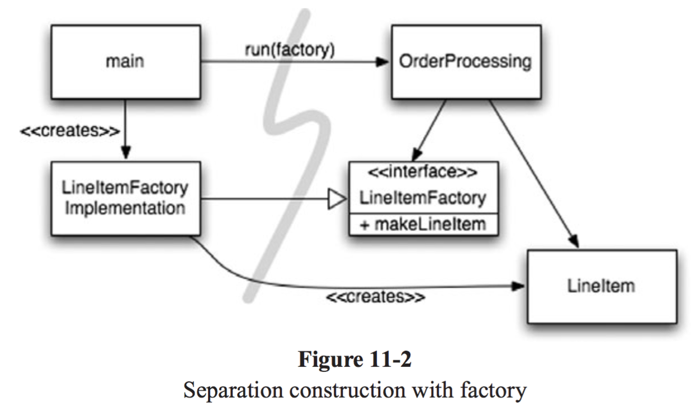

TOC
- [1. introduction](#1-introduction)
- [2. summary for me](#2-summary-for-me)
	- [2.1. Chapter 01 - 깨끗한 코드](#21-chapter-01---깨끗한-코드)
	- [2.2. Chapter 02 - 의미 있는 이름](#22-chapter-02---의미-있는-이름)
	- [2.3. Chapter 03 - 함수](#23-chapter-03---함수)
	- [2.4. Chapter 04 - 주석](#24-chapter-04---주석)
	- [2.5. Chapter 05 - 형식 맞추기](#25-chapter-05---형식-맞추기)
	- [2.6. Chapter 06 - 객체와 자료 구조](#26-chapter-06---객체와-자료-구조)
	- [2.7. Chapter 07 - 에러 핸들링 : Error handling is important, but if it obscures logic, it's wrong.](#27-chapter-07---에러-핸들링--error-handling-is-important-but-if-it-obscures-logic-its-wrong)
	- [2.8. Chapter 08 - 경계](#28-chapter-08---경계)
	- [2.9. Chapter 09 - 단위 테스트](#29-chapter-09---단위-테스트)
	- [2.10. Chapter 10 - 클래스](#210-chapter-10---클래스)
	- [2.11. Chapter 11 - 시스템 ???](#211-chapter-11---시스템-)
	- [2.12. Chapter 12 - 창발성](#212-chapter-12---창발성)
	- [2.13. Chapter 13 - 동시성](#213-chapter-13---동시성)
	- [2.14. Chapter 14 - 점진적인 개선](#214-chapter-14---점진적인-개선)
- [3. 추천 책](#3-추천-책)


----------------------

# 1. introduction 
- 2025-01-07 10:31:18
- link : https://github.com/Yooii-Studios/Clean-Code
- comments를 잘 쓰는게 어떤 것인가를 찾다가 발견

# 2. summary for me
## 2.1. Chapter 01 - 깨끗한 코드
- 제일 먼저 해봐야 할 것은 AI를 이용하여 자동으로 주석을 다는 것과 내가 달아놓은 주석에 대해서 변경을 요청해보는 것
- 내가 나쁜 코드를 만들고 있다. 반성하자. 시간이 갈수록 생산성이 줄어듦을 인식
  - 새 팀원들이 구조를 쉽게 이해할수 있어야 한다.
- 더러운 코드를 만들어서는 절대 기한을 맞추지 못한다. 빨리 가기 위한 단 하나의 방법은 "최대한 깨끗한 코드를 항상 유지하는 것"이다.
- clean code란
  - 에러 핸들링, 메모리 누수, 경쟁상태, 일관되지 않은 네이밍 등 디테일을 신경쓰라. 메서드의 이름 등으로 코드가 하는 일을 명시하라. (메서드 등을) 일찍 추상화해서 프로젝트를 빠르게 진행할 수 있게 하라
  - 클린코드는 한 가지 일을 잘 한다. 클래스/메서드는 한 가지 일만 하게 하라
  - 다른 이가 수정하기 쉬워야 한다.
  - 테스트를 해야 한다.
  - 코드는 간결할 수록 좋다.(Smaller is better)
## 2.2. Chapter 02 - 의미 있는 이름
- **의도를 분명히 밝혀라**   int d; / - 그릇된 정보를 피하라   
- 의미 있게 구분하라(불용어-noise word-를 쓰지 말자)   ex. Name VS NameString
- 발음하기 쉬운 이름을 사용하라
- 검색하기 쉬운 이름을 사용하라  ex. 상수는 static final과 같이 정의해 쓰자.
- 인코딩을 피하라(변수에 부가 정보를 덧붙여 표기하는 것을 뜻함.)
  - 헝가리안 표기법 : 변수명에 해당 변수의 타입(String, Int 등)을 적지 말자
  - 맴버 변수 접두어 : 맴버 변수 접두어를 붙이지 말자(???)
  - 인터페이스와 구현 : 인터페이스 클래스와 구현 클래스를 나눠야 한다면 구현 클래스의 이름에 정보를 인코딩하자.
- 자신의 기억력을 자랑하지 마라
- **클래스 이름 : 명사 혹은 명사구를 사용하라.**(Customer, WikiPage, Account, AddressParser)
- **메서드 이름 : 동사 혹은 동사구를 사용하라.**(postPayment, deletePayment, deletePage, save 등)
## 2.3. Chapter 03 - 함수
- **작게 만들어라!** : 중첩구조(if/else, while문 등)에 들어가는 블록은 한 줄이어야 한다. 각 함수 별 들여쓰기 수준이 2단을 넘어서지 않고, 각 함수가 명백하다면 함수는 더욱 읽고 이해하기 쉬워진다.
- **한 가지만 해라!** 
- 함수 당 추상화 수준은 하나로!
  - 함수 추상화 부분이 한번에 한단계씩 낮아지는 것이 가장 이상적이다.(내려가기 규칙)
  - 다형성을 이용하여 switch문을 abstract factory에 숨겨 다형적 객체를 생성하는 코드 안에서만 switch를 사용하도록 한다.
- 서술적인 이름을 사용하라!
- 함수 인수 : 최대 1개 , 출력은 없도록
  - 많이 쓰는 단항 형식 : 인수에 질문을 던지는 경우 boolean fileExists(“MyFile”); / 인수를 뭔가로 변환해 결과를 변환하는 경우 InputStream fileOpen(“MyFile”); / 이벤트 함수일 경우 (이 경우에는 이벤트라는 사실이 코드에 명확하게 드러나야 한다.)
  - **플래그 인수** : bool 값을 넘기는 것 자체가 여러가지 일을 한다고 공표하는 것임
  - 이항 함수 , 삼항 함수는 가능하면 쓰지 말고 , 그보다는 인수 객체를 사용하라.
  - 출력 인수 : **함수에서 상태를 변경해야 한다면 함수가 속한 객체 상태를 변경하는 방식을 택하라.**
- 명령과 조회를 분리하라!   bad ex. public ```boolean set(String attribute, String value);```
- **오류코드보다 예외를 사용하라!** : Try/Catch 블록 뽑아내기
- 오류 처리도 한 가지 직업이다 :  함수에 try 키워드가 존재한다면, 이 키워드가 이 함수의 첫 키워드여야 하며 catch/finally 뒤에는 어떤 코드도 없어야 함을 의미한다.
- Error.java의 의존성 자석  :  ??? 예외를 사용하는 것이 더 안전하다 ???
- 반복하지마라! 
- 구조적 프로그래밍 : **루프 안에서 break나 continue를 사용해선 안된며 goto는 절대로, 절대로 사용하지 말자.**
## 2.4. Chapter 04 - 주석
- 주석은 필요악 : **주석으로 보완하지 말고 코드를 잘 짜라.**
- 좋은 주석
  - 법적인 주석
  - 정보를 제공하는 주석
  - 의미를 설명하는 주석
  - 의미를 명료하게 밝히는 주석
  - 결과를 경고하는 주석
  - TODO 주석
  - 중요성을 강조하는 주석
  - 공개 API
  - 함수나 변수로 표현할 수 있다면 주석을 달지 마라
## 2.5. Chapter 05 - 형식 맞추기
- 코드 형식을 맞추기 위한 간단한 규칙을 정하고, 그 규칙을 착실히 따라야 하며, 팀으로 일한다면 팀이 합의해 규칙을 정하고 모두가 그 규칙을 따라야 한다. 필요하다면 규칙을 자동으로 적용하는 도구를 활용한다 (e.g. Android Studio의 Code Formatter)
- 파일당 200줄 , **최대 500줄**
  - 가로는 MAX 120자
- 서로 밀접한 개념은 세로로 가까이 둬야 한다.
두 개념이 서로 다른 파일에 속한다면 규칙이 통하지 않지만, 타당한 근거가 없다면 서로 밀접한 개념은 한 파일에 속해야 마땅하다(protected 변수를 피해야 하는 이유)
- 끼리끼리 잘 모아두자.  사용하는 것은 가까이에 , 호출되는 함수를 뒤에. 
- 좋은 예제
```cpp
public class CodeAnalyzer implements JavaFileAnalysis { 
	private int lineCount;
	private int maxLineWidth;
	private int widestLineNumber;
	private LineWidthHistogram lineWidthHistogram; 
	private int totalChars;
	
	public CodeAnalyzer() {
		lineWidthHistogram = new LineWidthHistogram();
	}
	
	public static List<File> findJavaFiles(File parentDirectory) { 
		List<File> files = new ArrayList<File>(); 
		findJavaFiles(parentDirectory, files);
		return files;
	}
	
	private static void findJavaFiles(File parentDirectory, List<File> files) {
		for (File file : parentDirectory.listFiles()) {
			if (file.getName().endsWith(".java")) 
				files.add(file);
			else if (file.isDirectory()) 
				findJavaFiles(file, files);
		} 
	}
	
	public void analyzeFile(File javaFile) throws Exception { 
		BufferedReader br = new BufferedReader(new FileReader(javaFile)); 
		String line;
		while ((line = br.readLine()) != null)
			measureLine(line); 
	}
	
	private void measureLine(String line) { 
		lineCount++;
		int lineSize = line.length();
		totalChars += lineSize; 
		lineWidthHistogram.addLine(lineSize, lineCount);
		recordWidestLine(lineSize);
	}
	
	private void recordWidestLine(int lineSize) { 
		if (lineSize > maxLineWidth) {
			maxLineWidth = lineSize;
			widestLineNumber = lineCount; 
		}
	}

	public int getLineCount() { 
		return lineCount;
	}

	public int getMaxLineWidth() { 
		return maxLineWidth;
	}

	public int getWidestLineNumber() { 
		return widestLineNumber;
	}

	public LineWidthHistogram getLineWidthHistogram() {
		return lineWidthHistogram;
	}
	
	public double getMeanLineWidth() { 
		return (double)totalChars/lineCount;
	}

	public int getMedianLineWidth() {
		Integer[] sortedWidths = getSortedWidths(); 
		int cumulativeLineCount = 0;
		for (int width : sortedWidths) {
			cumulativeLineCount += lineCountForWidth(width); 
			if (cumulativeLineCount > lineCount/2)
				return width;
		}
		throw new Error("Cannot get here"); 
	}
	
	private int lineCountForWidth(int width) {
		return lineWidthHistogram.getLinesforWidth(width).size();
	}
	
	private Integer[] getSortedWidths() {
		Set<Integer> widths = lineWidthHistogram.getWidths(); 
		Integer[] sortedWidths = (widths.toArray(new Integer[0])); 
		Arrays.sort(sortedWidths);
		return sortedWidths;
	} 
}
```
## 2.6. Chapter 06 - 객체와 자료 구조
- 기막힌 예제임.
  - 객체 지향 프로그래머가 위 코드를 본다면 코웃음을 칠지도 모르겠다. 클래스가 절차적이라 비판한다면 맞는 말이다. 하지만 그런 비웃음이 100% 옳다고 말하기는 어렵다. 만약 Geometry 클래스에 둘레 길이를 구하면 perimeter() 함수를 추가하고 싶다면? 도형 클래스는 아무 영향도 받지 않는다! 도형 클래스에 의존하는 다른 클래스도 마찬가지다! 반대로 새 도형을 추가하고 싶다면 Geometry 클래스에 속한 함수를 모두 고쳐야 한다. 그래서 두 조건은 완전히 정반대라고 할 수 있다.
  - 이번에는 목록 6-6을 살펴보자. 객체 지향적인 도형 클래스다. 새 도형을 추가해서 기존 함수에 아무런 영향을 미치지 않는다. 반면 새 함수를 추가하고 싶다면 도형 클래스 전부를 고쳐야 한다.
- 객체 지향 코드에서 어려운 변경은 절차적인 코드에서 쉬우며, 절차적인 코드에서 어려운 변경은 객체 지향 코드에서 쉽다!
- 분별 있는 프로그래머는 모든 것이 객체라는 생각이 미신임을 잘 안다. 때로는 단순한 자료 구조와 절차적인 코드가 가장 적합한 상황도 있다.
- **디미터 법칙** : 모듈은 자신이 조작하는 객체의 속사정을 몰라야 한다는 법칙이다. << 나는 이렇게까지는 못 짜는데>>
  - method f는 단지 클래스 C / f가 생성한 객체 / 
f 인수로 넘어온 객체 / C 인스턴스 변수에 저장된 객체  만을 사용
## 2.7. Chapter 07 - 에러 핸들링 : Error handling is important, but if it obscures logic, it's wrong.
**깨끗한 코드와 견고한 코드는 대립되는 목표가 아니다. 예외처리를 로직에서 제거하면 각각에 대해 독립적인 사고가 가능해진다.**
- **리턴코드 대신 Exceptions를 사용하라** : exceptions를 사용하자. 겉보기에만 아름다운 코드가 되는게 아니라 "실제 로직"과 "예외처리" 부분이 나뉘어져 필요한 부분에 집중할 수 있게 된다.
- [Try-Catch-Finally문을 먼저 써라](https://github.com/Yooii-Studios/Clean-Code/blob/master/Chapter%2007%20-%20%EC%97%90%EB%9F%AC%20%ED%95%B8%EB%93%A4%EB%A7%81.md#try-catch-finally%EB%AC%B8%EC%9D%84-%EB%A8%BC%EC%A0%80-%EC%8D%A8%EB%9D%BC)
  - try문은 transaction처럼 동작하는 실행코드로, catch문은 try문에 관계없이 프로그램을 일관적인 상태로 유지하도록 한다.
 - 이렇게 함으로써 코드의 "Scope 정의"가 가능해진다.
  - 예시: 잘못된 input을 넣을 경우 StorageException을 제대로 던지는지 확인하는 테스트 코드를 작성해보자
- Unchecked Exceptions(compile time에 check해주지 않는 exception. ex> divide by zero)를 사용하라
- Exceptions로 문맥을 재공하라 : 예외가 발생한 이유와 좀 더 구체적인 Exception 타입을 제공하라.
- 사용에 맞게 Exception 클래스를 선언하라
- 정상적인 상황을 정의하라(Default값을 설정하라)
  - Martin Fowler의 [Special Case Pattern](https://velog.io/@yeahg_dev/Special-Case-Pattern)을 사용하자.
    - 코드를 부르는 입장에서 예외적인 상황을 신경쓰지 않아도 된다.
    - 예외상황은 special case 를 처리하는 object를 만들어 이 내부에서 처리되게 한다. 없을때 default값을 이 special case object에서 주게 하는 등의 처리를 한다.   
- Null을 리턴하지 마라
  - null을 리턴하고 싶은 생각이 들면 위의 Special Case object를 리턴하라.
  - 써드파티 라이브러리에서 null을 리턴할 가능성이 있는 메서드가 있다면 Exception을 던지거나 Special Case object를 리턴하는 매서드로 래핑하라.
- Null을 넘기지 마라
## 2.8. Chapter 08 - 경계
- "제공하는" 입장에서는 좀 더 다양한 환경에서 좀 더 많은 사용자가 사용할 수 있도록 다양한 사용성을 지향한다. "사용하는" 입장에서는 그들의 사용성에 맞는 specific한 인터페이스를 원한다. 이것을 "경계에서의 긴장"이라 부른다.
- 모든 Map을 이런 식으로 래핑하라는 말은 아니다. 다만 Map과 같은 "경계에 있는 인터페이스"를 시스템 전반에 걸쳐 돌려가며 사용하지 말고 
  - 해당 객체를 사용하는 클래스 내부에 넣던지 가까운 계열의 클래스에 넣어라. 
  - 공개된 api에서 인자로 받거나 리턴하지 마라.
- 곧바로 **서드파티 코드를 사용하지 말고, 그 코드를 이해하기 위해 테스트를 작성**할 수 있다.(짐 뉴커크는 이를 "테스트 공부하기"라고 부른다.)
- Map 객체를 래핑하든 Adapter를 사용해 우리 입맛에 맞게 인터페이스를 변경하든, 코드는 보기 편해지고 경계 인터페이스를 일관적으로 사용할 수 있게 해주며 그들의 변경에도 유연하게 대응할 수 있게 해준다.
## 2.9. Chapter 09 - 단위 테스트
- TDD 법칙 세 가지
  - 첫째 법칙: 실패하는 단위 테스트를 작성할 때까지 실제 코드를 작성하지 않는다.
  - 둘째 법칙: 컴파일은 실패하지 않으면서 실행이 실패하는 정도로만 단위 테스트를 작성한다.
  - 셋째 법칙: 현재 실패하는 테스트를 통과할 정도로만 실제 코드를 작성한다.
- 테스트 코드는 실제 코드 못지 않게 중요하다. 테스트 코드는 이류 시민이 아니다. 테스트 코드는 사고와 설계와 주의가 필요하다. 실제 코드 못지 않게 깨끗하게 짜야 한다.
- 깨끗한 테스트 코드를 만들려면? 세 가지가 필요하다. 가독성, 가독성, 가독성.
- **BUILD-OPERATE-CHECK 패턴**이 위와 같은 테스트 구조에 적합하다. 각 테스트는 명확히 세 부분으로 나눠진다. 첫 부분은 테스트 자료를 만든다. 두 번째 부분은 테스트 자료를 조작하며, 세 번째 부분은 조작한 결과가 올바른지 확인한다.
- **테스트 당 assert 하나** : 코드를 이해하기 빠르고 쉽다
  - *TEMPLATE METHOD 패턴*을 사용하면 중복을 제거할 수 있다. given/when 부분을 부모 클래스에 두고 then 부분을 자식 클래스에 두면 된다.
  - assert 1개가 너무 가혹하면 **"테스트 함수마다 한 개념만 테스트하라"는 규칙**이 더 낫겠다. 이것저것 잡다한 개념을 연속으로 테스트하는 긴 함수는 피한다.
- [F.I.R.S.T](https://github.com/Yooii-Studios/Clean-Code/blob/master/Chapter%2009%20-%20%EB%8B%A8%EC%9C%84%20%ED%85%8C%EC%8A%A4%ED%8A%B8.md#first)
## 2.10. Chapter 10 - 클래스
- 클래스 설명은 "if", "and", "or", "but"을 사용하지 않고 25 단어 내외로 가능해야된다.
- 클래스는 작아야 한다. : 함수를 작게, 매개변수 목록을 짧게
  - 단일 책임 원칙 - Single Responsibility Principle (SRP)
  - 응집도 Cohesion : 클래스는 인스턴스 변수 수가 작게 하여, 응집도를 낮추자
  - 응집도를 유지하면 작은 클래스 여럿이 나온다. 
- 가장 먼저 원래 프로그램의 정확한 동작을 검증하는 테스트 슈트를 작성하라. 변경하고, 변경시마다 테스트를 수행
- 잘 짜여진 시스템은 추가와 수정에 있어서 건드릴 코드가 최소이다.
  - concrete 클래스와 abstract 클래스가 있는데, concrete 클래스에 의존(상세한 구현에 의존)하는 클라이언트 클래스는 구현이 바뀌면 위험에 빠진다. 그래서 인터페이스와 abstract 클래스를 사용해 구현이 미치는 영향을 격리시켜야 한다.
## 2.11. Chapter 11 - 시스템 ???
Complexity kills. It sucks the life out of developers, it makes products difficult to plan, build, and test.
- 시스템의 생성과 사용을 분리하라
  - "Lazy Initialization/Evaluation(게으른 초기화)"의 일반적인 형태이다. ```if (service == null)  service = new MyServiceImpl(...);```  이것때문에 의존성 증대.    잘 정돈된 견고한 시스템을 만들기 위해서는 전역적이고 일관된 의존성 해결 방법을 통해 위와 같은 작은 편의 코드들이 모듈성의 저해를 가져오는 것을 막아야 한다.
  - 생성 로직을 어플리케이션의 시작이 아닌 메인으로
  - 팩토리 기법 : 객체의 생성 시기를 직접 결정하려면 main에서 완성된 객체를 던져주기 보다 factory 객체를 만들어서 던져주자. 만약 자세한 구현을 숨기고 싶다면 Abstract Factory 패턴을 사용하자. 
    - 
- 의존성 주입(Dependency Injection) : 의존성 관리의 관점에서는 "객체는 그 자신의 의존성들을 직접 생성하지 말고 다른 'authoritative mechanism'에게 맡겨야 한다."라고 한다.  ??? 
- 스케일링
- 시스템 아키텍쳐를 테스트 주도하라(Test Drive the System Architecture)
## 2.12. Chapter 12 - 창발성
창발성이란 단순한 결합이 복잡한 결과를 나타내는 것을 의미한다. 창발적 설계는 집단지성과 같은 의미이다.
- 창발적 설계로 깔끔한 코드를 구현하자 : 4가지 규칙
  * 모든 테스트를 실행한다.
  * 중복을 없앤다.
  * 프로그래머 의도를 표현한다.
  * 클래스와 메서드 수를 최소로 줄인다.
- 단순한 설계 규칙 2~4: 리팩터링 반복
- 표현하라.
	- 소프트웨어 프로젝트 비용 중 대다수는 장기적인 유지보수에 들어간다. 코드를 변경하면서 버그의 싹을 심지 않으려면 유지보수 개발자가 시스템을 제대로 이해해야 한다. 하지만 시스템이 점차 복잡해지면서 유지보수 개발자가 시스템을 이해하느라 보내는 시간은 점점 늘어나고 동시에 코드를 오해할 가능성도 점점 커진다. 그러므로 코드는 개발자의 의도를 분명히 표현해야 한다. 개발자가 코드를 명백하게 짤수록 다른 사람이 그 코드를 이해하기 쉬워진다. 그래야 결함이 줄어들고 유지보수 비용이 적게 든다.
    1. 좋은 이름을 선택한다. 이름과 기능이 완전히 딴판인 클래스나 함수로 개발자를 놀라게 해서는 안 된다.
    2. 함수와 클래스 크기를 가능한 한 줄인다. 작은 클래스와 작은 함수는 이름 짓기도 쉽고, 구현하기도 쉽고, 이해하기도 쉽다.
    3. 표준 명칭을 사용한다. 예를 들어, 디자인 패턴은 의사소통과 표현력 강화가 주요 목적이다. 클래스가 COMMAND나 VISITOR와 같은 표준 패턴을 사용해 구현된다면 클래스 이름에 패턴 이름을 넣어준다. 그러면 다른 개발자가 클래스 설계 의도를 이해하기 쉬워진다.
    4. 단위 테스트 케이스를 꼼꼼히 작성한다. 테스트 케이스는 소위 '예제로 보여주는 문서'다. 다시 말해, 잘 만든 테스트 케이스를 읽어보면 클래스 기능이 한눈에 들어온다.
	- 하지만 표현력을 높이는 가장 중요한 방법은 노력이다. 흔히 코드만 돌린 후 다음 문제로 직행하는 사례가 너무도 흔하다. 나중에 읽을 사람을 고려해 조금이라도 읽기 쉽게 만드려는 충분한 고민은 거의 찾기 어렵다. 하지만 나중에 코드를 읽을 사람은 바로 자신일 가능성이 높다는 사실을 명심하자.
## 2.13. Chapter 13 - 동시성
clean concurrent code
- livelock : 스레드들이 서로 작업을 수행하려는 중 다른 스레드가 작업중인 것을 인지하고 서로 양보한다. 이러한 공명 때문에 스레드들은 작업을 계속 수행하려 하지만 장시간 혹은 영원히 작업을 수행하지 못하게 된다.
- 2 method 이상에서 공유된 객체를 사용하는 것을 피하라.
- 한번 더 테스트를 실행해 성공했다고 해서 이전의 실패를 무시하지 마라.
- 코드에 보조 코드instrument를 넣어 돌려라. 강제로 실패를 일으키게 해보라
## 2.14. Chapter 14 - 점진적인 개선
- 코드 구조를 유지보수하기 좋은 상태로 만들려면 지금이 적기라 판단했다.
- 변경 전후 시스템이 똑같이 돌아간다는 사실을 확인하려면 언제든 실행이 가능한 자동화된 테스트 슈트가 필요하다
- 해당 부분을 리팩토링하고 난 후 남는 문제는 예외 코드 부분이다. 예외 코드는 아주 흉할뿐더러 사실상 Args 클래스에 속하지도 않는다. 게다가 ParseException을 던지지만 ParseException은 Args 클래스에 속하지 않는다. 그러므로 모든 예외를 하나로 모아 ArgsException 클래스를 만든 후 독자 모듈로 옮긴다. 이렇게 되면 Args 모듈에서 예외/오류 처리 코드를 완벽하게 분리할 수 있다.

# 3. 추천 책
- 2002년에 쓴 책 Agile Software Development: Principles, Patterns, and Practices (PPP) 의 프리퀄