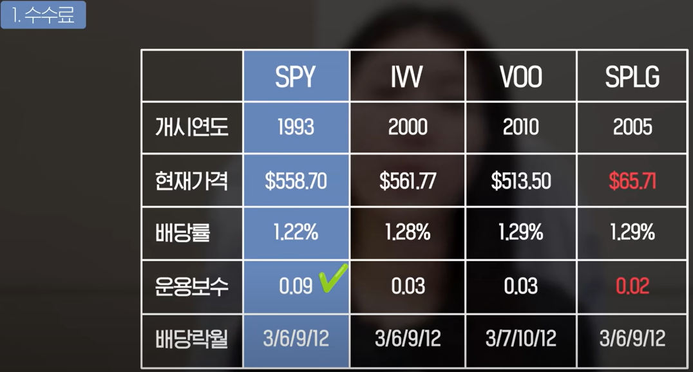
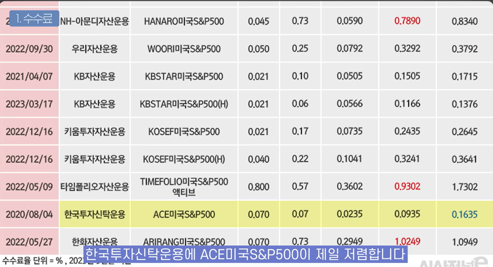
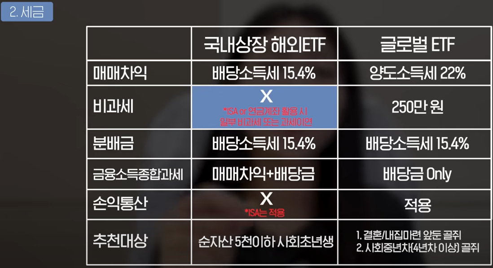

# 2024/12/01 ETF 비교
- [ETF , 이제는 졸업하세요](https://www.youtube.com/watch?v=8jgo99Q2yX0&ab_channel=%EC%8B%9C%EA%B3%A8%EC%A5%90%EC%9D%98%EB%8F%84%EC%8B%9C%EC%83%9D%ED%99%9C)

## 수수료
- 해외 ETF

    - SPLG
- 국내 ETF : 맨 마지막 총수수료율를 따져라!

    - 나스닥은 KBSTAR미국나스닥100 이 총보수율이 0.1457로 가장 낮다.

## 세금

## 결론
- ISA에 가능한 것만 국내 ETF를 하는 것이 좋고 , 그것을 넘으면 해외 ETF로

