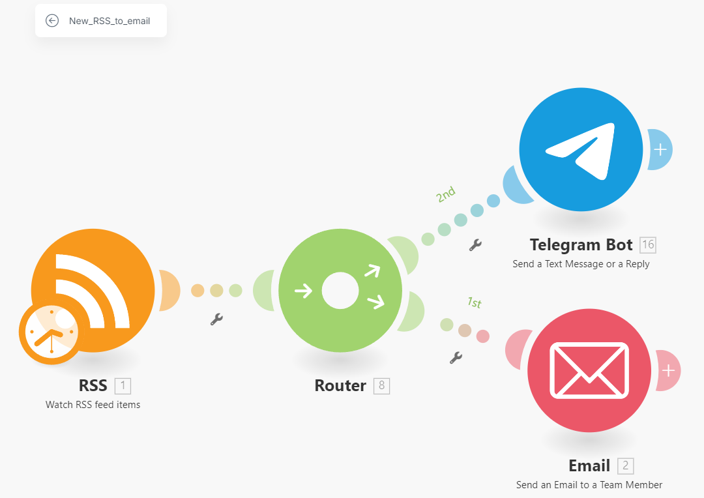
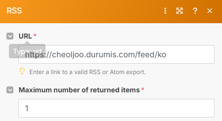
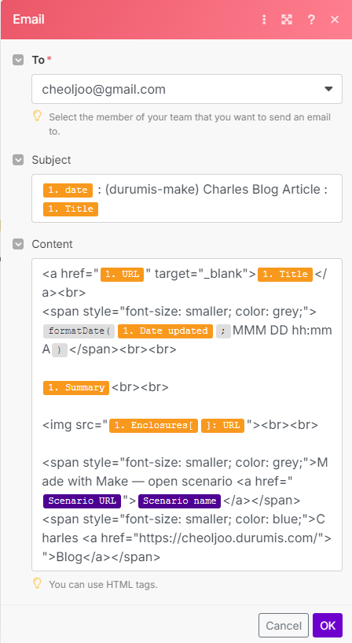
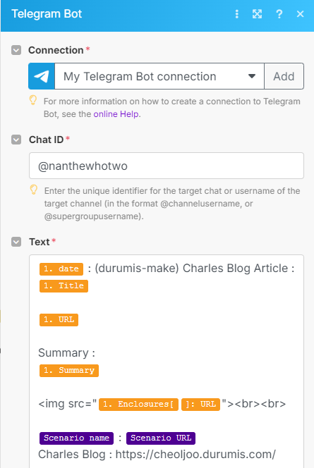

# how to set to get my blog notification in telegram
- connect to @nanthewhotwo channel

# automation for getting my blog notification
- 나의 blog인 https://cheoljoo.durumis.com/ko 에 RSS로 접근하여 새로운 항목이 있으면 이를 telegram에 뿌려주고 , email도 보내준다.

## rss
- durumis.com supports RSS.

## email
- I use "send an email to a team member". but I do not have any team.  it has only me. so I can send the mail only to me.
- Alternatives and my failure
  - gmail
    - error - I do not have access right. because i am not a workspace member.
  - other mail service
    - I tried kaka.com and naver.com.  but i can not succeed.
    - [one blog succeeds with naver.com](https://2nd-deck.tistory.com/entry/Make-%EB%84%A4%EC%9D%B4%EB%B2%84-%EB%A9%94%EC%9D%BC%EC%9D%84-Email-%EB%AA%A8%EB%93%88%EB%A1%9C-%EC%84%A4%EC%A0%95).  it use send an Email (IMAP). but i can not find this module in make.com

## telegram
- make bot in telegram
  - https://www.make.com/en/help/tutorials/using-telegram-bot-with-make
  - https://www.make.com/en/help/app/telegram-bot
  - in my case I set the bot name (channel name + _bot)
- make channel (ex. channel_name : nanthewhotwo  , bot_name : nanthewhotwo_bot)
  - enter this channel
  - click channel name on top of app
  - choose subscribers (구독자)
  - add subscriber : insert your bot name (ex. nanthewhotwo_bot)

