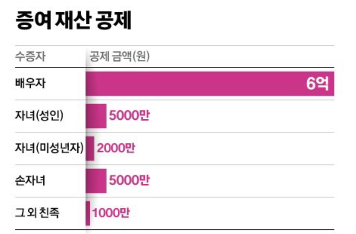
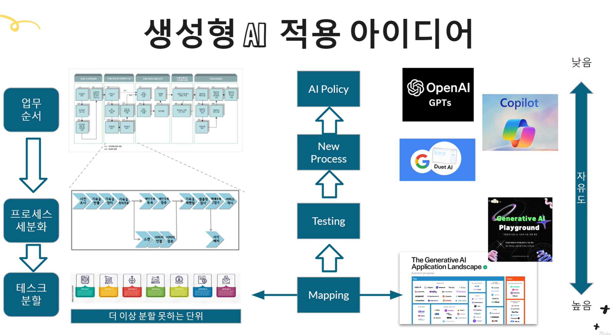
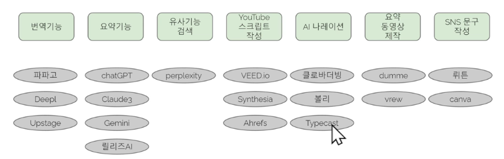

- description : ai에 대한 교육 내용을 적어둔 것이다. 일단 김진형 / 김인중 교수님의 내용에 대해서 들은 것을 정리해두었다.
- tag : ai , study , 김진형 , 김인중 , machine-learning
- date : 2024-01-01

TOC
- [1. AI](#1-ai)
  - [1.1. kaist 김진형 교수님 책 (밀리의 서재): AI 최강 강의  2020.11.26](#11-kaist-김진형-교수님-책-밀리의-서재-ai-최강-강의--20201126)
  - [1.2. 기사](#12-기사)
  - [1.3. chatgpt-automaiton (udemy)  2024-07 ~](#13-chatgpt-automaiton-udemy--2024-07-)
  - [1.4. \[한동대 머신러닝캠프 (김인중 교수)\] 2024-06 ~](#14-한동대-머신러닝캠프-김인중-교수-2024-06-)
    - [1.4.1. 1 Introduction to Machine Learning](#141-1-introduction-to-machine-learning)
    - [1.4.2. 2 Neural Network Basics](#142-2-neural-network-basics)
    - [1.4.3. Deep Learning Overview](#143-deep-learning-overview)
    - [1.4.4. Convolutional Neural Networks](#144-convolutional-neural-networks)
    - [1.4.5. Recurrent Neural Networks\\](#145-recurrent-neural-networks)


--------------------


# 1. AI

## 1.1. kaist 김진형 교수님 책 (밀리의 서재): AI 최강 강의  2020.11.26
- 인공지능을 제대로 교육하려면 수학/과학을 포함한 컴퓨터과학에 대한 기본 개념 및 프록램을 만들수 있는 능력이 필수적이다. 컴퓨팅 교육의 연장선으로 자연스럽게 인공지능으로...
- 비판적 사고력 , 창의력 , 소통 능력 , 협동 능력은 현재도 미래도 중요
- 원격근무/ 프리랜서의 일반화 (빌림의 business) : [변화 관리 툴 / 이것도 AI 관리 툴까지 / AI  최대한 활용 / 무엇이 현재의 한계인지 추적 필요 (niche market)]
- 2030에는 8억명이 일자리를 잃을 것이지만, 과학기술 영역은 55% 증가 예측
- 고위험 일자리 : 회계사 ,은행 수납 , 텔레마케터 , 법률 비서 , 기사 , 부동산 중계 , 점포 계산원 , 제조업 공장 근로자 , 기자 , 도서관 사서 , 요리사 
- 저위험 일자리 : 치과의사 , 간호사 , 과학자 , 예술가 , 헬스트레이너 , 초등교사 , 레크리에이션 강사 , 소방관, 성직자 등..  : 고도의 손재주가 필요하거나, 고객과 만나는 업무 , 융통성 있게 문제를 해결하거나 고도의 창의성이 요구
-  소프트웨어 엔지니어가 기계 학습 도구를 익히는 것이 더 바람직해 보이기도 한다. 인공지능에 대한 흥분이 가라 앉으면 기계 학습도 소프트웨어를 개발하는 방법 중의 하나였구나 하고 이해하는 엔지니어가 많아질 것이다.  [방향성?]
- 업무의 오류를 줄이고 더 나은 의사결정을 빠르게 내릴 수 있게 된다. 데이터분석으로 편견을 갖지 않고 사실에 근거하여 판단할수 있다. 다양한 정보를 서로 연결하고 상황을 이해해 통찰력 있게 판단할 수 있다. 사건이 일어나기 전에 예측하고 , 대응책을 권고할 것이다.  [**활용법**]
  - 인공지능은 데이터와 디지털 기반이 성패를 가른다. 충분한 디지탈 기반을 확보해야 한다. 이를 위해서는 관리자부터 연장 기술자까지 인공지능의 본질 , **능력,한계** 그리고 자원의 요구를 이해하는 것이 중요하다. 현재 기술로 할수 있는 것과 할 수 없는 것을 정확하게 알아야 할 것이다. 기술을 정확하게 이해해 **과도한 기대를 피하면서 과실을 취한다면** 인공지능에 대한 실망을 피할수 있다. [인공지능의 겨울을 회피]
  - 모듈화 기법은 아직 기계 학습에서 못한다.  디버깅 용이성 ,Robustness , 재사용 가능성 , 재현성 ..   [곧 AI에서 될 것 같은데!!]
- 자율 학습 시스템을 잘 사용하기 위해서는 항상 감시하고 통제해야 한다. 오늘 잘 작동하던 자율 학습 시스템이 내일도 잘 작동한다는 보장이 없다. 그러므로  사람이 운영과 학습의 반복 사이클에 들어가서 지속적으로 개입해야 할 것이다. 완전한 자동화는 위험할수 있다. 
- 의사결정 과정을 설명하려면 연관관계뿐만 아니라 인과관계 , 계층 관계등 다양한 세상의 모델이 필요하다. 그러나 **기계 학습 시스템이 배우는 것은 단지 연관관계 뿐이다. 기계 학습 인공지능에세 '왜?'라고 물으면 대답하지 못한다.** 완전한 자동화는 위험할수 있다. 
- 현실적으로 이러한 작업은 많은 데이터와 컴퓨팅 자원을 가진 대기업에서만 가능하다. 경쟁력있는 신경망 모델을 만들수 없다는 이야기다.   [우리는 AI algorithm개발보다는 우리 강점에 잘 활용을... 인터넷도 기존 산업에 적용을 잘하여 궁극의 생산 능력 상승]


## 1.2. 기사
- 케이뱅크는 왜 자체 생성형AI 개발에 나설까? https://byline.network/2024/05/30-305/?ct=t(RSS_EMAIL_CAMPAIGN)&mc_cid=21d1e600e8&mc_eid=ca9f06a9b9
  - Upstage AI Company (SOLAR) :  https://www.content.upstage.ai/
    - 논문등 볼수 있음. embedded LLM - 역시 읂행은 폐쇄적으로 가기에 자체적으로 뭔가 필요한듯! 좋은 niche market임.
      - [ ] 아직 보지 못함
- 레버리지 100?   → https://mail2.scrapmaster.co.kr/mail/include/iitp_display.php?news_id=64613&scrapBookNo=1991&scrapinfo=202406280&article_serial=20240628jo00a18003&q=aWl0cHwyMDI0MDYyODB8MjAyNLPiIDA2v/kgMjjAzyAgKNDdKSDBtrCj
- LG AI 연구원님이 추천해준 책/과정 / 공부 방법
  - 언어 모델 : 
    - udemy : 앤드류기의 machine learning...  
    - 밑바닥 부터 시작하는 deep learning 이 처음에 시작하기 가장 좋은 책이라고 합니다. 잘 쓰여졌다고함.
- 창업가를 위한 생성형 AI 기술 https://maily.so/core/posts/7bb376cc : 여러가지 창업 아이템으로 뭔가를 만들어주는데 , 중간에 정보를 넘겨주는 형식이거나, openAI 위에 주고 받은 것을 사용하는 것보다는 frame만을 씌운다는 느낌이다.    뤼튼은 한번 설치해봐야겠네요.     대단한거네요. 써볼 방법이 없을까요? (https://www.deepbrain.io/ko/home)
- 

## 1.3. chatgpt-automaiton (udemy)  2024-07 ~
- chatgpt 실습
  - 가능하면 영어로 사용하면 빠르다. papago.naver.com 이용 번역후 사용
  - https://github.com/callee2006/2019-Winter-HGU-Machine-Learing-Camp 을 한글로 요약해줘. 하면 요약함.
  - 고객님에게 드리는 사과 메일과 같이 쓰기 싫은 내용을 써 달라고 할때 사용
  - 매번 papago 사용하기가 귀찮으므로 , 프롬프트 지니 addon을 이용하면 편함
    - https://www.promptgenie.ai/  chrome extension을 등록
- chatgpt 사용방법
  - 검색보다 요약이나 정리하는데 사용하는 것이 유용
  - 최근 지식은 미약
  - 예상 / 예측 / 추측은 정확도가 떨어짐
  - 잘 하는 것
    - 보도자료 초안 / 이메일 초안 / 아이디어가 필요할때 / 긴글 요약 / 문서 작성 초안
- 업무 자동화 RPA
  - openAI API keys : ```secret_key.md 3.```
    - MAG
  - google sheet
    - gpt_fill('학습데이터범위','fill할 범위') 로 email , 전화번호등을 일정한 형식에 맞게 변화시켜준다. /과일명 
    - 중간에 foundation model이라는게 있어서 여러가지가 가능하다.
  - API를 하려면 (google spread sheets)  pthread89의 계정으로 login을 하고 해당 google drive에서 뭔가 해야 하는 것 맞죠?  맞다면 google passwd 공유 가능하신지요?  다른 방법 있으면 공유 부탁드립니다.
  - [ ] python으로 API 사용하기 : https://docs.kanaries.net/ko/topics/ChatGPT/how-to-use-chatgpt-api-python
- 2023-11 추가 부분
  - 할루시네이션 (아는 척해야 하는 현상)
  - (혼자) Project Lead(PL)를 chatgpt 가 할수 있지 않을까? JIRA / CB로 모든 일이 할당되고 처리되는지를 확인하고 문제되는 부분들을 판단하고 표를 만들어 보고하는 등은 chatgpt가 할수 있지 않을까?
- 활용
  - 10. Notion AI 활용 : 블럭 단위로 AI에게 할당 / 문서 협업 짱
    - template 사용
    - notion ai : notion.so -> 써보면 쉽게 알수 있음.  프로젝트 관리를 AI에 맡기는 방법? 페이지를 만들었습니다. 
  - 12. 생성형 AI를 이용한 데이터 분석하기
    - 상관 분석 정도까지만..
  - 14. gen ai 할수 있는 일들
    - 
  - 16. google bard 확장 프로그램
    - https://gemini.google.com/extensions
      - "내 메일에 있는 ai 관련 소식 요약해줘"
    - http://wrtn.ai : 문구는 뤼튼
  - 18. suno ai 로 노래 작사 작곡
  - 21. shorts 생성
    - http://fliki.ai
  - 22. 페이지 요약
    - gimme summary ai  : https://chromewebstore.google.com/detail/gimme-summary-get-summary/mpjcikcpmljllcobpboakgocbenkhokc?hl=en
  - 24. perplexity : PDF upload하고 해당 내용 질문하기
  - 26. 회사의 생성형 AI 사용방법
    - 
  - 데이터 분석은 bard
  - 27. gamma.app 으로 ppt 초안
  - 29. bard 이용 너튜브 요약 및 타임스템프
  - 31. gemini advanced 유료 : open chatting 방의 내용을 요약 - 내용별 날짜별로 요약 가능 (각 openai 마다 다른 결과를 낸다.)
  - 32. news 정리는 copilot 으로..
  - 33. gemini advanced 유료 : 건물 등기부 등복 분석도 시도해봄. 결과는 글쎄!
  - 34. 엔트로픽 클로드 AI 3.0 출시 :  유료 월 20$
  - 36. 우리회사에 생성형 AI 도입 방법 : 여러분이 생각하고 원하는 AI는 아직 없다. (24.07)
  - pair programming
  - 46. www.plugdocs.com   & gamma.app    :  make slides  앞으로 계속해서 많은 app들이 나올 것이다.  upload한 내용을 기준으로 정리 / quiz 등을 만들어준다.
  - 47. gemini advanced 유료 : EDA (탐색적 데이터 분석)
  - 48. browser 검색 엔진 변경법 : perplexity : chrome 계정별로 설정 가능   https://www.perplexity.ai/?q=%s
  - 53. cloverX 에서 번역 잘 해줌
  - 나도 내 업무에서 어떤 부분을 gen-AI를 사용할수 있는지를 계속 살펴봐야 한다. 예로 RPA , OCR 등을 이용한 반복 작업 삭제
    - 
  - 56. 그림으로 저장된 표 테이블을 생성형 AI로 uplaod해서 변환하여 사용할수 있다.
    - 엑셀에 그림에서 뽑는 기능도 제공되고 있음. 
  - 

## 1.4. [한동대 머신러닝캠프 (김인중 교수)] 2024-06 ~ 
### 1.4.1. 1 Introduction to Machine Learning
- https://www.youtube.com/watch?v=xKhYmlgC7j8
- labels 이 expected result.  0 ~ 9
- Neural Network은 min / max를 찾는 algorithm을 찾는 것이다. NN에서는 미분이 제일 중요하다. 
- unsupervised learning : 비슷한 것으로 묶는 것 (clustering) / reproduction - 그림을 주고 뭔지는 안 가르쳐주지만 비슷하게 만들어 달라 (패턴을 그대로 기억해버려라. 내용은 모르지만 배켜써라.) / 숨겨진 이유를 찾아라. 나타나는 현상만 계속 보면서 hidden code를 알수 있는 경우가 있다. 
- error를 정의할때 정답이 정의되지 않은 것이 unsupervised learning
- reinforcement learinig : agent가 환경안에 들어가 있으며 어떻게 잘 적응하는가? alphago에서 environment는 바둑판 / rewards를 최대로하게 학습을 계속 진행
- prediction 은 classification이 아닌 숫자로 맞추어야 한다. 
- feature extraction : vector로 바꾸는 것
    - 지금까지 ML tool들이 대부분 vector를 입력으로 받기에 , vector type의 input을 만들어야 한다.
    - relevant information (유용한 정보) 중심으로..
- 너무 복잡한지 단순한지를 어떻게 판단하는가? 
    - 데이터가 많은 경우면 복잡한 것을 써도 된다.  데이터가 적은데 복잡한 것을 쓰면 overfitting이 많이 나온다.
- overfitting 판정법 : training error 는 감소하고 , test error는 증가할때  (차이가 증가할때)  -> 모델을 줄이거나 데이터를 더 모으거나
    - 요즘은 overfitting을 막는 방법이 많이 발전하여, 요즘에는 복잡한 모델부터 시작하는게 일반적이다.
- **Bayesian Theorem** : w (남자/여자) , X (키)
    - 전자는 키 별로 남자 여자를 모아야 한다.    후자는 남자 / 여자 별로 키를 모은다. 
    - 기막히구만!!~~~~  classification에서 많이 사용하는 용어임. 
        - posterior probability.    likelihood       prior probability
### 1.4.2. 2 Neural Network Basics
- mapping 학습
  - 세상이 많은 것들을 vector -> vector로 표현 가능하다.
    - classification / regression
  - sequence mapping도 가능 (자연어 문장) : sequence -> sequence 로 변환 : translation / tts
- 확률분포 학습 : 사람의 얼굴을 계속 보여주고 , 그런 패턴을 만들어라고 명령하면 비슷한 사람 얼굴을 만들어 낸다. 
  - 사람이 얼굴이 가지고 있는 확률 분포를 학습하게 되고, 그 학습 정보에 입각하여 생성
  - restoration / transform (흑백 영상을 주고 컬러 영상을 만들어라)
- perceptron : neural network의 시초
  - sigma (W(i)*X(i)) 를 하게 되는 것은 1차원이다. 
  - 복잡한 것은 레이어를 쌓아서 1차식으로 처리하게 된다.  레이러를 쌓으면 쌓을수록 복잡한 것도 처리 가능하다.
- single layer perceptron
  - forward propagation
    - 뉴런들이 f를 처리하면 전파해 나가는 것을 propagation이라고 한다. 
  - training : 초기 weight은 random value(작은 영역)를 사용하는게 일반적이다.
  - gradient descent (continuous perceptron training) 
    - E =  (출력 - desired output) ^2 / 2   : 미리 2로 나누는 것은 미분 할 것이므로 square error
      - 시험시 error 값 측정은  x와 d 는 고정이므로 w가 변수가 된다. 
    - 에러를 어떻게 minimize하는가? W가 matrix라도 한줄로 세운다. 
      - 벡터에서는 반대방향으로 가는 것은 빼주는 것을 말하고, 같은 방향은 + 이다.
      - -를 한다는 것은 반대방향으로 minimize (감소하는 방향)
      - 미분을 하면서 계속 gradient를 계산해서 , 최적을 계속 찾아가는 것이다. 
    - weight에 대한 grandient는 어떻게 계산하는가? chain rule : dz/dx = dz / dy * dy / dx 를 한다.  x -> y -> z 를 간다고하면 각각 가는것이 layer이다
  - 한계 : XOR를 못 푼다.  직선 하나 가지고는 구분이 안된다. 그래서 , single로는 안됨
- multi layer perceptron
  - layer를 두어서 같은 것까리 모아주면 계속 전체 갯수가 줄어들게 된다. 
  - layer가 많아지면 node 가 많아지고 이런 경우 overfit 이 발생할 확률이 매우 높아짐
- activation function = non-linearity function
  - 최근 ReLU 를 많이 사용한다고함.
  - output layer의 activation function은 softmax를 사용한다. 
    - softmax는 확률을 만족하게 변환시켜준다.  합이 1
- **Back-propagation**
  - cross entropy는  과목중에 information theory 라는 것을 들으면 자세히 알수 있다. 
  - 뒤에서부터 계산하는 방식을 채택하기 위한 것으로..
  - Net이 뭔지?
  - 중요한 것은 1차의 E/Y는 2차에서 계산한 값을 가져와서 사용하면 된다는 것임.
### 1.4.3. Deep Learning Overview
- 잘된 case
  - ImageNet Dataset 사용 : 아주 좋은 testcase들을 제공해줌
    - 2012년 이후 deep learning 적용됨
    - 사람의 인식률은 에러 rate가 5% 이지만, 2017년에는 2.3%까지 줄였다고함.
  - Image Synthesis : ProGAN : 생성해낸 사람들
  - google BigGAN
  - Image to Image translation : 연필로 그림을 그리면 실물처럼 변경
  - google neural machine translation (GNMT) 
- Deep Learning
  - neural netowrk은 layer가 3~4개 인데 , deep learning은 layer가 매우 많다.
  - 위로 갈때마다 더 high level의 데이터로 변화 : layer를 통과할수록 더 고급 정보로
  - layer를 더 통과시킬수록 분포가 더 잘 됨
  - deep learning = feature extraction + classificaiton을 한번에 처리함
  - 아이디어만 나오면 deep learning으로 구현 가능
  - 심각한 문제
    - 여러가지 문제들 , overfitting (데이터가 작은 경우) 등
    - vanishing gradient problem
      - N 차에서 1차로 갈수록 gradient가 희미해진다.
      - 초기에는 방향성이 뛰렸하나 , 1차에 가면 애매해진다.
      - f'때문에 값이 줄어듬. / merge가 되면서 특성이 사라짐
    - saddle point : 어떤 것에서는 최대이고 ,어디서는 최소로 gradient를 구하면 0이 나온다.
- approaches
  - avoid vanishing gradient problem -> CNN / LSTM , GRU , GLU
  - skip connection
- RNN (Recurrent neural networks)
  - 음성신호 / 주가 / 자연어 처리 : 과거의 값이 미래의 값에 영향을 주는 time series data 처리
  - memory 역할을 할수 있다. flip-flop
- generative model
  - GAN
    - generator : 위조지폐범
    - Discriminator : 경찰관 - 진짜와 가짜의 차이점을 집중 학습
    - generator와 discriminator가 번갈아가면서 학습을 해서 서로 발전을 한다.  각기 CNN을 적용시키면 DCGAN 이다.
- 각 learning의 practical cases
  - transfer learning : 데이터가 적거나 할때 이것으로 먼저 시도 **중요**  : 기존 영어 학습을 시킨 것을 이용하여 최종만 변경하여 독일어 적용

### 1.4.4. Convolutional Neural Networks
- w가 data에서 학습하는 패러미터. 마지막에는 loss function 을 최소화
- CNN은 영상처를 위해서 만들어진 것 : 병렬화 쉽다.
- RNN의 단점은 순차적이어서 병렬화가 힘들다. 


### 1.4.5. Recurrent Neural Networks\
32:47
- RNN에서는 bidirectional RNN이라는것이 있는데 구문을 분석할때 미래에 나올 단어를 봐야지 의미를 더 잘 해석할수도 있는 경우가 있기에 나온 것이다. (자연어 처리 번역)
- Deep RNN은 layer가 다수 이고 , higher로 갈수록 축약된 정보들을 가지게 된다.
- [각 모델들은 여러가지 방법에 대한 조합이 되는 것으로 보인다. 여러가지의 방법들을 layer마다 다르게 써서 어느 것이 적당한지를 찾는 것으로 보인다.]
- encoder - decoder : log를 취하는 이유는 *가 +로 바뀌기 때문이다. exponential이 들어가는 경우 계산이 훨씬 편해진다.
- attention model : encoder-decorder 모델의 단점이 가장 최근의 것이 비중이 제일 커지는 것을 해결한다. 
- softmax (확률값) 는 다 더하면 1
- Training RNN
	- objective function을 먼저 정의해야 한다.  : Loss(t) = -logPmodel(yt , x1...xt)
		- maximum likelyhood : 내가 관찰한 데이터(likelyhood)의 확률을 높여주는게 맞다는 철학
		- 각 time에는 y(t) 정답이 있어야 하고 , x1 ~ xt까지 고려해서 봐야하므로 입력으로 받는다. (recurrent) 
		- 각 확률을 *을 하는게 실제 값인데 , 계산을 편하게 하기위해서 log를 붙이는 것이다. 
	- 학습은 gradient descent algorithm을 사용한다.  
		- gradient를 어떻게 구하는지가 가장 중요하다.  chain rule : totalLoss 를 weight으로 미분하면 gradient
		- 계속 back propagation을 시키면서 각각의 gradient를 계산한다. ^yt는 출력값 (softmax로 가정)
		- can not parallelized
	- activation 도함수 소개
		- hyperbolic tangent (tanh) : 미분 = 1-y**2
		- softmax : 미분 = y(1-y)
	- computing gradients in RNN
- LSTM (Long Short-Term Memory) Networks
	- RNN에서는 동일한 값(W의 eigen value)이 반복해서 곱해진다. exponential -> explode or vanish
	- weight를 때에따라 변경을 할수 있어야 한다.
	- LSTM은 gate에 의해서 정보의 흐름을 통제 (input/output/forget gates)
	- Leaky Unit에서 처럼 예전의 것이 계속 영향을 미치도록  (moving average 형태)
  	- 긴 시간 동작해도 잘 working을 한다.
	- 아직까지는 LSTM을 많이 사용한다. (제일 좋다)
- Gated Recurrent Units (GRu)
  - 현실적으로 특정 문제들은 LSTM보다 더 좋은 성능을 가진다. LSTM보다 가벼워 경제적이다.
  - forget / input gate를 1개(update gate)로 통합함 , 그리고, reset gate 추가
- success story
  - 번역기 (LSTM)
    - 2016년부터 deep learning을 써서 갑자기 좋아짐
    - 8 layers
    - attention을 가지고 시각화를 하여 어디를 중점을 두는지 알게 된다.
  - Convolutional Sequence to Sequence Learning : RNN 속도 느림 개선
    - CNN으로 길이가 정해지지 않을 것을 어떻게 처리:  MAX를 처음부터 크게 둔다.
  - Transformer Network
    - attention만을 사용. 요즘은 CNN / RNN보다 자연어 처리에 우수
  - Neural Speeach Recognition : pyramid 방식으로 실행 횟수를 줄인다.
  - Neural TTS : RNN 사용
  - Automatic Image Captioning 
    - object detect를 하고 -> object별로 CNN으로 인식 -> sequence -> RNN -> 문장 출력
    - 발전하면 Dense Captioing이 가능하다. (object마다 설명이 나오도록 한다.)


