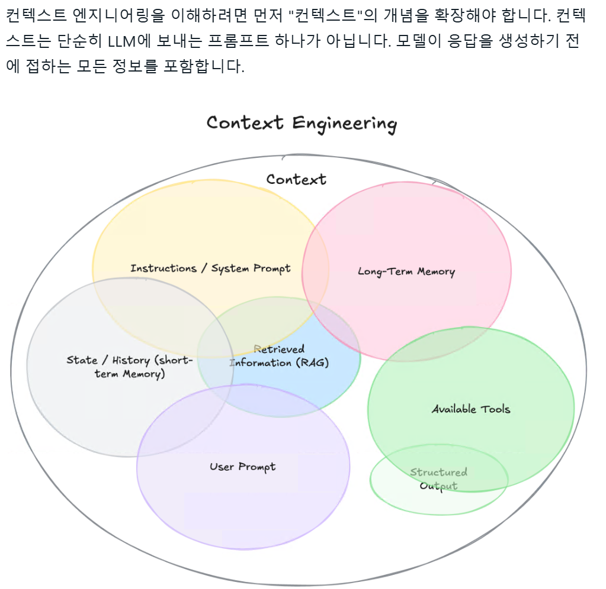

- description : ai를 위한 prompt 관련 공부 해야 하는 내용 : prompt engineering
- tag : ai, prompt
- date : 2025-07-28

-------

<H1>
Title : ai를 위한 prompt 관련 공부 해야 하는 내용 : prompt engineering
</H1>

# 조영재 책임님 설명 내용 요약
- LLM에는 cot와 in context running과 같이 prompt관련하여 어떻게 해야 LLM이 더 잘 이해를 하는지에 대해서 다루는 부분이 있다.
- A2A / MCP를 잘 활용 필요
- DL에 더 제한적 일 것이라는 추측을 하심.

# context engineering
- 
- RAG정보 / prompt / 장기 기억 / mail / json 등.. 모든 내용을 이용하여 더 효과적인 답변을 하게 됩니다.

