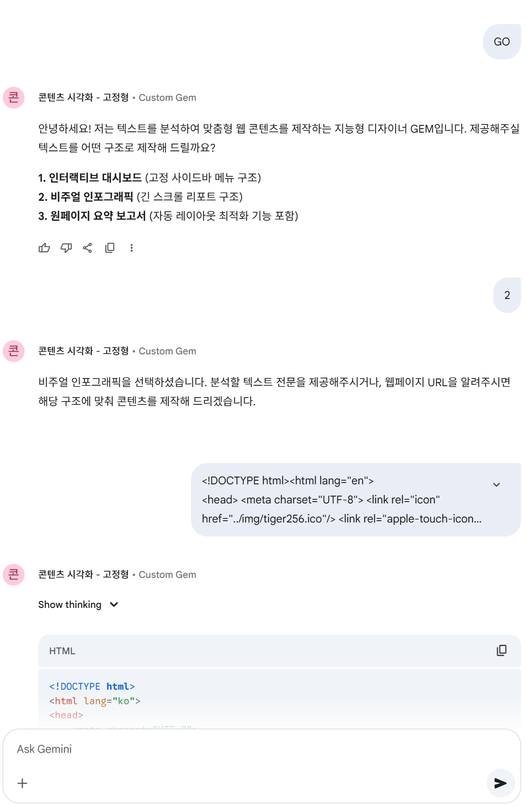
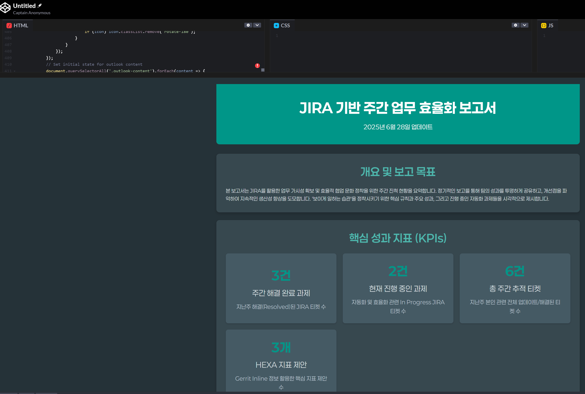

- description : Prompt , AI 문서 시각화, 이제 돈 내지 마세요! 제미나이 젬 활용 가이드 / 단 몇 초 만에 유튜브 전문가 되는 비법 공개! youtube 요약 및 8가지 기능 /  | GEMINI 활용법 6편
- tag : ai, visualization, gemini, free, youtube, summary, mindmap, prompt
- date : 2025-06-28

TOC
- [1. ai : AI 문서 시각화, 이제 돈 내지 마세요! 제미나이 젬 활용 가이드](#1-ai--ai-문서-시각화-이제-돈-내지-마세요-제미나이-젬-활용-가이드)
  - [1.1. introduction](#11-introduction)
  - [1.2. getting started](#12-getting-started)
- [2. 단 몇 초 만에 유튜브 전문가 되는 비법 공개! youtube 요약 및 8가지 기능 | GEMINI 활용법 7편](#2-단-몇-초-만에-유튜브-전문가-되는-비법-공개-youtube-요약-및-8가지-기능--gemini-활용법-7편)
- [3. Suno GPTs](#3-suno-gpts)
- [4. 이 프롬프트만 있으면 AI가 달라진다! | GEMINI 활용법 6편](#4-이-프롬프트만-있으면-ai가-달라진다--gemini-활용법-6편)

-------

<H1>
Title : ai : AI 문서 시각화, 이제 돈 내지 마세요! 제미나이 젬 활용 가이드 & 단 몇 초 만에 유튜브 전문가 되는 비법 공개!
</H1>

- 모두 GPT park 님 작품 입니다.
  - https://www.youtube.com/@AIFACT-GPTPARK

# 1. ai : AI 문서 시각화, 이제 돈 내지 마세요! 제미나이 젬 활용 가이드
## 1.1. introduction
- [blog](https://muzbox.tistory.com/483606)
- [youtube](https://www.youtube.com/watch?v=ViQCacVsdMI&ab_channel=GPTPARK%EC%9D%98AI%ED%8C%A9%ED%8A%B8)
- blog나 youtube를 보고 따라하면 됩니다.

## 1.2. getting started
- [blog](https://muzbox.tistory.com/483606) 끝에서 지침 download를 한다.
- [gemini](https://gemini.google.com/) 에 접속하여 "Explore Gems" > "New Gem"
  - Title에 "콘텐츠 시각화 - 고정형"을 입력 (마음대로 입력하세요)
  - 내용 부분에 위의 download받은 지침
    - "콘텐츠 시각화 - 고정형.txt" 파일 안의 내용을 copy해서 paste를 해주고 , [콘텐츠 시각화 - 고정형.txt](콘텐츠 시각화 - 고정형.txt) [콘텐츠 시각화 - 자유형.txt](콘텐츠 시각화 - 자유형.txt)
    - 3개의 html 파일은 첨부 해준다. [대시보드.html](대시보드.html) [요약보고서.html](요약보고서.html) [인포그래픽.html](인포그래픽.html)
  - create
- create한  "콘텐츠 시각화 - 고정형" GEM 에 들어가서 
  - GO[ENTER]
  - 2[ENTER]
  - file 첨부 및 data 입력 [PLAY선택]
  - 결과가 나오면, html이므로 이를 copy하여 [codepen](https://codepen.io/pen/) 에 입력하여 결과를 본다.
  - 
- 내가 일주일간 한 일에 대한 jira report 입력시 결과
  - [codepen result](https://codepen.io/cheoljoo/pen/KwpEope)
  - 

# 2. 단 몇 초 만에 유튜브 전문가 되는 비법 공개! youtube 요약 및 8가지 기능 | GEMINI 활용법 7편
- [blog](https://muzbox.tistory.com/483615) 끝에서 지침 download를 한다.  zip의 password는 동영상안에 ... (8j4ke)
- [youtube](https://www.youtube.com/watch?v=BI_c9qScpzQ&ab_channel=GPTPARK%EC%9D%98AI%ED%8C%A9%ED%8A%B8)
- blog나 youtube를 보고 따라하면 됩니다.

- GEM을 만들어 수행
  - [영상분석시각화템플릿.html](영상분석시각화템플릿.html)   [유튜브 분석 전문가 지침.txt](유튜브 분석 전문가 지침.txt)

- 위의 youtube를 요약하여 mindmap 생성 결과 : https://codepen.io/cheoljoo/pen/dPorwrq

# 3. Suno GPTs
- https://chatgpt.com/g/g-681480f8a4688191b94abd2af3c3390a-suno-4-5-prompt-generator

# 4. 이 프롬프트만 있으면 AI가 달라진다! | GEMINI 활용법 6편
- [blog](https://muzbox.tistory.com/483611) 끝에서 지침 download를 한다.
- [youtube](https://www.youtube.com/watch?v=6-kuNf3K5Ck&ab_channel=GPTPARK%EC%9D%98AI%ED%8C%A9%ED%8A%B8)
- [gemini](https://gemini.google.com/) 에 접속하여 "Explore Gems" > "New Gem"
  - GEM에 다음 내용을 입력 [프롬프트 생성기 GEM 지침.txt](프롬프트 생성기 GEM 지침.txt)
  - sample
    - [01 꿈해몽 프롬프트.txt](01 꿈해몽 프롬프트.txt)
    - [02 SEO 블로그 기사 작성 프롬프트.txt](02 SEO 블로그 기사 작성 프롬프트.txt)
    - [03 이미지 생성 프롬프트.txt](03 이미지 생성 프롬프트.txt)
    - [04 사업솔루션 제안 프롬프트.txt](04 사업솔루션 제안 프롬프트.txt)
    - [05 영상 제작 프롬프트.txt](05 영상 제작 프롬프트.txt)