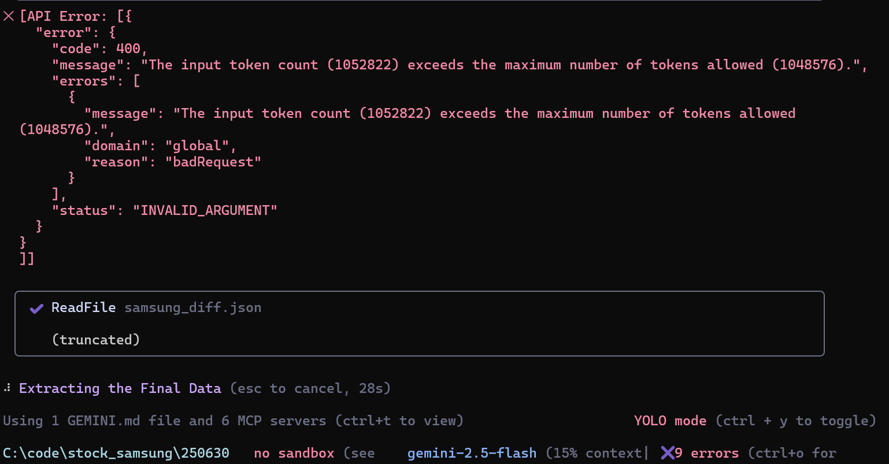

- description : 삼성전자와 삼성전자(우)의 비교 : 언제 어떤 것을 사야 유리한지?
- tag : ai, gemini, cli, free, stock
- date : 2025-06-29

TOC
- [1. ai coding 경험](#1-ai-coding-경험)
- [2. git](#2-git)
- [3. gemini cli로 작성하는 삼성전자와 삼성전자(우)를 이용하는 backtest program 작성](#3-gemini-cli로-작성하는-삼성전자와-삼성전자우를-이용하는-backtest-program-작성)
  - [3.1. 아이디어](#31-아이디어)
  - [3.2. 수행 plan](#32-수행-plan)
  - [3.3. 시작일을 바꾸었을때의 prompt](#33-시작일을-바꾸었을때의-prompt)
- [error](#error)


-------


<H1><p style="color:blue;">Title : 삼성전자와 삼성전자(우)의 비교 : 언제 어떤 것을 사야 유리한지?</p></H1>


# 1. ai coding 경험
- 초기에는 그냥 gemini cli나 replit에게 소스를 만들라고 하고 , 이것을 계속 고쳐나간다. 
- 그러나, 이는 문제가 발생하여 여러개의 기능을 추가하면 이것들의 조합이 제대로 동작하지 않게 된다.
- 그러면 어떻게 해야 할까?  모듈을 먼저 만들게 하고 , 그 값들을 모아서 DB 를 만들고 , 그것을 가지고 다시 계산을 하도록 하는 부분으로 단계들을 잘 나누고 , 이를 각기 AI가 작성하게 하고 , 확인을 하는 방법이 좋을 것이라 생각한다.
- 기존 내용과 이를 고치는 것에 대해서도 고려해야지만, 새로 architecture를 작성하는 것이 더 좋을 수 있다. 
  - 여러번 하고 , 새로 architecture를 만들어야 하는 이유는 초기부터 모든 것을 알고 이를 고려한 architecture를 만들수 없기 때문이다.

- 지금까지 한 내용을 정리를 해보고 , 이후 단계별로 만드는 것을 다시 해봐야겠다.
- 하여간 최종 결과가 이상해요~~~~

- 그래서 다음과 같이 일들을 나누어서 명령을 내렸습니다.  각 명령마다 결과를 json으로 받아서 확인하면서 처리


# 2. git
- https://github.com/cheoljoo/stock_samsung.git

# 3. gemini cli로 작성하는 삼성전자와 삼성전자(우)를 이용하는 backtest program 작성
## 3.1. 아이디어
- 삼성전자와 삼성전자(우) 간의 가격 차이가 들쑥날쑥하다. 이때 , 가격의 간극을 보고 삼성전자와 삼성전자(우)를 이동해다니면 더 좋은 수익률을 가지지 않을까 하는 아이디어
## 3.2. 수행 plan
- prompt
  - linux docker사용시 일때는 필요한 ```설치가 필요시 sudo 를 이용하여 설치해줘```
- samsung_ltd_price.json : 삼성전자의 2015년 1월 1일 부터의 일별 시작가 , 종가 확보
  - dictionary type으로 만들어주세요. { 'YY-mm-dd' : 'open': 시작가격 , 'close': 종가 }
  - 정보를 획득하는 python code를 만들고 저장해주며 , 이를 수행하여 samsung_ltd_price.json 결과도 저장을 해주십시요.
  - ```
    get_samsung_price.py 스크립트를 실행하여 samsung_ltd_price.json 파일을 생성하겠습니다. yfinance
      라이브러리가 필요하므로 pip install yfinance 명령어를 먼저 실행합니다.
    ✦ 성공적으로 samsung_ltd_price.json 파일에 데이터를 저장했습니다.
      FutureWarning는 yfinance 라이브러리 내부의 변경 예정 사항에 대한 경고이며, 현재 실행에는 영향을 미치지 않습니다.
      이제 samsung_ltd_price.json 파일이 생성되었으며, 요청하신 형식으로 데이터가 저장되어 있습니다.
    ```
- samsumg_pref_price.json : 삼성전자(우)의 2015년 1월 1일 부터의 일별 시작가 , 종가 확보
  - dictionary type으로 만들어주세요. { 'YY-mm-dd' : 'open': 시작가격 , 'close': 종가 }
  - 정보를 획득하는 python code를 만들고 저장해주며 , 이를 수행하여 samsung_pref_price.json 결과도 저장을 해주십시요.
  - ```
    ✦ samsung_pref_price.json 파일이 성공적으로 생성되었습니다. 이제 get_samsung_price.py 파일은 삭제하겠습니다.
    ╭─────────────────────────────────────────────────────────────────────╮
    │ ✔  Shell del get_samsung_price.py (임시 파이썬 파일을 삭제합니다.)  │
    ╰─────────────────────────────────────────────────────────────────────╯
    ✦ get_samsung_pref_price.py 파일도 삭제하겠습니다.
    ╭──────────────────────────────────────────────────────────────────────────╮
    │ ✔  Shell del get_samsung_pref_price.py (임시 파이썬 파일을 삭제합니다.)  │
    ╰──────────────────────────────────────────────────────────────────────────╯
    ✦ 완료되었습니다. samsung_pref_price.json 파일에 삼성전자 우선주의 2015년 1월 1일부터의 일별 시가와 종가
      정보가 저장되었습니다.
    ```
- samsung_ltd_dividend.json : yahoo finance를 이용하여 삼성전자의  2015년 1월 1일 부터의 배당일 YY-mm-dd 를 key로 가지는 dictionary를 만들어주세요.
  - ```
    ✦ samsung_ltd_dividend.json 파일이 성공적으로 생성되었습니다. 이제 임시로 만들었던 get_samsung_dividend.py
      파일을 삭제하겠습니다.
    ╭────────────────────────────────────────────────────────────────────────╮
    │ ✔  Shell del get_samsung_dividend.py (임시 파이썬 파일을 삭제합니다.)  │
    ╰────────────────────────────────────────────────────────────────────────╯
    ✦ 완료되었습니다. samsung_ltd_dividend.json 파일에 삼성전자의 배당일 정보가 저장되었습니다.
    ```
- samsung_pref_dividend.json : yahoo finance를 이용하여 삼성전자(우)의 2015년 1월 1일 부터의 배당일 YY-mm-dd 를 key로 가지는 dictionary를 만들어주세요.
  - ```
    ✦ 이제 작성된 파이썬 코드를 실행하여 samsung_pref_dividend.json 파일을 생성하겠습니다.
    ╭──────────────────────────────────────────────────────────────────────────────────────────────────────────────╮
    │ ✔  Shell python get_samsung_pref_dividend.py (삼성전자 우선주 배당금 정보를 가져와 JSON 파일로 저장합니다.)  │
    ╰──────────────────────────────────────────────────────────────────────────────────────────────────────────────╯
    ✦ 완료되었습니다. samsung_pref_dividend.json 파일에 삼성전자 우선주의 배당일 정보가 저장되었습니다.
    ```
- 다음 4개의 json의 값들을 이용하여 삼성전자와 삼성전자(우)의 종가의 차이를 날짜별로 10년치를 저장하는 ```samsung_diff.json```을 만들어 달라. 'YY-mm-dd'가 key가 되고 , value로는 'diff' : 삼성전자price - 삼성전자(우)price , 'diff_ratio': 주가의차이/삼성전자(우)의 종가  , 삼성전자 종가 , 삼성전자(우) 종가 ,  2015년 1월 1일부터 diff_ratio의 4분위에서 그날까지의 사분위 기준으로 25% 와 75%일때의 값을 각각 나타내주세요. 처음에 삼성전자 주식을 1000 주를 가지고 있다고 가정하자. 모든 날의 'buy_and_hold':1000 이다. 그리고, 여기서는 배당금은 별도로 계산을 할 것이다. 배당금을 재투자하지는 않는다.   매 날짜마다의 주식수를 'samsung_ltd_count':? , 'samsung_pref_count':? 로 표시해달라.  'range'라는 key에 대한 값으로 diff_ratio < q25 이면 "q25"를 q25 <= diff_ratio <= q75 이면 "normal" , diff_ration > q75 이면 "q75" 값을 넣어주세요. 주식을 사고 파는 행위는 단지 전날의 'range'값이 normal 이고 오늘의 'range'값이 q25이면 오늘의 종가로 삼성전자(우)를 팔아서 삼성전자를 사야한다. 주식을 살때 가지고 있는 돈과 주식수가 딱 떨어지지 않으므로 , 'balanced'라는 항목으로 하나 가지고 있자. 다음에 팔고 살때는 balanced의 비용도 같이 계산해서 주식을 사야 할 것이다.   또 전날의 'range'값이 normal 이고 오늘의 'range'값이 q75이면 오늘의 종가로 삼성전자를 팔아서 삼성전자(우)를 사야한다. 추가로 쉽게 비교를 위해서 가진 주식을 종가로 계산했을때의 total 가격도 'changed_total_value'로 추가해주세요.  'buy_and_hold_total_value'도 buy_and_hold 갯수 * 종가로 하여 보여주세요.   10년전부터 받은 배당금의 누적을 넣는 changed_total_dividend 값과 buy_and_hold 주식수인 1000주에 대한 배당금의 누적치를 나타내는 buy_and_hold_total_dividend를 추가해달라. 배당금은 samsung_pref_dividend.json와 samsung_ltd_dividend.json에서 얻을수 있다. 배당을 하는 날짜에 가지고 있는 주식 수에 비례하여 배당을 받는다고 가정하자.
  - samsumg_pref_price.json : 삼성전자(우)의 2015년 1월 1일 부터의 일별 시작가 , 종가 확보
  - samsung_ltd_price.json : 삼성전자의 2015년 1월 1일 부터의 일별 시작가 , 종가 확보
  - samsung_pref_dividend.json : yahoo finance를 이용하여 삼성전자(우)의 배당일 YY-mm-dd 를 key로 가지는 dictionary
  - samsung_ltd_dividend.json : yahoo finance를 이용하여 삼성전자의 배당일 YY-mm-dd 를 key로 가지는 dictionary
  - ```
    주요 변경 사항은 다음과 같습니다:
    1. diff_ratio를 기준으로 "q25", "normal", "q75" 값을 가지는 'range' 키를 추가합니다.
    2. 주식 매매 로직을 다음과 같이 변경합니다:
        * 전날의 'range'가 "normal"이고 오늘의 'range'가 "q25"이면, 오늘의 종가로 삼성전자(우) 주식을 모두 팔고
            삼성전자 보통주를 매수합니다.
        * 전날의 'range'가 "normal"이고 오늘의 'range'가 "q75"이면, 오늘의 종가로 삼성전자 보통주 주식을 모두
          팔고 삼성전자(우) 주식을 매수합니다.
        * 그 외의 경우에는 전날의 주식 보유량을 유지합니다.
    3. buy_and_hold는 항상 1000으로 고정됩니다.
    4. 매일 보유한 주식의 총 가치(changed_total_value)를 계산하여 추가합니다.
    5. buy_and_hold 주식의 총 가치(buy_and_hold_total_value)를 계산하여 추가합니다.
    6. 주식을 사고 남은 현금(balanced)을 기록하고, 다음 매매 시 이 현금을 포함하여 총 자본을 계산합니다.
    7. 새로운 요구사항: 10년 전부터 받은 배당금의 누적을 changed_total_dividend 값으로 추가하고, buy_and_hold
        주식수인 1000주에 대한 배당금의 누적치를 buy_and_hold_total_dividend로 추가합니다. 배당금은 재투자하지
        않습니다.
    ```


- samsung_diff.json : diff에 대한 정보와 날짜마다의 삼성전자와 삼성전자(우)의 주식수를 가지고 있음.
- 이 samsung_diff.json를 이용하여 mathplot으로 매월 1월 기준으로 변경된 값들을 비교하는 그래프를 그려달라. 그래프는 보여주지말고 png로 저장을 해 달라. 
  - 비교 1 : diff_ratio
  - 비교 2 : samsung_ltd_count vs samsung_pref_count
  - 비교 3 : changed_total_value vs buy_and_hold_total_value
  - 비교 4 : changed_total_value + changed_total_dividend vs buy_and_hold_total_value + buy_and_hold_total_dividend
  - 비교 5 : changed_total_dividend vs buy_and_hold_total_dividend
- 2015년 1월 1일부터 buy&hold한 것과 삼성전자와 삼성전자(우)를 번갈아 샀을때의 changed_total_value + changed_total_dividend vs buy_and_hold_total_value + buy_and_hold_total_dividend의 최종 성과 비교하여 text로 보여달라. 
  - ```
    ✦ Okay, I understand. I will create a Python script to analyze the samsung_diff.json file, generate the
      requested plots, and provide a final performance comparison.


      Here's the plan:
      1. Create `plot_samsung_diff.py`: I will write a Python script that reads samsung_diff.json.
      2. Data Processing: The script will parse the JSON data, filter for January entries each year, and prepare
          the data for plotting.
      3. Generate Plots: It will use matplotlib to create five different plots as requested:
          * diff_ratio
          * samsung_ltd_count vs samsung_pref_count
          * changed_total_value vs buy_and_hold_total_value
          * (changed_total_value + changed_total_dividend) vs (buy_and_hold_total_value +
            buy_and_hold_total_dividend)
          * changed_total_dividend vs buy_and_hold_total_dividend
          Each plot will be saved as a PNG file.
      4. Final Performance Comparison: The script will calculate and print the final comparison between
          changed_total_value + changed_total_dividend and buy_and_hold_total_value + buy_and_hold_total_dividend
          from January 1, 2015, to the latest available date.

    ✦ The plots have been generated and saved as PNG files in the C:/code/gemini/ directory.
      Here is the final performance comparison:
      Final Performance Comparison (as of 2025-01-02):
        Changed Strategy Total (Value + Dividend): 80,213,914.50
        Buy and Hold Strategy Total (Value + Dividend): 66,508,609.38
        The Changed Strategy outperformed Buy and Hold by 13,705,305.12.
    ```

- > 초기 투자비 대비 각각 몇 %의 성과를 낸 것인가?
  - ```
    Here is the final performance comparison, including the percentage return on initial investment:

    Final Performance Comparison (as of 2025-01-02):
      Changed Strategy Total (Value + Dividend): 80,213,914.50
      Buy and Hold Strategy Total (Value + Dividend): 66,508,609.38

    Percentage Return on Initial Investment (19,232,152.34 KRW):
      Changed Strategy: 317.08%
      Buy and Hold Strategy: 245.82%
      The Changed Strategy outperformed Buy and Hold by 13,705,305.12.
    ```

- [2015 ~ 현재 결과](./2015)

## 3.3. 시작일을 바꾸었을때의 prompt
- 주식을 2020년 1월 초에 1000주의 삼성전자 주식을 가지고 있었다고 가정을 하자. 이후 다음 4개의 json의 값들을 이용하여 삼성전자와 삼성전자(우)의 종가의 차이를 날짜별로 2020년 1월 1일부터 저장하는 ```samsung_diff.json```을 만들어 달라. 'YY-mm-dd'가 key가 되고 , value로는 'diff' : 삼성전자price - 삼성전자(우)price , 'diff_ratio': 주가의차이/삼성전자(우)의 종가  , 삼성전자 종가 , 삼성전자(우) 종가 ,  2020년 1월 1일부터 diff_ratio의 4분위에서 그날까지의 사분위 기준으로 25% 와 75%일때의 값을 각각 나타내주세요. 처음에 삼성전자 주식을 1000 주를 가지고 있다고 가정하자. 모든 날의 'buy_and_hold':1000 이다. 그리고, 여기서는 배당금은 별도로 계산을 할 것이다. 배당금을 재투자하지는 않는다.   매 날짜마다의 주식수를 'samsung_ltd_count':? , 'samsung_pref_count':? 로 표시해달라.  'range'라는 key에 대한 값으로 diff_ratio < q25 이면 "q25"를 q25 <= diff_ratio <= q75 이면 "normal" , diff_ration > q75 이면 "q75" 값을 넣어주세요. 주식을 사고 파는 행위는 단지 전날의 'range'값이 normal 이고 오늘의 'range'값이 q25이면 오늘의 종가로 삼성전자(우)를 팔아서 삼성전자를 사야한다. 주식을 살때 가지고 있는 돈과 주식수가 딱 떨어지지 않으므로 , 'balanced'라는 항목으로 하나 가지고 있자. 다음에 팔고 살때는 balanced의 비용도 같이 계산해서 주식을 사야 할 것이다.   또 전날의 'range'값이 normal 이고 오늘의 'range'값이 q75이면 오늘의 종가로 삼성전자를 팔아서 삼성전자(우)를 사야한다. 추가로 쉽게 비교를 위해서 가진 주식을 종가로 계산했을때의 total 가격도 'changed_total_value'로 추가해주세요.  'buy_and_hold_total_value'도 buy_and_hold 갯수 * 종가로 하여 보여주세요.   10년전부터 받은 배당금의 누적을 넣는 changed_total_dividend 값과 buy_and_hold 주식수인 1000주에 대한 배당금의 누적치를 나타내는 buy_and_hold_total_dividend를 추가해달라. 배당금은 samsung_pref_dividend.json와 samsung_ltd_dividend.json에서 얻을수 있다. 배당을 하는 날짜에 가지고 있는 주식 수에 비례하여 배당을 받는다고 가정하자.
  - samsumg_pref_price.json : 삼성전자(우)의 2015년 1월 1일 부터의 일별 시작가 , 종가 확보
  - samsung_ltd_price.json : 삼성전자의 2015년 1월 1일 부터의 일별 시작가 , 종가 확보
  - samsung_pref_dividend.json : yahoo finance를 이용하여 삼성전자(우)의 배당일 YY-mm-dd 를 key로 가지는 dictionary
  - samsung_ltd_dividend.json : yahoo finance를 이용하여 삼성전자의 배당일 YY-mm-dd 를 key로 가지는 dictionary
- samsung_diff.json : diff에 대한 정보와 날짜마다의 삼성전자와 삼성전자(우)의 주식수를 가지고 있음.
- 이 samsung_diff.json를 이용하여 mathplot으로 매월 1월 기준으로 변경된 값들을 비교하는 그래프를 그려달라. 그래프는 보여주지말고 png로 저장을 해 달라. 
  - 비교 1 : diff_ratio
  - 비교 2 : samsung_ltd_count vs samsung_pref_count
  - 비교 3 : changed_total_value vs buy_and_hold_total_value
  - 비교 4 : changed_total_value + changed_total_dividend vs buy_and_hold_total_value + buy_and_hold_total_dividend
  - 비교 5 : changed_total_dividend vs buy_and_hold_total_dividend
- 2020년 1월 1일부터 buy&hold한 것과 삼성전자와 삼성전자(우)를 번갈아 샀을때의 성과를 text로 보여달라.
  - ```
      This command will execute the 'calculate_samsung_diff.py' script using the Python interpreter from the virtual environment. This script is expected to generate the 'samsung_diff.json' file based on the logic you
      provided.
    ╭────────────────────────────────────────────────────────────────────────────────────────────────────────────────────────────────────────────────────────────────────────────────────────────────────────────────────╮
    │ ✔  Shell /usr/src/app/venv/bin/python calculate_samsung_diff.py (Running the script to calculate Samsung stock differences and generate the JSON file.)                                                            │
    │                                                                                                                                                                                                                    │
    │    samsung_diff.json created successfully.                                                                                                                                                                         │
    │                                                                                                                                                                                                                    │
    │    --- Investment Performance Summary (as of latest date) ---                                                                                                                                                      │
    │    Strategy (Changed): Total Value = 72067943.69 KRW (Stock Value: 61864733.69 KRW, Dividends: 10203210.00 KRW)                                                                                                    │
    │    Buy and Hold: Total Value = 69937000.00 KRW (Stock Value: 60800000.00 KRW, Dividends: 9137000.00 KRW)                                                                                                           │
    │    The trading strategy outperformed the buy and hold strategy.                                                                                                                                                    │
    │                                                                                                                                                                                                                    │
    ╰────────────────────────────────────────────────────────────────────────────────────────────────────────────────────────────────────────────────────────────────────────────────────────────────────────────────────╯
    ✦ samsung_diff.json 파일이 성공적으로 생성되었고, 투자 성과 요약도 출력되었습니다.
    ```

- [2020 ~ 현재 결과](./2020)

# error
- 