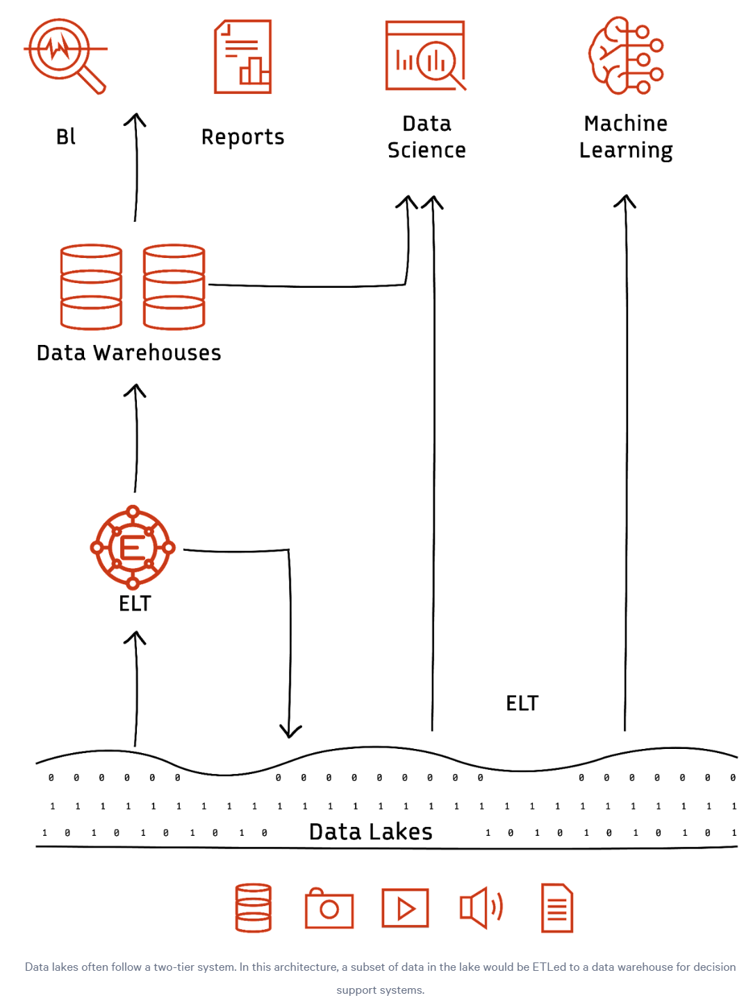

- description : (book정리) Fundamentals of data engineering - DE
- tag : book , summary , my-summary , DE , data-science , done
- date : 2025-01-31

TOC
- [1. Fundamentals of data engineering](#1-fundamentals-of-data-engineering)
  - [1.1. Use cases](#11-use-cases)
  - [1.2. Stages of the cycle](#12-stages-of-the-cycle)
  - [1.3. Emerging trends \& challenges](#13-emerging-trends--challenges)
- [2. Data pipeline architecture](#2-data-pipeline-architecture)
  - [2.1. Data pipeline architectural patterns](#21-data-pipeline-architectural-patterns)
  - [2.2. Factors impacting data pipeline architecture choice](#22-factors-impacting-data-pipeline-architecture-choice)
- [3. Data engineering tools](#3-data-engineering-tools)
  - [3.1. Ingestion tools](#31-ingestion-tools)
  - [3.2. Tansformation Tools](#32-tansformation-tools)
  - [3.3. Storage Tools](#33-storage-tools)
  - [3.4. Data Lakes](#34-data-lakes)
  - [3.5. Data warehouses](#35-data-warehouses)
  - [3.6. Data lakehouses](#36-data-lakehouses)
  - [3.7. Monitoring tools](#37-monitoring-tools)
  - [3.8. Data quality and governance tools](#38-data-quality-and-governance-tools)
  - [3.9. Reporting tools](#39-reporting-tools)
- [4. Data warehouse vs. data lake](#4-data-warehouse-vs-data-lake)
- [5. Data lifecycle management](#5-data-lifecycle-management)
  - [5.1. data ingestion](#51-data-ingestion)
    - [5.1.1. data ingestion patterns](#511-data-ingestion-patterns)
  - [5.2. data storage](#52-data-storage)
  - [5.3. Data processing \& transformations](#53-data-processing--transformations)
  - [5.4. Data consumption](#54-data-consumption)
  - [5.5. Data archiving and deletion](#55-data-archiving-and-deletion)
- [6. Streaming data pipeline](#6-streaming-data-pipeline)
  - [6.1. Streaming data pipeline fundamentals](#61-streaming-data-pipeline-fundamentals)
  - [6.2. Important considerations in streaming data pipeline design](#62-important-considerations-in-streaming-data-pipeline-design)
- [7. CDC (change data capture)](#7-cdc-change-data-capture)
  - [7.1. Understanding CDC](#71-understanding-cdc)
  - [7.2. Practical applications of CDC](#72-practical-applications-of-cdc)
  - [7.3. Push-based CDC implementation](#73-push-based-cdc-implementation)
  - [7.4. Pull-based CDC implementation](#74-pull-based-cdc-implementation)
- [8. Data streaming technologies](#8-data-streaming-technologies)
  - [8.1. Data streaming technologies—architectural approaches](#81-data-streaming-technologiesarchitectural-approaches)
- [9. Stream processing](#9-stream-processing)
  - [9.1. Fundamental concepts in stream processing](#91-fundamental-concepts-in-stream-processing)
  - [9.2. Stream processing challenges for developers](#92-stream-processing-challenges-for-developers)
  - [9.3. Stream processing best practices for developers](#93-stream-processing-best-practices-for-developers)
- [10. Event Streaming](#10-event-streaming)


----------------

Title : Fundamentals of data engineering
- https://www.redpanda.com/guides/fundamentals-of-data-engineering

# 1. [Fundamentals of data engineering](https://www.redpanda.com/guides/fundamentals-of-data-engineering)
- In a nutshell: its ability to convert raw data into actionable insights.
- Data engineering is deriving of meaningful insights from operational data.
  - Structured data organized in databases with a clear schema, often in tabular formats like SQL databases.
  - Unstructured data like images, videos, emails, and text documents that cannot fit into schemas.
  - Semi-structured data that includes both structured and unstructured elements.
- Tools and frameworks like Apache Hadoop, Apache Spark™, Apache Kafka®, Airflow, Redpanda, Apache Beam®, Apache Flink®, and more exist to implement the different data engineering approaches. (IMO : Until now, I made all by myself.)
## 1.1. Use cases
  - real-time analytics / Fraud detection / Health monitoring / Data migration / AI
## 1.2. Stages of the cycle
  - data ingestion : data gathering from source
  - data transformation : refine raw data and enhance its quality and utility.
  - data serving : server for end-users through API
  - data storage : stores data through the various data engineering stages. storage merges the disparate sets to offer a cohesive and consistent daa view.  (reliable , available and secure)
- Best practices
  - Proactive data monitoring	: Regularly checks datasets for anomalies to maintain data integrity. This includes identifying missing, duplicate, or inconsistent data entries.
    - A tool like Apache Griffin can be used to measure data quality across platforms in real-time, providing visibility into data health.
    - ```python
      # Using Python's built-in methods for simple validation
      def is_valid_email(email):
          return "@" in email and "." in email
      # Simple Pytest for data validation
      def test_data_entry(entry):
          assert type(entry['price']) == float, "Price should be a float"
      ```
  - Schema drift management	: Detects and addresses changes in data structure, ensuring compatibility and reducing data pipeline breaks.
    - It can result from scenarios like an API update altering data fields. 
      - Utilize dynamic schema solutions that adjust to data changes in real time.
      - Perform regular audits and validate data sources.
      - Integrate version controls for schemas, maintaining a historical record.
    - ```python
      import pandas as pd

      def detect_schema_drift(old_schema, new_schema):
          if set(old_schema) != set(new_schema):
              added = set(new_schema) - set(old_schema)
              removed = set(old_schema) - set(new_schema)
              return {"added": list(added), "removed": list(removed)}
          else:
              return None

      old_df = pd.DataFrame({
          'A': [1,2,3],
          'B': [4,5,6]
      })

      new_df = pd.DataFrame({
          'A': [1,2,3],
          'C': [7,8,9]
      })

      drift = detect_schema_drift(old_df.columns, new_df.columns)
      print(drift)
      ```
  - Continuous documentation : Manages descriptive information about data, aiding in discoverability and comprehension.
    - Maintaining up-to-date documentation becomes vital with the increasing complexity of data architectures and workflows.
    - [ ] How to do well?  I want to use my tool like my github private memo.
  - Data security measures : Controls and monitors access to data sources, enhancing security and compliance.
    - Tools like Apache Atlas offer insights into data lineage—a necessity in sectors where compliance demands tracing data back to its origin.
    - Automated testing frameworks like Pytest and monitoring tools like Grafana all contribute to proactive data security.
  - Version control and backups : Tracks change to datasets over time, aiding in reproducibility and audit trails
    - git : we use it.  However , I should break a big job into several sub job.  each commit should be less than 100 lines. if you have a lot of changes , set a tag.
## 1.3. Emerging trends & challenges
  - Data engineers are increasingly adopting distributed data storage and processing systems like Hadoop or Spark. Netflix's adoption of a microservices architecture to manage increasing data is a testament to the importance of scalable designs.
  - The shift towards cloud-based storage and processing solutions has also revolutionized data engineering. Platforms like AWS, Google Cloud, and Azure offer scalable storage and high-performance computing capabilities. 
  - AI's rise has paralleled the evolution of data-driven decision-making in businesses. Advanced algorithms can sift through vast datasets, identify patterns, and offer previously inscrutable insights. However, these insights are only as good as the data they're based on. The fundamentals of data engineering are evolving with AI.
    - Using data engineering in AI
      - AI applications can also learn and process human language. For instance, they can identify hidden sentiments in content, summarize and sort documents, and translate from one language to another. These AI applications require data engineers to convert text into numerical vectors using embeddings. The resulting vectors can be extensive, demanding efficient storage solutions. Real-time applications require rapid conversion into these embeddings, challenging data infrastructure's processing speed. Data pipelines have to maintain the context of textual data. It also involves data infrastructure capable of handling varied linguistic structures and scripts.
      - Scale / Diversity / Quality
    - Using AI for data enginerring
      - In essence, **the integration of AI into data engineering is a game-changer**. As AI simplifies and enhances complex data engineering tasks, professionals can focus on strategic activities, pushing the boundaries of what's possible in data-driven innovation. The potential of this synergy is vast, promising unprecedented advancements in data efficiency, accuracy, and utility.
      - The relationship between AI and data engineering is bidirectional.
      - Automated data cleansing / Predictive data storage / Anomaly detection / Imputation (predict and fill in missing data) / Data categorization and tagging / Optimizing data pipelines / Semantic data search / Data lineage tracking

# 2. [Data pipeline architecture](https://www.redpanda.com/guides/fundamentals-of-data-engineering-data-pipeline-architecture)
- Summary of key concepts
  - Defining data pipeline architecture	: Architecture is a blueprint of a data pipeline, independent of the technologies used in its implementation.
  - Factors impacting pipeline architecture	: Expected behavior of each stage of the data pipeline from data source to downstream application.
  - Data pipeline architecture principles	: Reliability, scalability, security, and flexibility are essential in architecture design.
  - Data warehouse architectural pattern : Data flows from diverse sources to central, structured data storage.
  - Data lake architectural pattern : Data flows from diverse sources to a central, unstructured data store.
  - Data flow pipeline : Data flows continuously through the pipeline in the form of small messages.
  - IoT data pipeline : Data flows from IoT devices to analytics systems in a continuous stream of time-stamped data.
- Principles in data pipeline architecture design
  - Loose coupling : communicating through **well-defined interfaces**. This allows individual components to be updated or changed at will without affecting the rest of the pipeline
  - Scalability
  - Reliability : The data pipeline is critical when downstream applications consume processed data in near real-time.  (IMO : we need the checking system of reliability.)
  - Security
## 2.1. Data pipeline architectural patterns
  - Data warehouse : The data warehouse architecture consists of a central data hub where data is stored and accessed by downstream analytics systems. (ETL system) Extraction / Transformation / Loading (push data)
  - Data lake : Data lakes are a more flexible data pipeline architecture that relies on cloud-based infrastructure to be cost-effective while enabling a huge variety of data processing use cases. It does not enforce structure on data stored within it, accepting data from a large variety of sources and storing it as is.
  - Dataflow pipeline : Dataflow pipelines are data pipelines for data streaming applications. They typically use a data streaming platform like Kafka or Redpanda as the data transfer layer, with data being ingested as small messages.
    - 
    - ex. Apache Flink
## 2.2. Factors impacting data pipeline architecture choice
  - Data source : The source from which the data flows into the pipeline can be one of many possibilities, including relational database systems like SQL, NoSQL databases like Cassandra, modern systems like IoT swarms, and even something as simple as .csv files.
  - Ingestion and storage
  - Consumption : Data pipelines serve a variety of applications, including machine learning applications, data analytics, business intelligence tools, and so on.

# 3. [Data engineering tools](https://www.redpanda.com/guides/fundamentals-of-data-engineering-data-engineering-tools)
| Tool category                  | Description                                                                                  |
|--------------------------------|----------------------------------------------------------------------------------------------|
| Ingestion tools                | Collect and import data from diverse sources into a data ecosystem. They typically support ETL processes. |
| Processing tools               | Transform, cleanse, and manipulate data at scale. They run complex data operations efficiently. |
| Storage and warehousing tools  | Provide robust and efficient data storage, including on-premises and cloud-based solutions.  |
| Monitoring tools               | Provide real-time insights into data pipeline health and performance, ensuring data reliability. |
| Data quality and governance tools | Support data quality, security, and compliance management, including metadata, lineage, and policy control. |
| Reporting tools                | Generate and deliver reports and dashboards based on data insights and analytics.           |

- 

## 3.1. Ingestion tools
  - Redpanda : Kafka complexity를 줄이고 , Kafk API와 호환
  - Kafka Connect : external database system을 Kafka와 연결하는 tool
  - Debezium : open source 로써 Kafka의 top에 위치한 transaction log를 이용하여 source database에 commit되는 row-level change를 기록한다.
## 3.2. Tansformation Tools
  - Spark
    - Spark is a unified analytics engine that can be used for both batch and streaming data processing. It is built on the Hadoop Distributed File System (HDFS) and uses a distributed architecture to process data quickly and efficiently. It can scale horizontally to handle large datasets across multiple nodes. You can also cache data in memory, significantly improving the performance of data processing operations.
    - Spark has a high fault tolerance so that data processing continues even if some nodes in the cluster fail. It can read and write data to various data systems, including HDFS, Hive, Cassandra, and Amazon S3, and also supports multiple programming languages like Java, Scala, Python, and R.
  - Airflow : orchestrate complex data pipelines. 
    - Airflow is a workflow management platform that you can use to orchestrate complex data pipelines. It is built on top of Python and provides a simple and intuitive way to define and manage workflows. Airflow uses a distributed architecture
  - Flink (open source) is often used for real-time analytics, event-driven applications, and data processing tasks that require low-latency and high-throughput processing. 
  - Kafka Streams (a.k.a Kstreams) is a library in the Apache Kafka® ecosystem that enables real-time stream processing of data
## 3.3. Storage Tools
  - Once your data has been transformed, it needs to be stored in a way that is efficient, scalable, and accessible.
  - 
## 3.4. Data Lakes
  - Popular cloud-based data lakes include Amazon S3, Azure Data Lake Storage, and Google Cloud Storage.
## 3.5. Data warehouses
  - Data warehouses are central repositories for storing and analyzing large amounts of **structured data**. Amazon Redshift is currently leading as a fully managed data warehousing service by AWS. It uses columnar storage, parallel processing, and automatic query optimization to deliver fast query performance on large datasets. You only pay for the compute and storage resources you use, making it a cost-effective solution for data analytics. Other top data warehousing solutions include:
  - BigQuery can be used to store and analyze **structured, semi-structured, and unstructured data**. It is a cloud-based data warehouse that is designed to be scalable, reliable, and easy to use. It can query billions of rows in seconds.
  - SnowFlake : This makes Snowflake more cost-effective than other data warehouses, and you can process queries very quickly, even on large datasets.
## 3.6. Data lakehouses
  - The data lakehouse is an emerging concept in enterprise big data storage architectures.
  - Hudi is a popular open-source lakehouse that enables you to build an end-to-end data pipeline on top of existing data lakes.
## 3.7. Monitoring tools
  - **Grafana** is an open-source monitoring and observability platform that enables you to visualize, query, understand, and set alerts on your metrics, irrespective of where they’re stored. Grafana allows you to:
    - Create and share interactive dashboards that visualize metrics from various data sources, including Prometheus, Graphite, InfluxDb, and more.
    - Send alerts via email, Slack, PagerDuty, and other notification channels when metrics exceed or fall below certain thresholds.
    - Automatically detect anomalies in your metrics and notify you when they occur.
    - Trace the flow of requests through your distributed system and identify performance bottlenecks.
## 3.8. Data quality and governance tools
  - Data governance is the process of managing data in a way that ensures data is accurate, consistent, trustworthy, and always meets the security and regulatory requirements of your organization.
  - **Great Expectations (GX)** is an open-source data quality tool that helps teams build a shared understanding of their data through quality testing, documentation, and profiling. It is a Python-based tool that allows data teams to profile, test, and create data reports.
    - Automatically profile data and identify potential quality issues.
    - Create and run data tests to validate the quality of your data.
    - Generate documentation for your data quality tests.
    - Generate reports on the results of your data quality checks.
## 3.9. Reporting tools
  - **Tableau** also allows you to connect to various data sources, including databases, spreadsheets, and web services. You can extract and transform data from these sources into a format suitable for visualization and analysis.
  - **Streamlit** is a modern-day low-code data visualization tool that helps users build powerful data apps and dashboards. It is an open-source Python library that makes it easy to create and share beautiful, custom web apps for machine learning and data science.

# 4. [Data warehouse vs. data lake](https://www.redpanda.com/guides/fundamentals-of-data-engineering-data-warehouse-vs-data-lake)
- summary

| Difference         | Category              | Data warehouse                                                                 | Data lake                                                                 |
|-------------------|----------------------|-------------------------------------------------------------------------------|-------------------------------------------------------------------------|
| **Architecture**  | Schema               | Schema-on-write: Contains well-defined tables in a traditional RDBMS designed around subject-specific business metrics. Star Schema is common. | Schema-on-read: Usually, there is no overarching schema. It may contain some processed data that resembles data found in a data warehouse. Typically stored in a distributed database. |
|                  | Design requirements   | Facts and dimensions, more preparation, and communication with stakeholders and users. | Much less prep allows for ad-hoc additions of new data sources or processed data. |
| **Data**         | Data format           | Structured                                                                   | Structured, semi-structured, and unstructured                         |
|                  | Timeliness            | Aggregated over predefined intervals (e.g., daily, weekly, monthly). Typically batch processed. | Data can be ingested in batch or in real-time.                        |
| **Management**   | Data processing       | Extract, Transform, Load (ETL): Follows established business rules. Typically involves aggregations and some calculations. | Extract, Load, Transform (ELT): Minimal processing, maybe some cleaning to create analytics-ready datasets, but mostly raw, unprocessed. |
|                  | Data lineage          | Processed data comes from various well-defined business sources.              | Typically raw, unprocessed data. It can be ingested from downstream databases or directly from data generation processes. |
|                  | Updates               | Difficult to update. Data Engineers may spend more time writing SQL queries to add facts/dimensions. | Easy to update. Data engineers spend more time building pipelines to feed new data sources into the data lake. |
| **Usage**        | Users                 | Business intelligence analysts, Stakeholders                                  | Data analysts, Engineers, Scientists, Business intelligence analysts   |
|                  | Access patterns       | Regular data pulls to dashboards and reports. Some ad hoc analysis.       | Much more random. Can include heavy loads for ML model training.       |
|                  | Data products         | Reports, dashboards                                                         | Machine learning models, analytics reports, R&D, data product development |
| **Benefits**     |                       | Provides pre-defined KPIs. Easy to access and analyze for business users.   | Raw data can be sampled and organized to build new data products or machine learning models. Scales to handle high volume, velocity, and veracity data. |

- data warehouse

- data lake


# 5. [Data lifecycle management](https://www.redpanda.com/guides/fundamentals-of-data-engineering-data-lifecycle-management)
- DLM aims to ensure that data is accurate, complete, and easily accessible to its users.
- data lifecycle


## 5.1. data ingestion
- Extract, Transform, Load (ETL) is a traditional data integration technique that involves extracting data from various sources, transforming it into a standard format, and loading it into a target system such as a data warehouse or data lake. ETL evolved further into Extract, Load, Transform (ELT), which extracts data from various sources, loads it into a centralized repository, and transforms it into a format that is optimized for analysis and processing.However, both ETL and ELT present challenges at scale. 
### 5.1.1. data ingestion patterns
- **Multisource extractor pattern** is an approach to ingest multiple data source types efficiently.
- **Protocol converter pattern** employs a protocol mediator to provide the abstraction for the incoming data from the different protocol layers.
- **Multidestination pattern** is useful when the ingestion layer has to transport the data to multiple components like Hadoop Distributed File System (HDFS), streaming pipelines, or real-time processing engines.
- **Just-in-time transformation pattern** involves transforming data into a format suitable for consumption by the target system just before it is needed to save compute time.
- **Real-time streaming patterns** support instant analysis of data coming into the enterprise

## 5.2. data storage
- Relational databases like MySQL, PostgreSQL, and MariaDB
- NoSQL : key-value 조합으로 할수 있는 모든 것
- Others : Google BigQuery / Amazon Redshift / Snowflake / Vertica

## 5.3. Data processing & transformations
- Real time data processing : Apache Storm / Apache Flink / Apache Spark Streaming / Apache Kafka Streams / AWS Kinesis / Azure Stream Analytics
  - Several pat`terns
    - windowing
    - triggering : it is good to have a low rate of change but requires immediate processing
    - late arrival handling : 순서가 없는 것
    - real-time join : combination of data from differnet source
    - real-time aggregation : data aggregation, such as calculating statistics or counting the number of events
    - real-time filtering : 원하지 않는 데이터 filter out
    - route pattern
    - transform`
- Batch-based data processing : Apache Hadoop, MapReduce, Spark, Storm, and Flink.
  - Common batch transformation patterns 
    - MapReduce
    - Distributed joins
    - Broadcast join
    - Sort merge join
    - Shuffle hash join
  - combined bach and stream : Lambda / Kappa

## 5.4. Data consumption
- Data consumption refers to analyzing and utilizing data to extract insights and support business decisions.
- types of data analytics
  - 

## 5.5. Data archiving and deletion
- data archiving
  - Data compression—reduction in the number of bits required to store data.
  - Data deduplication—removal of duplicate data copies
  - Data classification—based on importance and access frequency can help organizations identify which data should be archived and how it should be stored.
  - Data indexing—creating indexes of archived data helps organizations quickly locate and retrieve specific data when needed.
- data deleting
  - Data retention policies: Establishing policies for data retention can help organizations determine when data should be deleted and how it should be disposed of.
  - Data backup and recovery: Ensuring backups are available and restorable can help organizations recover from accidental deletions or data loss.
  - Auditing and monitoring: Monitoring and auditing data deletion activities can help organizations detect and respond to potential security risks or compliance violations.

# 6. [Streaming data pipeline](https://www.redpanda.com/guides/fundamentals-of-data-engineering-streaming-data-pipeline)
- According to International Data Corporation, the world's data volume is set to grow by 61% to 175 zettabytes by 2025.
- A streaming data pipeline allows data to flow through a source to a target- in near real-time just like a stream.

## 6.1. Streaming data pipeline fundamentals
- [X] [MOUSE](https://github.com/cheoljoo/mouse/tree/master) project에서는 SOURCE (engineer) > data ingestion layer (JIRA) > data storage layer (CJQL) > data processing layer (CAnalysisVlm.py) > destination (final.json/html) 의 각각의 어느 단계에 포함되는지를 나타낼수 있을 것으로 보인다.
  - 

## 6.2. Important considerations in streaming data pipeline design
- Throughput and latency optimization
- Scalability
- Storage at scale
- Reliability
- Error handling
  - Error handling is extremely crucial for data reliability. To minimize errors, streaming processing frameworks, tools like Data Flow Monitoring Interfaces, and platforms like Apache NiFi offer built-in management mechanisms that automatically identify, report, and handle errors that may arise during data processing.
  - Retrying or automatically reattempting to process failed data also increases the chance of successful data delivery without any manual intervention. It increases the data pipelines’ efficiency but may impact throughput.
- Security
- Monitoring and tuning
  - Monitoring not only helps you improve your optimal performance but also gives you ways to determine whether you need horizontal or vertical scalability.

# 7. [CDC (change data capture)](https://www.redpanda.com/guides/fundamentals-of-data-engineering-cdc-change-data-capture)
- Summary of key CDC (Change data capture) concepts
  - Real-time data synchronization : Change data capture helps to synchronize data in a source database with a destination system as soon as a change happens.
  - CDC approaches
    - Push-based CDC relies on the source database to trigger the data transmission.
    - Pull-based CDC depends on the destination database or intermediate CDC framework to trigger the data capture.
  - CDC implementation patterns	
    - Query-based CDC uses queries on the source database to extract the changes. 
    - Trigger CDC involves configuring the database with triggers to send messages when data is updated, inserted, or deleted. 
    - Binary log-based CDC relies on internal log files of the source database to understand the changes.
  - CDC architecture : A real-time stream processing framework like Redpanda helps to implement CDC by providing a buffer and transformation layer between source and destination.

## 7.1. Understanding CDC
- A change in data occurs in a database through INSERT, UPDATE, or DELETE operation. Change data capture runs the same operations or brings the same effect in the destination database as and when the change happens.
- **In most cases, the source database is relational since CDC is often used to synchronize data between a transactional database and other downstream systems. However, the concept of CDC can apply to any source system, whether NoSQL or flat file storage.**

## 7.2. Practical applications of CDC
- Data replication between databases
- On-premise to cloud data migration : now do not hesitate to move parts of their data processing to the cloud.
- Microservice data integration : Organizations that rely on microservice integration split their core functionalities into several domains that act independently based on events.
- Maintaining caches and indexes : Change data capture helps to improve the performance of their services with indexs and caches in real time.
- Implementing real-time reports and analytics : (**이들은 이런 것 까지 생각해두는구나!**)
- Maintaining audit logs for compliance

## 7.3. Push-based CDC implementation
- It pushes data to the CDC framework.
- Trigger-based CDC
  - A trigger is a stored procedure that can be configured to execute whenever a database change occurs.
  - 

## 7.4. Pull-based CDC implementation
- the framework is responsible for identifying the changes happening in the source database and pushing it to the destination database.
- Query-based CDC : the CDC framework uses SELECT statements to identify if there has been a change in data.
- Log-based CDC : Most databases use a **write-ahead log** that stores all the events happening in a database to aid backup and data replication.

# 8. [Data streaming technologies](https://www.redpanda.com/guides/fundamentals-of-data-engineering-data-streaming-technologies)
- Data streaming technologies for processing
  - Apache Spark Streaming : Spark Streaming is an extension of the core Apache Spark API for stream processing in Spark—a **batch processing technology**.
  - Apache Flink® : Flink is a framework and **distributed processing engine** for stateful computations over unbounded and bounded data streams.

## 8.1. Data streaming technologies—architectural approaches
- Publish-subscribe
  - 
- task distribution
  - 

# 9. Stream processing
## 9.1. Fundamental concepts in stream processing
- Event-driven architecture
  - 
  - Processing logic : This logic defines event-driven rules, enabling dynamic responses to incoming data.
  - State management : This is crucial for scenarios like "exactly-once" processing, where it ensures that the same output is generated regardless of how many times the input stream is read. State management helps maintain context and supports complex computations.
  - Event processors & windowing : Picture a real-time financial analysis system where stock prices fluctuate by a second. Event-driven architecture ensures that each stock price update triggers an event, and windowing slices these updates into one-second intervals. This way, the architecture becomes a conductor, directing the data flow for harmonious analysis within the one-second windows. This synchronization empowers real-time calculations, like average prices or trend predictions, and facilitates timely decision-making.
## 9.2. Stream processing challenges for developers
- Ensuring exactly-once processing
- Ensuring at-least once processing
## 9.3. Stream processing best practices for developers
- Strategies for minimizing IO and maximizing performance
- Data distribution, partitioning, and sharding
- Incorporating in-memory processing for low-latency data handling

# 10. Event Streaming
- At its core, event streaming involves the continuous, unidirectional flow of events from producers to consumers. Producers generate events, and consumers process and respond to these events in real time.
- 
- Factors to consider
  - Latency requirements
  - Data consistency
