- description : (book정리) algorithms-and-data-structures-for-massive-datasets (대규모-데이터!-세트를-위한-알고리즘과-데이터-구조)
- tag : book , summary , my-summary , DE , data-science , bigData , read-done
- date : 2025-01-20

TOC
- [1. summary](#1-summary)
  - [1.1. 소개](#11-소개)
  - [1.2. 2장. 해시 테이블 및 최신 해싱 검토 : hatchset(도끼) -\> hash](#12-2장-해시-테이블-및-최신-해싱-검토--hatchset도끼---hash)
    - [1.2.1. 사용 시나리오](#121-사용-시나리오)
    - [1.2.2. python의 dict의 작동 방식](#122-python의-dict의-작동-방식)
    - [1.2.3. MurmurHash : 빠른 비암호화 해시 함수](#123-murmurhash--빠른-비암호화-해시-함수)
    - [1.2.4. 분산 시스템용 해시 테이블 : 일관된 해싱](#124-분산-시스템용-해시-테이블--일관된-해싱)
  - [1.3. 근사 멤버십 : Bloom / Quotient Filter](#13-근사-멤버십--bloom--quotient-filter)
    - [1.3.1. Bloom Filter 데이터 교환 방식](#131-bloom-filter-데이터-교환-방식)
    - [1.3.2. Bloom Filter Positive 처리 방법](#132-bloom-filter-positive-처리-방법)
    - [1.3.3. Bloom Filter 구성](#133-bloom-filter-구성)
    - [1.3.4. bloom filter 적용 및 대안](#134-bloom-filter-적용-및-대안)
    - [1.3.5. quotient filter](#135-quotient-filter)
      - [1.3.5.1. Quotienting](#1351-quotienting)
      - [1.3.5.2. meta data bit의 이해](#1352-meta-data-bit의-이해)
    - [1.3.6. Bloom 과 Quotient filter의 비교](#136-bloom-과-quotient-filter의-비교)
  - [1.4. 빈도 추정 및 Count-Min Sketch](#14-빈도-추정-및-count-min-sketch)
    - [1.4.1. 다수 (과반수) 요소 (Majority Element)](#141-다수-과반수-요소-majority-element)
    - [1.4.2. Count-Min Sketch : 작동 방식](#142-count-min-sketch--작동-방식)
  - [1.5. 카디널리티 추정 및 HyperLogLog](#15-카디널리티-추정-및-hyperloglog)
    - [1.5.1. 데이터 베이스의 개별 항목 계산산](#151-데이터-베이스의-개별-항목-계산산)
    - [1.5.2. hyperLogLog 증분 설계](#152-hyperloglog-증분-설계)
      - [1.5.2.1. 확률적 평균화](#1521-확률적-평균화)
      - [1.5.2.2. LogLog](#1522-loglog)
      - [1.5.2.3. HyperLogLog : 조화평균을 사용한 확률적 평균화](#1523-hyperloglog--조화평균을-사용한-확률적-평균화)
    - [1.5.3. 사용 사례 : HLL로 worm 잡기](#153-사용-사례--hll로-worm-잡기)
  - [1.6. 스트리밍 데이터 : 모든 것을 하나로 모으기](#16-스트리밍-데이터--모든-것을-하나로-모으기)
    - [1.6.1. 스트리밍 데이터 시스템 : 메타 예시](#161-스트리밍-데이터-시스템--메타-예시)
      - [1.6.1.1. bloom filter join](#1611-bloom-filter-join)
      - [1.6.1.2. 중복 제거](#1612-중복-제거)
      - [1.6.1.3. 부하 분산 및 네트워크 트래픽 추적](#1613-부하-분산-및-네트워크-트래픽-추적)
    - [1.6.2. 데이터 스트림의 실제 제약 및 개념](#162-데이터-스트림의-실제-제약-및-개념)
    - [1.6.3. 수학 비트 : 샘플링 및 추정](#163-수학-비트--샘플링-및-추정)
  - [1.7. 데이터 스트림에서 샘플링](#17-데이터-스트림에서-샘플링)
    - [1.7.1. 베르누이 샘플링 / Poisson (포아송) sampling](#171-베르누이-샘플링--poisson-포아송-sampling)
    - [1.7.2. 저장소 샘플링 (Reservoir Sampling)](#172-저장소-샘플링-reservoir-sampling)
    - [1.7.3. 편향된 저장소 샘플링](#173-편향된-저장소-샘플링)
    - [1.7.4. 슬라이딩 윈도우에서의 샘플링](#174-슬라이딩-윈도우에서의-샘플링)
    - [1.7.5. 우선 순위 샘플링](#175-우선-순위-샘플링)
  - [1.8. 데이터 스트림의 근사 분위수](#18-데이터-스트림의-근사-분위수)
    - [1.8.1. 정확한 분위수](#181-정확한-분위수)
    - [1.8.2. 근사 분위수](#182-근사-분위수)
    - [1.8.3. t-digest 작동 방식 (key percentile)](#183-t-digest-작동-방식-key-percentile)
    - [1.8.4. Q-digest](#184-q-digest)
  - [1.9. 외부 메모리 모델 소개](#19-외부-메모리-모델-소개)
    - [1.9.1. 외부 메모리 모델](#191-외부-메모리-모델)
    - [1.9.2. 최적의 검색](#192-최적의-검색)
  - [1.10. 데이터베이스용 데이터 구조 : B-Tree , B(esilon) Tree , LSM-Tree](#110-데이터베이스용-데이터-구조--b-tree--besilon-tree--lsm-tree)
    - [1.10.1. 인덱싱 작동 방식](#1101-인덱싱-작동-방식)
    - [1.10.2. 데이터 구조](#1102-데이터-구조)
    - [1.10.3. B-Tree](#1103-b-tree)
      - [1.10.3.1. B-Tree 밸런싱](#11031-b-tree-밸런싱)
      - [1.10.3.2. 조회(Lookup)](#11032-조회lookup)
      - [1.10.3.3. 삽입](#11033-삽입)
      - [1.10.3.4. 삭제](#11034-삭제)
    - [1.10.4. B+Tree](#1104-btree)
    - [1.10.5. Bε-트리](#1105-bε-트리)
      - [1.10.5.1. 작동방식](#11051-작동방식)
    - [1.10.6. LSM tree (로그 구조 병합 트리)](#1106-lsm-tree-로그-구조-병합-트리)
    - [1.10.7. 작동 방식](#1107-작동-방식)
  - [1.11. 외부 메모리 정렬](#111-외부-메모리-정렬)
    - [외부 메모리에서 정렬할때의 문제](#외부-메모리에서-정렬할때의-문제)
    - [외부 메모리의 양방향 병합 정렬](#외부-메모리의-양방향-병합-정렬)
- [2. capture](#2-capture)
- [3. readling list](#3-readling-list)
- [4. 책 (밀리의 서재)](#4-책-밀리의-서재)
  - [4.1. 데이터책](#41-데이터책)
  - [4.2. 금융](#42-금융)
  - [4.3. 부동산](#43-부동산)

----------------

algorithms-and-data-structures-for-massive-datasets

# 1. summary
- online book
  - https://www.manning.com/books/algorithms-and-data-structures-for-massive-datasets
- 소스
  - download : https://www.manning.com/downloads/2489

## 1.1. 소개
- 사실상 무한한 리소스를 가진 회사라도 여러분의 RAM을 공간 효율적인 데이터 구조로 채우는 방법을 선택합니다.
- 데이터 집약적이라는 것은 애플리케이션의 병목 현상이 데이터를 사용할수 있게 된 후 연산하는 것이 아니라 데이터를 주고 받으며 접근하는 과정에서 발생한다는 것을 의미합니다.
  - 해시테이블 (dict) 구조에 따라 다를수 있지만, 3장에 논의할 bloom filter (comment-id -> frequency)는 해시 페이블보다 8배 적은 공간을 사용하며 , 약 2%의 오탐률로 멤버십 질문에 답변합니다. bloom filter는 comment-id를 자체 저장하지 않는다. bloom filter의 크기는 키의 크기가 아니라 주로 삽입된 키의 수에 따라 달라집니다.
  - 4장의 count-min sketch는 각 comment-id의 빈도를 추정하는데 해시테이블보다 24배 이상 적은 공간을 사용하며 , 99%이상의 경우에서 빈도를 약간 과대 추정합니다.   주제 해시 테이블당 3MB를 사용하여 기존 방식에 비해 20배 적은 비용을 사용합니다.
  - 5장의 HyperLogLog는 12KB 만을 사용하여 세트의 cadinality(사전적의미는 집합원의 갯수, 데이터의 중복되는/유니크한 정도를 상대적으로 타나내는 개념으로 주민등록번호는 카디널리티가 높다고 판다)를 추정할수 있으며 , 오류는 실제 cadinality의 1% 미안으로 나타납니다. 
  - 스트림 댓글 데이터 : 좋아요
  - 데이터베이스의 댓글 데이터
  - 영구적 저장 (정확도 100%)
  - 용도에 맞는 데이터베이스 MySQL , TokuDB , LevelDB
- 공간을 줄이면 시간이 절약됩니다. : 하드훼어 한계를 극복할 수 있는 알고리즘을 설계해야 합니다. 작고 빠른 레벨의 메모리에 맞는 간결한 데이터 구조 설계 (또는 데이터 샘플을 취하면)는 비싼 디스크 탐색을 피할 수 있으므로 이점

## 1.2. 2장. 해시 테이블 및 최신 해싱 검토 : hatchset(도끼) -> hash
- 정렬된 배열 O(logN) , 연결된 목록 O(N) , 균형 이진 검색 트리(AVL,red-black : 정렬순서 유지하며 O(logN) ) , 해시 O(1) ~ O(N)
- 해시 테이블은 데이터 정렬이 중요한 모든 애플리케이션에 적합하지 않습니다. 정확히 일치하는 항목을 찾는데는 유용하나, 유사성에 관한 쿼리를 답변하기 위해서도 정렬된 데이터의 경우 해싱이 유용할 경우도 있습니다. 
  - 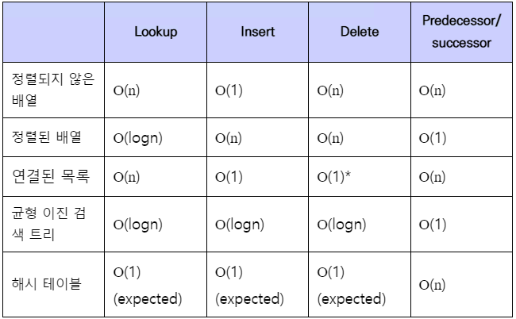
### 1.2.1. 사용 시나리오
- 백업/스토리지 솔류션의 중복 제거 (dropbox)
  - 스냅샷을 충분히 자주(예.24시간) 생성하면 연속된 스냅샷 사이에 있는 대부분의 데이터는 변경되지 않는 상태를 유지됩니다. 중복제거시 현대 대부분의 시스템에서 해싱을 사용합니다. 
- MOSS (소프트웨어 유사도 탐지 시스템) 및 Rabin-Krap 핑거프린팅을 통한 표절 탐지
  - rolling hash를 이용하여 빠르게 계산 (앞의 하나를 빼고 , 추가될 하나를 추가)
### 1.2.2. python의 dict의 작동 방식
- map [정렬된 red-black tree], unordered_map [정렬되지 않으며 하위에 해시 테이블] (C++) / HashMap (Java) 로 실행됨.
  - 충돌 해결은 chaning을 사용
  - j = ((5*j) +1) mod 2**i
### 1.2.3. MurmurHash : 빠른 비암호화 해시 함수
- wrapper : mmh3 (https://pypi.org/project/mmh3/)
  - mmh3.hash64(key="hello",seed=0,x64arch=True,signed=True)
  - mmh3.hash128(key="hello",seed=0,x64arch=True,signed=True)
### 1.2.4. 분산 시스템용 해시 테이블 : 일관된 해싱
- 분산 시스템에서 해시 테이블 크기를 변경함으로 인하여 리해싱을 하는 것은 동적인 상황에서는 실현 불가능하다.
- 해시링 (Hashring) : web cache : hash가 원으로 되어져있는 것 [0 ~ 2**k-1]이다. 순환 양방향 노드 리스트이다. 
  - 룩업 (Lookup) : distance를 이용하여 current 와 next의 사이에 resource가 들어가면 해당 부분이 return해야 하는 노드
  - 새로운 노드(30)가 들어왔다고하면 (28,29, 기존에는 27까지) 이 부분은 새로운 hash값 30에 재할당하게 됩니다. 
    - 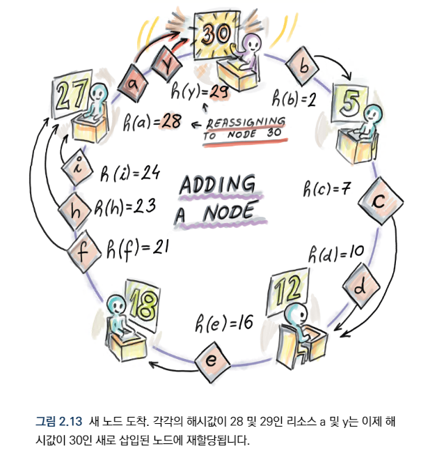
  - 코드 (Chord) : P2P 네트워크용 분산 룩업 : 각 노드마다 finger table을 가진다. 해당 finger table에서 가장 근접한 것으로 가서 다시 찾는다. 
    - 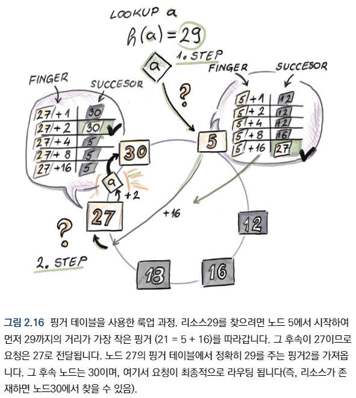
## 1.3. 근사 멤버십 : Bloom / Quotient Filter
- Bloom Fiter는 해시 테이블과 같은 방식으로 삽입 및 룩업을 지원하지만, 매우 적은 공간 (항목당 1바이 이하)을 사용합니다. 
  - 거짓 양성을 가지지만 거짓 음성은 없으며, 오류의 단면성은 이점으로 활용될 수 있습니다. Bloom Filter가 항목을 Found/Present로 보고할때 , 약간의 가능성으로는 사실과 다를수 있지만, **Not Found/Not Present로 보고할 때는 분명한 사실**임을 할 수 있습니다. 
  - Google WebTable / Apache Cassandra
    - 디스크에 위치해서 key-value map (URL-website 속성)으로 구성된 정렬된 문자열 테이블 (SSTs)이라는 여러 테이블로 데이터를 구성합니다. SST마다 전용 Bloom Filter를 RAM에 유지하여 쿼리를 올바른 테이블로 라우팅 합니다.
### 1.3.1. Bloom Filter 데이터 교환 방식
각 제품에서 Bloom filter 데이터를 교환하는 방식은 제품의 특성과 아키텍처에 따라 다를 수 있습니다. 다음은 몇 가지 예시입니다:
1. 데이터베이스 시스템
- Google Bigtable, Apache HBase: 
  - 교환 방식: 노드 간에 Bloom filter를 정기적으로 교환하거나, 특정 쿼리 요청 시 필요한 Bloom filter를 전송합니다. 데이터가 추가되거나 삭제될 때, 해당 변경 사항을 반영한 Bloom filter를 업데이트하여 교환합니다.
2. 웹 브라우저
- Chrome, Firefox: 
  - 교환 방식: 사용자가 방문한 URL에 대한 Bloom filter를 로컬에 저장하고, 브라우저 세션 간에 이 정보를 유지합니다. 사용자가 새로운 웹사이트를 방문할 때, 기존의 Bloom filter를 참조하여 중복 요청을 방지합니다.
3. 분산 시스템
- Apache Cassandra, Amazon DynamoDB: 
  - 교환 방식: 노드 간에 Bloom filter를 주기적으로 동기화하거나, 데이터 요청 시 필요한 Bloom filter를 전송합니다. 데이터가 변경될 때마다 해당 노드에서 Bloom filter를 업데이트하고, 이를 다른 노드와 교환하여 일관성을 유지합니다.
4. 네트워크 보안
- 방화벽, 침입 탐지 시스템: 
  - 교환 방식: 알려진 악성 IP 주소나 URL 목록을 Bloom filter로 변환하여, 주기적으로 업데이트된 필터를 다른 보안 장비와 교환합니다. 이를 통해 실시간으로 보안 정책을 강화합니다.
5. 캐시 시스템
- Redis, Memcached: 
  - 교환 방식: 캐시된 데이터의 존재 여부를 확인하기 위해 Bloom filter를 사용하며, 캐시가 업데이트될 때마다 Bloom filter를 갱신합니다. 이 정보는 다른 캐시 노드와 교환되어, 전체 시스템의 성능을 최적화합니다.
### 1.3.2. Bloom Filter Positive 처리 방법
Bloom filter에서 positive로 표시된 경우, 이는 해당 데이터가 존재할 가능성이 있다는 것을 의미하지만, 실제로 데이터가 존재하지 않을 수도 있습니다 (false positive). 이 상황에서 데이터를 처리하는 방법은 시스템의 설계와 아키텍처에 따라 다를 수 있습니다. 일반적으로 다음과 같은 접근 방식이 있습니다:
1. 처음 받은 시스템에서 처리
   - 데이터 요청: 처음 받은 시스템이 Bloom filter에서 positive로 표시된 경우, 해당 시스템은 실제 데이터를 확인하기 위해 데이터베이스나 다른 저장소에 요청을 보냅니다.
   - 결과 확인: 데이터가 존재하지 않는 경우, 시스템은 이를 처리하고, 필요에 따라 Bloom filter를 업데이트하여 false positive를 반영할 수 있습니다.
2. Bloom filter에 positive로 표시된 시스템에서 처리
   - 데이터 요청: Bloom filter에서 positive로 표시된 다른 시스템에 요청을 보냅니다. 이 시스템이 실제 데이터를 가지고 있는지 확인합니다.
   - 결과 확인: 해당 시스템에서 데이터가 존재하지 않는 경우, 이 정보는 요청한 시스템에 전달되고, 필요에 따라 Bloom filter를 업데이트할 수 있습니다.
3. 추가적인 처리
   - 오류 처리: 데이터가 존재하지 않는 경우, 시스템은 오류 메시지를 반환하거나, 사용자에게 적절한 피드백을 제공할 수 있습니다.
   - 재시도 로직: 데이터가 존재하지 않는 경우, 다른 노드나 시스템에 대해 재시도 로직을 구현할 수 있습니다. 이를 통해 데이터의 존재 여부를 확인하는 과정을 반복할 수 있습니다.이러한 방식으로, Bloom filter에서 positive로 표시된 경우에도 실제 데이터의 존재 여부를 확인하고, 필요한 처리를 수행할 수 있습니다. 시스템의 설계에 따라 이러한 로직이 다르게 구현될 수 있으므로, 구체적인 상황에 따라 적절한 방법을 선택해야 합니다.
### 1.3.3. Bloom Filter 구성
- n = 삽ㅇ비할 요소 수
- f = 거짓 양성률 (false positive rate)
- m = bloom filter의 비트수
- k = 해시 함수의 수
- 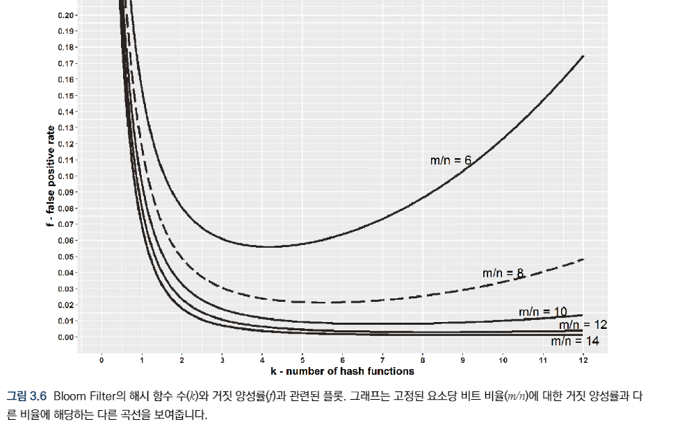
  - k = (m / n) * ln2
  - f = (1/2)**k
- 같은 양의 공간에 대해 더 나은 거짓 양성률을 달성할수 있을까? 
### 1.3.4. bloom filter 적용 및 대안
- 단점
  - 표준 bloom filter는 삭제 처리가 ㅇ벗다. 
  - 효율적으로 크기 조정이 안된다.
  - 쿼리가 균일하게 무작위로 생성되지 않을때 BF는 취약합니다. 일반적으로 쿠리는 균일하게 무작위로 생성되는 경우는 거의 없으면, 많은 경우 Zipfian 분포를 따름
### 1.3.5. quotient filter
- 선형 프로빙에서 사용된다.
- quotient filter는 작 해시의 일부를 저장하지만, 전체 해시를 신뢰할수 있게 복원할 수 있습니다.
- Quotient filter는 핑거프린트를 복원하는 기능을 이용하여 삭제 가능합니다. 그리고, 크기 조정도 가능합니다.
#### 1.3.5.1. Quotienting
- quotienting은 해시를 쿼션트(몫-quotient)와 나머지(remainder)로 나누는 것 입니다.
- ```filter[quotient] = remainder```
#### 1.3.5.2. meta data bit의 이해
- 충돌을 해결하기 위해서 사용되며 , 전체 핑거프린트를 재구성하기 위해 쿠티언트 필터는 슬롯당 3개의 추가 meta data bit를 사용합니다.
  - 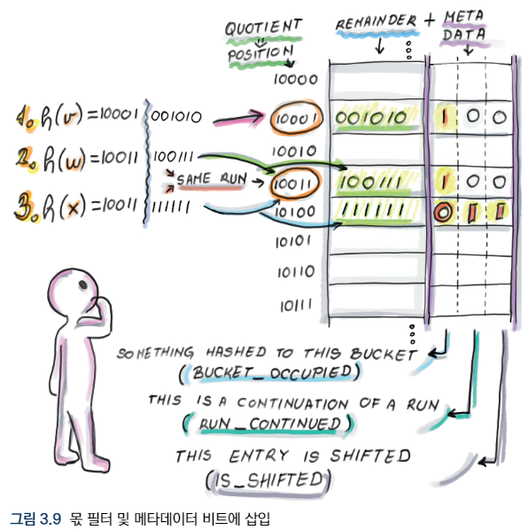
  - 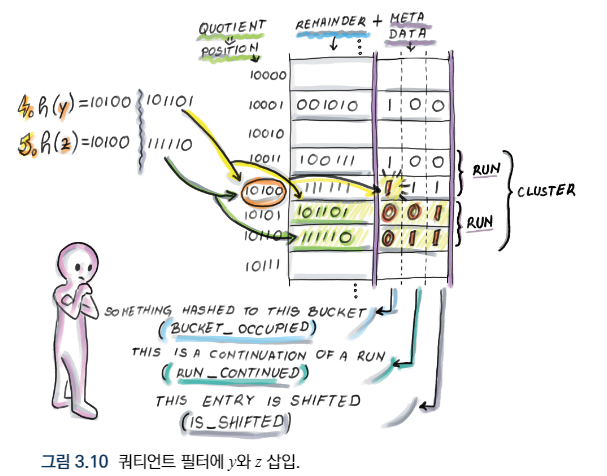
  - y 가 들어갈때 , 기존 10100에서의 BUCKET_OCCUPIED bit가 0 에서 1로 변경된다. 이유는 x 일때까지는 밀려서 들어간 것이지만, y가 들어감으로써 10100 (quotient)가 진짜로 사용되어지게 되어 hashing되었다고 보여지기 때문이다.
- 선형 프로빙 방식의 일반적인 해시 테이블과 마찬가지로 , 쿼티언트 필터는 부하율이 75~90%로 유지 될때 작업속도가 더 빨라집니다.
### 1.3.6. Bloom 과 Quotient filter의 비교
- 성능 차이는 크지 않다.
  - 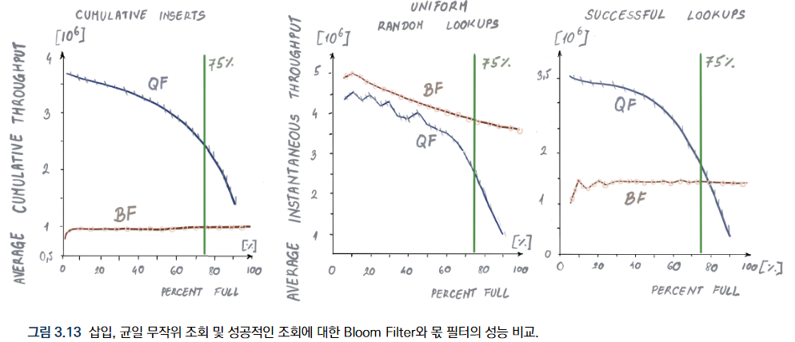

## 1.4. 빈도 추정 및 Count-Min Sketch
### 1.4.1. 다수 (과반수) 요소 (Majority Element)
- [boyer-more의 과반수 투표 알고리즘](./대규모-데이터!-세트를-위한-알고리즘과-데이터-구조/boyer-more-majority-vote.py)
  - [python debugger](https://www.digitalocean.com/community/tutorials/how-to-use-the-python-debugger#using-the-debugger-to-move-through-a-program)
    - break k.py:5
    - c
    - pp count
  - A = [7,7,7,7,7,7,1,2,3,2,5,2,2,3,2,4] 에 대해서 동작하면 답이 4가 나오는데 , 이거 아닌듯 한데요...
### 1.4.2. Count-Min Sketch : 작동 방식
- Count-Min Sketch는 빈도(frequency) 추정을 위한 확률적 자료 구조로, G. Cormode와 S. Muthukrishnan이 2003년 발표했습니다. 정확한 빈도 값은 HashMap 등과 같은 방법으로 계산할 수 있습니다. 이렇게 참값 빈도를 계산하려면, 유일한 원소 개수에 비례하는 메모리 공간(linear space)이 필요합니다. 하지만 Count-Min Sketch는 유일한 원소 개수보다 더 적은 메모리 공간(sublinear space)으로도 빈도 계산을 할 수 있습니다. 확률적 자료 구조이기 때문에 Count-Min Sketch로 얻을 수 있는 빈도 값은 참값이 아니라 근삿값입니다. HyperLogLog, Bloom Filter 등 다른 확률적 자료 구조와 마찬가지로 메모리 공간과 정확도(|참값 – 근삿값|)는 반비례 관계입니다.  Count-Min Sketch는 전체 원소 중 극히 일부만 빈도 값이 큰 분포를 다루기에 적합합니다. 그 외의 분포에서는 오차가 증가하기 때문입니다. 가령 네이버에 접속하는 모든 IP 주소에 대한 국가별 빈도를 매우 적은 메모리만 사용해 실시간으로 알고자 할 때 Count-Min Sketch는 훌륭한 선택이 될 수 있습니다. [reference](https://d2.naver.com/helloworld/799782)
  - 데이터 분포가 Zipfian 분포를 따른다면 Count-Min Sketch를 적용하기 적합하다.
  - 웹 페이지 방문 기록은 Top-K가 전체 빈도의 합인 S의 대부분을 차지하는 핵심 방문자가 있는 경우가 많다. 이런 빈도 정보를 실시간으로 파악하고자 할 때 Count-Min Sketch는 좋은 선택일 수 있다.
- Count-Min Sketch를 이용한 Range queries
  - 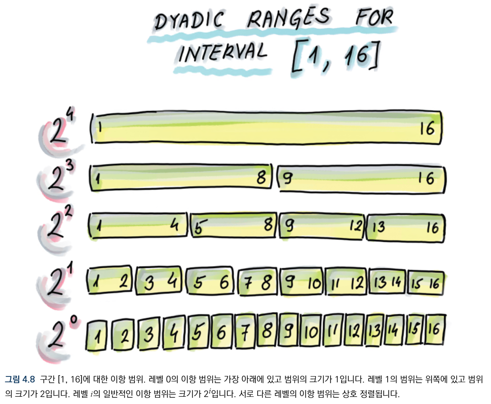
  - [2,16] 범위는 [2,2] , [3,4] , [5,8] , [9,16] 의 4개의 이항 범위로 구분 할수 있다.
- O(logN)
## 1.5. 카디널리티 추정 및 HyperLogLog
- 오늘날 카디널리티 추정은 특정 제품에 관심 있는 개별 방문자 수, 웹 앱의 특정 기능을 사용하는 서로 다른 사용자 수, 라우터를 통해 전달되는 개별 소스-목적지 IP 주소의 수의 갑작스러운 변화(잠재적으로 서비스 거부 공격을 나타냄)를 감지하는데 사용됩니다. 웹에서 정보가 반복되어 복제되는 방식 때문에 카디널리티를 측정하는 것은 개별 뉴스 기사나 특정 웹사이트의 사본 수와 같이 우리가 다루는 개별 콘텐츠의 수를 파악하는데도 도움이 됩니다.
### 1.5.1. 데이터 베이스의 개별 항목 계산산
- COUNT DISTINCT를 사용하는 쿼리는 특히 전자 상거래에서 웹사이트의 사용 통계를 얻고자 할 때 매우 일반적입니다. 사용자 방문 데이터는 종종 DAILY_VISITS 테이블에 기록되며 session_id, timestamp, product_id, user_ip_address, visit_duration 등의 속성으로 인해 매우 커지는 경향이 있습니다. 아래 SELECT 작업을 실행함으로써 특정 날짜에 ID 9873947로 제품에 액세스하는 개별 IP주소(즉, 사용자의 수)를 받게 됩니다. 바쁜 웹 사이트의 일일 방문 테이블은 수십억 개의 행으로 길어질 수 있으며, 이러한 쿼리는 시간이 오래 걸릴 수 있습니다.
  - ```sql
    SELECT COUNT (DISTINCT user_ip_address) WHERE product_id = 9873947
    FROM DAILY_VISITS
    ```
- 열이 사전에 정렬되지 않은 경우, 대부분의 데이터베이스에서(예: Azure SQL/SQL Server) 기본적인 COUNT DISTINCT가 수행하는 정렬 연산은 딜레이를 발생시킵니다. 열을 정렬한 후 모든 중복 항목이 서로 인접하게 위치하게 되고, 이후에는 중복 항목을 식별하고 계산하는데 한 번의 순차 스캔만 필요합니다. 정렬 작업은 행이 n개인 테이블에서 O(n log₂ n)의 비용이 들며, 수백만 또는 수십억 개의 행이 있는 테이블에서는 확장이 잘 이루어지지 않습니다. 설상가상으로, 단순한 쿼리조차도 여러 열에서 COUNT DISTINCT와 GROUP BY를 많이 수행하므로, 한 열을 정렬한다고 해서 다른 열의 정렬 복잡도를 줄일 수 없다는 것입니다. 해시 테이블을 사용하면 작업을 빠르게 처리할 수 있겠지만, 해시 테이블은 개별 요소의 수인 k에 비례하는 선형 공간을 필요로 합니다. k는 n까지 증가할 수 있기 때문에 해싱을 사용할 여유가 없습니다.
- 우리는 정확성을 포기하는 대가로 공간을 절약하는 많은 예를 보았습니다. 그러나 HyperLogLog는 평균적으로 작은 오류율(예: ±2%)로 진정한 카디널리티에 도달하면서 거의 항상 몇 킬로바이트 범위에 머물면서 공간 효율성에 완전히 새로운 의미를 부여합니다.
### 1.5.2. hyperLogLog 증분 설계
#### 1.5.2.1. 확률적 평균화
- 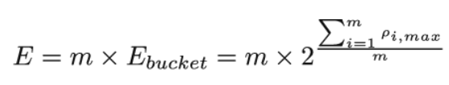
- 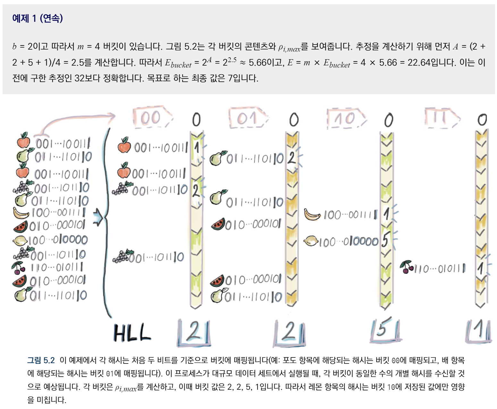
#### 1.5.2.2. LogLog
- 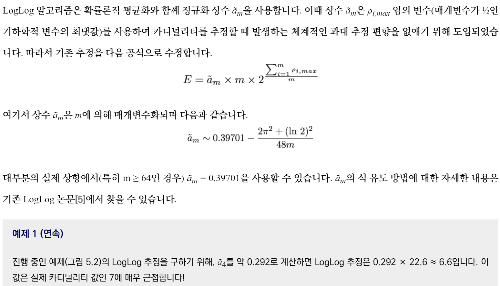
#### 1.5.2.3. HyperLogLog : 조화평균을 사용한 확률적 평균화
- 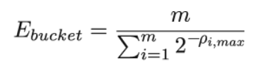
### 1.5.3. 사용 사례 : HLL로 worm 잡기
- 라우터를 통과하는 패킷 헤더에서 사용 가능한 소스-목적지 IP 주소 쌍은 관련된 네트워크 상태를 나타내는 지표 중 하나 입니다. 한 소스가 짧은 시간 간격으로 (때로는 무작위로) 목적기에 대해 많은 연결을 열거나, 단순히 서로 다른 소스-목적지 IP 주소 쌍의 수가 상당히 증가하면 바이러스가 있을수 있다는 것을 나타낼수 있습니다.  라우터에 유선으로 연결된 소프트웨어에 HyperLogLog를 내장하는 것은 특히 빠른 연산 시간과 작은 메모리 공간이 필요한 경우 매우 유용합니다. 

!! ????  이루는 잘 모르겠음.   실제로 작업할때 상세 내용은 보아야 할 듯

========= PART 2 : 스트리밍 데이터 =============

## 1.6. 스트리밍 데이터 : 모든 것을 하나로 모으기
- [스트리밍 데이터 처리 할때 distinct count estination에는 hyperLogLog. Percentile은 T-Digest.](https://brunch.co.kr/@yangpayangpa/89)
  - 데이터 처리 속도 걱정은 데이터 엔지니어링 (ME)
  - 데이터가 정확한가, 이게 무슨 의미인가는 데이터 사이언스
### 1.6.1. 스트리밍 데이터 시스템 : 메타 예시
#### 1.6.1.1. bloom filter join
- 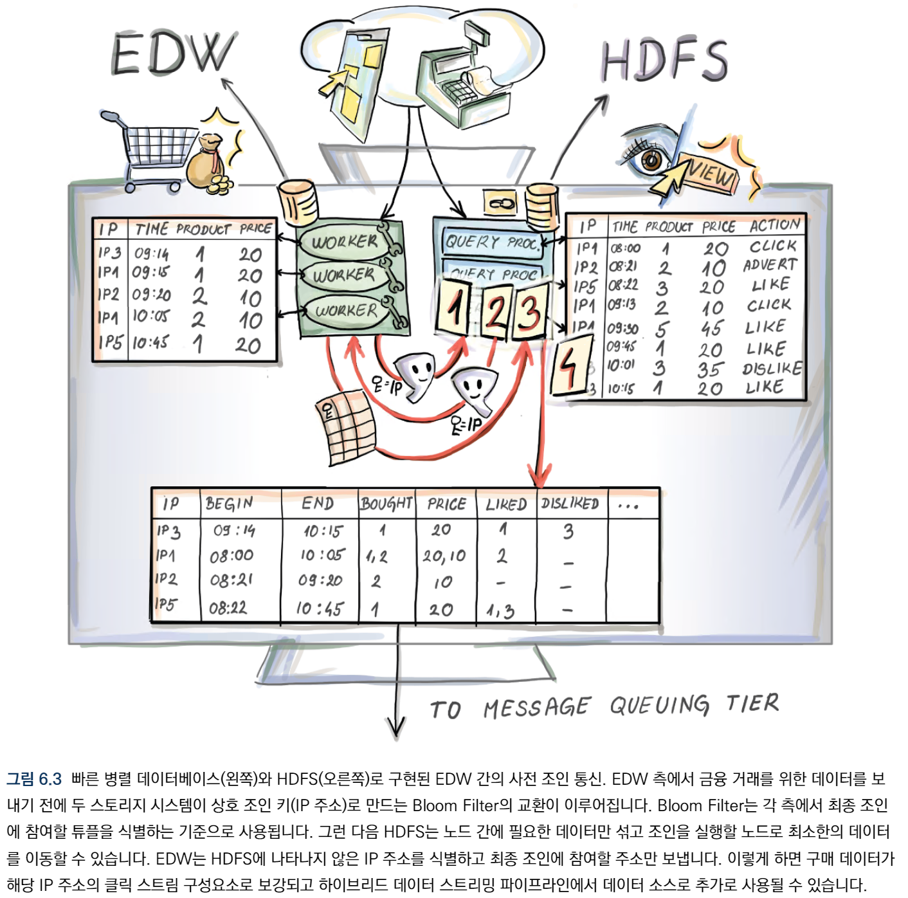
  - EDW : enterprise data warehouse
  - HDFS : hadoop distributed file system
  - 조인 작업을 구현하기 위해서는 이 두 시스템 간에 브로드캐스트해야 하는 테이블의 크기를 최소화하는데 집중
#### 1.6.1.2. 중복 제거
- 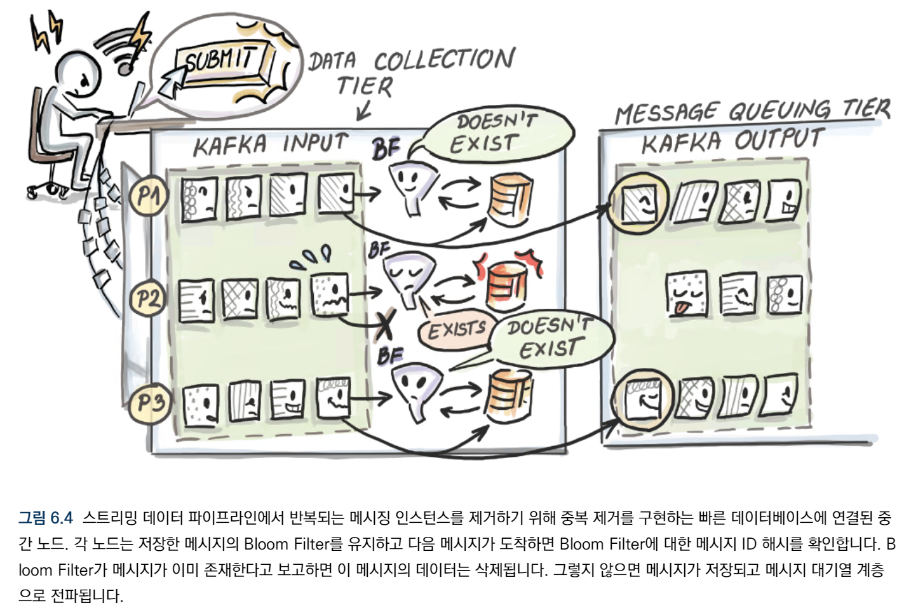
#### 1.6.1.3. 부하 분산 및 네트워크 트래픽 추적
- 브로커 간의 로드 밸런싱이 가장 중요.  최선 방어 전략은 실시간으로 탐지하는 통계적 방법에 의존
### 1.6.2. 데이터 스트림의 실제 제약 및 개념
- 슬라이딩 윈도우 모델
### 1.6.3. 수학 비트 : 샘플링 및 추정
- ???
## 1.7. 데이터 스트림에서 샘플링
### 1.7.1. 베르누이 샘플링 / Poisson (포아송) sampling
- 0 <= p <= 1 로 N*p 개의 샘플링을 한다.
- 베르누이와 포아송 샘플링의 단점은 무작위 샘플 크기 입니다. 
### 1.7.2. 저장소 샘플링 (Reservoir Sampling)
- 샘플 크기의 다양성 문제를 해결합니다. 선택된 샘플은 크기 k의 모든 샘플에 균등하게 분포 됩니다.  
- **저장소 샘플링 알고리즘의 실행 시간은 O(k + log(n/k)) 이므로 필요한 시간 및 공간은 "작은 공간 , 짧은 시간 제약"에 적합합니다.**
### 1.7.3. 편향된 저장소 샘플링
- 금융 데이터 스트림 또는 오래된 요소를 제거하는 것이 유익한 스트림의 경우
### 1.7.4. 슬라이딩 윈도우에서의 샘플링
- 윈도우가 1000개이고 sampale수가 k 개라고 할때 , 이 k개를 어떻게 유지 할지가 관건  (IMO : 그냥 windows size를 k로 잡고 처리하면 되는 것 아닌가?)
### 1.7.5. 우선 순위 샘플링
- (IMO : 우선 순위를 고려하는 heap등을 사용하여 가장 우선순위가 낮은 것과 비교해서 추가/대치하면 될 것으로 보인다. )
## 1.8. 데이터 스트림의 근사 분위수
- 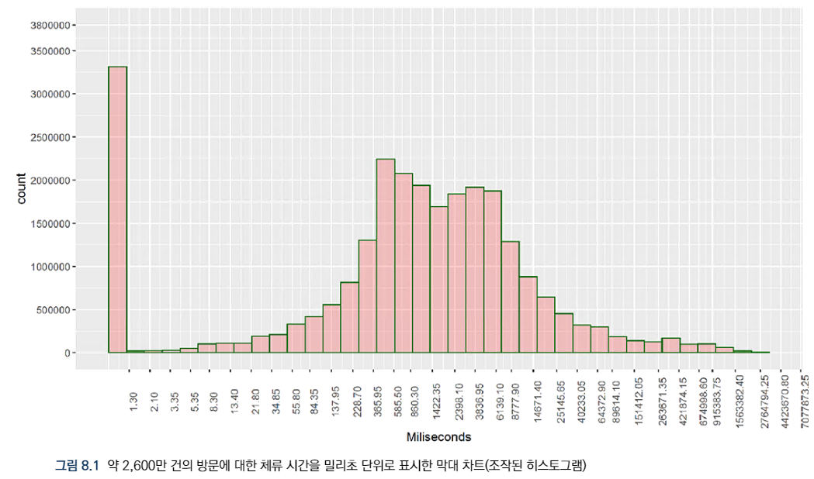
### 1.8.1. 정확한 분위수
- 데이터가 거의 정적이고 순위 쿠리를 많이 수행할 것으로 예상되는 경우에는 정렬에 대한 높은 대가를 지불할 가치가 있습니다. 그러나 특정 순위 몇 개만 찾아야 하거나 데이터가 자주 수정되는 경우 정렬은 비용이 많이 드는 취미가 됩니다. 
- O(N)
### 1.8.2. 근사 분위수
- social network에서는 대다수의 사용자가 길지 않은 대기 시간을 경험하지만, 이 대다수는 침묵하고 있ㅅ브니다. 롱테일 데이터는 절대값으로 99.5번째와 99.975번째 백분위수 사이에 30초 이상의 큰 차이가 발생할수 있습니다. 이것이 바로 부포의 꼬리에서 분위수 추정과 관련하여 더 높은 충실도를 가진 옵션을 원하는 이유입니다. 곱셈 상대 오차 범위는 이러한 비정상적인 꼬리 행동을 평가하는데 가산 오차 개념보다 적합합니다.
### 1.8.3. t-digest 작동 방식 (key percentile)
- ??? 이해 불가 ???
### 1.8.4. Q-digest
- t-digest 휴리스틱의 선행자로서, 오차와 공간에 대한 최악의 경우 보장을 제공합니다.  알고리즘적인 측면에서 우리를 안심시키는 요소 외에도 q-digest는 가장 높은 빈도의 요소에 대한 쿼리를 가장 정확하게 처리할수 있는 데이터 구조의 좋은 예시로 사용될수 있습니다. 이는 빈도 데이터를 다룰때 필요한 기능이지만, 다른 많은 데이터 구조에서는 이를 제공하지 않습니다.
- q-digest의 목표는 키-값 쌍의 형태로 제공되는 데이터 세트 S를 요약하는 것 입니다.  공간을 절약하기 위해서 너무 빈도가 낮은 쌍은 별로도 저장하지 않고 비슷하게 개수가 적은 인접 요소의 개수 정보와 병합되어 관려 ㄴ범위의 항목 수에 대한 정보는 보존되지만 특정 요소의 개수에 대한 정보는 손실됩니다.
- q-digest는 다른 많은 유형의 쿼리, 특히 범위 쿼리 , 역 사분위수 쿼리 및 합의 쿼리에 응답하는데에도 사용할 수 있습니다.


========= PART 3 : 데이터베이스 및 외부 메모리 알고리즘의 데이터 구조 =============
- I/O 비용이 CPU 비용보다 3배

## 1.9. 외부 메모리 모델 소개
- 외장 메모리 알고르즘 설계시 고려할 점
  - RAM은 데이터에 비해 사이즈가 매우 작다. RAM에 하나씩 가져오고 내보내야 한다.
  - 디스크 데이터는 연속된 청크(블록) 단위로 가져온다. 청크의 요소를 하나만 사용하든 수천 개를 사용하든 한 번의 데이터 전송에 드는 비용은 동일하다.
  - 블록 입출력은 RAM에 비해서 100 ~ 1000 배 이상 느리다
  - 디스크 데이터 액세스하는 순차적 순서는 무작위 순서보다 빠르다. 
  - 읽기가 쓰기보다 빠른 경향이 있다.
- 정의
  - N : 디스크에 있는 데이터 레코드 수
  - M : 주 메모리에 있는 레코드 수
  - B : 블럭 하나에 있는 레코드 수
### 1.9.1. 외부 메모리 모델
- sequential search나 binary search나 모두 block 을 몇 번 읽어오는지가 중요하다.
### 1.9.2. 최적의 검색
- log2 N/B  => logB N
- 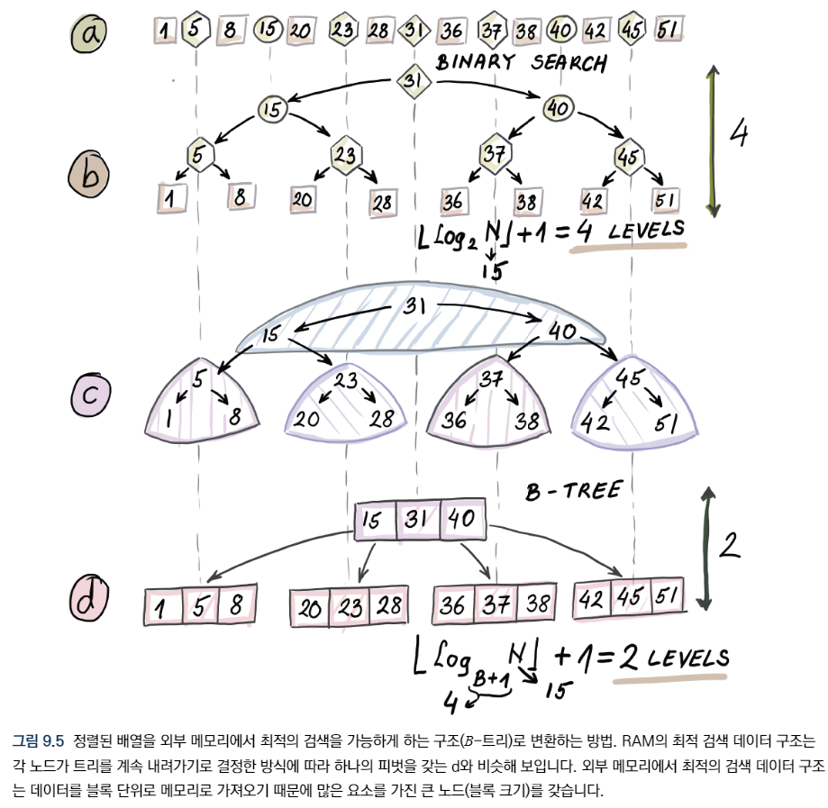

## 1.10. 데이터베이스용 데이터 구조 : B-Tree , B(esilon) Tree , LSM-Tree
### 1.10.1. 인덱싱 작동 방식
- 클러스터링되지 않은 인덱스(unclustered index)라고 부르기도 하는데, 인덱스를 구축할 때 실제 테이블 데이터가 재정렬되지 않는 형태입니다. 예시에서와 같이 여러 개의 인덱스가 있는 경우, 클러스터링되지 않은 인덱스를 사용해야 합니다. 반면 클러스터된 인덱스(clustered index)는 인덱스를 구축할 때 테이블 내에서 데이터를 정렬하므로, 한 테이블당 하나의 클러스터된 인덱스만 존재할 수 있습니다.
### 1.10.2. 데이터 구조
- 이 장에서는 가장 많이 사용되는 데이터베이스 엔진(ex. PostgreSQL (https://www.postgresql.org/docs/13/index.html) 및 MySQL(https://mng.bz/OG8n))과 같이 가장 큰 수의 종수를 형성하는 B-트리가 가장 많은 주의를 기울입니다[2]. B-트리는 이전 검색 트리와 매우 유사하지만, 디스크의 페이지/블록과 같은 큰 노드를 사용합니다. 이러한 노드는 많은 수의 키를 수용할 수 있기 때문에 B-트리는 큰 가지치기 인자(노드의 자식 수를 팬-아웃이라고 합니다)를 가지고 있어 깊이가 얕고 검색 성능이 우수합니다. 또한 이 장에서는 B-트리의 연산 메커니즘을 알아보는 것 외에도 B-트리가 외부 메모리에서의 검색에 대한 최적의 성능을 보인다는 수학적 정리를 밝힐 것입니다. 70년대에 고안된 예로 B-트리가 데이터베이스 엔진 설계에 가장 인기 있는 전력이 된 것은 당연한 일입니다.
- B-트리는 빠른 검색 능력으로 인해 널리 인정받고 있지만, B-트리보다 검색은 약간 느리더라도 삽입과 삭제의 성능이 훨씬 빠른 데이터 구조가 가능합니다. Bε-트리[3]는 TokuDB와 같은 저장 엔진에서 사용되는 대체 데이터 구조로, 최근에는 빠른 삽입 및 삭제 성능으로 인해 인기를 얻고 있습니다. 데이터가 더 동적으로 변하면서 많은 애플리케이션은 빠른 조회 속도를 유지하면서 B-트리 기반의 데이터베이스가 제공하는 삽입 및 삭제 속도보다 훨씬 빠른 속도를 유지해야 합니다. 이러한 유형의 워크로드에는 Bε-트리가 이상적인 데이터 구조입니다. Bε-트리는 조회 비용을 접근적으로 동일하게 유지하면서 삽입/삭제의 비용을(접근적으로) 개선합니다. 즉, 조회 속도는 약소 느려지지만 삽입 및 삭제 속도는 훨씬 더 빨라집니다.
- Bε-트리의 성능의 비밀은, 삽입과 삭제가 B-트리와 같이 즉시 실행되지 않는다는 점에 있습니다. Bε-트리에서는 단일한 삽입/삭제/수정이 즉시 트리의 필요로 이동하여 수정됨(B-트리는 기갑)을 중요하게 생각합니다). Bε-트리에서는 삽입과 삭제가 캡프를 향하는 동안 버퍼링되고 자연스러운 메커니즘으로 작동합니다. 연산을 지연시키는 아이디어는 같은 방향으로 향하는 여러 삽입/삭제 메시지를 하나의 노드에서 충분히 수집한 후에 함께 한 번에 메모리 전송으로 보내는 것입니다. 이는 카프와 비슷한 아이디어로, 삽입과 삭제를 함께 처리함으로써 Bε-트리는 가능한 많은 삽입과 삭제를 처리하기 위해 I/O를 최대로 활용할 수 있습니다. 이는 트리를 따라 내려가는 단일 I/O가 자체적인 이득을 위해 필요한 비용이 드는 I/O 연산을 트리거하는 B-트리와는 대조적입니다.
- 마지막으로, LSM-트리에 대해 논의하겠습니다[4]. LSM-트리는 LevelDB, RocksDB, Cassandra[5] 그리고 Bε-트리보다 빠른 삽입 성능에 중점을 두는 다른 엔진의 데이터 구조입니다. LSM-트리의 장점은 디스크의 매우 빠른 순차 스캔 기능을 활용한다는 것입니다. B-트리와 Bε-트리는 트리를 따라 내려가면서 임의의 블록에 접근하지만, LSM-트리는 병합 정렬에서와 같이 때때로 병합되는 순차적 실행으로 데이터를 구성합니다. 두 개의 실행을 병합하는 것은 최적의 스캔 속도(모든 요소에 대해 N/B 또는 요소당 1/B)로 처리될 수 있으며, 실행 간에 가끔 병합을 수행하면 시간이 지나면 쿼리해야 할 정도로 너무 많은 실행이 쌓이지 않도록 합니다. 그럼에도 불구하고, 이 데이터 구조에서의 조회는 성능에 약간의 타격을 입을 수 있지만, Bloom Filter로 어느 정도 개선할 수 있습니다.
- [추가설명 참조](https://zorba91.tistory.com/293)
### 1.10.3. B-Tree
- B-Tree는 외부 메모리에 이진 트리를 확장한 것 입니다.
#### 1.10.3.1. B-Tree 밸런싱
- B-Tree의 깊이가 위에서부터 커졌다 작아졌다 하는 반면 , 아래쪽의 리프 노드들은 항상 하단에서 모두 같은 레벨을 유지한다. 
#### 1.10.3.2. 조회(Lookup)
- O(log N / log d)  최악은 리프까지 갔는데 실제 요소가 없는 경우가 자주 발생하는 것이다.
#### 1.10.3.3. 삽입
- 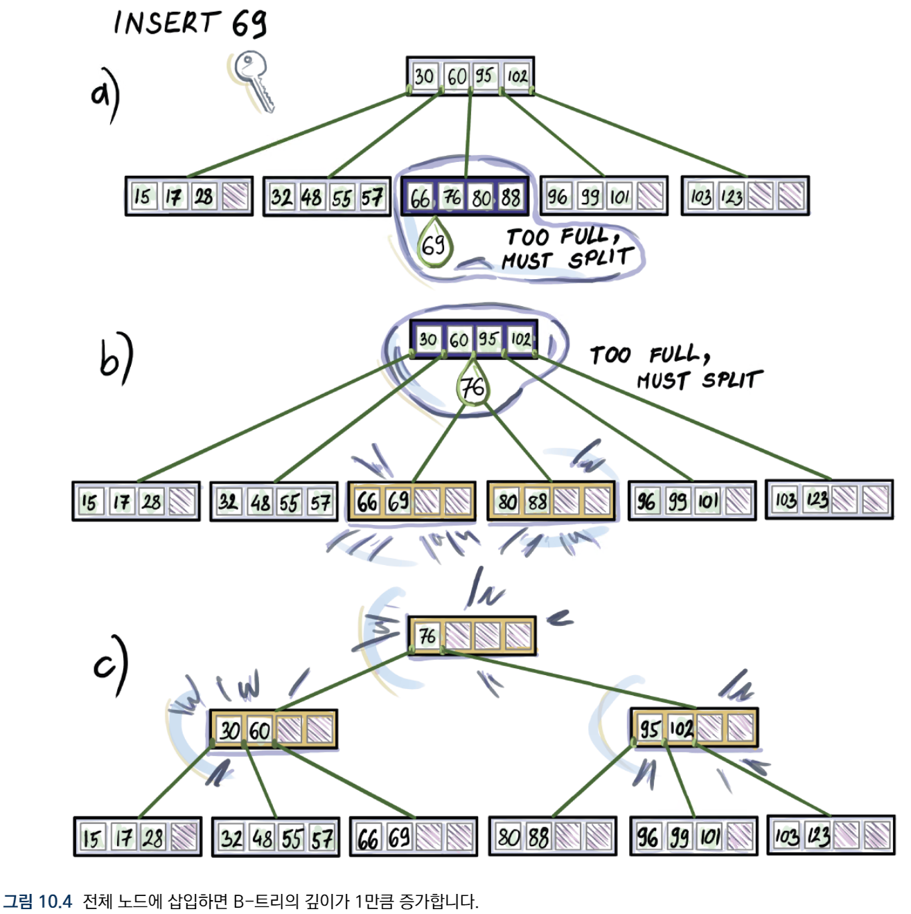
#### 1.10.3.4. 삭제
- 내부 노드에서 삭제 or 리프 노드에서 삭제
- 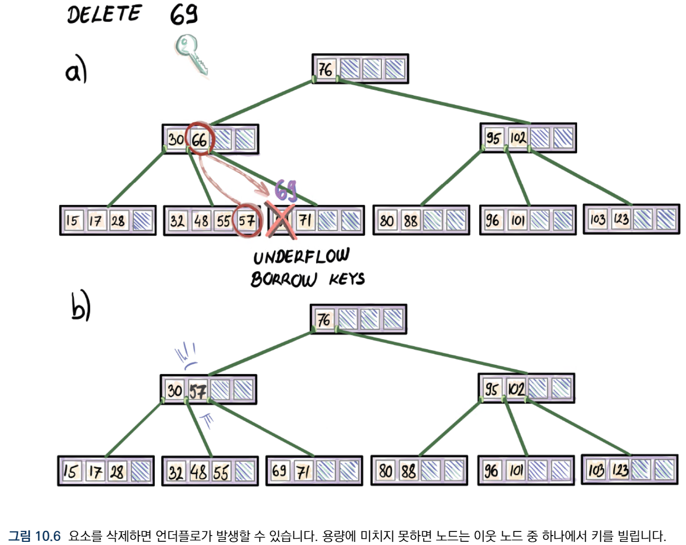
- 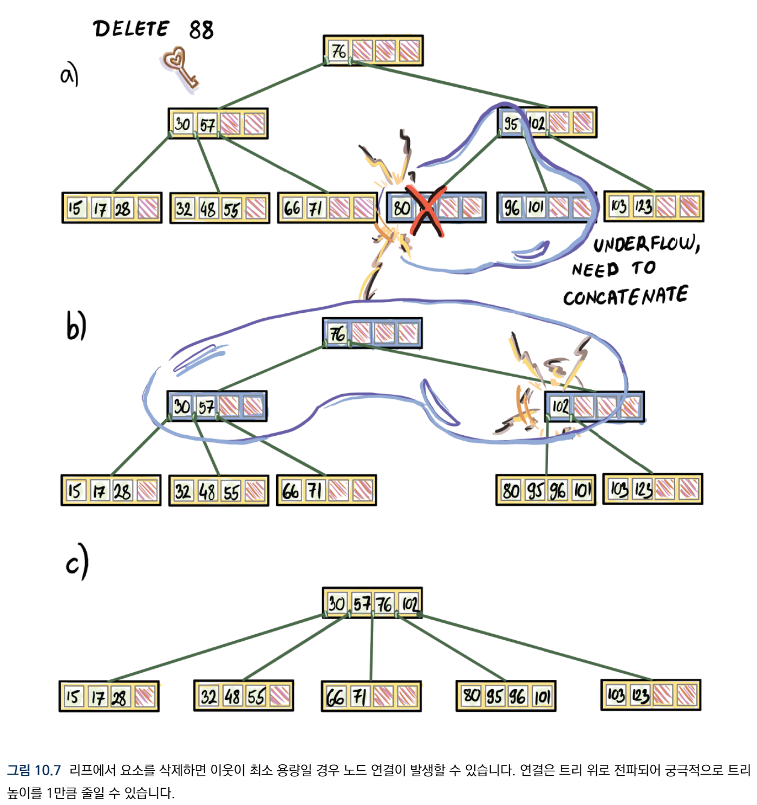
### 1.10.4. B+Tree
- 현재 사용은 대부분 B+Tree를 사용합니다. B+ tree는 모든 데이터를 리프 노드에 저장합니다.
- 리프 노드들은 linked list로 구성됩니다. 데이터 정렬된 순서에 따라 순차적으로 빠른 색세스와 범위 쿼리를 가능하게 합니다.  내부 노드에 실제 데이터에 대한 포인터를 유지하지 않기 때문에 더 많은 키를 저장할수 있다.
- B+ 에서는 초기에는 key들과 실제 데이터들이 중복됩니다. (내부노드와 리프노드의 값이 중복)  그러나, 삭제시 리프 노드에서는 삭제 되더라고 내부노드에서는 가이드포스트로 남아 있습니다. 
###  1.10.5. Bε-트리
- 외부 메모리에서 삽입 및 조회 속도의 트레이드오프를 반영하는 데이터 구조 이니다. ε=0 일때 삽입/삭제를 위해 최적화 , ε=1 일대는 조회에 완전히 최적화됩니다. 
#### 1.10.5.1. 작동방식
- 내부 노드마다 키 외에도 버퍼가 존재한다는 점 입니다. 삽입 / 삭제시 임시로 저장을 합니다.   삽입/삭제 메시지는 다른 메시지가 충분히 수집되어 하나의 I/O에서 자식 노드중  하나에 함께 플러시 될때까지 버퍼에서 대기합니다.
### 1.10.6. LSM tree (로그 구조 병합 트리)
- 메시지가 축적되는 인메모리 버퍼를 두고 , 버퍼가 차면 순차적으로 디스크의 특정 위치로 버퍼를 플러시 합니다.
- Bloom Filter를 RAM에 가지게 되는데 , 높은 삽입 속도일 경우는 RAM이 금새 찹니다. 이때 단순화된 쓰기 최적화 구조를 포함하고 여기에 가끔씩 테이블을 병합하고 압축하여 디스크의 테이블 수를 제한하는 메커니즘을 추가한 것 입니다. 
- Google , RocksDB , Facebook등에서 사용하는 LevelDV와 같은 여러 쓰기 최적화 DB에서 성공적으로 구현되었습니다.
### 1.10.7. 작동 방식
- 내부는 정렬되어져있어 협합이 가능합니다.
- M = 4 , f = 2
- 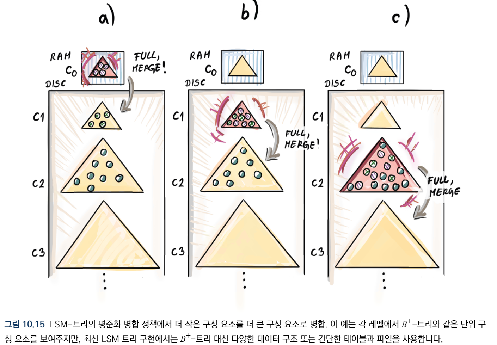
- 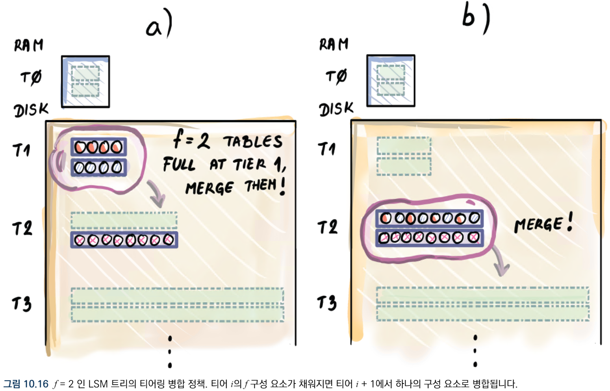
- 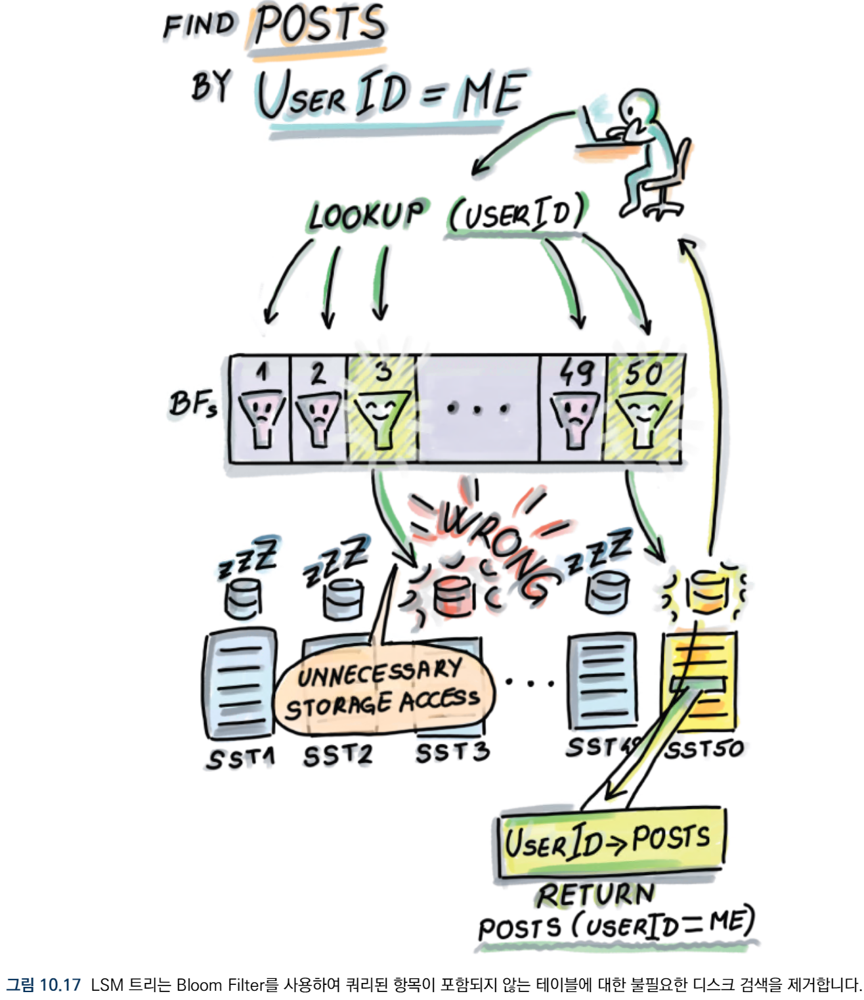 
- B tree나 Bε tree에 비해 조회작업이 느릴 수 있습니다.

## 1.11. 외부 메모리 정렬
### 외부 메모리에서 정렬할때의 문제
- 예로 모든 요청을 정렬하여 액세스 시간 분포를파악하고 가장 오래 걸린 요청을 찾고자 합니다. 512GB의 파일을 정렬해야 하고 ,  RAM은 4GB
### 외부 메모리의 양방향 병합 정렬
- 우리가 생각하는 방식 (그림 11.5 , 11.4)
- 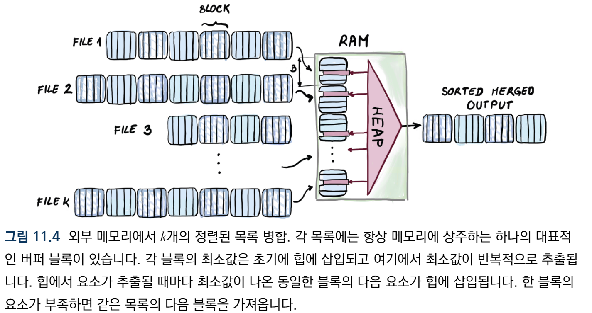
- 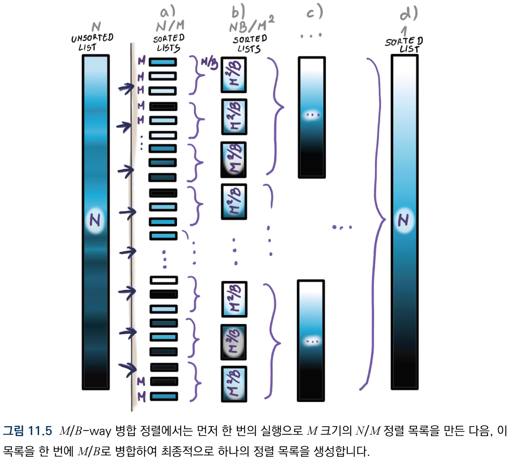


# 2. capture
- 
- 
- 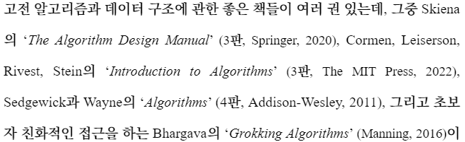


# 3. readling list 
- Andrew G.Psaltis : Streaming Data (Manning,2017)

# 4. 책 (밀리의 서재)
## 4.1. 데이터책
- 
- 
- 
- 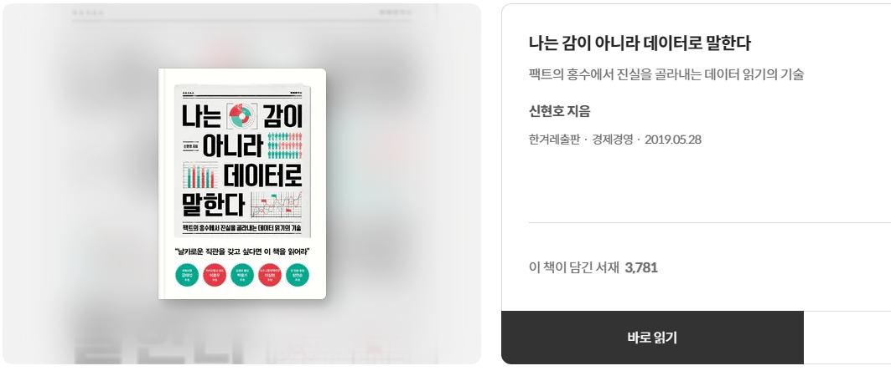
- 
- 
## 4.2. 금융
- 
- 
- 
## 4.3. 부동산
- 
- 