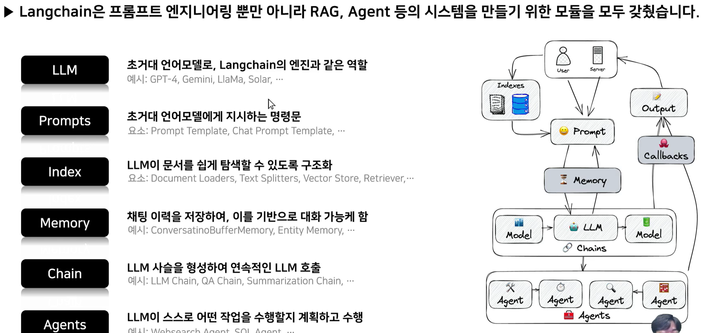
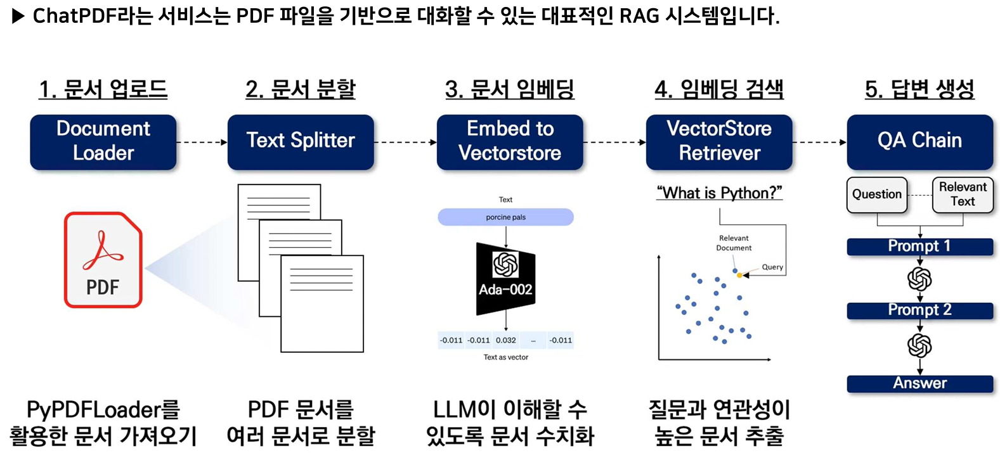
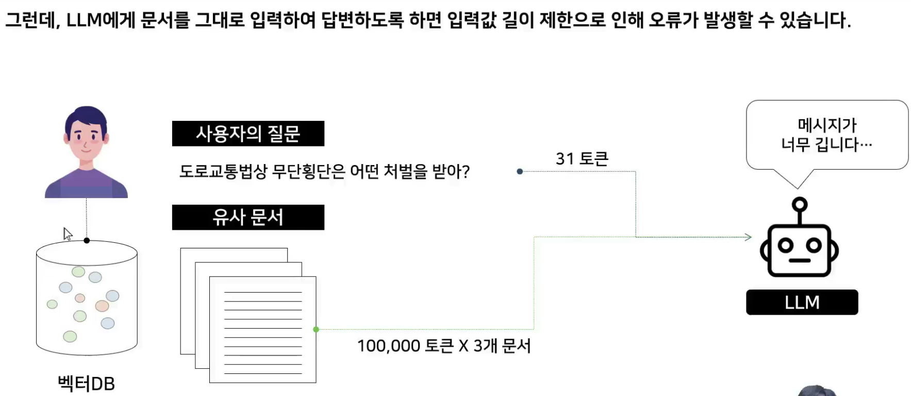
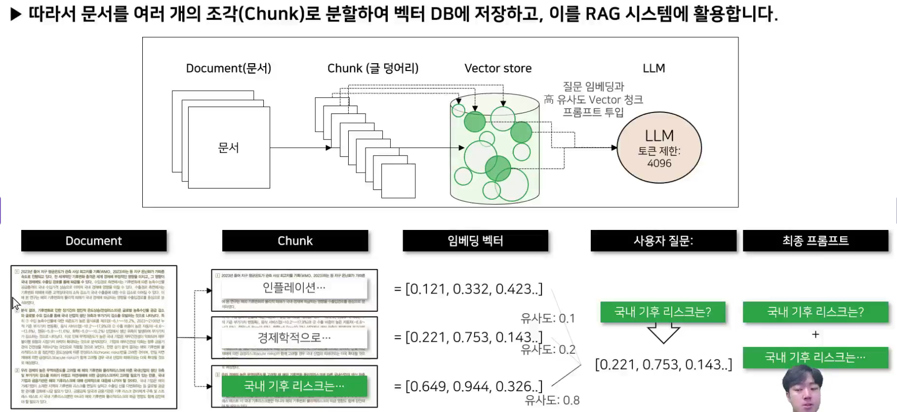

- description : (education정리) Gen AI RAG 실전 가이드, Langchain을 활용한 AI 챗봇 완전정복 : 실습을 통한 설명과 zip파일로 소스 pdf등 제공
- tag : education , summary , my-summary , RAG , langchain , ai , udemy , done
- date : 2025-03-31

TOC
- [1. 강의 소개](#1-강의-소개)
- [2. RAG의 개념과 필요성](#2-rag의-개념과-필요성)
- [3. RAG 파이프라인 개요와 핵심 컴포넌트](#3-rag-파이프라인-개요와-핵심-컴포넌트)
- [4. RAG 실제 적용 사례 분석](#4-rag-실제-적용-사례-분석)
- [5. Langchain 개념과 아키텍처](#5-langchain-개념과-아키텍처)
- [6. Langchain을 사용한 RAG 구현 워크플로우](#6-langchain을-사용한-rag-구현-워크플로우)
- [7. (실습) Models](#7-실습-models)
- [8. (실습) Prompt Templates](#8-실습-prompt-templates)
- [9. (실습) Document Loaders](#9-실습-document-loaders)
- [10. (실습) Text Splitters](#10-실습-text-splitters)
- [11. (실습) Embeddings](#11-실습-embeddings)
- [12. (실습) Vector Stores](#12-실습-vector-stores)
- [13. (실습) Retrievers](#13-실습-retrievers)
- [14. LCEL 소개 및 기본 구조](#14-lcel-소개-및-기본-구조)
- [15. (실습) Runnable 인터페이스와 체이닝](#15-실습-runnable-인터페이스와-체이닝)
- [16. (실습) RunnablePassthrough와 RunnableLambda](#16-실습-runnablepassthrough와-runnablelambda)
- [17. (실습) LCEL을 사용한 RAG 파이프라인 구성](#17-실습-lcel을-사용한-rag-파이프라인-구성)
- [18. (실습) 다중 쿼리 생성(Multi-query Retriever) 기법](#18-실습-다중-쿼리-생성multi-query-retriever-기법)
- [19. (실습) 재정렬(Rerank) 기법](#19-실습-재정렬rerank-기법)
- [20. (실습) 맥락 압축(Context Compression) 기법](#20-실습-맥락-압축context-compression-기법)
- [21. (실습) HyDE(Hypothetical Document Embeddings) 기법](#21-실습-hydehypothetical-document-embeddings-기법)
- [22. (실습) Streamlit 챗봇 기초 구현](#22-실습-streamlit-챗봇-기초-구현)
- [23. (실습) 대화 이력 관리와 메모리 구현](#23-실습-대화-이력-관리와-메모리-구현)
- [24. (실습) FastAPI 기초와 RESTful API 설계](#24-실습-fastapi-기초와-restful-api-설계)
- [25. (실습) FastAPI와 Langchain RAG 서비스 연동](#25-실습-fastapi와-langchain-rag-서비스-연동)
- [26. (실습) HTML/CSS 기초: 챗봇 인터페이스 구현](#26-실습-htmlcss-기초-챗봇-인터페이스-구현)


-------

<H1>Gen AI RAG 실전 가이드, Langchain을 활용한 AI 챗봇 완전정복</H1>

- udemy URL : https://lg.udemy.com/course/maso-it-langchain-onc102/learn/lecture/45610191#overview   https://www.udemy.com/course/maso-it-langchain-onc102/


- 이 강의의 대상:
  - 생성형 AI 시스템 구축의 기초부터 심화까지 배우고 싶은 분
  - 최신 AI 기술을 실무에 바로 적용하고 싶은 현업 종사자
  - Gen AI 챗봇과 RAG 서비스 구현에 관심 있는 현직 개발자 및 엔지니어
  - 생성형 AI 개발로 커리어를 증진시키고, 포트폴리오에 기재하여 자신의 경쟁력을 높이고 싶은 개발자

- [교재 pdf](./Langchain을 활용한 RAG 서비스 구축_v.2.1.pdf)
- [실습자료 zip](./[실습자료]Langchain을+활용한+AI+챗봇+완전정복_v1.0.zip)
- [코드 zip](./[코드]Langchain을+활용한+AI+챗봇+완전정복_v1.1.zip)

# 1. 강의 소개
- Langchain은 파이썬 기반의 라이브러리로, 언어 모델을 활용해 복잡한 자연어 처리(NLP) 작업을 간편하게 구현할 수 있도록 도와주는 도구입니다. 이를 통해 다양한 AI 시스템, 특히 챗봇이나 텍스트 분석 시스템을 손쉽게 개발할 수 있습니다.
- RAG(Retrieval-Augmented Generation) 서비스는 검색과 생성 기능을 결합한 AI 모델입니다. RAG는 사용자 질문에 대해 데이터베이스에서 관련 정보를 검색하고, 이를 바탕으로 정확하고 유용한 답변을 생성합니다. 이렇게 만들어진 AI 시스템은 더 나은 사용자 경험을 제공하며, 정보 검색과 생성의 효율성을 극대화합니다.

[[ section 2 : RAG 기초와 파이프라인 ]]
# 2. RAG의 개념과 필요성
- 언어 변환을 위한 인코더 디코더 구조 (교재 page 6)
  - 인코더 : 사람의 언어 이해
  - 디코더 : 이해한 내용을 바탕으로 자연어 생성
- LLM의 한계 (교재 page 7)
  - 확각 현상 : 엉뚱한 대답, 학습된 데이터 이외의 정보에 취약
  - 기억 불가 : 사전 학습시 받아들인 정보외의 것은 배우지 못함. 따라서 오늘 나와 대화한고 있는 LLM은 어제 나와 대화했던 내용을 기억하지 못한다.
  - 토큰 제한 : LLM은 입력값의 길이가 길어지면 계산량이 크게 증가
- RAG (Retrieval Augmented Generation)으로 환각 현상 해결에 특효약 (교재 page 8)
  - 힌트를 한께 넣어줌으로 , 힌트(답지)에 기반한 답변을 하도록 한다.
# 3. RAG 파이프라인 개요와 핵심 컴포넌트
- 교재 page 10
  - 문서를 벡터 임베딩하여 vector DB를 만들어 ,  Query와 유사한 것을 vector DB에서 찾아서 LLM에 같이 제공함으로써 , LLM에서 제대로 된 닶을 제공하게 된다.
  - LLM에 넣을때 LLM의 넣을때 , 힌트까지 포함하여 LLM의 입력값 한게를 넘지 않아야 하므로, 힌트를 일정한 길이로 잘라주게 (분할된 문서) 된다.
    - IMO : 우리는 ticket들이 모두 분할된 문서가 되어야 할 것으로 생각된다.
- 교재 page 11
  - RAG 핵심 컴포넌트
  - 문서 불러오기 : 우리가 원하는 부분에 대해서 필요한 것만 가져오게 전처리 필요
  - 임베딩모델
    - open source (허깅페이스) : 내것과 맞을 것 같은 엠베딩 모델 선택해서 사용 
    - model 개발 기업의 것을 유료로 사용
  - vector DB : Kroma DB등.
  - LLM 활용시도 : Closed Source LLM (openAi , claude , gemini) , open source LLM
# 4. RAG 실제 적용 사례 분석
- GPTs의 knowledge가 RAG와 유사
- 법률 / 금융 분야에서 사용


[[ section 3 : LangChain 프레임워크 소개 ]]
# 5. Langchain 개념과 아키텍처
- Langchain Framework
- Langchain은 프롬프트 엔지니어링의 번거로움을 줄이기 위해 Prompt template이라는 모듈을 지원합니다.
  - langchain 에서는 template으로 어떻게 하면 길고 좋은 prompt를 만들도록 도와준다.
  - RAG도 prompt engineering의 일종이다. 질문에 힌트까지 끼워넣게 해주는 prompt engineering이다.
- 교재 page 18
  - Langchain 의 다양한 모듈들이 있고 , 각 모듈은 다양한 종류의 서비스를 제공한다.
- Langchain architecture
  - 
  - index : vector DB에 저장하는 과정
  - QA chain : indexing한 것에서 RAG 사용
# 6. Langchain을 사용한 RAG 구현 워크플로우
- 
- text splitter : 길이 단위로 보통 자르지만, 의미로 자를 수도 있다.


[[ section 4 : RAG를 위한 Langchain 핵심 구성요소소 ]]
# 7. (실습) Models
- template 선언
- {} 은 매개변수
- template에 매개변수에 다른 값들을 들어갈수 있게 설정할수 있다.
- 마지막은 {user_input}
- temperature 매개변수
  - 낮은 온도는 정확한 값을 답으로 준다. 출현 확률이 높은 것이 나올 확률이 더 높게 나온다. 일관성이 있다.
- os.environ["OPENAI_API_KEY"] = "..." 을 넣으면 알아서 가져간다.
- Langchain을 활용하여 streaming (typing 하듯이) 기능을 사용할수 있다.
  - for chuck in chat.stream("달에 관한 시를 써줘"):    print(.. , flush=True)
- 캐싱
  - from langchain.globals impor tset_llm_cache # 캐시메모리 라이브러리 호출
- %%time
  - 시간 측정

# 8. (실습) Prompt Templates
- promptTemplate
  - PromptTemplate.from_template( {개수})  와 같이 매개변수를 설정
    - 개수=3
  - FewShotPromptTemplate
- chatPromptTemplate : SystemMessage / HumanMessage / AIMessage
- partial prompt template : optional 처리

# 9. (실습) Document Loaders
- 이미지에서 text 추출 : OCR extract_images=True
- 예제 소스를 보고 쫓아가면 될 듯
- pdf , word , pptx , url  처리 가능
- .load_and_split() 쪽별로 잘라서 가져올수 있다.
- csv 는 .load()
- WebBaseLoader([urls])
- DirectoryLoader : 특정 경로의 모든 파일 불러오기

# 10. (실습) Text Splitters
- 
- 
- 문서를 잘라야 한다. chunk_overlap을 사용하면 약간이 overlap되어 서로 연관된 것이라고 LLM이 이해를 하게 해주기 위해서이다.
- RecursiveCharacterTextSpliter 에서는 separators=["\n\n","\n"," ",""] 등으로 여러개를 주면 알아서 제일 적당한 것들을 사용하여 split를 하게 된다.
- Sematic Chunker
  - 유사성 기반으로 분할
  - 비용들어가고 시간이 오래 걸린다.

# 11. (실습) Embeddings
- text를 숫자로 변환
- 문장과 문장간의 거리를 측정할수 있다.
- 문장들 간의 유사도 비교 : cos_sim()

# 12. (실습) Vector Stores
- vector libraries : query하기 좋게
- db = Chroma.from_document(docs,openai_embedding)
- docs = db.similarity_search(query)
- docs = db.similarity_search_with_score(query)

# 13. (실습) Retrievers
- 새로운 검색 방식 - MMR
  - 너무 유사한 문서만을 답을 주는 경우를 방지하고 , 다양한 방식으로 답변하고 싶으면 :  이미 선택된 문서들의 다양성을 고려하여 답변을 함.
- chroma를 retriever로 활용
  - fetch_k = 10 , k= 3 이면 10개를 뽑은 후 , 다양성이 큰 3개만 답함
- RAG system을 어떤 방식을 선택하느냐에 따라 , 다양성을 다르게 줄 수 있다.


[[ section 5 : Langchain을 더 편하게 , LCEL ]]
# 14. LCEL 소개 및 기본 구조
- LCEL : langchain의 새로운 언어 (Langchain Expression Language)
  - streaming , async , parallel , in-output schema , 재시도 , 중간과정 확인 , langsmith 추적 , langserve 배포     용이
- pipe operator 제공
  - chain = prompt | model | output_parser; chain.invoke({"topic":"ice cream"})
  - prompt안에 topic 매개변수가 있음
- streaming
  - for i in chain.stream("ice cream)

# 15. (실습) Runnable 인터페이스와 체이닝
- chain.batch()

# 16. (실습) RunnablePassthrough와 RunnableLambda
- RunnablePassthrough
  - {"sentence" : RunnablePasthrough()} | prompt | model | output_parser
  - RunnablePassthrough.assign() : 새로운 변수 선언
  - RunnableParallel : 병렬로 수행
- RunnableLambda : 임의의 함수를 chain에 결합할수 있게 Runnable 객체로 변환
  - RL = RunnableLambda(add_smile); chain = prompt | model | output_parser | RL
- grandalf : chain을 text 그림으로 그려줌

# 17. (실습) LCEL을 사용한 RAG 파이프라인 구성
- langchainhub : 한 일들을 모아둔 것
- prompt = hub.pull("rlm/rag-prompt)     <-  이름에 해당하는 prompt를 가져오게 됨
  - http://smith.langchain.com/hub/rlm/rag-prompt
- 메모리 기능 추가
  - contextualize_q_system_prompt
  - 새로운 사용자의 질문에 대해서 그 전의 질문들까지 고려한 답변을 하게 한다. 
  - create_history_aware_retriever()
- 사용자마다 다르게 chat history를 만드는 것

[[ section 6 : 고급 RAG 기법법 ]]
# 18. (실습) 다중 쿼리 생성(Multi-query Retriever) 기법
- 질문이 모호할 경우 , vector DB 내 문장들과 매칭되지 않는 경우 제대로 동작하게 하려면 ,  중간에 LLM이 길게 풀어서 쓰게 만들어 다양한 새로운 질문들을 만들어주는 것
- logging을 이용하여 multi query가 재생성한 질문들이 뭔지 저장하여 보려 한다.

# 19. (실습) 재정렬(Rerank) 기법
- LLM context size가 늘어나며 , 긴 입력이 가능해졌지만 중간 문서는 잘 찾지 못하는 문제가 있다. 
  - 연관선이 높은 문서는 맨앞과 맨뒤로 re-ordering을 한다.

# 20. (실습) 맥락 압축(Context Compression) 기법
- RAG가 제대로 작동하려면 , 알맞은 유사 문서만 검색되어야만 하지만 그렇지 않은 경우가 있다.   맥락 압축이라는 것이 유사하지 않은 것을 없애주는 것이다.
- LLMChainExtractor : 필요한 것만 뽑아내는 것
- LLMChainFilter : 유사하지 않은 문서는 아예 탈락
- Extractor / Filter 2개 모두 사용하고 싶은 경우 : DocumentCompressorPipeline() 이용

# 21. (실습) HyDE(Hypothetical Document Embeddings) 기법
- 사용자의 질문에 대해서 DB에서 유사성 비교는 종종 올바른 문서 검색이 어렵디ㅏ. 이떄 , HyDE는 사용자 질문에 대한 가상 답변을 작성하여 벡터 DB속 유사 문장을 더 잘 검색할수 있게 만든다.

[[ section 7 : streamli을 활용한 RAG 챗봇 구현현 ]]
# 22. (실습) Streamlit 챗봇 기초 구현
- http://streamlit.io
- vscode 사용 (console에서)
  - pip install streamlit
  - streamlit hello
- streamlit은 python
  - test.py
    - ```python
      import streamlit as st
      import os
      os.environ['OPENAI_API_KEY'] = "..."
      st.title("chatbot")
      if "messages" not in st.session_state:
        st.session_state['messages'] = [
          { 'role':"assistant", 'content':'무엇을 도와드릴까요?'}
        ]
      for msg in st.session_state.messages:
        st.chat_message(msg['role']).write(msg['content'])
      
      #엔진 붙이기
      chat  = ChatOpenAI(model="gpt-4o-mini", temperature=1)
      if prompt := st.chat_input():   # := input이 있으면 이라는 것 
        st.session_state.messages.append({'role':'user','content':prompt})
        st.chat_message("user").write(prompt)
        response = chat.invoke(prompt)
        msg = response.content
        st.session_state.msessages.append('role':'assistant','conent':msg)
        st.chat_message('assistnat').write(msg)

      #st.write("hello")
      ```
  - streamlit run test.py

# 23. (실습) 대화 이력 관리와 메모리 구현
- streamlit에서는 memory기능을 위해서 StreamlitChatMessageHistory(key='새로 정의')  를 해주어야 한다.   기존에는 RunnalbleWithMessageHistory()만 있으면 가능했다. 

[[ section 8 : FastAPI를 활용한 쳇봇 웹사이트 구축 ]]
# 24. (실습) FastAPI 기초와 RESTful API 설계
- FastAPI : 가장 빠른 python framework 중 하나 http://fastapi.tiangolo.com/ko/
- pip install fastapi
- pip install "uvicorn[standard]"

# 25. (실습) FastAPI와 Langchain RAG 서비스 연동
- css와 같은 정적 파일은 static 이라는 directory안에 넣는다.
- import traceback    # debugging 위해서 
- from pydantic import BaseModel
- async def root()   # 비동기로 처리
- $ uvicorn main::app --reload

# 26. (실습) HTML/CSS 기초: 챗봇 인터페이스 구현
- index.html
- styles.css
- script.js

