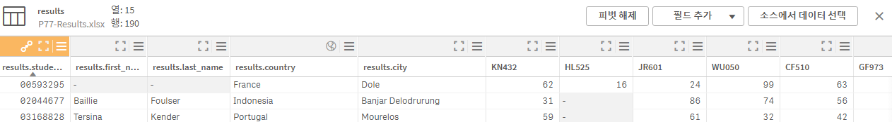

- description : (education정리) Data Science 와 BI 를 위한 Qlik Sense 클릭센스 : 차원이 존재하는 엑셀
- tag : education , summary , my-summary , qlik , done
- date : 2025-03-18

TOC
- [1. 교육](#1-교육)
- [2. LGE EAP 2.0 접속](#2-lge-eap-20-접속)
- [3. 섹션 2 : Qlik Sense 기본](#3-섹션-2--qlik-sense-기본)
  - [3.1. 실무 과제 소개 및 데이터 연결하기](#31-실무-과제-소개-및-데이터-연결하기)
  - [3.2. alternative measure](#32-alternative-measure)
- [4. 섹션 3 : DashBoard](#4-섹션-3--dashboard)
  - [4.1. 데이터 연관 만들기](#41-데이터-연관-만들기)
  - [4.2. 지도 만들기](#42-지도-만들기)
  - [4.3. 분포와 산점도](#43-분포와-산점도)
  - [4.4. Total 한정자 및 help 보는 법](#44-total-한정자-및-help-보는-법)
  - [4.5. KPI 와 Big Numbers](#45-kpi-와-big-numbers)
  - [4.6. 필터창](#46-필터창)
- [5. 섹션 5. Story](#5-섹션-5-story)
- [6. 섹션 6. 데이터 준비하기](#6-섹션-6-데이터-준비하기)
  - [6.1. 단어 시각화 및 트리맵](#61-단어-시각화-및-트리맵)
  - [6.2. 집합 분석 (Set Analysis)](#62-집합-분석-set-analysis)
  - [6.3. Bullet chart 뽀개기](#63-bullet-chart-뽀개기)


-------


<H1> 클릭 센스 : Data Science 와 BI 를 위한 Qlik Sense</H1>

# 1. 교육 
- udemy.com에 접속하여 Qlik로 검색
  - "클릭 센스 : Data Science 와 BI 를 위한 Qlik Sense" 교육 선택
  - https://www.udemy.com/course/best-data-science-bi-qlik-sense/?couponCode=KEEPLEARNING

# 2. LGE EAP 2.0 접속
- 먼저 EAP 2.0 접속 (LGEP에서)
  - 
- 데이터 분석 -> SSBI/SandBox 선택
  - 
- Qlik (클릭센스) -> 사용권한 신청하기
  - ```R&D Manager``` 권한으로 신청 했습니다. 
  - 
- 교육에서의 것을 "리포트 개발" 을 선택하여 진행하였습니다.
  - 
- 교육 데이터 : https://www.superdatascience.com/pages/qliksense


# 3. 섹션 2 : Qlik Sense 기본
## 3.1. 실무 과제 소개 및 데이터 연결하기
- section 2 교육 과정의 HardwareSupplies.csv 사용
- data load 
  - Qlik Data Market에는 여러가지 통화 등의 데이터들이 들어 있다고 합니다.
- 데이터 로드 편집
  - 
  - 데이터 관리자 : DB 생성
  - 데이터 로드 편집기 : 읽어올때 변경을 해주거나 filter등을 해주는 것을 만듦
  - 분석 시트 에서는 ^E를 눌러서 편집/뷰어 모드를 쉽게 변환이 가능합니다.
- Dimension vs Measure
  - 차원 : dimensions determine thow the data in a visualization is grouped
  - categorical / qualitative
    - Department
    - Salesbuckets
    - Order number
  - 측정값 : calculations used in visualizations
  - numerical / quantitative
    - count(Department)
    - sum(Sales)
    - count(Order number)
  - 
- 문제
  - 
  - 측정값 수식을 넣을때 fx를 선택해서 작성을 한다.
    - ```sum(Units * [Unit Price])```
    -  => 
- Aggregation
  - 각 행이 하나 하나 계산되는 방식
## 3.2. alternative measure
- 경영진의 잠재적 질문을 미리 준비
- x,y 축을 alternative하게 변경할수 있는 기능으로 바로바로 변경하여 보여줄수 있게 준비를 하는 것이다.
  - 이때 , sort가 되는 값의 경우 처음만 sort되고 , alternative는 sort가 안되는 경우가 있는데 이것은 자동으로 설정되어진 것을 off하면 numerically 하게 sort하는 것을 check하면 원하는대로 sort된 순서로 나온다.
- 


# 4. 섹션 3 : DashBoard
## 4.1. 데이터 연관 만들기
- 
- Supplies-R-Us.xlsx 데이터 사용
- 연관 만들기
  - 
- "데이터 모델 뷰어"를 보면
  - city와 geo정보를 가지고 field가 2개 늘어나 있을 것을 볼수 있다.
## 4.2. 지도 만들기
- Map을 선택하여 시각화
  - 여러가지 layer를 설정하여 시각화 가능
- 마스터 항목을 설정
  - 
- Container에 여러개의 map을 넣을수 있다.
## 4.3. 분포와 산점도
- Scatter Plot
## 4.4. Total 한정자 및 help 보는 법
- 차원에 관계없는 모든 전체 값에서의 자신의 비율을 구하고자 할때..
  - 집계 함수 내에서 total 한정자를 사용하여 차원 값을 무시할 수 있습니다. 가능한 모든 필드 값에 대해 집계가 수행됩니다.
- ?를 누르면 underbar 나오고 , 이것을 누르면 help가 나온다. 
  - 
- 차원이 항상 적용되어서 처리되는데 , 이를 무시하고 싶을때 total이 사용된다.
## 4.5. KPI 와 Big Numbers
- 비용을 얼마나 썼으면 목표 대비 몇%를 쓰고 있다고 보여주는 것도 방법일듯! 이대로 가면 12월에는 목표대비 몇 %가 되는지도 KPI 형식으로 보여주면 좋을 듯
## 4.6. 필터창
- 차원에 대한 관리를 하게 되는 것이다. filter에 맞는 것을 기준으로 다시 정리됨

# 5. 섹션 5. Story
- powerpoint와 유사
- snapshot 만들어둔 화면들을 load해서 사용할수 있고 , power point와 같이 작성하는 것이다.

# 6. 섹션 6. 데이터 준비하기
- 과제 : 
  - 
- data load전에 data의 처음 header가 틀린 경우 Header size 조절
  - student,email,country line이 제대로 된 header
    - 
- filter를 이용하여 
  - password와 같이 안 쓰는 것을 지우고,
  - 조건을 추가하여 active가 TRUE인 것만을 뽑는다.
- student의 student field는 , | 을 separator로 구분을 해야 한다.
  - 
  - 을 눌러서 
  - 
  - 을 통해서 lastName,firstName,studentId로 split을 시킨다.
- course와 result안의 course값을 맞춰주기 위해서는 result안의 course 각각의 값들에 대해서 pivot을 풀어주어야 한다고함. (cross tab)
  - 피벗 해제 (행과 열 전환 : transpose) 클릭
    - 
      - 선택하라는 것이 나오는데,
      - 이때 , 각 course column을 click해서 선택을 해주세요. 그리고, pivot 해제를 적용하면 됨
    - unpivot을 하여
      - 
      - 와 같이 나오면 , 
    - 3개의 file간에 association을 연결할수 있다.
      - 
- 데이터 정제했으니 이제 시각화 시작

## 6.1. 단어 시각화 및 트리맵
- Word Cloud 챠트가 없다. 대신 막대 그래프로 처리
  - dimention : country
  - measure : Count(distinct student_id)
- gender breakdown : %로 보여주기
  - 
  - 식 : Count(distinct student_id) / Count(total distinct student_id)
## 6.2. 집합 분석 (Set Analysis)
- sum(sales) => sum( {Identifiers Modifiers} sales)
  - {} : aggregation
  - 
    - Identifier
      - $1 : previous selection
      - $_1 : next selection
      - 1 : 모두 선택
      - $ : current selection
    - Modifiers
      - ex.  <Year={2019}>
    - Operators
    - 
- overall을 표시하기 위해서 (2번째 KPI) {1}을 사용.
  - count(student_id) => count({1}student_id)
## 6.3. Bullet chart 뽀개기
- Buttlet Chart가 없으므로 , 막대그래프로 모양:세로를 선택한다.
- {1}을 이용하면 항상 전체 값이 나오므로 , 이와 비교하면 전체 평균이나 sum과 비교 가능하게 만들수 있다.
