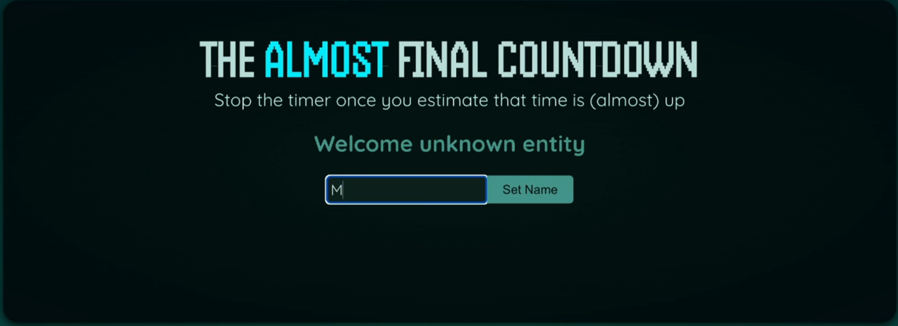

- description : (education정리) React 완벽 가이드 2025 with React Router & Redux
- tag : education , summary , my-summary , react
- date : 2025-02-25

TOC
- [1. getting started \[\[2025-02-15\]\]](#1-getting-started-2025-02-15)
  - [1.1. Our First React App](#11-our-first-react-app)
  - [1.2. 코스 개요](#12-코스-개요)
  - [1.3. 리엑트 프로젝트 생성하기](#13-리엑트-프로젝트-생성하기)
- [2. javascript new generation : JS Refresher/code/finished \[\[2025-02-15\]\]](#2-javascript-new-generation--js-refreshercodefinished-2025-02-15)
  - [2.1. JavaScript Refresher](#21-javascript-refresher)
  - [2.2. 리엑트 프로젝트 구축 프로세스](#22-리엑트-프로젝트-구축-프로세스)
  - [2.3. import  / export](#23-import---export)
  - [2.4. 변수 , 값 , 함수 , 객체](#24-변수--값--함수--객체)
  - [2.5. 연산자](#25-연산자)
  - [2.6. 함수와 매개변수](#26-함수와-매개변수)
  - [2.7. 화살표 함수 : arrow function](#27-화살표-함수--arrow-function)
  - [2.8. 객체와 class](#28-객체와-class)
  - [2.9. array](#29-array)
  - [2.10. 디스트럭처링 : array 분해](#210-디스트럭처링--array-분해)
  - [2.11. 컨트롤 구조](#211-컨트롤-구조)
  - [2.12. 참조형과 기본 값 비교](#212-참조형과-기본-값-비교)
  - [2.13. JS Array Functions](#213-js-array-functions)
  - [2.14. 사용된 강의 자료와 소스](#214-사용된-강의-자료와-소스)
- [3. React Essentials \[\[2025-02-16\]\]](#3-react-essentials-2025-02-16)
  - [3.1. components](#31-components)
  - [3.2. JSX와 리액트 컴포넌트 (핵심개념)](#32-jsx와-리액트-컴포넌트-핵심개념)
  - [3.3. first custom component](#33-first-custom-component)
  - [3.4. 리액트의 컴포넌트 처리 과정 \& 컴포넌트 트리 생성법 \[핵심 개념\]](#34-리액트의-컴포넌트-처리-과정--컴포넌트-트리-생성법-핵심-개념)
  - [3.5. 동적값 출력과 활용](#35-동적값-출력과-활용)
  - [3.6. 동적 HTML Attributes(속성) 설정 \& 이미지 파일 로딩](#36-동적-html-attributes속성-설정--이미지-파일-로딩)
  - [3.7. Prop(속성)으로 컴포넌트 재사용 (핵심 개념)](#37-prop속성으로-컴포넌트-재사용-핵심-개념)
  - [3.8. style file도 같이 별도 저장하기](#38-style-file도-같이-별도-저장하기)
  - [3.9. 컴포넌트 구성: 특별한 “children” Prop (“자녀” 속성) - menu element](#39-컴포넌트-구성-특별한-children-prop-자녀-속성---menu-element)
  - [3.10. 이벤트 처리하기 - click event listener](#310-이벤트-처리하기---click-event-listener)
  - [3.11. 함수를 Prop의 값으로 전달하기](#311-함수를-prop의-값으로-전달하기)
  - [3.12. event 함수에 custom 인자 전달하기](#312-event-함수에-custom-인자-전달하기)
  - [3.13. UI를 업데이트 하는 법 - 13-how-not-to-update-ui](#313-ui를-업데이트-하는-법---13-how-not-to-update-ui)
  - [3.14. State(상태) 관리 \& Hooks(훅) 사용법 (핵심 개념) - 14-managing-state](#314-state상태-관리--hooks훅-사용법-핵심-개념---14-managing-state)
  - [3.15. Quiz](#315-quiz)
  - [3.16. 조건적 콘텐츠 렌더링 - 16-rendering-content-conditionally](#316-조건적-콘텐츠-렌더링---16-rendering-content-conditionally)
  - [3.17. CSS 스타일링 및 동적 스타일링 - 17-css-styling-dynamic-styles](#317-css-스타일링-및-동적-스타일링---17-css-styling-dynamic-styles)
  - [3.18. List(리스트) 데이터 동적 출력 : 18-outputting-list-data](#318-list리스트-데이터-동적-출력--18-outputting-list-data)
  - [3.19. quiz](#319-quiz)
- [4. Essentials Deep Dive \[\[2025-02-16\]\]](#4-essentials-deep-dive-2025-02-16)
  - [4.1. JSX를 꼭 사용하지 않아도 되는 이유](#41-jsx를-꼭-사용하지-않아도-되는-이유)
  - [4.2. Fragments (프레그먼트) 사용법](#42-fragments-프레그먼트-사용법)
  - [4.3. Feature 및 State 로 컴포넌트 분리하기 : 03-splitting-components](#43-feature-및-state-로-컴포넌트-분리하기--03-splitting-components)
  - [4.4. 내부 요소에 Props(속성)이 전달되지 않을 경우](#44-내부-요소에-props속성이-전달되지-않을-경우)
  - [4.5. forwarded props : **wrapper component를 만들때 유용**](#45-forwarded-props--wrapper-component를-만들때-유용)
  - [4.6. 여러 JSX 슬롯 활용법 : 05-multiple-jsx-slots](#46-여러-jsx-슬롯-활용법--05-multiple-jsx-slots)
  - [4.7. component type 동적으로 설정하기 : 06-dynamic-component-types](#47-component-type-동적으로-설정하기--06-dynamic-component-types)
  - [4.8. Tic-Tac-Toe Game 환경 설정](#48-tic-tac-toe-game-환경-설정)
  - [4.9. component isolation : 다른 곳에 영향이 없게 component내에서 모든 것을 끝낸다.](#49-component-isolation--다른-곳에-영향이-없게-component내에서-모든-것을-끝낸다)
  - [4.10. Game Board : 다차원 리스트 렌더링링](#410-game-board--다차원-리스트-렌더링링)
  - [4.11. 불변의 객체 State로 업데이트하기 (const arry 값 변경)](#411-불변의-객체-state로-업데이트하기-const-arry-값-변경)
  - [4.12. state 끌어올리기 : lifting state](#412-state-끌어올리기--lifting-state)
  - [4.13. 기타 for tic-tac-toe](#413-기타-for-tic-tac-toe)
- [5. Essential Practice - Investment Input \& Table \[\[2025-02-17\]\]](#5-essential-practice---investment-input--table-2025-02-17)
  - [5.1. UserInput : 02-user-input-two-way-binding](#51-userinput--02-user-input-two-way-binding)
  - [5.2. lift state : 값이 변경되면 다른 component에 변경된 값을 넘기기 위해서](#52-lift-state--값이-변경되면-다른-component에-변경된-값을-넘기기-위해서)
  - [5.3. table : 리스트에 결과 출력하기](#53-table--리스트에-결과-출력하기)
  - [5.4. Duratioan에 minus 값을 입력할때 문제 해결](#54-duratioan에-minus-값을-입력할때-문제-해결)
- [6. Essential Practice - Styling React Apps \[\[2025-02-17\]\]](#6-essential-practice---styling-react-apps-2025-02-17)
  - [6.1. Vanilla CSS와 함께 리액트 앱 스타일링하기](#61-vanilla-css와-함께-리액트-앱-스타일링하기)
  - [6.2. styled compoents - dynamic style](#62-styled-compoents---dynamic-style)
    - [6.2.1. @media 및 중첩 규칙 처리도 css -\> styled components로 가능하다.](#621-media-및-중첩-규칙-처리도-css---styled-components로-가능하다)
  - [6.3. tailwind css (마음에 든다. string으로 저장하고 변경하면서 사용)](#63-tailwind-css-마음에-든다-string으로-저장하고-변경하면서-사용)
- [7. 리액트 앱 디버깅](#7-리액트-앱-디버깅)
- [8. Refs \& Portals : Advanced DOM access \& value management](#8-refs--portals--advanced-dom-access--value-management)
  - [8.1. 복습 : state를 사용한 사용자 입력 관리 (양방향 바인딩)](#81-복습--state를-사용한-사용자-입력-관리-양방향-바인딩)
  - [8.2. 복습 : Framgments](#82-복습--framgments)
  - [8.3. Refs(참조) 소개 : Refs로 HTML 요소 연결 및 접근](#83-refs참조-소개--refs로-html-요소-연결-및-접근)
  - [8.4. Refs 로 DOM 제어](#84-refs-로-dom-제어)
  - [8.5. Refs vs State](#85-refs-vs-state)
  - [8.6. Timer 설정 및 State 관리](#86-timer-설정-및-state-관리)
  - [8.7. 모달 컴포넌트 추가 : 07-adding-a-modal-cmp](#87-모달-컴포넌트-추가--07-adding-a-modal-cmp)
    - [8.7.1. 커스텀 컴포넌트로 Refs(참조) 전달 : 08-forwarding-refs](#871-커스텀-컴포넌트로-refs참조-전달--08-forwarding-refs)
  - [8.8. userImperativeHandle 훅으로 컴포넌트 API 정의하여 노출](#88-userimperativehandle-훅으로-컴포넌트-api-정의하여-노출)
  - [8.9. Modal을 ESC 키로 닫기](#89-modal을-esc-키로-닫기)
  - [8.10. Portals 소개 및 이해하기](#810-portals-소개-및-이해하기)
- [9. Practice Project : Advanced Concepts - working with components , state , styling (tailwind) , refs\&portals](#9-practice-project--advanced-concepts---working-with-components--state--styling-tailwind--refsportals)
  - [9.1. 사이드바](#91-사이드바)
  - [9.2. add NewProject](#92-add-newproject)
  - [9.3. project List](#93-project-list)
  - [9.4. error dialog : modal](#94-error-dialog--modal)
  - [9.5. selected project](#95-selected-project)
  - [9.6. project 삭제](#96-project-삭제)
  - [9.7. task with duedate](#97-task-with-duedate)
- [10. Advanced State Management - Byond Basic Apps \& "Lifting Up State"](#10-advanced-state-management---byond-basic-apps--lifting-up-state)
  - [10.1. Prop Drilling 이해](#101-prop-drilling-이해)
  - [10.2. Prop Drilling : 컴포넌트 구성으로 해결하기](#102-prop-drilling--컴포넌트-구성으로-해결하기)
    - [10.2.1. React's Context API (prop drilling's solution)](#1021-reacts-context-api-prop-drillings-solution)
  - [10.3. Context 소개](#103-context-소개)
  - [10.4. Context 사용하기](#104-context-사용하기)
  - [10.5. Context와 State 연결하기](#105-context와-state-연결하기)
  - [10.6. Contet를 소비하는 여러가지 방법](#106-contet를-소비하는-여러가지-방법)
  - [10.7. Context 값이 바뀌면 생기는 일](#107-context-값이-바뀌면-생기는-일)
  - [10.8. Context Outsourcing \& 분리된 제공자 component에 state 부여](#108-context-outsourcing--분리된-제공자-component에-state-부여)
  - [10.9. useReducer 훅 소개](#109-usereducer-훅-소개)
- [11. Dealing with Side Effects  - Keeping the UI Synchronized - useEffect() 훅 사용](#11-dealing-with-side-effects----keeping-the-ui-synchronized---useeffect-훅-사용)
  - [11.1. What is side effect](#111-what-is-side-effect)
  - [11.2. Side Effect의 잠재적인 문제 : 무한 루프](#112-side-effect의-잠재적인-문제--무한-루프)
  - [11.3. useEffect()를 사용하는 side effect](#113-useeffect를-사용하는-side-effect)
  - [11.4. useCallback 훅 : 함수 인스턴스를 1번만 생성시키게 되어 성능 향상에 도움](#114-usecallback-훅--함수-인스턴스를-1번만-생성시키게-되어-성능-향상에-도움)
  - [11.5. progress bar](#115-progress-bar)
  - [11.6. 마우스가 위로 가면 사진이 기울어지는 효과](#116-마우스가-위로-가면-사진이-기울어지는-효과)
  - [11.7. 성능 최적화](#117-성능-최적화)
- [12. Working with Effects : 퀴즈 앱 만들기](#12-working-with-effects--퀴즈-앱-만들기)
  - [12.1. 답변을 shuffle](#121-답변을-shuffle)
  - [12.2. 질문 timer 추가](#122-질문-timer-추가)
  - [12.3. Timer가 1번만 동작하는 문제](#123-timer가-1번만-동작하는-문제)
  - [12.4. 추가된 내용들](#124-추가된-내용들)
- [13. Behind The Scenes - understanding \& optimizing React : 최적화](#13-behind-the-scenes---understanding--optimizing-react--최적화)
  - [13.1. log.js](#131-logjs)
  - [13.2. React Developer Tools](#132-react-developer-tools)
  - [13.3. memo() : memorizing](#133-memo--memorizing)
  - [13.4. 구조를 잘 잡아 함수 실행을 방지](#134-구조를-잘-잡아-함수-실행을-방지)
  - [13.5. button을 누르면 중간의 숫자는 변하더라도 "+ Increment" button은 변하지 않으므로 memo를 사용하면 성능 향상 가능](#135-button을-누르면-중간의-숫자는-변하더라도--increment-button은-변하지-않으므로-memo를-사용하면-성능-향상-가능)
  - [13.6. useMemo() 함수를 재실행 방지](#136-usememo-함수를-재실행-방지)
  - [13.7. 가상DOM](#137-가상dom)
  - [13.8. state를 관리할때 key의 역할](#138-state를-관리할때-key의-역할)
  - [13.9. state 스케쥴링 \& 배칭](#139-state-스케쥴링--배칭)
  - [13.10. MillionJS로 최적화하기 (Free)](#1310-millionjs로-최적화하기-free)
- [14. 컴포넌트 구축하는 다른 방법 : class based components](#14-컴포넌트-구축하는-다른-방법--class-based-components)
- [15. HTTP 요청 보내기 (예: Database Connection)](#15-http-요청-보내기-예-database-connection)
  - [15.1. 데이터 연결 / 해지하는 방법](#151-데이터-연결--해지하는-방법)
  - [15.2. 앱의 데이터 fetching을 위한 준비](#152-앱의-데이터-fetching을-위한-준비)
  - [15.3. async / await 사용하기 및 에러 처리](#153-async--await-사용하기-및-에러-처리)
  - [15.4. async await http](#154-async-await-http)
  - [15.5. PUT 요청으로 데이터 전송](#155-put-요청으로-데이터-전송)
- [16. 커스텀 리액트 Hook 필드 : Custom Hook](#16-커스텀-리액트-hook-필드--custom-hook)
  - [16.1. 📌 1. React’s Hook Rules](#161--1-reacts-hook-rules)
  - [16.2. custom Hooks 만들기](#162-custom-hooks-만들기)
- [17. 양식과 사용자 입력 작업 : Forms user Input](#17-양식과-사용자-입력-작업--forms-user-input)
  - [17.1. State \& Handler로 사용자 입력 수집 및 관리](#171-state--handler로-사용자-입력-수집-및-관리)
  - [17.2. 사용자 입력 수집 1 : state를 이용한 email , password 입력값 받기](#172-사용자-입력-수집-1--state를-이용한-email--password-입력값-받기)
  - [17.3. JSX 안에서의 주석은 어떻게 넣는가?](#173-jsx-안에서의-주석은-어떻게-넣는가)
  - [17.4. 사용자 입력 수집 2 : Ref를 이용한 email , password 입력값 받기](#174-사용자-입력-수집-2--ref를-이용한-email--password-입력값-받기)
  - [17.5. 사용자 입력 수집 3 : FromData()라는 네이티브 브라우저 API로 값 채취취](#175-사용자-입력-수집-3--fromdata라는-네이티브-브라우저-api로-값-채취취)
  - [17.6. Form 데이터 지우기](#176-form-데이터-지우기)
  - [17.7. 키보드 입력마다 유효성 검사](#177-키보드-입력마다-유효성-검사)
  - [17.8. onBlur 할때를 이용한 validation check](#178-onblur-할때를-이용한-validation-check)
  - [17.9. 내장된 prop 으로 입력 유효성 검사](#179-내장된-prop-으로-입력-유효성-검사)
  - [17.10. 반복적으로 사용한 input을 Input component로 만들자](#1710-반복적으로-사용한-input을-input-component로-만들자)
  - [17.11. 커스텀 useInput Hook 생성 : 외부에서 재사용하기 원하여](#1711-커스텀-useinput-hook-생성--외부에서-재사용하기-원하여)
  - [17.12. 3rd-party libraries for react form](#1712-3rd-party-libraries-for-react-form)
- [18. 폼 액션을 통해 양식 관리하기 : Using Form actions](#18-폼-액션을-통해-양식-관리하기--using-form-actions)
  - [18.1. form action](#181-form-action)
    - [18.1.1. 폼 액션](#1811-폼-액션)
    - [18.1.2. useActionState()로 양식 종속 상태 관리하기](#1812-useactionstate로-양식-종속-상태-관리하기)
  - [18.2. form action : communicate with backend server](#182-form-action--communicate-with-backend-server)
    - [18.2.1. CORS : Cross-Origin Resource Sharing](#1821-cors--cross-origin-resource-sharing)
    - [18.2.2. async 를 모아둠](#1822-async-를-모아둠)
    - [18.2.3. submit이 진행되고 있는지 check 가능 : useFormStatus()](#1823-submit이-진행되고-있는지-check-가능--useformstatus)
    - [18.2.4. vote count up / down](#1824-vote-count-up--down)
    - [18.2.5. useOptimistic](#1825-useoptimistic)
- [19. 연습 프로젝트 : 음식 주문 앱 구축하기](#19-연습-프로젝트--음식-주문-앱-구축하기)
  - [19.1. data fetching](#191-data-fetching)
  - [19.2. MealItem 추가하기](#192-mealitem-추가하기)
  - [19.3. Button을 유동성있게 text button/button 지원 , classname도 다르게 설정 가능하게...  file](#193-button을-유동성있게-text-buttonbutton-지원--classname도-다르게-설정-가능하게--file)
  - [19.4. Context \& Reducer](#194-context--reducer)
  - [19.5. Modal 추가](#195-modal-추가)
  - [19.6. Form 제출 과 유효성 검사 : handling-form-submission](#196-form-제출-과-유효성-검사--handling-form-submission)
  - [19.7. Order 데이터로 POST 요청 전송 : sending a post request](#197-order-데이터로-post-요청-전송--sending-a-post-request)
  - [19.8. Custom HTTP Hook 추가 및 일반적 에러 방지 : adding a custom http hook : useHttp()](#198-custom-http-hook-추가-및-일반적-에러-방지--adding-a-custom-http-hook--usehttp)
  - [19.9. HTTP 로딩과 에러 State 다루기: finishing touches](#199-http-로딩과-에러-state-다루기-finishing-touches)
  - [19.10. 폼 액션 마이그레이션 : managing form status action](#1910-폼-액션-마이그레이션--managing-form-status-action)
  - [19.11. reduce 사용법](#1911-reduce-사용법)
- [20. 리덕스에 뛰어들기 (컨텍스트 API의 대안) : 3rd party library : managing app-wide state with redux](#20-리덕스에-뛰어들기-컨텍스트-api의-대안--3rd-party-library--managing-app-wide-state-with-redux)
  - [20.1. how does redux work](#201-how-does-redux-work)
  - [20.2. 개발 환경 설정](#202-개발-환경-설정)
  - [20.3. 스토어 제공하기](#203-스토어-제공하기)
  - [20.4. class 기반으로 변경](#204-class-기반으로-변경)
  - [20.5. redux state 올바른 사용 방법](#205-redux-state-올바른-사용-방법)
  - [20.6. redux 도전 과제 및 redux tool 소개](#206-redux-도전-과제-및-redux-tool-소개)
  - [20.7. multiple slice](#207-multiple-slice)
- [21. 고급 리덕스](#21-고급-리덕스)
- [22. 리액트 라우터(react router)가 있는 SPA 다중 페이지 구축하기](#22-리액트-라우터react-router가-있는-spa-다중-페이지-구축하기)
  - [22.1. Multiple Pages in Single Page Apps (SPA)](#221-multiple-pages-in-single-page-apps-spa)
  - [22.2. project setup \& react router install](#222-project-setup--react-router-install)
  - [22.3. route 정의하기](#223-route-정의하기)
  - [22.4. 두번째 route 추가하기](#224-두번째-route-추가하기)
  - [22.5. 라우트를 정의하는 다른 방법들](#225-라우트를-정의하는-다른-방법들)
  - [Link로 페이지들간 이동하기](#link로-페이지들간-이동하기)
  - [레이아웃 및 중첩된 라이트](#레이아웃-및-중첩된-라이트)
- [23. 리액트 앱 인증 추가하기](#23-리액트-앱-인증-추가하기)
- [24. 리액트 앱 배포하기](#24-리액트-앱-배포하기)
- [25. 리액트 쿼리 / Tanstack 쿼리 : 간단하게 HTTP 요청 처리](#25-리액트-쿼리--tanstack-쿼리--간단하게-http-요청-처리)
- [26. (Pretty deep dive) Next.js 소개](#26-pretty-deep-dive-nextjs-소개)
- [27. React 서버 컴포넌트 (RSC) \& 서버 액션](#27-react-서버-컴포넌트-rsc--서버-액션)
- [28. 리액트 앱에 애니메이션 넣기](#28-리액트-앱에-애니메이션-넣기)
- [29. React 패턴 및 모범 사례](#29-react-패턴-및-모범-사례)
- [30. 리덕스를 리액트 훅으로 바꾸기](#30-리덕스를-리액트-훅으로-바꾸기)
- [31. 리액트 앱 테스트 + 유닛 테스트](#31-리액트-앱-테스트--유닛-테스트)
- [32. 리액트 + TypeScript](#32-리액트--typescript)
- [33. Section 33. React 요약 및 핵심 정리](#33-section-33-react-요약-및-핵심-정리)
- [34. 보너스 / 선택 강의 ... ...](#34-보너스--선택-강의--)


-------

시간 슬롯 : udemy 개인 구매 (모든 시간 가능)

<H1><p style="color:blue;">Title : React 완벽 가이드 2025 with React Router & Redux</p></H1>

# 1. getting started [[2025-02-15]]
## 1.1. Our First React App
- 4번째 tab을 추가해보자
  - origin : 
    - Start : https://codesandbox.io/p/sandbox/first-react-app-start-7ec9fd   
    - Finished : https://codesandbox.io/p/sandbox/first-react-app-zj5cx1
  - forked (cheoljoo): 
    - Start : https://codesandbox.io/p/devbox/first-react-app-start-forked-4mpgn7?workspaceId=ws_UHSZUBEp8TxjxZsZZ1PrrY
    - Finished : https://codesandbox.io/p/devbox/first-react-app-forked-tz6nly?workspaceId=ws_UHSZUBEp8TxjxZsZZ1PrrY
- Solution:
  - add <button> for "React vs Vanilla JS" in menu

## 1.2. 코스 개요
- 
- 
- resource : https://github.com/academind/react-complete-guide-course-resources
- code resource : https://github.com/academind/react-complete-guide-code/tree/02-js-refresher
  - 여기서는 결국 branch로 각 chapter가 구분되는 것으로 보임
  - 강의 slide도 포함되어져있음
- 바쁜 경우에는 chapter 603 부터 봐라.  그러므로 , 처음부터 들을때는 602까지만 들으면 될 듯!

## 1.3. 리엑트 프로젝트 생성하기
- https://react.new
  - 기본적인 project가 sandbox에 생성됨
- vscode를 이용하고 , local 수행을 위해서는 node.js (LTS) 설치 필요
  - create react app : https://create-react-app.dev/
  - ```npm install```
  - ```npm run dev``` : support server and up and running

- section 3 : Setting up the starting project (35. 초기 프로젝트 구축하기) 참조

# 2. javascript new generation : JS Refresher/code/finished [[2025-02-15]]
- [정리 자료](./next-gen-js-summary.pdf)

## 2.1. JavaScript Refresher
- javascript는 browser외에도 , node.js/deno등을 이용하여 machine에서도 바로 이용할수 있다. mobile device에서도 실행 가능
- adding js code to a website
  - between <script> tag
  - <script src="script.js"></script>
- 다른 것보다 늦게 시작하게 하기 위해서 <script src="script.js" defer></script>
- <script src="script.js" type-"module"></script>
- import / export syntax

## 2.2. 리엑트 프로젝트 구축 프로세스
- react projects use a **build process**
  - your code is **transformed** before it's handed off to the browser  -> JSX
- package.json includes dependencies.
- <noscript>

## 2.3. import  / export
- import
  - ```
    import { apiKey , abc } from './util.js'
    console.log(apiKey)
    ```
  - ```
    import * as util from "./util.js";
    console.log(util.apiKey);
    ```
- export
  - ```export let apiKey = ...";```
- 빌드 프로세스가 없는 vanilla js code를 작성할때는 type="module" 속성을 추가해야 합니다.
- ```export default```를 이용하여 1개만 선언해야하고 , ```import apiKey from "util.js"``` 와 같이 선언하여 쓴다.

## 2.4. 변수 , 값 , 함수 , 객체
- let 으로 변수 선언
- const

## 2.5. 연산자
- === 은 비교 연산자

## 2.6. 함수와 매개변수
```js
function greet(u,m="hello!") {
  console.log("hello);
  console.log(u);
  return "hi, " + u + "." + m;
}
console.log( greet("max") );
```

## 2.7. 화살표 함수 : arrow function
- ```onClick = { () => set(0); }```  : anonymous function
- ```js
  export default (u,m) => {
    console.log('hello');
    return u+m;
  }
  ```
- ```js
  (userName) => { ... }
  userName => { ... }
  ```
  - 1개의 변수만 있을때만 ()을 없앨 수 있다.
- ```js
  number => {
    return number * 3;
  }
  number => number * 3;
  ```
  - 반환문만 있으면 {}와 return을 꼭 함께 없앨 수 있다.
- ```js
  number => { age: number }; // ERROR. 객체를 반환하려고 합니다. 이것을 중괄호가 객체인지 함수의 brace인지 구분안됨
  number => ({ age: number }); // OK. 추가 괄호를 써서 객체를 감싸줍니다.
  ```

## 2.8. 객체와 class
- ```js
  const user = {   // object 예제
    name : 'Max',
    age:34,
    greet() {  // member function
    console.log(this.age);  // this points self-object
    }
  }
  console.log(user);
  console.log(user.name);
  user.greet();
  ```
- ```js
  class User {  // blue print
    constructor(name,age) {
      this.name = name;
      this.age = age;
    }
    greet() {
      console.log('hello');
    }
  }

  const user1 = new User('manuel',35)
  console.log(user1
    user1.greet();
  )
  ```

## 2.9. array
- ```js
  const hobbies = ["sports",'cooking','reading'];
  // console.log(hobbies[]);  // error
  console.log(hobbies);
  console.log(hobbies[0]);

  hobbies.push("new")
  console.log(hobbies);

  console.log(
    hobbies.findIndex((item) => {
      return item === "sports";
    })  
  );

  const editedhobbies = hobbies.map((item) => item + "!");
  console.log(editedhobbies);
  ```
- error는 sandbox의 console에서 확인 가능

- solution
- ```js
  function transformToObjects(numberArray) {
      // Todo: Add your logic
      // should return an array of objects
      return numberArray.map( (item) => ({val:item}) );
  }
  ```

## 2.10. 디스트럭처링 : array 분해
- ```js
  const [ firstName , lastName] = ['charles','lee'];
  
  const {name,age} = { name:'charles',age:34};
  console.log(name,age);

  const {name : aliasName ,age} = { name:'charles',age:34};
  console.log(aliasName,age);

  ```
- 함수의 argument에서도 destructuring 가능
  - ```js
    function storeOrder(order) {
      localStorage.setItem('id', order.id);
      localStorage.setItem('currency', order.currency);
    }

    function storeOrder({id, currency}) { // 디스트럭처링
      localStorage.setItem('id', id);
      localStorage.setItem('currency', currency);
    }
    ```

  - 다음코드로 해보니 undefined undefined undefined 로 나옴
  - ```js
    const user = {
      name: "ccc",
      age: 100,
      gender: "male",
    };
    function uuu(user, TT = "default") {
      console.log("uuu");
      // console.log(user, TT);
      console.log(user, TT);
      console.log(user.name, user.age, user.gender, TT);
    }
    uuu(user, TT);
    function aaa({ u, a, j }, TT) {
      console.log("aaa");
      // console.log(user, TT);
      console.log(u, a, j, TT);
    }
    aaa(user, TT);

    function bbb({ u, a, j }) {
      console.log("bbb start");
      // console.log(user, TT);
      console.log(u, a, j);
      console.log("bbb end");
    }
    uuu({ name: "bbb", age: 200, gender: "female" });
    bbb(user);
    bbb({ name: "bbb", age: 200, gender: "female" });
    ```

## 스프레드 연산자
- ```js
  const h1 = ["sports", "cooking", "reading"];
  const h2 = ["sports2", "cooking2", "reading2"];
  console.log(h1+h2); // sports,cooking,readingsports2,cooking2,reading2
  // + is not concatenation of array
  console.log([...h1,...h2]); // ... is spreading operator

  const user = {
      name: "ccc",
      age: 100,
      gender: "male",
    };
  const extendedUser = {
    isAdmin : true,
    ...user
  }
  console.log(extendedUser)
  ```

## 2.11. 컨트롤 구조
- ```js
  const password = prompt('your passwd:');
  console.log(password);

  if ( ) {}
  else if ( ) { }
  else { }

  for (const item of items) { }

  ```

## 함수를 값으로 사용하기
- setTimeout(function,milliseconds,param1,param2);
  - [함수 설명](https://www.freecodecamp.org/korean/news/how-to-set-a-timer-in-javascript/)
  - setTimeout( () => {} );
- ```js
  funciton greeter(greetFn){
    greetFn();
  }
  greeter( () => console.log("hi"));
  ```

## 2.12. 참조형과 기본 값 비교
- ```js
  const hobbies = ['sports'];
  hobbies.push('working);
  console.log(hobbies);
  ```
  - 이것은 hobbies가 참조형이기 때문에 const이지만 안에 push를 할수 있는 것이다.

## class inheritance
```js
class Human {
    species = 'human';
}
 
class Person extends Human {
    name = 'Max';
    printMyName = () => {
        console.log(this.name);
    }
}
 
const person = new Person();
person.printMyName();
console.log(person.species); // prints 'human'
```

## 2.13. JS Array Functions
- 차세대 자바스크립트는 아니지만 중요합니다. 다음과 같은 자바스크립트 array 함수가 있습니다: map() , filter() , reduce().
- 많은 React 개념이 (불변의 방식으로) 배열 작업에 의존하기 때문에 제가 그것들을 꽤 많이 사용하는 것을 보게 될 것입니다.
- 다음 페이지는 어레이 프로토타입에서 사용할 수 있는 다양한 방법에 대한 좋은 개요를 제공합니다. 필요에 따라 이를 클릭하고 지식을 리프레시할 수 있습니다. https://developer.mozilla.org/en-US/docs/Web/JavaScript/Reference/Global_Objects/Array
- 이 코스에서 특히 중요한 사항은 다음과 같습니다:
  - map()  => https://developer.mozilla.org/en-US/docs/Web/JavaScript/Reference/Global_Objects/Array/map
  - find()  => https://developer.mozilla.org/en-US/docs/Web/JavaScript/Reference/Global_Objects/Array/find
  - findIndex()  => https://developer.mozilla.org/en-US/docs/Web/JavaScript/Reference/Global_Objects/Array/findIndex
  - filter()  => https://developer.mozilla.org/en-US/docs/Web/JavaScript/Reference/Global_Objects/Array/filter
  - reduce()  => https://developer.mozilla.org/en-US/docs/Web/JavaScript/Reference/Global_Objects/Array/Reduce?v=b
  - concat()  => https://developer.mozilla.org/en-US/docs/Web/JavaScript/Reference/Global_Objects/Array/concat?v=b

## 2.14. 사용된 강의 자료와 소스
- 코드샌드박스의 완성된 코드: https://codesandbox.io/s/javascript-refresher-j56djd
- 완성된 코드 스냅샷은 아래 Github 저장소에서 확인할 수 있습니다: https://github.com/academind/react-complete-guide-code/tree/02-js-refresher

# 3. React Essentials [[2025-02-16]]
## 3.1. components
- reuse / store together / simplify
- HTML + CSS +  JS => React Component
- 
- local 개발 환경 구축
  - https://github.com/academind/react-complete-guide-course-resources/blob/main/attachments/03%20React%20Essentials/01-starting-project.zip
  - extract
  - ```npm install```   to install package.json
  - ```npm run dev```  for server
- sandbox
  - https://codesandbox.io/p/sandbox/react-essentials-start-gsmr8r

## 3.2. JSX와 리액트 컴포넌트 (핵심개념)
- JSX : JavaScript syntax eXtension
  - this is react component to use html+css easily
  - JSX로 사용하지만, 확장자는 js로 사용합니다. broswer에서는 지원하지 않기에 이 코든느 background에서 실행되는 build process에게 JSX 라는 것을 알려주어 transformatio됩니다.
- Component functions must follow two rules
  - name starts with uppercase character : built-in component use lower character as starting character.
  - returns "renderable" content (HTML markup)

## 3.3. first custom component
- component안에서는 two rules를 지켜서 만들면 Header()를 만들고 <Header /> 같이 하여 자유롭게 사용할수 있다.
  - ```js
    function Header() {
      return (
        <header>
          
          <h1>React Essentials</h1>
          <p>
            Fundamental React concepts you will need for almost any app you are
            going to build!
          </p>
        </header>
      );
    }

    function App() {
      return (
        <div>
          <Header />
          <main>
            <h2>Time to get started!</h2>
          </main>
        </div>
      );
    }

    export default App;
    ```
- 확장자를 가져오기 파일의 일부로써 요구하는 프로젝트와 이를 요구하지 않는 다른 프로젝트도 찾을 수 있습니다 (예: import App from './App.jsx'와 같이 사용할 수도 있고, 그렇지 않은 경우에는 import App from './App'만 사용할 수도 있습니다).

## 3.4. 리액트의 컴포넌트 처리 과정 & 컴포넌트 트리 생성법 [핵심 개념]
- index.js is starting point. and this is jsx file.
  - <div id='root'></div>
  - 
- component hierarchy
  - 

## 3.5. 동적값 출력과 활용
- jsx안에 {} 로 표시된 부분은 계산을 한 결과를 보여주게 된다.
  - ```js
    <p>
        {reactDescriptions[genRandomInt(2)]} React concepts you will need for
        almost any app you are going to build!
    </p>
    ```

## 3.6. 동적 HTML Attributes(속성) 설정 & 이미지 파일 로딩
- 아래와 같이 이용을 해야 release image에 확실히 들어가게 된다. (import 이용)
- import reactImg from 'relative path from app.js';
- 

## 3.7. Prop(속성)으로 컴포넌트 재사용 (핵심 개념)
- configure components with props
- 
- ```js
  function CoreConcept(props){
    return (
      <li>
        
        <h3>{props.title}</h3>
        <p>{props.description}</p>
      </li>
    )
  }
  ```
- 
- props 예제
  - key is specific word. so change to id
  - ```js
    import { CORE_CONCEPTS } from "./data.js";

    // props
    function CoreConcept(props) {
      console.log("CoreConcept:");
      console.log(props);
      return (
        <li>
          <h3>{props.id}</h3>
          
          <h3>{props.title}</h3>
          <p>{props.description}</p>
        </li>
      );
    }

    // destructing
    function CoreConcept2({ image, title, description }) {
      return (
        <li>
          
          <h3>{title}</h3>
          <p>{description}</p>
        </li>
      );
    }

    function App() {
      return (
        <div>
          <Header />
          <main>
            <section id="core-concepts">
              <h2>Core Concepts</h2>
              <ul>
                <CoreConcept
                  title={CORE_CONCEPTS[0].title}
                  image={CORE_CONCEPTS[0].image}
                  description={CORE_CONCEPTS[0].description}
                  id = {0}
                />
                <CoreConcept {...CORE_CONCEPTS[1]} id={1} />
                <CoreConcept2 {...CORE_CONCEPTS[2]} />
              </ul>
              <ul>
                {CORE_CONCEPTS.map((concept, index) => {
                  return <CoreConcept id={index} {...concept} />;
                })}
              </ul>
            </section>
          </main>
        </div>
      );
    }

    export default App;
    ```
- 자바스크립트는 객체 비구조화를 사용할 때 기본 값을 지원함으로 이를 쉽게 달성할 수 있습니다:
  - ```js
    export default function Button({ caption, type = "submit" }) { 
      // caption has no default value, type has a default value of "submit" 
    }
    ```

## 3.8. component 를 파일로 분리
```js
export default function CoreConcept(){}   // copy function

import CoreConcept from 'relative file path'
```

## 3.8. style file도 같이 별도 저장하기
- components관련된 js , css를 같이 넣는다.
- index.css에서 header만 뽑아서 header.css를 만든다.
- import "./Header.css";

## 3.9. 컴포넌트 구성: 특별한 “children” Prop (“자녀” 속성) - menu element
- tab을 하나 만들어 examples를 넣자.
- ```<TabButton>Compnent</TabButton>```을 하면 **props.children**에 기본적으로 그 안의 내용인 'Component'는 자동으로 들어가게 된다.
- 
- 

## 3.10. 이벤트 처리하기 - click event listener
- source : https://github.com/academind/react-complete-guide-course-resources/tree/main/code/03%20React%20Essentials/10-reacting-to-events
- vanilla js
  - ```document.querySelector('button').addEventListener('click',() => {})```
- react : declarative code
  - event를 prop의 속속에 추가 합니다.
  - 많은 on...   on으로 시작하는 props를 제공한다.
  - button뿐만 아니라 li등도 제공하는 것이 많다.
```js
export default function TabButton(props) {
  function handleClick() {
    console.log("Hello World!");
  }
  return (
    <li>
      <button onClick={handleClick}>{props.children}</button>
    </li>
  );
}
```

## 3.11. 함수를 Prop의 값으로 전달하기
- ```<TabButton onSelect={handleSelect}>Components</TabButton>``` prop로도 함수를 넘길수 있다.

## 3.12. event 함수에 custom 인자 전달하기
- 함수를 다른 함수로 감싸서 해결 ```{() => handleClick("component1")}```
  - ```js
    <TabButton onSelect={() => handleClick("component1")}>
      Compnent1
    </TabButton>

    export default function TabButton({ children, onSelect }) {
      return (
        <li>
          <button onClick={onSelect}>{children}</button>
        </li>
      );
    }
    ```
- source : https://github.com/academind/react-complete-guide-course-resources/blob/main/code/03%20React%20Essentials/12-passing-custom-arguments-to-event-fn/src/App.jsx

## 3.13. UI를 업데이트 하는 법 - 13-how-not-to-update-ui
- 기본적으로 react는 UI를 update하지 않으므로 , 강제로 update시켜주어야 한다.
- **By default , React Components Execute only once.**
  - You have to 'tell' React to re-execute your component function.
- 
- 위에 forked된 link save해두기
- state라는 개념을 이용하여 rendering을 다시 수행해주는 것이다.

## 3.14. State(상태) 관리 & Hooks(훅) 사용법 (핵심 개념) - 14-managing-state
- use로 시작하는 것이 react hooks 이다.
- useState라는 hook을 사용하면 된다.
  - ```import { useState } from "react";```
  - ```const [counter,setCounter] = useState(0);``` 을 함으로 재실행을 시켜주는 것으로, component function의 첫줄에 호출이 되어져야 한다. (react의 규칙)
  - 
  - 
- source : https://github.com/academind/react-complete-guide-course-resources/blob/main/code/03%20React%20Essentials/14-managing-state/src/App.jsx

##  3.15. Quiz
- 중첩 함수 내에서 hook을 호출하면 안된다.
- 계산된 값은 다른 state 로부터 파생될 수 있으므로 분리된 상태로 관리해서는 안 된다.

## 3.16. 조건적 콘텐츠 렌더링 - 16-rendering-content-conditionally
- button을 고르기 전에는 'please choose a button' 이라고 나오고, 이후 button을 누르면 해당 버튼과 관련된 겂으로 보여주고 싶을때
- ```{selectedTopic === undefined ? ....  :  null}```
- ```{selectedTopic === undefined && .... }```
- 위 2개는 같다.
- selectedTopic 값을 보고 , 조건을 두어 다른 값으로 변경하는 방법과     보여야 하는 곳에 conditional expression 을 사용하게 하면 된다.
- source : https://github.com/academind/react-complete-guide-course-resources/blob/main/code/03%20React%20Essentials/16-rendering-content-conditionally/src/App.jsx

## 3.17. CSS 스타일링 및 동적 스타일링 - 17-css-styling-dynamic-styles
- css에 button.active 등이 정의된 것을 쓴다. className에 해당 값을 넣으면 된다.  ```<button className='active' onClick={handleSelect}> ... </button>```
  - ```js
      <TabButton
        isSelected={selectedTopic === 'components'}
        onSelect={() => handleSelect('components')}
      >
        Components
      </TabButton>

    export default function TabButton({ children, onSelect, isSelected }) {
      console.log('TABBUTTON COMPONENT EXECUTING');
      return (
        <li>
          <button className={isSelected ? 'active' : undefined} onClick={onSelect}>
            {children}
          </button>
        </li>
      );
    }
    ```
- sourcce : https://github.com/academind/react-complete-guide-course-resources/blob/main/code/03%20React%20Essentials/17-css-styling-dynamic-styles/src/App.jsx

## 3.18. List(리스트) 데이터 동적 출력 : 18-outputting-list-data
- js
  - ```js
    <section id="core-concepts">
      <h2>Core Concepts</h2>
      <ul>
        {CORE_CONCEPTS.map((conceptItem) => (
          <CoreConcept key={conceptItem.title} {...conceptItem} />
        ))}
      </ul>
    </section>
    ```
- 위에서 보면 key보다는 id로 바꾸어 수행하는게 더 좋았음.
  - **key는 react에서 사용한다고 한다. 그러므로 , key=? 로 값을 입력해주어야 한다.**
    - ```js
      <div> {someArray.map(item => <p key={item.id}>{item.name}</p>)} </div>
      ```
  - map()을 사용할때 , key가 있어야 warning이 없어진다.
- source : https://github.com/academind/react-complete-guide-course-resources/blob/main/code/03%20React%20Essentials/18-outputting-list-data/src/App.jsx

## 3.19. quiz
- key를 넣어야 warning이 없어진다.

# 4. Essentials Deep Dive [[2025-02-16]]
- 작업중인 sandbox file : https://codesandbox.io/p/devbox/react-essentials-start-forked-7zf7dg?file=%2Fsrc%2FApp.js%3A79%2C49&workspaceId=ws_UHSZUBEp8TxjxZsZZ1PrrY

## 4.1. JSX를 꼭 사용하지 않아도 되는 이유
- 결국 js 이므로 js로 만들어 되나 편리함때문에 react를 이용하는 것이다.
  - react 함수들을 이용하게 짜면 react library를 이용하여 바로 call되어 수행하지만, HTML을 사용하면 이것을 결국 react로 transform을 한후에 react library를 이용하여 실행을 한다는 것으로 , 처음에 생각(HTML이 바로 수행)한 것이랑 반대네요.
  - 

- 초기에 시작하는 ```ReactDOM.createRoot(entryPoint).render(<App />);```은 다음과 같은 것이다.
  - ```js
    import React from 'react';
    ReactDOM.createRoot(entryPoint).render(React.createElement(App));
    ```

## 4.2. Fragments (프레그먼트) 사용법
- ```<div> </div>``` 를 지웠더니, 에러가 발생한다. 
  - parent 를 1개만 가져야 한다는 것이다. 지운 경우 ```<Header> <main>``` 으로 2개가 존재하기 때문이다.
  - js에서는 return은 오직 1개만 할수 있다. 위는 2개의 return이 된다고 보는 것이다.
    - ```js
      React.createElement(Header);
      React.createElement(Main);
      ```

- ```<div> </div>``` 를 지우고 ```<Fragment> </Fragment>```를 이용하는 방법
  - ```import {useState,Fragment} from "react";```
  - div대신 Fragment를 쓰면 이점이 있어야 할 듯!
- ```<> </>``` 을 사용하라네.. 역시. 이게 더 편하네..

## 4.3. Feature 및 State 로 컴포넌트 분리하기 : 03-splitting-components
- App 에 모두 매달려서 계속 render를 다시 하면 비효율적일수 있으니 , component별로 분리하자.
  - ```js
    import Header from './components/Header/Header.jsx';
    import CoreConcepts from './components/CoreConcepts.jsx';
    import Examples from './components/Examples.jsx';

    function App() {
      return (
        <>
          <Header />
          <main>
            <CoreConcepts />
            <Examples />
          </main>
        </>
      );
    }

    export default App;
    ```
    - 각각에 맞게 component를 만들어준다.
- source : https://github.com/academind/react-complete-guide-course-resources/blob/main/code/04%20Essentials%20Deep%20Dive/03-splitting-components/src/App.jsx

## 4.4. 내부 요소에 Props(속성)이 전달되지 않을 경우
- Additional Key component & Props Concepts
  - Forwarded Props
  - Multiple Component slots
  - element identifiers as props
  - default prop values

## 4.5. forwarded props : **wrapper component를 만들때 유용**
  - ```<section id="examples">```를 했던 부분을 ```<Section id="examples">``` 로 해도 그대로 물려받게 하는 것
    - ```js
      export default function Section({ title, children, ...props }) {
        return (
          <section {...props}>
            <h2>{title}</h2>
            {children}
          </section>
        );
      }
      ```
  - 
  - source : https://github.com/academind/react-complete-guide-course-resources/blob/main/code/04%20Essentials%20Deep%20Dive/04-forwarding-props/src/components/TabButton.jsx

## 4.6. 여러 JSX 슬롯 활용법 : 05-multiple-jsx-slots
- menu와 content를 분리하기 위해서 사용한다. 
  - menu는 Props로 / content는 따로 
    - ```js
      export default function Tabs({ children, buttons }) {
        return (
          <>
            <menu>{buttons}</menu>
            {children}
          </>
        );
      }
      ```
- source : 
  - https://github.com/academind/react-complete-guide-course-resources/blob/main/code/04%20Essentials%20Deep%20Dive/05-multiple-jsx-slots/src/components/Tabs.jsx
  - https://github.com/academind/react-complete-guide-course-resources/blob/main/code/04%20Essentials%20Deep%20Dive/05-multiple-jsx-slots/src/components/Examples.jsx

## 4.7. component type 동적으로 설정하기 : 06-dynamic-component-types
- menu , div 와 같은 이름을 그냥 string으로 넘기면 ```<menu>``` 와 같이 처리 된다. 변수인 경우는 대문자인 경우는 선언되어져 있지 않으면 , [file] 에서 찾게 된다.
  - ```js
    <Tabs
        ButtonsContainer = 'div'
        buttons={ }> 
        {tabContent}
    </Tabs>

    export default function Tabs({ children, buttons, ButtonsContainer = 'menu' }) {
      // const ButtonsContainer = buttonsContainer;
      return (
        <>
          <ButtonsContainer>{buttons}</ButtonsContainer>
          {children}
        </>
      );
    }
    ```
  - ```ButtonsContainer = {Section}``` 과 같이 함수를 받을 수 있음.  built-in을 사용할때만 string
  - ```export default function Tabs({ children, buttons, ButtonsContainer = Section }) {```
- source : https://github.com/academind/react-complete-guide-course-resources/blob/main/code/04%20Essentials%20Deep%20Dive/06-dynamic-component-types/src/components/Tabs.jsx

## 4.8. Tic-Tac-Toe Game 환경 설정
- local : https://github.com/academind/react-complete-guide-course-resources/blob/main/attachments/04%20Essentials%20Deep%20Dive/07-tic-tac-toe-starting-project.zip
- sandbox : https://codesandbox.io/p/sandbox/react-essentials-deep-dive-tic-tac-toe-start-dn7j4s?file=%2Fsrc%2Findex.js
  - my playground : https://codesandbox.io/p/devbox/react-essentials-deep-dive-tic-tac-toe-start-forked-wlmgkc?file=%2Fsrc%2Findex.js&workspaceId=ws_UHSZUBEp8TxjxZsZZ1PrrY

- react의 제어가 필요하지 않는 변하지 않는 것은 index.html에 넣어라.
  - source : https://github.com/academind/react-complete-guide-course-resources/blob/main/code/04%20Essentials%20Deep%20Dive/08-working-with-state/index.html

## 4.9. component isolation : 다른 곳에 영향이 없게 component내에서 모든 것을 끝낸다.
- Player.js
  - ```js
    // Player.js
    import { useState } from "react";

    export default function Player({ initName, symbol }) {
      const [isEditing, setIsEditing] = useState(false);
      const [playerName, setPlayerName] = useState(initName);

      function handleEditClick() {
        setIsEditing((editing) => !editing);
      }
      function handleChange(event) {
        console.log(event);
        setPlayerName(event.target.value);
      }

      let editablePlayerName = <span className="player-name">{playerName}</span>;
      // let btnCaption = 'Edit';

      if (isEditing) {
        editablePlayerName = (
          <input type="text" required value={playerName} onChange={handleChange} />
        );
        // btnCaption = 'Save';
      }

      return (
        <li>
          <span className="player">
            {editablePlayerName}
            <span className="player-symbol">{symbol}</span>
          </span>
          <button onClick={handleEditClick}>{isEditing ? "Save" : "Edit"}</button>
        </li>
      );
    }
    ```
  - onChange를 추가해야 한다. : You provided a `value` prop to a form field without an `onChange` handler. This will render a read-only field. If the field should be mutable use `defaultValue`. Otherwise, set either `onChange` or `readOnly`.
- 
  - 이것은 react가 해당 함수를 이용하여 setISEditing(isEditing) 과 같이 나중에 수행하므로 (즉각 수행이 아님) , 그냥 setIsEditing(!isEditing) 이라고 하면 안된다.
- source : https://github.com/academind/react-complete-guide-course-resources/blob/main/code/04%20Essentials%20Deep%20Dive/10-two-way-binding/src/components/Player.jsx

## 4.10. Game Board : 다차원 리스트 렌더링링
- js
  - ```js
    const initialGameBoard = [
      [null, null, null],
      [null, null, null],
      [null, null, null],
    ];

    export default function GameBoard() {
      return (
        <ol id="game-board">
          {initialGameBoard.map((row, rowIndex) => (
            <li key={rowIndex}>
              <ol>
                {row.map((playerSymbol, colIndex) => (
                  <li key={colIndex}>
                    <button>{playerSymbol}</button>
                  </li>
                ))}
              </ol>
            </li>
          ))}
        </ol>
      );
    }
    ```
- source : https://github.com/academind/react-complete-guide-course-resources/blob/main/code/04%20Essentials%20Deep%20Dive/11-multi-dimensional-lists/src/components/GameBoard.jsx

## 4.11. 불변의 객체 State로 업데이트하기 (const arry 값 변경)
- js
  - ```js
    const [gameBoard, setGameBoard] = useState(initialGameBoard);

    function handleSelectSquare(rowIndex, colIndex) {
      setGameBoard((prevGameBoard) => {
        const updatedBoard = [...prevGameBoard.map(innerArray => [...innerArray])];
        updatedBoard[rowIndex][colIndex] = 'X';
        return updatedBoard;
      });
    }

    <button onClick={() => handleSelectSquare(rowIndex, colIndex)}>{playerSymbol}</button>
    ```
- reference인 것이 위험하니 , 값을 ```updatedBoard = [...prevBoard.map(innerArray => [...innerArray])];``` 와 같이 copy를 해주라.
- [reference vs primitive values](https://academind.com/tutorials/reference-vs-primitive-values)
  - primitives : ```var name = 'Max' // strings are primitives, too!``` , boolean
  - reference : ```object = { ...o}```  , ```array = [...a]```
- source : https://github.com/academind/react-complete-guide-course-resources/blob/main/code/04%20Essentials%20Deep%20Dive/12-updating-state-immutably/src/components/GameBoard.jsx

## 4.12. state 끌어올리기 : lifting state
- 
- app.js
  - ```js
    // app.js
    function App() {
      const [activePlayer, setActivePlayer] = useState('X');

      function handleSelectSquare() {
        setActivePlayer((curActivePlayer) => curActivePlayer === 'X' ? 'O' : 'X');
      }

      return 
        <GameBoard onSelectSquare={handleSelectSquare} activePlayerSymbol={activePlayer} />
    ```
- GameBoard.js
  - ```js
    // GameBoard.js
    export default function GameBoard({ onSelectSquare, activePlayerSymbol }) {
      const [gameBoard, setGameBoard] = useState(initialGameBoard);

      function handleSelectSquare(rowIndex, colIndex) {
        setGameBoard((prevGameBoard) => {
          const updatedBoard = [...prevGameBoard.map(innerArray => [...innerArray])];
          updatedBoard[rowIndex][colIndex] = activePlayerSymbol;
          return updatedBoard;
        });

        onSelectSquare();
      }
    ```
  - GameBoard 에서는 onSelectSquare를 prop으로 넘겨 받는다. 넘겨 받은 것을 onClick되어질때 call되는 handle에서 Invoke한다.
  - source : https://github.com/academind/react-complete-guide-course-resources/blob/main/code/04%20Essentials%20Deep%20Dive/13-lifiting-state-up/src/App.jsx

## 4.13. 기타 for tic-tac-toe
- 합쳐서 string을 만들고 싶으면 , backtick 이용
  - ```js
    `${turn.square.row}$#${turn.square.col}`
    ```
- 버튼 비활성화 : ```<button disabled={playerSymbol !== null}>```
- 왜 불변성을 지켜야 하는지? : 게임을 다시 시작하게 하려면 , gameTurns가 []의 초기값을 가지면 된다.
  - 그리고, gameBoard가 변경되었으니 이를 초기화 시켜주어야 한다. 이를 위해서는 처음에 copy할때 reference가 아닌 deepcopy를 해주어야 한다.
    - ```js
      function deriveGameBoard(gameTurns) {
        let gameBoard = [...INITIAL_GAME_BOARD.map((array) => [...array])];
      ```
- Player의 name을 app.js로 lift-up 시키면 , 매 input마다 app이 다시 실행된다.
  - object일때 다음과 같이 안의 값을 변경가능하다. symbol이 X 이면 X:newName이 들어가게 된다.
    - ```js
      // apps.js
      const PLAYERS = {
        X: 'Player 1',
        O: 'Player 2'
      };
      setPlayers(prevPlayers => {
        return {
          ...prevPlayers,
          [symbol]: newName
        };
      });
      ```
- use general constant.  general constant use all uppercase.
- source : https://github.com/academind/react-complete-guide-course-resources/blob/main/code/04%20Essentials%20Deep%20Dive/18-finished/src/App.jsx

# 5. Essential Practice - Investment Input & Table [[2025-02-17]]
- starting source : https://codesandbox.io/p/sandbox/react-essentials-practice-wh2p5m?file=%2Fsrc%2Findex.js
  - local : https://github.com/academind/react-complete-guide-course-resources/blob/main/attachments/05%20Essentials%20Practice/01-starting-project.zip
  - my playground : https://codesandbox.io/p/devbox/react-essentials-practice-forked-nn7rvm?workspaceId=ws_UHSZUBEp8TxjxZsZZ1PrrY
- 
- 

## 5.1. UserInput : 02-user-input-two-way-binding
- js
  - ```js
    export default function UserInput() {
      const [userInput, setUserInput] = useState({
        initialInvestment: 10000,
        annualInvestment: 1200,
        expectedReturn: 6,
        duration: 10,
      });

      function handleChange(inputIdentifier, newValue) {
        setUserInput((prevUserInput) => {
          return {
            ...prevUserInput,
            [inputIdentifier]: newValue,
          };
        });
      }

      return (
        <section id="user-input">
          <div className="input-group">
            <p>
              <label>Initial Investment</label>
              <input
                type="number"
                required
                value={userInput.initialInvestment}
                onChange={(event) =>
                  handleChange("initialInvestment", event.target.value)
                }
              />
            </p>
    ```
  - className : start with "." in index.css
  - id : start with '#' in index.css
- source : https://github.com/academind/react-complete-guide-course-resources/blob/main/code/05%20Essentials%20Practice/02-user-input-two-way-binding/src/components/UserInput.jsx

## 5.2. lift state : 값이 변경되면 다른 component에 변경된 값을 넘기기 위해서
- js
  - ```js
      function App() {
        const [userInput, setUserInput] = useState({
          initialInvestment: 10000,
          annualInvestment: 1200,
          expectedReturn: 6,
          duration: 10,
        });

        function handleChange(inputIdentifier, newValue) {
          setUserInput((prevUserInput) => {
            return {
              ...prevUserInput,
              [inputIdentifier]: newValue,
            };
          });
        }

        return (
          <>
            <h1>React Investment Calculator</h1>
            <Header />
            <UserInput userInput={userInput} handleChange={handleChange} />
          </>
        );
      }
    ```
  - 사용시 handleChange={handleChange} 와 같이 같은 이름을 사용하면 된다.
  - UserInput.jsx에서는 useState를 지워준다.
- source : https://github.com/academind/react-complete-guide-course-resources/blob/main/code/05%20Essentials%20Practice/03-lifting-state-up/src/App.jsx

## 5.3. table : 리스트에 결과 출력하기
- js
  - ```js
    import { calculateInvestmentResults, formatter } from '../util/investment.js';

    export default function Results({ input }) {
      const resultsData = calculateInvestmentResults(input);
      const initialInvestment =
        resultsData[0].valueEndOfYear -
        resultsData[0].interest -
        resultsData[0].annualInvestment;

      return (
        <table id="result">
          <thead>
            <tr>
              <th>Year</th>
              <th>Investment Value</th>
              <th>Interest (Year)</th>
              <th>Total Interest</th>
              <th>Invested Capital</th>
            </tr>
          </thead>
          <tbody>
            {resultsData.map((yearData) => {
              const totalInterest =
                yearData.valueEndOfYear -
                yearData.annualInvestment * yearData.year -
                initialInvestment;
              const totalAmountInvested = yearData.valueEndOfYear - totalInterest;

              // The browser-provided Intl API is used to prepare a formatter object
              // This object offers a "format()" method that can be used to format numbers as currency
              // Example Usage: formatter.format(1000) => yields "$1,000"
              return (
                <tr key={yearData.year}>
                  <td>{yearData.year}</td>
                  <td>{formatter.format(yearData.valueEndOfYear)}</td>
                  <td>{formatter.format(yearData.interest)}</td>
                  <td>{formatter.format(totalInterest)}</td>
                  <td>{formatter.format(totalAmountInvested)}</td>
                </tr>
              );
            })}
          </tbody>
        </table>
      );
    }
    ```
- source : https://codesandbox.io/p/devbox/react-essentials-practice-forked-nn7rvm?file=%2Fsrc%2Fcomponents%2FResults.jsx&workspaceId=ws_UHSZUBEp8TxjxZsZZ1PrrY

## 5.4. Duratioan에 minus 값을 입력할때 문제 해결
- App.js
  - ```js
    const inputIsValid = userInput.duration >= 1;

    return (
      <>
        <h1>React Investment Calculator</h1>
        <Header />
        <UserInput userInput={userInput} handleChange={handleChange} />
        {inputIsValid && <Results input={userInput} />}
      </>
    );
    ```

# 6. Essential Practice - Styling React Apps [[2025-02-17]]
- Static & Dynamic Styling for Pretty Apps
  - starting source : https://codesandbox.io/p/sandbox/styling-start-g8dpm6?file=%2Fsrc%2Findex.js
    - local : https://github.com/academind/react-complete-guide-course-resources/blob/main/attachments/07%20Styling/01-starting-project.zip
    - my playground : https://codesandbox.io/p/devbox/styling-start-forked-ft4df8?file=%2Fsrc%2FApp.js&workspaceId=ws_UHSZUBEp8TxjxZsZZ1PrrY
- 
- 

## 6.1. Vanilla CSS와 함께 리액트 앱 스타일링하기
- 
- vanilla css는 전체가 적용되는 것으로 component에 국한되게 만들지 못한다.
  - 파일을 나누어 import함으로 같은 <p> 라도 다른 style이 적용되게 할수 있다.
- inline style in JSX
  - ```<p style={{ color: "red" }}>A community of artists and art-lovers.</p>```
  - css에서 text-align: center;  이라고 하면 inline style에서는 textAlign:'left' 와 같이 넣어주면된다.
- 동적 inline style
  - ```js
    // AuthInputs.js
    <input 
      style={{
        backgroundColor: emailNotValid ? "#fed2d2" : "red",
      }}
      className={emailNotValid ? "invalid" : undefined}
    />

    // index.css
    input.invalid {
      color: #ef4444;
      border-color: #f73f3f;
      background-color: #fed2d2;
    }
    ```
  - 위의 2가지 방식으로 처리 가능
    - inline style에서 동적 처리
    - id='input' className='invalid'
  - ```className={emailNotValid && "invalid"}```을 사용하면 false일때 처리가 안된다고 warning이 나온다.
- css ```.label.invalid``` 이면
  - instyle에서는 ```className="label invalid"``` 로 표시한다.
  - use backtick for dynamic set
    - ```js
      className={`label ${emailNotValid ? 'invalid' : ''}`}
      ```
- button을 click하면 <p> 에 active를 적용하고, 다시 click하면 해제
  - ```js
    import React from 'react';

    // don't change the Component name "App"
    export default function App() {
        const [buttonIsClicked,setButtonIsClicked] = React.useState(false);
        
        function handleOnClick(){
            console.log('clicked' , buttonIsClicked);
            setButtonIsClicked( (prevButtonIsClicked) => !prevButtonIsClicked );
        }
        
        return (
            <div>
                <p className={`${buttonIsClicked ? "active" :undefined}`}>Style me!</p>
                <button onClick={handleOnClick}>Toggle style</button>
            </div>
        );
    }
    ```
    - ```<p className={buttonIsClicked ? "active" :undefined}>Style me!</p>``` 도 가능
- module css를 이용하는 방법도 있다. 
  - Header.module.css file 안에  .para가 정의되어져잇다.
  - ```js
    import cssModule from "Header.module.css";
    <p className={cssMdoule.para}>   ... </p>
    ```
## 6.2. [styled compoents](https://styled-components.com/) - dynamic style
- local : ```npm install styled-components``` and ```npm run dev```
- sandbox : find and add styled-components at Dependencies
- source : https://github.com/academind/react-complete-guide-course-resources/blob/main/code/07%20Styling/05-styled-cmp-creating-reusable-cmp/src/components/AuthInputs.jsx
- 여기서는 style을 정의하기 위해서 [Template Literal의 tagged templates](https://developer.mozilla.org/en-US/docs/Web/JavaScript/Reference/Template_literals#tagged_templates)를 이용한다.
  - ```js
    import { styled} from 'styled-components';
    const ControlContainer = styled.div`
      display: flex;
      flex-direction: column;
      gap: 0.5rem;
      margin-bottom: 1.5rem;
    `

    <ControlContainer> contents </ControlContainer>
    ```
- dynamic하게 변경을 하기 위해서는 backtick안에 들어가 있으므로 ```${변수}```으로 값을 변경할수도 있고 ,   
  - ```js
    const Label = styled.label`
      color:${({invalid}) => invalid ? '#f87171' : '#6b7280'};
      `
    <Label invalid={emailNotValid}>Email</Label>
    ```
### 6.2.1. @media 및 중첩 규칙 처리도 css -> styled components로 가능하다. 
  - source : https://github.com/academind/react-complete-guide-course-resources/blob/main/code/07%20Styling/05-styled-cmp-creating-reusable-cmp/src/components/Header.jsx
- 다음의 2가지는 같은 것이다. css vs styled-components
  - css
    - ```css
      header {
        display: flex;
        flex-direction: column;
        align-items: center;
        justify-content: center;
        margin-top: 2rem;
        margin-bottom: 2rem;
      }

      header img {
        object-fit: contain;
        margin-bottom: 2rem;
        width: 11rem;
        height: 11rem;
      }

      .paragraph {
        text-align: center;
        color: #a39191;
        /* color: red; */
        margin: 0;
      }

      @media (min-width: 768px) {
        header {
          margin-bottom: 4rem;
        }

        header h1 {
          font-size: 2.25rem;
        }
      }
      ```
  - inline styled.component
    - ```js
      const StyledHeader = styled.header`
        display: flex;
        flex-direction: column;
        align-items: center;
        justify-content: center;
        margin-top: 2rem;
        margin-bottom: 2rem;

        & img {
          object-fit: contain;
          margin-bottom: 2rem;
          width: 11rem;
          height: 11rem;
        }

        & p {
          text-align: center;
          color: #a39191;
          /* color: red; */
          margin: 0;
        }
        
        @media (min-width: 768px) {
          margin-bottom: 4rem;
          & h1 {
            font-size: 2.25rem;
          }
        }
      `;
      ```
- 

## 6.3. tailwind css (마음에 든다. string으로 저장하고 변경하면서 사용)
- [Tailwind CSS](https://tailwindcss.com/) is a utility-first CSS framework for rapidly building modern websites without ever leaving your HTML.
- sandbox : https://codesandbox.io/p/devbox/styling-tailwind-start-6pv9fs?file=%2Fsrc%2Fmain.jsx
- source : https://github.com/academind/react-complete-guide-course-resources/blob/main/code/07%20Styling/06-tailwind-finished/src/components/AuthInputs.jsx
- 
- configuration을 통해서 customization이 가능하다.
- 여기는 **hover:bg-amber-500**  이런 것도 가능하다. hover일때 색이 변경되는 기능등도 정의 가능
- 

# 7. 리액트 앱 디버깅
- start sandbox : https://codesandbox.io/p/sandbox/debugging-start-vy38s8?file=%2Fsrc%2Findex.js
- finish source : https://github.com/academind/react-complete-guide-course-resources/tree/main/code/06%20Debugging/03-finished
- error msg : ``` Uncaught TypeError: Cannot read properties of undefined (reading 'valueEndOfYear')```
  - valueEndOfYear를 못 읽는 것이므로 , 그 전의 results[0]를 못 읽는 것이다. 그러므로 ,  results의 내용을 먼저 조사를 해야 한다.  내용을 찍어보고 , length를 찍어보면 알수 있다.
- 기본적으로 input에서의 return값은 string이다.
  - string을 number로 바꾸는 것
    - Convert a valid number string	: **Number(str)**
    - Convert an integer from a mixed string : parseInt(str)
    - Convert a decimal number : parseFloat(str)
    - Quick conversion (shorter syntax) : +str
    - Round to nearest whole number : Math.round(Number(str))
- StrictMode
  - index.js
    - ```js
      import { StrictMode } from "react";

      import App from "./App";
      import "./index.css";

      ReactDOM.createRoot(document.getElementById("root")).render(
        <StrictMode>
          <App />
        </StrictMode>
      );
      ```
  - StrictMode에서는 component가 2번 수행되는 것을 허용하지 않는다.
- react devtools
  - [React Developer Tools - Chrome Web Store](https://chromewebstore.google.com/detail/react-developer-tools/fmkadmapgofadopljbjfkapdkoienihi?hl=en)
    - Console >> ...  **Profiler**
    - [설명](https://velog.io/@seesaw/React-%EA%B0%9C%EB%B0%9C%EC%9E%90-%EB%8F%84%EA%B5%AC-%ED%99%9C%EC%9A%A9%ED%95%98%EA%B8%B0-Dev-Tools)

# 8. Refs & Portals : Advanced DOM access & value management
- [local](https://github.com/academind/react-complete-guide-course-resources/blob/main/attachments/08%20Refs%20Portals/01-starting-project.zip)
- [sandbox](https://codesandbox.io/p/sandbox/refs-portals-start-7jf3nl?file=%2Fsrc%2Findex.js)
  - [my playground](https://codesandbox.io/p/devbox/refs-portals-start-forked-53lvw4?file=%2Fsrc%2Findex.js&workspaceId=ws_UHSZUBEp8TxjxZsZZ1PrrY)
- 

## 8.1. 복습 : state를 사용한 사용자 입력 관리 (양방향 바인딩)
- Player.js
  - ```js
    import { useState } from "react";

    export default function Player() {
      const [enteredPlayerName, setEnteredPlayerName] = useState(null);
      const [submitted, setSubmitted] = useState(false);

      function handleChange(event) {
        setSubmitted(false);
        setEnteredPlayerName(event.target.value);
      }

      function handleClick() {
        setSubmitted(true);
      }

      return (
        <section id="player">
          <h2>Welcome {submitted ? enteredPlayerName : "unknown entity"}</h2>
          <p>
            <input type="text" onChange={handleChange} value={enteredPlayerName} />
            <button onClick={handleClick}>Set Name</button>
          </p>
        </section>
      );
    }
    ```
## 8.2. 복습 : Framgments
- ```(<Fragment> ... </Fragment> 또는 <> ... </>)```
- JSX 코드를 작성할 때 중요한 규칙이 하나 있습니다: JSX 값은 하나의 루트(root) 요소만 가질 수 있습니다.
## 8.3. Refs(참조) 소개 : Refs로 HTML 요소 연결 및 접근
- useRef()는 object를 참조하기 위해서 만들어지는 것이다.
  - ```playerName = useRef();``` 이라고 하고 ```<input ref={playerName}``` 이면 input component를 PlayerName이 가리키게 하는 것이다.
    - this와 같은 것이 current prop으로 , ```playerName.current```가 input Component를 가리치게 된다. 
  - ref는 key와 같은 특별한 prop이다. ```playerName.current.value```은 input component에 입력하는 값을 바로 받을 수 있다.
- Player.js with Refs
  - ```js
    import { useState, useRef } from 'react';

    export default function Player() {
      const playerName = useRef();

      const [enteredPlayerName, setEnteredPlayerName] = useState(null);
      
      function handleClick() {
        setEnteredPlayerName(playerName.current.value);
      }

      return (
        <section id="player">
          <h2>Welcome {enteredPlayerName ?? 'unknown entity'}</h2>
          <p>
            <input
              ref={playerName}
              type="text"
            />
            <button onClick={handleClick}>Set Name</button>
          </p>
        </section>
      );
    }
    ```
  - new expression (??) : ```{enteredPlayerName ? enteredPlayerName : 'unknown entity'}``` => ```{enteredPlayerName ?? 'unknown entity'}```

## 8.4. Refs 로 DOM 제어
- ```playerName.current.value = ''; ``` 을 하면 input box의 값이 empty로 변경되므로 DOM을 직접 만지는 것이 된다. 그러나 , react에서는 react만이 DOM을 만지게 되어져있다.

## 8.5. Refs vs State
- Ref 값만 변경해서는 re-execute를 하지 않으므로 , rendering을 다시 하지 않는다.
- **rendering은 State의 변경에 의해서만 이루어진다.**
- 
- 결론 : 값만 변경하고 실으면 Ref , 화면도 변경하고 싶은면 State
- [source] (https://github.com/academind/react-complete-guide-course-resources/blob/main/code/08%20Refs%20Portals/04-manipulating-dom-with-refs/src/components/Player.jsx)

## 8.6. Timer 설정 및 State 관리
- [source](https://github.com/academind/react-complete-guide-course-resources/blob/main/code/08%20Refs%20Portals/06-refs-for-more-than-dom-elements/src/components/TimerChallenge.jsx)
- TimgerChallenge.js
  - ```js
    import { useState, useRef } from 'react';

    // let timer;  // 이것은 다른 object들도 같이 사용하게 된다.

    export default function TimerChallenge({ title, targetTime }) {
      const timer = useRef();  // 해당 object에서만 사용하는 static한 변수가 필요하게 된다. 이때 Ref를 사용하면된다. 해당 함수가 재실행되어도 이 값은 새로 만들어지지 않는다.

      const [timerStarted, setTimerStarted] = useState(false);
      const [timerExpired, setTimerExpired] = useState(false);

      function handleStart() {
        setTimerExpired(false);
        // timer.current는 default로 생기는 prop이므로 이를 이용하면 된다.
        timer.current = setTimeout(() => {
          setTimerExpired(true);
          setTimerStarted(false); // timeout되었으니 , started되지 않은 것이다.
        }, targetTime * 1000);

        setTimerStarted(true);
      }

      function handleStop() {
        clearTimeout(timer.current);
        setTimerExpired(false); // stop시켰으니 expired가 아니다.
        setTimerStarted(false); // stop시켰으니 , started되지 않은 것이다.
      }

      return (
        <section className="challenge">
          <h2>{title}</h2>
          {timerExpired && <p>You lost!</p>}
          <p className="challenge-time">
            {targetTime} second{targetTime > 1 ? 's' : ''}
          </p>
          <p>
            <button onClick={timerStarted ? handleStop : handleStart}>
              {timerStarted ? 'Stop' : 'Start'} Challenge
            </button>
          </p>
          <p className={timerStarted ? 'active' : undefined}>
            {timerStarted ? 'Time is running...' : 'Timer inactive'}
          </p>
        </section>
      );
    }
    ```

## 8.7. 모달 컴포넌트 추가 : 07-adding-a-modal-cmp
- timer를 수행 후에 근접하게 stop시킨 것에 점수를 더 주는 게임을 만들기 위한 것으로 , stop을 누르면 modal로 결과로 알려주기 위해서이다.
- [source](https://github.com/academind/react-complete-guide-course-resources/blob/main/code/08%20Refs%20Portals/07-adding-a-modal-cmp/src/components/ResultModal.jsx)
- timerExpired되어졌을때만 modal open하게 한다.
  - ```js
    // ResultModal.js
    export default function ResultModal({ result, targetTime }) {
      console.log("ResultModal", result, " ", targetTime);
      return (
        <dialog className="result-modal" open>
          <h2>You {result}</h2>
          <p>
            The target time was <strong>{targetTime} seconds.</strong>
          </p>
          <p>
            You stopped the timer with <strong>X seconds left.</strong>
          </p>
          <form method="dialog">
            <button>Close</button>
          </form>
        </dialog>
      );
    }

    // TimerChallenge.js
    {timerExpired && <ResultModal targetTime={targetTime} result="lost" />}
    ```
  - ```<dialog open>``` open을 붙이지 않으면 popup이 뜨지 않는다.

### 8.7.1. 커스텀 컴포넌트로 Refs(참조) 전달 : 08-forwarding-refs
- [source](https://github.com/academind/react-complete-guide-course-resources/tree/main/code/08%20Refs%20Portals/08-forwarding-refs/src/components)
- TimerChallenge가 diaglog를 직접 control하게 하려면 , 이것도 ```dialog = useRef()```를 이용하여 ResultModal.js에서 위로 올려주어야 한다.  
  - Ref {ref}를 만들어 하위 component에 전달하여 diaglog에 ref={ref} 로 해서 dialog를 {ref}로 set해주면 상위단에서 dialog.current를 이용하여 access할수 있다. 
  - 내려보낼때는 ref={ref}를 사용
  - 올려보낼때는 forwardRef를 사용 (version 19 이전)
    - **최신 버젼에서는 forwardRef없이도 그냥 prop를 사용하면 자동으로 양방향 바인딩이 된다.**
  - 이때 showModal()로 open도 controllable하다.
    - ```js
      // ResultModal.js for old version (before 19)
      import { forwardRef } from 'react';
      const ResultModal = forwardRef(function ResultModal({ result, targetTime }, ref) {
        return (
          <dialog ref={ref} className="result-modal">
            <h2>You {result}</h2>
            <p>
              The target time was <strong>{targetTime} seconds.</strong>
            </p>
            <p>
              You stopped the timer with <strong>X seconds left.</strong>
            </p>
            <form method="dialog">
              <button>Close</button>
            </form>
          </dialog>
        );
      })
      export default ResultModal;

      // ResultModal.js for current version
      export default function ResultModal({ ref, result, targetTime }) {
        console.log("Model", result);
        return (
          <dialog ref={ref} className="result-modal">
            <h2>You {result}</h2>
            <p>
              The target time was <strong>{targetTime} seconds.</strong>
            </p>
            <p>
              You stopped the timer with <strong>X seconds left.</strong>
            </p>
            <form method="dialog">
              <button>Close</button>
            </form>
          </dialog>
        );
      }

      // TimerChallenge.js
      export default function TimerChallenge({ title, targetTime }) {
        const dialog = useRef();

        function handleStart() {
          timer.current = setTimeout(() => {
            setTimerExpired(true);
            dialog.current.showModal();
          }, targetTime * 1000);

          setTimerStarted(true);
        }

        return (
          <>
            <ResultModal ref={dialog} targetTime={targetTime} result="lost" />
      ```
    - 의문점 : 메모리 낭비가 심하지 않을까?  보이지는 않지만 ResultModal을 항상 call할 것이기 때문이다.

## 8.8. userImperativeHandle 훅으로 컴포넌트 API 정의하여 노출
- showModal()은 dialog에서만 가능한 것으로 , 서로 약속 되어져있을때는 알고 사푱할수 있지만, 여기서만 사용할수 있는 API를 정의해주면 더 편하지 않을까?
  - ResultModal.js
    - ```js
      // ResultModal.js
      import React, { useImperativeHandle, useRef } from "react";
      export default function ResultModal({ ref, result, targetTime }) {
        // ref는 위에서 받은 것으로 그 내부에서는 ResultModal에서 추가한 API를 사용하게 하기 위한 것이다.
        console.log("Modal", result);
        const dialog = useRef(); // 생성하는 이유는 ref는 각 Modal마다 diaglog를 가지고 있어야 하고 , 그 dialog를 사용해야 하기 때문이다.
        useImperativeHandle(ref, () => {
          return {
            open() {
              if (dialog && dialog.current) {
                dialog.current.showModal(); // 실제 실행은 각 object마다 따로 가지는 것으로 사용해야 한다.
                // 그래서 뒤의 <dialog에서는 이를 사용한다.
              }
            },
          };
        });

        // ref로는 각 object에서 생성된 dialog를 사용하여 modal하면 될 것으로 보인다.
        return (
          <dialog ref={dialog} className="result-modal">
            <h2>You {result}</h2>
            <p>
              The target time was <strong>{targetTime} seconds.</strong>
            </p>
            <p>
              You stopped the timer with <strong>X seconds left.</strong>
            </p>
            <form method="dialog">
              <button>Close</button>
            </form>
          </dialog>
        );
      }
      ```
  - TimerChallenge.js
    - ```js
      import { useState, useRef } from "react";
      import ResultModal from "./ResultModal.js";

      // let timer;  // 이것은 다른 object들도 같이 사용하게 된다.

      export default function TimerChallenge({ title, targetTime }) {
        const timer = useRef(); // 해당 object에서만 사용하는 static한 변수가 필요하게 된다. 이때 Ref를 사용하면된다.
        const dialog = useRef();

        const [timerStarted, setTimerStarted] = useState(false);
        const [timerExpired, setTimerExpired] = useState(false);

        function handleStart() {
          setTimerExpired(false);
          // timer.current는 default로 생기는 prop이므로 이를 이용하면 된다.
          timer.current = setTimeout(() => {
            setTimerExpired(true);
            setTimerStarted(false); // timeout되었으니 , started되지 않은 것이다.
            dialog.current.open(); // useImperativeHandle에서 정의한 API를 사용해야 하므로 , useImprativeHandle에서는 arguement로 이 object를 가져간다.
          }, targetTime * 1000);

          setTimerStarted(true);
        }

        function handleStop() {
          clearTimeout(timer.current);
          setTimerExpired(false); // stop시켰으니 expired가 아니다.
          setTimerStarted(false); // stop시켰으니 , started되지 않은 것이다.
        }
        console.log(timerExpired);
        return (
          <>
            <ResultModal ref={dialog} targetTime={targetTime} result="lost" />
            <section className="challenge">
              <h2>{title}</h2>
              {timerExpired && <p>You lost!</p>}
              <p className="challenge-time">
                {targetTime} second{targetTime > 1 ? "s" : ""}
              </p>
              <p>
                <button onClick={timerStarted ? handleStop : handleStart}>
                  {timerStarted ? "Stop" : "Start"} Challenge
                </button>
              </p>
              <p className={timerStarted ? "active" : undefined}>
                {timerStarted ? "Time is running..." : "Timer inactive"}
              </p>
            </section>
          </>
        );
      }
      ```

- [source][(](https://github.com/academind/react-complete-guide-course-resources/blob/main/code/08%20Refs%20Portals/10-portals-finished/src/components/ResultModal.jsx))

## 8.9. Modal을 ESC 키로 닫기
- ```<dialog>```요소를 사용하면 웹사이트 방문자가 키보드의 ESC(Escape) 키를 눌러 열린 대화창을 닫을 수 있습니다.
- 현재, 이것은 버튼 클릭으로 대화상자를 닫는 것과 달리, onReset함수를 트리거하지 않습니다.
- ESC 키로 대화창을 닫을 때 onReset이 트리거되도록 하려면 ```<dialog>``` 요소에 내장된 onClose 속성을 추가하고 그 값을 onReset속성에 바인딩해야 합니다.
  - ```js
    <dialog ref={dialog} className="result-modal" onClose={onReset}
    ...
    </dialog>
    ```
    
## 8.10. Portals 소개 및 이해하기
- ResultModal.js
  - ```js
    return createPortal(
      <dialog ref={dialog} ...>
        ...
      </dialog> , 
      document.getElementById('modal')
    );
    ```
- ```<div id=modal>``` 의 밑에 dialog가 위치하게 된다.

# 9. Practice Project : Advanced Concepts - working with components , state , styling (tailwind) , refs&portals
- 개발 환경 설정
  - [start source](https://codesandbox.io/p/devbox/project-mgmt-start-ctzt5r?file=%2Fsrc%2Fmain.jsx)
    - [my playground](https://codesandbox.io/p/devbox/project-mgmt-start-forked-8rvpf7?workspaceId=ws_UHSZUBEp8TxjxZsZZ1PrrY)
  - [local](https://github.com/academind/react-complete-guide-course-resources/blob/main/attachments/09%20Practice%20Project%20-%20Project%20Management/01-starting-project.zip)
  - [tailwind CSS classes](https://github.com/academind/react-complete-guide-course-resources/blob/main/attachments/09%20Practice%20Project%20-%20Project%20Management/tailwind-css-classes-used.md)

- 

- [finished source](https://github.com/academind/react-complete-guide-course-resources/tree/main/code/09%20Practice%20Project%20-%20Project%20Management/10-finished)

## 9.1. 사이드바
- ```<aside>``` built-in function

## 9.2. add NewProject
- selectedProjectId : undefined -> NoProjectSelected
- selectedProjectId : null -> Add Project
- input
  - textarea로 많은 내용을 입력하기 원할때 ```<Input label="Description" textarea={true} />```
    - ```<Input label="Description" textarea />```   true가 default
- input 받은 값을 다른 곳에서 이용해야 하므로
  - ```js
    export default function NewProject({ onAdd }) {
      const title = useRef();
      const description = useRef();
      const dueDate = useRef();

          <div>
            <Input type="text" ref={title} label="Title" />
            <Input ref={description} label="Description" textarea />
            <Input type="date" ref={dueDate} label="Due Date" />
          </div>
    ```
    - useRef와 ref= 를 이용하여 input의 내용을 input 위 component에서 사용하기 위해서 사용됨
    - input type  : number text date email password
## 9.3. project List
- id 는 Math.random() 으로 한다. 이유는 map()에서 key가 필요하기 때문이다.
- onAdd prop => handleAddProject
- ```projects: [...prevState.projects, newProject],``` 기존 값에 newProject가 추가됨.
- ```enteredTitle.trim() === ''``` => python : strip()
## 9.4. error dialog : modal
- 에러 dialog는 Modal로
- Modal.jsx에서는 userImperativeHandle을 이용하여 API open() 을 추가하여 사용하는 방식을 취함
  - index.html에서 Element를 찾아서 해당 되는 곳을 지정하여 modal을 보여줌
- button을 누르면 넘어가게 하려면 form을 사용해야 하는 듯
  - ```js
    <form method="dialog" className="mt-4 text-right">
      <Button>{buttonCaption}</Button>
    </form>
    ```
- [[react] form을 다루는 5가지 방법](https://rudaks.tistory.com/entry/react-form%EC%9D%84-%EB%8B%A4%EB%A3%A8%EB%8A%94-5%EA%B0%80%EC%A7%80-%EB%B0%A9%EB%B2%95)
  - State와 Handler 사용하는 방법
  - **Ref를 사용하는 방법**
  - FormData와 브라우저 API 사용
  - Custom Hook 사용하기
  - React Forms Library 사용하기
    - ```js
      // Ref를 사용하는 방법
      export default function Login() {
        const emailRef = useRef();
        const passwordRef = useRef();

        function handleSubmit(event) {
          event.preventDefault();
          console.log("email: " + emailRef.current.value);
          console.log("password: " + passwordRef.current.value);
        }

        return (
          <form onSubmit={handleSubmit}>
            <h2>Login</h2>
            <div className="control">
              <label>Email</label>
              <input type="email" ref={emailRef} />
            </div>
            <div className="control">
              <label>Password</label>
              <input type="password" ref={passwordRef} />
            </div>
            <p>
              <button type="submit">Submit</button>
            </p>
          </form>
        );
      }
      ```
    
## 9.5. selected project
- 선택된 project의 title / description을 보여준다.
- readable  date format
  - ```js
    const formattedDate = new Date(project.dueDate).toLocaleDateString('en-US', {
      year: 'numeric',
      month: 'short',
      day: 'numeric',
    });
    ```
- project를 찾는것 : ```const selectedProject = projectsState.projects.find(    (project) => project.id === projectsState.selectedProjectId );```

## 9.6. project 삭제
- use .filer()
  - ```js
    function handleDeleteProject() {
        setProjectsState((prevState) => {
          return {
            ...prevState,
            selectedProjectId: undefined,
            projects: prevState.projects.filter(
              (project) => project.id !== prevState.selectedProjectId
            ),
          };
        });
      }
    ```

## 9.7. task with duedate
- 각 project안에는 여러개의 task 가 있다.
- project 관리하는 것과 같음. 결과를 어느 위치에 보여주는지가 다름
- 여기 소스는 projectId를 기억하기는 하지만, Project별로 task를 구별하여 보여주지는 않는다.

# 10. Advanced State Management - Byond Basic Apps & "Lifting Up State"
- 리액트의 컨텍스트 API & useReducer - 상태 관리 심화 단계
  - The problem of shared state : prop drilling
  - embracing **component composition**
  - shareing state with **context**
  - Managing Complex state with **Reducers**

- 개발 환경 설정
  - [start source](https://codesandbox.io/p/sandbox/adv-state-mgmt-context-start-gjyplp?file=%2Fsrc%2FApp.js)
    - [my playground](https://codesandbox.io/p/devbox/adv-state-mgmt-context-start-forked-86f6d7?workspaceId=ws_UHSZUBEp8TxjxZsZZ1PrrY)
  - [local](https://github.com/academind/react-complete-guide-course-resources/blob/main/attachments/10%20Advanced%20State%20Management%20with%20Context%20useReducer/01-starting-project.zip)

- 
- 

- [finished source](https://github.com/academind/react-complete-guide-course-resources/tree/main/code/10%20Advanced%20State%20Management%20with%20Context%20useReducer/09-dispatching-actions-finished)

## 10.1. Prop Drilling 이해
- 정보를 share하기 위해서  **prop drilling을 심하게 사용하는 경우 , component들을 재사용하기가 힘들다. **

## 10.2. Prop Drilling : 컴포넌트 구성으로 해결하기
- component composition을 통해서 단지 통과만하는 component는 건너뛰어 direct로 가게 할수 있다.
- shoppingCart 변수가 모든 내용을 가지고 있고, 이 변수의 내용을 바꾸는 것은 App.js에서만 이루어지게 하기 위해서 , handle을 여기에만 정의하고 , 그 아래 component들에 이 handle ref를 내려준다. 
  - cart 
    - items -> cartItems 로 이름을 설정하고 있다.
- ```const existingCartItem = updatedItems[existingCartItemIndex];``` 일 때 , existingCartItemIndex가 -1이면 existingCartItem은 undefined가 됩니다. 
  - .findIndex()는 찾을수 없을때 , -1을 return한다.
  - .find()는 못 찾을때 , undefined를 return한다.
  - [참조:React에서 많이 쓰이는 함수 3가지(map, find(findIndex), filter)](https://velog.io/@looljoon/React%EC%97%90%EC%84%9C-%EB%A7%8E%EC%9D%B4-%EC%93%B0%EC%9D%B4%EB%8A%94-%ED%95%A8%EC%88%98-3%EA%B0%80%EC%A7%80map-findfindIndex-filter)

### 10.2.1. React's Context API (prop drilling's solution)
- component간에 데이터 공유를 쉽게 해줍니다.
- context라는 것을 만들어서, grouping하면 해당 group안의 모든 component에서는 이 context를 access가능하다.
  - 

## 10.3. Context 소개
- [source:shopping-cart-context.jsx](https://github.com/academind/react-complete-guide-course-resources/blob/main/code/10%20Advanced%20State%20Management%20with%20Context%20useReducer/03-creating-providing-context/src/store/shopping-cart-context.jsx)
  - ```js
    // shopping-cart-context.jsx
    import { createContext } from 'react';

    export const CartContext = createContext({
      items: []
    });

    // App.js
      return (
        <CartContext.Provider>
          <Header
            cart={shoppingCart}
            onUpdateCartItemQuantity={handleUpdateCartItemQuantity}
          />
          <Shop>
            {DUMMY_PRODUCTS.map((product) => (
              <li key={product.id}>
                <Product {...product} onAddToCart={handleAddItemToCart} />
              </li>
            ))}
          </Shop>
        </CartContext.Provider>
      );
    ```
  - 구버젼에서는 ```<CartContext.Provider>```   , 최신은 ```<CartContext>```

## 10.4. Context 사용하기
- [Cart.jsx](https://github.com/academind/react-complete-guide-course-resources/blob/main/code/10%20Advanced%20State%20Management%20with%20Context%20useReducer/04-consuming-context/src/components/Cart.jsx)
  - ```js
    // Cart.jsx
    import { useContext } from 'react';

    import { CartContext } from '../store/shopping-cart-context.jsx';

    export default function Cart({ onUpdateItemQuantity }) {
      const { items } = useContext(CartContext);
      // const cartCtx = useContext(CartContext);
      // items = cartCtx.items  와 같은 것이다. 

      const totalPrice = items.reduce(
        (acc, item) => acc + item.price * item.quantity,
        0
      );

    // Cart.jsx
    import { use } from 'react';
    const { items } = use(CartContext);
    ```
  - useContext , use (ver >= 19) 모두 가능 (use가 더 flexible하다고함)

## 10.5. Context와 State 연결하기
- [Apps.jsx](https://github.com/academind/react-complete-guide-course-resources/blob/main/code/10%20Advanced%20State%20Management%20with%20Context%20useReducer/05-linking-context-to-state/src/App.jsx)
  - ```js
    // App.jsx
    function App() {
      const [shoppingCart, setShoppingCart] = useState({
        items: [],
      });

      const ctxValue = {
        items: shoppingCart.items,
        addItemToCart: handleAddItemToCart   // handle function
      };

      return (
        <CartContext.Provider value={ctxValue}>
    ```
- [Product.jsx](https://github.com/academind/react-complete-guide-course-resources/blob/main/code/10%20Advanced%20State%20Management%20with%20Context%20useReducer/05-linking-context-to-state/src/components/Product.jsx)
  - ```js
    // Product.jsx
    export default function Product({ id, image, title, price, description }) {
      const { addItemToCart } = useContext(CartContext);

      return (
        ...
            <p className="product-actions">
              <button onClick={() => addItemToCart(id)}>Add to Cart</button>
    ```
- useState에서는 초기값을 가지고 있어야 하고 , 여기서 정의한 값을 한 번 packaging하여 Context의 value로 넘겨주면 된다. 이때 , value에는 handle값들까지 모두 들어갈수 있다.
  - [IMO] Context로 결국 Component 재사용 못하는 것은 마찬가지 아닌가?  각 Componentrk 처음에 context를 접속하는 코드가 있기 때문이다.
  - 그냥 global로 사용할수 있다는 것

## 10.6. Contet를 소비하는 여러가지 방법
- Context.Consumer (old version)
  - ```js
    <CartContext.Consumer>
      {(cartCtx) => 
        .. cartCtx.item....
      }
    ```

## 10.7. Context 값이 바뀌면 생기는 일
- **재실행**된다.

## 10.8. Context Outsourcing & 분리된 제공자 component에 state 부여
- [Component에서 다 가지고 있게 변경 : CartContextProvider component](https://github.com/academind/react-complete-guide-course-resources/blob/main/code/10%20Advanced%20State%20Management%20with%20Context%20useReducer/07-outsourcing-context-provider-cmp/src/store/shopping-cart-context.jsx)
  - this is refactorng.

## 10.9. useReducer 훅 소개
- 
- .reduce
  - ```js
    const totalPrice = items.reduce(
        (acc, item) => acc + item.price * item.quantity,
        0
      );
    ```
  - acc,item에서 값을 받아서 , 모든 아이템에 대해서 ```acc + item.price * item.quantity``` 한 값을 초기값 0 부터 더해준다.
- useReducer도 .reduce와 같은 개념 : [shopping-cart-context.jsx](https://github.com/academind/react-complete-guide-course-resources/blob/main/code/10%20Advanced%20State%20Management%20with%20Context%20useReducer/08-introducing-usereducer/src/store/shopping-cart-context.jsx)
  - ```js
    // shopping-cart-context.jsx
    export default function CartContextProvider({ children }) {
      // [state , dispatch-function] = useReducer
      const [shoppingCartState, shoppingCartDispatch] = useReducer(
        shoppingCartReducer,
        {
          items: [],
        }  // 초기값
      );
    ```
- [잘 설명 : **useState 와 useReducer 설명**](https://ccomccomhan.tistory.com/281)
  - state를 변경하는 방식으로는 useState와 useReducer 2가지가 있다.
  - useState
    - ```js
      const [isEditing, setIsEditing] = useState(false);

      function handleEditClick() {
        setIsEditing((editing) => !editing);
      }
      ```
    - click했을때 정의된 setIsEditing을 수행한 return값을 isEditing에 넣어준다.
  - useReducer
    - ```js
      import React, { useReducer } from 'react';

      function reducer(state, action) {
        switch (action.type) {
          case 'PLUS':
            return state + 1;
          case 'MINUS':
            return state - 1;
          default:
            return state;
        }
      }

      function Baking() {
        // 3을 value 저장
        // 위에 선언했던 값을 변경하는 reducer 함수를 넣어주기!
        // reducer속 로직들을 실행시킬 명령어가 담겨있는 dispatch 선언
        const [value, dispatch] = useReducer(reducer, 3);

        const onPlus = () => {
          dispatch({ type: 'PLUS' });
        };

        const onMinus = () => {
          dispatch({ type: 'MINUS' });
        };

        return (
          <div>
            <h1>{number}</h1>
            <button onClick={onPlus}>+1</button>
            <button onClick={onMinus}>-1</button>
          </div>
        );
      }

      export default Baking;
      ```
    - dispatch(주문서) 를 reducer에 action으로 넣어서 처리된 결과를 value에 넣어준다.
      - +1 Button을 click을 하면 {type:'PLUs'} 라는 주문서가 reducer(old_value,{type:'PLUs'}) 에 들어가게 되고 , 이때 처리된 결과가 new_value로 value에 들어가게 된다.
- javascript에서는 { }을 사용할때
  - ```js
    {
      productID : productID , 
      type : type
    }
    ```
    - 인 경우에
  - ```js
    {
      productID , 
      type
    }
    ```
    - 이라고만 적어도 된다.

# 11. Dealing with Side Effects  - Keeping the UI Synchronized - useEffect() 훅 사용
- 

- 개발 환경 설정
  - [start source](https://codesandbox.io/p/sandbox/effects-start-km7ckg?file=%2Fsrc%2FApp.js)
    - [my playground](https://codesandbox.io/p/devbox/effects-start-forked-r5sc62?workspaceId=ws_UHSZUBEp8TxjxZsZZ1PrrY)
  - [local](https://github.com/academind/react-complete-guide-course-resources/blob/main/attachments/11%20Side%20Effects%20useEffect/01-starting-project.zip)

- loc.js : location caculation

## 11.1. What is side effect
- side effects are "tasks" that do not impact the current component render cycle
- for example , it is side effect not to affect rendering when navigator.geolocation.getCurrentPosition()  is used in App.js.

## 11.2. Side Effect의 잠재적인 문제 : 무한 루프
- useState와 updateFunction에서 여기를 보는 updateVriable을 update해주면 무한 루프에 빠지게 된다.

## 11.3. useEffect()를 사용하는 side effect
- ```useEffect(side_effect code , dependencies);```
- 이렇게 짜면 무한 루프에 빠지지 않는다고 한다.
- useEffect() 함수는 바로 수행되지 않고 component function이 다 끝난후에 수행을 한다고 한다. 그러므로 계속 update되지 않는다고한다.
  - ```js
    function App() {
      const modal = useRef();
      const selectedPlace = useRef();
      const [availablePlaces, setAvailablePlaces] = useState([]);
      const [pickedPlaces, setPickedPlaces] = useState(storedPlaces);

      useEffect(() => {
        navigator.geolocation.getCurrentPosition((position) => {
          const sortedPlaces = sortPlacesByDistance(
            AVAILABLE_PLACES,
            position.coords.latitude,
            position.coords.longitude
          );

          setAvailablePlaces(sortedPlaces);
        });
      }, []);
    ```
- 당연히 언제나 useEffect()를 사용해야 하는 것은 아니다. 예를 들어 rendering과 관련은 없지만 localStorage에 저장을 해야 하는 것은 1번만 해서는 안되고 , click할때마다 해주어야 한다. 이때는 useEffect()를 사용하면 안된다. [소스](https://github.com/academind/react-complete-guide-course-resources/blob/main/code/11%20Side%20Effects%20useEffect/03-useeffect-not-needed/src/App.jsx)  그러나, navigator의 경우는 click할때마다 동작하는 것이 아닌 app이 수행될때 수행이 되어야 하는데 loop를 돌면 안되므로 1번만 수행하게 하는 것이다. [IMO:어거지로 만든 듯! Ref를 이용해서 1번만 수행하게 할수도 있을 듯!  그러나 , 끝까지 보니 cleanup 때문이라도 필요한 듯! 역시 나는 초보] 
  - ```js
    const storedIds = JSON.parse(localStorage.getItem('selectedPlaces')) || [];
    if (storedIds.ndexOf(id) === -1){
      localStorage.setItem(
        'selectedPlaces',
        JSON.stringify(storedIds.filter((id) => id !== selectedPlace.current))
    );
    }
    ```
    - json 간략 사용법도 포함하고 있음.
- syschronous 한 것들은 useEffect()를 사용하면 안된다.
- useEffect()는 1번만 수행되고, 단지 dependencies가 변경되면 수행된다. ```useEffect(side_effect code , dependencies);```
  - ```js
      useEffect(() => {
        if (open) {
          dialog.current.showModal();
        } else {
          dialog.current.close();
        }
      }, [open]);
    ```
- DeleteConfirmation이 3초후에 꺼지게 하고 싶다면
  - setTimeout()을 rendering될때마다 하면 안되므로 , 딱 1번만 수행되게 해야 한다.
- useEffect 의 cleanup 함수 소개 : [소스](https://github.com/academind/react-complete-guide-course-resources/blob/main/code/11%20Side%20Effects%20useEffect/05-introducing-cleanup-fn/src/components/DeleteConfirmation.jsx)
  - component가 사라질때 cleanup 함수로 timeout을 삭제를 시켜야 한다.
    - ```js
      export default function DeleteConfirmation({ onConfirm, onCancel }) {
        useEffect(() => {
          // 1번만 수행된다. 
          console.log('TIMER SET');
          const timer = setTimeout(() => {
            onConfirm();
          }, 3000);

          // 이 부분은 component가 없어질때 같이 수행되게 정의하는 부분이다.
          return () => {
            console.log('Cleaning up timer');
            clearTimeout(timer);
          };
        }, []);  
      ```
  - cleanup도   ([참조: React Hooks : useEffect()](https://xiubindev.tistory.com/100))
    - dependency가 없을 때는 component가 없어질대 수행됨
    - dependency가 있을 때는 dendency가 업데이트 되기 직전에 수행됨.
- dependencies에서 넘겨주는 handle 이름이 같아도 , call 되는 때가 다르면 다른 object이므로 다른 것으로 취급된다.

## 11.4. useCallback 훅 : 함수 인스턴스를 1번만 생성시키게 되어 성능 향상에 도움
- const handleCallback = useCallback(function ,dependencies);
  - function을 다시 처음에 한번 만들고 , 재생성시키지 않는다.
  - ```js
    // App.js
      const handleRemovePlace = useCallback(function handleRemovePlace() {
        setPickedPlaces((prevPickedPlaces) =>
          prevPickedPlaces.filter((place) => place.id !== selectedPlace.current)
        );
        setModalIsOpen(false);

        const storedIds = JSON.parse(localStorage.getItem('selectedPlaces')) || [];
        localStorage.setItem(
          'selectedPlaces',
          JSON.stringify(storedIds.filter((id) => id !== selectedPlace.current))
        );
      }, []);
    ```
    - function handleRemovePlace를 재생성하지 않는다. 
- [참조 : [React] useCallback 사용법 정리](https://opendeveloper.tistory.com/entry/React-useCallback-%EC%82%AC%EC%9A%A9%EB%B2%95-%EC%A0%95%EB%A6%AC)

## 11.5. progress bar
- [소스](https://github.com/academind/react-complete-guide-course-resources/blob/main/code/11%20Side%20Effects%20useEffect/07-cleanup-another-example/src/components/DeleteConfirmation.jsx)
  - setInterval(() , milliseconds); 로 시간을 줄여가면 된다. 
  - ```<progress value={remainingTime} max={TIMER} />```
  - ```js
    export default function DeleteConfirmation({ onConfirm, onCancel }) {
      const [remainingTime, setRemainingTime] = useState(TIMER);
      useEffect(() => {
        const interval = setInterval(() => {
          console.log('INTERVAL');
          setRemainingTime((prevTime) => prevTime - 10);
        }, 10);

        return () => {
          clearInterval(interval);
        };
      }, []);
    ```

## 11.6. 마우스가 위로 가면 사진이 기울어지는 효과
```css
  .place-item:nth-child(even) button:hover,
  .place-item:nth-child(even) button:focus {
    box-shadow: 0 0 8px 4px rgba(255, 217, 0, 0.6);
    border-radius: 8px;
    transform: rotate(-5deg);
  }
```

## 11.7. 성능 최적화
- Progress를 만들어 progress와 관련된 것을 따로 떼어두면 더 효울적이다.
- [source](https://github.com/academind/react-complete-guide-course-resources/blob/main/code/11%20Side%20Effects%20useEffect/08-optimizing-state-updates/src/components/ProgressBar.jsx)

# 12. Working with Effects : 퀴즈 앱 만들기
- 

- 개발 환경 설정
  - [start source](https://codesandbox.io/p/sandbox/quiz-project-start-59583g?file=%2Fsrc%2FApp.js)
    - [my playground](https://codesandbox.io/p/devbox/quiz-project-start-forked-wp9tz5?workspaceId=ws_UHSZUBEp8TxjxZsZZ1PrrY)
  - [local](https://github.com/academind/react-complete-guide-course-resources/blob/main/attachments/13%20Demo%20Project%20-%20React%20Quiz/01-starting-project.zip)

- [Quiz Data](https://github.com/academind/react-complete-guide-course-resources/blob/main/attachments/13%20Demo%20Project%20-%20React%20Quiz/questions.js)
  - 모든 질문에 대한 답은 1번 임

- [final source](https://github.com/academind/react-complete-guide-course-resources/tree/main/code/13%20Demo%20Project%20-%20React%20Quiz/08-finished)

- 각 문제는 답을 1개만 선택할수 잇고 , 선택을 하면 다음 문제로 넘어간다.

## 12.1. 답변을 shuffle
- ``` shuffledAnswers.sort(() => Math.random() - 0.5);```

## 12.2. 질문 timer 추가
- StrictMode 는 2번씩 실행시켜줍니다. 그래서 , 문제를 잡아내 준다고함.
  - ```js
    // main.jsx
    ReactDOM.createRoot(document.getElementById('root')).render(
      <React.StrictMode>
        <App />
      </React.StrictMode>,
    )
    ```
- 그래서 , useEffect()의 cleanup을 잘 해주어야 한다.

## 12.3. Timer가 1번만 동작하는 문제
- 다음과 같이 되어져있으면 Timer가 1번만 동작한다. 문제가 바뀌어도 Timer가 동작하지 않는다. 이유는 return하는 부분이 변경되는 것이 없어서 DOM이 변하지 않게 되기 때문이다.
  - ```js
    export default function Quiz() {
    ...
      return (
        <div id="quiz">
          <div id="question">
            <QuestionTimer
              timeout={10000}
              onTimeout={handleSkipAnswer}
            />
            <h2>{QUESTIONS[activeQuestionIndex].text}</h2>
            <ul id="answers">
              {shuffledAnswers.map((answer) => (
                <li key={answer} className="answer">
                  <button onClick={() => handleSelectAnswer(answer)}>
                    {answer}
                  </button>
                </li>
              ))}
            </ul>
          </div>
        </div>
      );
      ```
- Important Point : **QuestionTimer의 prop으로 key값을 문제가 바꿀때마다 증가하는 activeQuestionIndex를 set하여 , 문제가 바뀌면 QuestionTimer를 다시 실행되게 할 수 있다.**
  - ```js
            <QuestionTimer
              key={activeQuestionIndex}
              timeout={10000}
              onTimeout={handleSkipAnswer}
            />
    ```

## 12.4. 추가된 내용들
- 선택한 값이 맞는지를 알아서
  - 값이 맡고 틀릴때  timeout값과 css를 변경하여 다르게 표시한다.
- 답이 얼마나 맞았는지 summary 정보를 제공한다.
- 뭔가 만들려면 component를 만들어라.  먼저 구조를 잡고 뭘 주고 받을지 정의해본다.  이러다 구조가 이상해지면 refactoring을 하는 것을 잊지 말자.

# 13. Behind The Scenes - understanding & optimizing React : 최적화
- 

- 개발 환경 설정
  - [start source](https://codesandbox.io/p/sandbox/behind-scenes-start-jzlfgp)
    - [my playground](https://codesandbox.io/p/devbox/behind-scenes-start-forked-hvlk4w?workspaceId=ws_UHSZUBEp8TxjxZsZZ1PrrY)
  - [local](https://github.com/academind/react-complete-guide-course-resources/blob/main/attachments/12%20Behind%20the%20Scenes/01-starting-project.zip)

- [final source](https://github.com/academind/react-complete-guide-course-resources/tree/main/code/12%20Behind%20the%20Scenes/05-millionjs)

## 13.1. log.js
```js
export function log(message, level = 0, type = 'component') {
  let styling =
    'padding: 0.15rem; background: #04406b; color: #fcfabd';

  if (type === 'other') {
    styling = 'padding: 0.15rem; background: #210957; color: #ede6b2';
  }

  const indent = '- '.repeat(level);

  console.log('%c' + indent + message, styling);
}
```

## 13.2. React Developer Tools
- [URL](https://chromewebstore.google.com/detail/react-developer-tools/fmkadmapgofadopljbjfkapdkoienihi?hl=en)
- 

## 13.3. memo() : memorizing
- [참조 : React.memo() 현명하게 사용하기](https://ui.toast.com/weekly-pick/ko_20190731)
  - React는 먼저 컴퍼넌트를 렌더링(rendering) 한 뒤, 이전 렌더된 결과와 비교하여 DOM 업데이트를 결정한다. 만약 렌더 결과가 이전과 다르다면, React는 DOM을 업데이트한다.
  - 컴퍼넌트가 React.memo()로 래핑 될 때, React는 컴퍼넌트를 렌더링하고 결과를 메모이징(Memoizing)한다. 그리고 다음 렌더링이 일어날 때 props가 같다면, React는 메모이징(Memoizing)된 내용을 재사용한다.
  - 메모이징 한 결과를 재사용 함으로써, React에서 리렌더링을 할 때 가상 DOM에서 달라진 부분을 확인하지 않아 성능상의 이점을 누릴 수 있다.
  - memo()는 shallow(얕은) comparison을 사용한다.
    - 이 comparion을 커스터마이징 가능
  - 다음의 에제에서 views만이 바뀔때는 views가 count로 화면에 보이는 값이 아니면 rendering을 할 필요가 없다.
    - ```js
      function MovieViewsRealtime({ title, releaseDate, views }) {
        return (
          <div>
            <Movie title={title} releaseDate={releaseDate} />
            Movie views: {views}
          </div>
        );
      }
      ```
  - memo를 사용하지 말아야 할 경우 : 기술적으로는 가능하지만 클래스 기반의 컴퍼넌트를 React.memo()로 래핑하는것은 적절하지 않다. 클래스 기반의 컴퍼넌트에서 메모이제이션이 필요하다면 PureComponent를 확장하여 사용하거나, shouldComponentUpdate() 메서드를 구현하는 것이 적절하다.
  - callback함수의 경우 (함수를 pointer로 사용하는 경우) 항상 다른 값을 return하게 되므로 memo()를 적용시켜도 무의미하다.  이때  , useCallback을 사용하면 같은 인스턴스를 재사용하므로 memo 사용하는 의미가 있다.
    - ```js
      function sumFactory() {
        return (a, b) => a + b;
      }

      const sum1 = sumFactory();
      const sum2 = sumFactory();

      console.log(sum1 === sum2); // => false
      console.log(sum1 === sum1); // => true
      console.log(sum2 === sum2); // => true
      ```
## 13.4. 구조를 잘 잡아 함수 실행을 방지
- 변경하는 부분을 child로 잘 나누어 child에서 변경된 것으로 parent에 영향을 받는게 있을때만 , parent도 rendering되게 설계를 하면 제일 좋을 것이다.

## 13.5. button을 누르면 중간의 숫자는 변하더라도 "+ Increment" button은 변하지 않으므로 memo를 사용하면 성능 향상 가능
- ```memo(function IconButton(...))```
- 한번 만들어두고 재실행 , 그리고 useCallback 이용해도 새로 만들지 않고 재실행
  - call 되는 log를 print하여 확인해봐라. 

## 13.6. useMemo() 함수를 재실행 방지
- 복잡한 계산일때만 사용
- ```const initialCountIsPrime = useMemo( () => isPrime(initialCount) , [initialCount] );````
- 이게 functional programming 이네
- 함수의 결과값을 재사용하고 , 실제로 실행을 하지 않네요.
- [[IMO:문제는 prop 이 매우 다양하면 , 이를 모두 memory에 담아두기에는 부담일텐데......]]

## 13.7. 가상DOM
- react는 memory에 가상 DOM을 생성하고 , 여기서 비교를 하여 변경된 것만 DOM 에 반영한다.

## 13.8. state를 관리할때 key의 역할
- state들을 각각의 component마다 별도의 메모리에 생성됩니다.  **모든 인스턴스는 각자의 state를 가집니다.**
- **The position of this component in the component tree. React tracks state by component type & position (of that component) in the tree.** ```key=```
  - id를 만들어 key에 적용하는 방법 선택
  - [[IMO:id대신 length - index로 넣으면 될 듯]]
- [source : state management in object](https://github.com/academind/react-complete-guide-course-resources/blob/main/attachments/12%20Behind%20the%20Scenes/Counter.jsx)
- key를 id로 사용하니 , 변하는 부분만이 DOM이 변하게 되는게 보인다. (대단!!) -> 최적화를 하려면 이 정도까지
- key값이 바뀌면
  - 기존의 instance 를 지우고 , 새 key에 맞는 instance를 새로 생성한다. (실행을 다시 한다는 것을 의미한다.)

## 13.9. state 스케쥴링 & 배칭
- 다음을 수행하면 setChosenCount()에 의해서 chosenCount가 바로 변경될 것이라고 생각하지만, 바로 변경되는 것이 아니다. 예전의 값을 print하게 된다.
  - ```js
      function handleSetCount(newCount) {
        setChosenCount(newCount);
        console.log(chosenCount); // won't work!
      }
    ```

## 13.10. MillionJS로 최적화하기 (Free)
- Everything you need to optimize your React website. Find slow code, fast. Quickly find the slowest components in your app.
  - ```yarn add @million/lint@latest```
  - 
- 에러가 나면
  - ```// million-ignore``` 주석을 추가
    - 사이트 방문하면 filter를 이용하는 것으로 바뀐 듯

# 14. 컴포넌트 구축하는 다른 방법 : class based components
- 
- recent react에서는 functional components를 사용하므로 , 이 방법을 거의 사용하지 않는다고함.  그러나 , 소스를 봤을때 class component를 사용하는지를 알고 있어야 하므로 기본만 보겠다.
  - class는 modern javascript에 있는 기능이라고함.

- [understanding 'this' Keyword & Function References](https://academind.com/tutorials/this-keyword-function-references)


# 15. HTTP 요청 보내기 (예: Database Connection)
- 
- 개발 환경 설정
  - [start source](https://codesandbox.io/p/devbox/sending-http-requests-starter-7t9kk3?file=%2Findex.html)
    - [my playground](https://codesandbox.io/p/devbox/sending-http-requests-starter-forked-v63nqx?workspaceId=ws_UHSZUBEp8TxjxZsZZ1PrrY)
  - [local](https://github.com/academind/react-complete-guide-course-resources/blob/main/attachments/15%20HTTP%20Requests/01-starting-project.zip)

- back-end server [source code : app.js](https://github.com/academind/react-complete-guide-course-resources/blob/main/code/15%20HTTP%20Requests/01-starting-project/backend/app.js)
  - npm run dev
  - install node.js
  - cd backend
  - node app.js

- [final source](https://github.com/academind/react-complete-guide-course-resources/tree/main/code/15%20HTTP%20Requests/08-practice-finished)

## 15.1. 데이터 연결 / 해지하는 방법
- You Do not !  At least not directly to connect to database.   이유는 보안 문제
- technical restrictions and constraints : Not all operations can be performed in the browser
  - you can not access a file system
- front-end 와 back-end 사이에는 HTTP request로만 통신을 한다. 
  - 
  - 
- [What is a RESTful API? | Creating a REST API with Node.js](https://www.youtube.com/watch?v=0oXYLzuucwE)
  - REspresentational State Transfer
  - response는 json과 xml등 여러가지로 제공될수 있다.
  - RESTful Constraints
    - client - server architecture : REST API should not care about UI
    - stateless : No client-context (e.g. session) is stored on the server
    - cacheability : 알아서
    - Layered System : 구조를 몰라도 쉽게 이용할수 있게
    - Uniform interface 

## 15.2. 앱의 데이터 fetching을 위한 준비
- server에서 place data를 가져오는 것
- fetch로 response를 받을때 기본적으로 await , async를 사용한다.  그러나 , **component function에는 async를 허용하지 않는다.**
  - ```js
    export default async function ... {
      const response = await fetch(URL);
    }
    ```
- fetch().then( (response) => {}) 으로 받는다.
  - ```js
    export default function AvailablePlaces({ onSelectPlace }) {
      const [availablePlaces, setAvailablePlaces] = useState([]);

      useEffect(() => {
        fetch('http://localhost:3000/places')
          .then((response) => {
            return response.json();
          })
          .then((resData) => {
            setAvailablePlaces(resData.places);
          });
      }, []);
      ```
  - .then은 전의 return값이 argument로 들어온다.
  - fetch는 무한 loop를 돌게 된다. setAvailablePlaces()에서 값을 바꿔주기 때문에 AvailablePlaces components가 계속 call된다. 
  - useEffect() 함수는 바로 수행되지 않고 component function이 다 끝난후에 딱 1번 수행을 한다고 한다. 그러므로 계속 update되지 않는다고한다.
- http를 통해 image 불러올때,
  - ``````

## 15.3. async / await 사용하기 및 에러 처리
- component function이 아니도록 내부에서 1회만 수행되게 useEffect() 안에 넣을때는 async 로 정의 가능
  - ```js
    export default function AvailablePlaces({ onSelectPlace }) {
      const [isFetching, setIsFetching] = useState(false);
      const [availablePlaces, setAvailablePlaces] = useState([]);
      const [error, setError] = useState();

      useEffect(() => {
        async function fetchPlaces() {
          setIsFetching(true);

          try {
            const response = await fetch('http://localhost:3000/places');
            const resData = await response.json();

            if (!response.ok) {
              throw new Error('Failed to fetch places');
            }

            // navigator.geolocation.getCurrentPosition()
            setAvailablePlaces(resData.places);
          } catch (error) {
            setError({
              message:
                error.message || 'Could not fetch places, please try again later.',
            });
          }

          setIsFetching(false);
        }

        fetchPlaces();
      }, []);

      if (error) {
        return <Error title="An error occurred!" message={error.message} />;
      }

      return (
        <Places
          title="Available Places"
          places={availablePlaces}
          isLoading={isFetching}
          loadingText="Fetching place data..."
          fallbackText="No places available."
          onSelectPlace={onSelectPlace}
        />
      );
    }
    ```
- 위의 코드에 navigator를 수행하는 경우는 navigator.geolocation이 async이기에 바로 빠져나가서 ``` setIsFetching(false);```을 수행하게 된다. 이 경우는 그 안의 수앻이 되는 것을 확인한 후에 false로 고쳐주어야 한다.
  - ```js
    useEffect(() => {
      async function fetchPlaces() {
        setIsFetching(true);

        try {
          const places = await fetchAvailablePlaces();

          navigator.geolocation.getCurrentPosition((position) => {
            const sortedPlaces = sortPlacesByDistance(
              places,
              position.coords.latitude,
              position.coords.longitude
            );
            setAvailablePlaces(sortedPlaces);
            setIsFetching(false); // modified code
          });
        } catch (error) {
          setError({
            message:
              error.message || 'Could not fetch places, please try again later.',
          });
          setIsFetching(false);  // modified code
        }
      }

      fetchPlaces();
    }, []);
    ```
  
## 15.4. async await http
- [async await http source](https://github.com/academind/react-complete-guide-course-resources/blob/main/code/15%20HTTP%20Requests/04-extracting-code/src/http.js)
- [참조 : 예재로 이해하는 await-async-문법](https://codesandbox.io/p/devbox/custom-hooks-start-forked-sjh4xy?workspaceId=ws_UHSZUBEp8TxjxZsZZ1PrrY)
  - 빠른 페이지 도입입을 위해 웹사이트 개발에 비동기 작업이 사용돼요.
  - Promise는 비동기 함수의 결과를 담고 있는 객체 입니다.
    - Promise의 3가지 상태
      - 대기(Pending): 비동기 함수가 아직 시작하지 않은 상태
      - 성공(Fulfilled): 비동기 함수가 성공적으로 완료된 상태
      - 실패(Rejected): 비동기 함수가 실패한 상태
    - Promsie가 대기 상태에서 상태가 바뀌면 then(), catch() 함수를 사용해서 성공 상태의 Promise, 실패 상태의 Promise를 각각 처리할 수 있어요.
      - ```js
        paymentWidget.requestPayment({
          orderId: "t9JI0Bs1SVdJxRs8yjiQJ",            
          orderName: "토스 티셔츠 외 2건",                    
        })
        .then(function (data) {
          console.log(data);
          // 성공 처리
        })
        .catch(function (error) {
          // 에러 처리
          if (error.code == "NEED_CARD_PAYMENT_DETAIL") {
            console.log(error.message);
          }        };
        ```
    - 하지만 Promise에도 콜백과 비슷한 문제가 일어날 수 있어요. then() 체인을 길게 이어 나가면 콜백 체인과 마찬가지로 코드의 가독성이 떨어지고 에러가 어디서 일어났는지 보기 어려워요.
- 그래서 , async / await
  - async로 선언한 함수 안에서  함수A를 call 할때 await를 붙여주면 함수A가 return할때까지 기다리고 다음을 수행하게 됩니다. await는 then과 같은 역할을 하며, 실패 처리에 대해서도 try catch를 사용하면 된다.
    - ```js
      async function handleSubmit() {
        try {
          const paymentData = await paymentWidget.requestPayment({
            orderId: "KOISABLdLiIzeM-VGU_8Z", // 주문 ID(직접 만들어주세요)
            orderName: "토스 티셔츠 외 2건" // 주문명
          });
          console.log(paymentData);
          // 성공 처리
          return paymentData;
        } catch (error) {
          // 에러 처리
          console.log(error.message);
        }
      }
      ```
  - 예제
    - async로 선언을 했어도 내부에 await가 없으면 그냥 regular function들 처럼 동작을 한다.
    - ```js
      async function A() {
          console.log("Start");
          console.log("Middle");
          console.log("End");
      }
      A();
      console.log("Outside");
      // 결과
      Start
      Middle
      End
      Outside
      ```
    - async와 await가 함께 사용될때, async로 선언된 부분이 비동기로 수행되는 것이다. async안의 await를 만나면 병렬 수행으로 변경되는 것이다. (thread를 await를 만나면 생성한다고 봐야 할 것이다.)
      - ```js
        async function A() {
            console.log("Start");
            await new Promise(resolve => setTimeout(resolve, 2000)); // 2s delay
            console.log("Middle");
            await new Promise(resolve => setTimeout(resolve, 1000)); // 1s delay
            console.log("End");
        }

        async function runAll() {
            await Promise.all([A(), A()]); // Run A() twice in parallel
            console.log("All Done");
        }

        runAll();
        console.log("Outside");
        // 결과
        Start
        Start
        Outside
        Middle
        Middle
        End
        End
        All Done
        ```
- [참조 : async 동작 확인 용이 : 자바스크립트에서 프로그램의 실행을 지연시키기 (sleep)](https://www.daleseo.com/js-sleep/)
  - My practice
    - async안에 await가 없는 경우 : 모두 순차 수행
      - ```js
        function sleep(ms) {
          const wakeUpTime = Date.now() + ms;
          while (Date.now() < wakeUpTime) {}
        }
        function test() {
          console.log("before");
          sleep(2000);
          console.log("after");
        }
        async function A() {
          test();
          console.log("done!");
        }
        A();

        // Result
        before
        after
        done!
        ```
    - async안에 await가 있을 경우 : 병렬수행
      - ```js
        function sleep(ms) {
          const wakeUpTime = Date.now() + ms;
          while (Date.now() < wakeUpTime) {}
        }
        async function test1() {
          console.log("before1");
          await sleep(2000);
          console.log("after1");
        }
        async function test2() {
          console.log("before2");
          await sleep(2000);
          console.log("after2");
        }
        async function A() {
          test1();
          test2();
          console.log("done!");
        }
        A();

        // result
        before1    
        before2
        done!  // 동시에 test1,test2,done! 이 수행된 것임.
        after1
        after2
        ```
    - async로 선언되었더라도 await가 없는 경우 : 순차 수행
      - ```js
        function sleep(ms) {
          const wakeUpTime = Date.now() + ms;
          while (Date.now() < wakeUpTime) {}
        }
        async function test1() {
          console.log("before1");
          sleep(2000);
          console.log("after1");
        }
        async function test2() {
          console.log("before2");
          sleep(2000);
          console.log("after2");
        }
        async function A() {
          test1();
          test2();
          console.log("done!");
        }
        A();

        // result
        before1 
        after1   
        before2
        after2
        done!
        ```
      

## 15.5. PUT 요청으로 데이터 전송
- [put source](https://github.com/academind/react-complete-guide-course-resources/blob/main/code/15%20HTTP%20Requests/05-sending-data/src/http.js)

# 16. 커스텀 리액트 Hook 필드 : Custom Hook
- 개발 환경 설정
  - [start source](https://codesandbox.io/p/devbox/custom-hooks-start-dvs7v3?file=%2Fsrc%2Fmain.jsx)
    - [my playground](https://codesandbox.io/p/devbox/custom-hooks-start-forked-sjh4xy?workspaceId=ws_UHSZUBEp8TxjxZsZZ1PrrY)
  - [local](https://github.com/academind/react-complete-guide-course-resources/blob/main/attachments/16%20Custom%20Hooks/01-starting-project.zip)

- [final source](https://codesandbox.io/p/devbox/custom-hooks-start-forked-sjh4xy?workspaceId=ws_UHSZUBEp8TxjxZsZZ1PrrY)

## 16.1. 📌 1. React’s Hook Rules
- React enforces two main rules for using Hooks:
  1. Hooks must be called inside a functional component or another Hook
    - useState, useEffect, etc. cannot be called inside a regular function.
  2. Hooks must be at the top level
    - Hooks cannot be conditionally called inside loops, conditions, or nested functions.

## 16.2. custom Hooks 만들기
- [참조 : 자시만의 Hook 만들기](https://ko.legacy.reactjs.org/docs/hooks-custom.html)
- use로 시작하는 이름을 가져야 한다.
- 함수 만들듯이 만들어줘라. hooks 함수들도 이용할수 있다.
- 함수도 return하여 외부에서 사용하게 살수 있다.
  - ```js
    // useFetch.js
    import { useEffect, useState } from 'react';

    export function useFetch(fetchFn, initialValue) {
      const [isFetching, setIsFetching] = useState();
      const [error, setError] = useState();
      const [fetchedData, setFetchedData] = useState(initialValue);

      useEffect(() => {
        async function fetchData() {
          setIsFetching(true);
          try {
            const data = await fetchFn();
            setFetchedData(data);
          } catch (error) {
            setError({ message: error.message || 'Failed to fetch data.' });
          }

          setIsFetching(false);
        }

        fetchData();
      }, [fetchFn]);

      return {
        isFetching,
        fetchedData,
        setFetchedData,
        error
      }
    }

    // App.js
    function App() {
      const {
        isFetching,
        error,
        fetchedData: userPlaces,
        setFetchedData: setUserPlaces
      } = useFetch(fetchUserPlaces, []);

      async function handleSelectPlace(selectedPlace) {
        // await updateUserPlaces([selectedPlace, ...userPlaces]);

        setUserPlaces((prevPickedPlaces) => {
    ```

# 17. 양식과 사용자 입력 작업 : Forms user Input
- 
- 개발 환경 설정
  - [start source](https://codesandbox.io/p/sandbox/forms-start-j9tmrn)
    - [my playground](https://codesandbox.io/p/devbox/forms-start-forked-qdlhl8?workspaceId=ws_UHSZUBEp8TxjxZsZZ1PrrY)
  - [local](https://github.com/academind/react-complete-guide-course-resources/blob/main/attachments/17%20Forms%20User%20Input/01-starting-project.zip)

- [final source](https://github.com/academind/react-complete-guide-course-resources/tree/main/code/17%20Forms%20User%20Input/12-creating-a-custom-useinput-hook)

- 

## 17.1. State & Handler로 사용자 입력 수집 및 관리
- 우리는 왜 별도의 react app으로 만들었을까?
  - 
  - 
- Login form에서 어떻게 submit을 다루는지 기본형
  - ```js
      export default function Login() {
        function handleSubmit(event) {
          // onSubmit에 handler를 추가 <= 밑의 form-actions의 button 에서는 onClick을 없애줌.
          event.preventDefault(); // 이것이 없으면 계속 화면이 reset되며 처음부터 시작
          console.log("submit!!", event);
        }

        return (
          <form onSubmit={handleSubmit}>
            <h2>Login</h2>

            <div className="control-row">
              <div className="control no-margin">
                <label htmlFor="email">Email</label>
                <input id="email" type="email" name="email" />
              </div>
      ...
            <p className="form-actions">
              <button className="button button-flat">Reset</button>
              <button className="button">Login</button>
            </p>
          </form>
        );
      }
    ```

## 17.2. 사용자 입력 수집 1 : state를 이용한 email , password 입력값 받기
- [StateLogin.js](https://codesandbox.io/p/devbox/forms-start-forked-qdlhl8?file=%2Fsrc%2Fcomponents%2FStateLogin.js%3A1%2C1-75%2C1&workspaceId=ws_UHSZUBEp8TxjxZsZZ1PrrY)
  - ```js
    import { useState } from "react";

    export default function Login() {
      // const [enteredEmail, setEnteredEmail] = useState("");
      // const [enteredPassword, setEnteredPassword] = useState("");
      const [enteredValues, setEnteredValues] = useState({
        // 위의 2 line을 대신
        email: "",
        password: "",
      });

      function handleSubmit(event) {
        // onSubmit에 handler를 추가 <= 밑의 form-actions의 button 에서는 onClick을 없애줌.
        event.preventDefault(); // 이것이 없으면 계속 화면이 reset되며 처음부터 시작
        console.log("submit!!", enteredValues);
      }

      function handleEmailChange(event) {
        setEnteredEmail(event.target.value); //  React does not update enteredEmail immediately.
        console.log("Email", enteredEmail);
      }
      function handleEmailPassword(event) {
        console.log("Password", event);
        setEnteredPassword(event.target.value);
      }

      function handleInputChange(identifier, value) {
        console.log("handleInputChange", identifier, value);
        setEnteredValues((prevValues) => ({
          ...prevValues,
          [identifier]: value, // 객체속의 속성은 [] 으로 감싼다.
        }));
      }

      return (
        <form onSubmit={handleSubmit}>
          <h2>Login</h2>

          <div className="control-row">
            <div className="control no-margin">
              <label htmlFor="email">Email</label>
              <input
                id="email"
                type="email"
                name="email"
                onChange={(event) => handleInputChange("email", event.target.value)}
                // {/* {handleEmailChange} */}
                // {/* handleInputChange는 argument가 2개 인데 이것은 () => 을 이용하면 된다.*/}
                value={enteredValues.email}
              />
              {/* comments */}
            </div>

            <div className="control no-margin">
              <label htmlFor="password">Password</label>
              <input
                id="password"
                type="password"
                name="password"
                onChange={(event) =>
                  handleInputChange("password", event.target.value)
                }
                value={enteredValues.password}
              />
            </div>
          </div>

          <p className="form-actions">
            <button className="button button-flat">Reset</button>
            <button className="button">Login</button>
          </p>
        </form>
      );
    }
    ```
## 17.3. JSX 안에서의 주석은 어떻게 넣는가?
  - ```// ``` 은 ```<div>``` 와 ```</div>``` 사이에서 사용
  - <>이 아닌 경우는 {/* 주석 */}
  - ```js
    export default function Input({ label, id, error, ...props }) {
      return (
        <div className="control no-margin">
          <label htmlFor={id}> {label} </label>
          <input
            id={id}
            // aaaa
            //bbb {id}
            {...props}
          />
          {/* aaa */}
          <div className="control-error">{error && <p>{error}</p>}</div>
        </div>
      );
    }
    ```

## 17.4. 사용자 입력 수집 2 : Ref를 이용한 email , password 입력값 받기 
- 소스양이 매우 작다.  그러나 , 많은 input을 가지고 있을 경우 권장하지 않음.
  - ```js
    import { useRef } from "react";

    export default function Login() {
      const email = useRef();
      const password = useRef();

      function handleSubmit(event) {
        // onSubmit에 handler를 추가 <= 밑의 form-actions의 button 에서는 onClick을 없애줌.
        event.preventDefault(); // 이것이 없으면 계속 화면이 reset되며 처음부터 시작
        const enteredEmail = email.current.value;
        const enteredPassword = password.current.value;
        console.log("submit!!", enteredEmail, enteredPassword);
      }

      return (
        <form onSubmit={handleSubmit}>
          <h2>Login</h2>

          <div className="control-row">
            <div className="control no-margin">
              <label htmlFor="email">Email</label>
              <input
                id="email"
                type="email"
                name="email"
                ref={email}
                // {/* {handleEmailChange} */}
                // {/* handleInputChange는 argument가 2개 인데 이것은 () => 을 이용하면 된다.*/}
              />
              {/* comments */}
            </div>

            <div className="control no-margin">
              <label htmlFor="password">Password</label>
              <input id="password" type="password" name="password" ref={password} />
            </div>
          </div>

          <p className="form-actions">
            <button className="button button-flat">Reset</button>
            <button className="button">Login</button>
          </p>
        </form>
      );
    }
    ```

## 17.5. 사용자 입력 수집 3 : FromData()라는 네이티브 브라우저 API로 값 채취취
- new FormData(); 는 Browser에서 제공해주는 것이라고함. 
  - 각각은 모두 name 이 있어야 한다.
  - const fd = new FormData(event.target);
  - const enteredEmail = fd.get('email')
  - const data = Object.fromEntries(fd.entries());
  - 모든 checkbox가 acquisition으로 되어져있을때
    - const acquisitionChannel = find.getAll('acquisition');  으로 얻으면 된다.
- [source code](https://github.com/academind/react-complete-guide-course-resources/blob/main/code/17%20Forms%20User%20Input/05-getting-values-formdata/src/components/Signup.jsx)

## 17.6. Form 데이터 지우기
- 방법 1 : button type='reset' 으로 설정
- 방법 2 : 각 값을 '' 로 초기화 하기
- 방법 3 : event.target.reset();

## 17.7. 키보드 입력마다 유효성 검사
- too early. this is not good method for input form.

## 17.8. onBlur 할때를 이용한 validation check
- onBlur는 입력의 포커스를 잃게 될때 발현
- didEdit를 따로 두어 email,password가 blur 처리된 것인지를 확인하는 것을 추가한 것이다.
  - ```js
      const [didEdit, setDidEdit] = useState({
        email: false,
        passwd: false,
      });

      // 매번 keystoke할때마다 발생하면 , 좋지 않다.
      const emailIsInvalid =
        didEdit.email === true &&
        enteredValues.email !== "" &&
        !enteredValues.email.includes("@");
      // blur (forcus를 잃을때) 때 validation check를 하게 하자.
      function handleEmailOnBlur(identifier) {
        console.log("handleEmailOnBlur", identifier, didEdit);
        setDidEdit((prevEdit) => ({
          ...prevEdit,
          [identifier]: true,
        }));
      }
      function handleSubmit(event) {
        // onSubmit에 handler를 추가 <= 밑의 form-actions의 button 에서는 onClick을 없애줌.
        event.preventDefault(); // 이것이 없으면 계속 화면이 reset되며 처음부터 시작
        console.log("submit!!", enteredValues);
      }

      function handleInputChange(identifier, value) {
        console.log("handleInputChange", identifier, value);
        setEnteredValues((prevValues) => ({
          ...prevValues,
          [identifier]: value, // 객체속의 속성은 [] 으로 감싼다.
        }));
        setDidEdit((prev) => ({
          ...prev,
          [identifier]: false,
        }));
      }
    ```

## 17.9. 내장된 prop 으로 입력 유효성 검사
- ```<input id="email" type="email" name="email" required />```
- ```<input id="password" type="password" name="password" required minLength={6} />```
- FormData사용시 name='confirmed-password' 일 경우에는 data.confirmed-password로 하면 - 이 있기에 안된다. 이때는 data['confirmed-password'] 로 해서 access를 해야 한다.
- [참조 : Client-Side form validation](https://developer.mozilla.org/en-US/docs/Learn_web_development/Extensions/Forms/Form_validation)

## 17.10. 반복적으로 사용한 input을 Input component로 만들자
- 기본적으로 해야 하는 작업.
- [finished code](https://codesandbox.io/p/devbox/forms-start-forked-qdlhl8?file=%2Fsrc%2Fcomponents%2FInput2.js%3A16%2C1&workspaceId=ws_UHSZUBEp8TxjxZsZZ1PrrY)
- 반복적으로 사용하는 것을 function으로 만들어 util 밑에 file하나를 만들자. (e.g. util/validation.js)

## 17.11. 커스텀 useInput Hook 생성 : 외부에서 재사용하기 원하여
- 코드의 상태(State) 관리가 필요한 것으로 일반 function으로는 만들 수 없다.
  - [16.1. 📌 1. React’s Hook Rules](#161--1-reacts-hook-rules)
- final source code : [StateLogin.js](https://github.com/academind/react-complete-guide-course-resources/blob/main/code/17%20Forms%20User%20Input/11-outsourcing-validation-logic/src/components/StateLogin.jsx) -> [useInput.js hook](https://github.com/academind/react-complete-guide-course-resources/blob/main/code/17%20Forms%20User%20Input/12-creating-a-custom-useinput-hook/src/hooks/useInput.js)

## 17.12. 3rd-party libraries for react form
- [React Hook Form](https://react-hook-form.com/)
  - [react-hook-form 알고 쓰자](https://velog.io/@yesoryeseul/react-hook-form-%EC%95%8C%EA%B3%A0-%EC%93%B0%EC%9E%90)

# 18. 폼 액션을 통해 양식 관리하기 : Using Form actions
## 18.1. form action
- 개발 환경 설정
  - [start source](https://codesandbox.io/p/sandbox/form-actions-start-7ln3d2?file=%2Fsrc%2FApp.js)
    - [my playground](https://codesandbox.io/p/devbox/form-actions-start-forked-jpdwsm?file=%2Fsrc%2FApp.js&workspaceId=ws_UHSZUBEp8TxjxZsZZ1PrrY)
  - [local](https://github.com/academind/react-complete-guide-course-resources/blob/main/attachments/17b%20Form%20Actions/01-starting-project.zip)

- [final source 1 : form action](https://github.com/academind/react-complete-guide-course-resources/tree/main/code/17b%20Form%20Actions/05-basics-finished)

### 18.1.1. 폼 액션
- ver 19 이상에서는 ```<form action={handle}}>``` 와 같이 action prop 이 제공됩니다.
  - action으로 하면 event.preventDefault()를 하여 browser에서 default로 수행하는 부분을 막아줍니다.
  - handle(event) -> signupAction(formData) : formData includes all data
    - const enteredEmail = formData.get('email');  // name

### 18.1.2. useActionState()로 양식 종속 상태 관리하기
- 처음에 사용한 것이랑 바뀌게 된다.
  - 초기
    - ```js
      function signupAction(formData){}

      return (
          <form action={signupAction}>
      ```    
  - useActionState 사용 이후후
    - ```js
      function signupAction(prevFormState, formData) {}
      const [formState , formAction , pending] = useActionState(signupAction, {errors:null });

      return (
          <form action={formAction}>
      ```
    - useActionState의 첫번째 것이 수행이되게 되는 것이고, 수행되는 signupAction의 argument도 변경되며 , action=도 useActionState에서 return된 값으로 사용하게 된다.
    - formState 에 값이 저장되게 된다. formState.errors..
- defaultValue prop를 사용하면 기본 값을 가지고 시작하게 된다. (입력한 값을 그대로 놔두고 변경하도록 하기 위해서)
  - input : defaultValue={formState.enteredValues?.email}
  - select : defaultChecked={formState.enteredValues?.acquisitionChannel.inlcudes('google')}

## 18.2. form action : communicate with backend server
- 
- 개발 환경 설정
  - [start source](https://codesandbox.io/p/devbox/form-actions-adv-start-jsq7j8?file=%2Fsrc%2Fmain.jsx)
    - [my playground](https://codesandbox.io/p/devbox/form-actions-adv-start-forked-kmw39k?workspaceId=ws_UHSZUBEp8TxjxZsZZ1PrrY)
  - [local](https://github.com/academind/react-complete-guide-course-resources/blob/main/attachments/17b%20Form%20Actions/06-adv-starting-project.zip)

- [final source 2 : communicate with backend](https://github.com/academind/react-complete-guide-course-resources/tree/main/code/17b%20Form%20Actions/12-optimistic-updating)

### 18.2.1. CORS : Cross-Origin Resource Sharing
- CORS의 판단은 browser에서 한다.
  - CORS 정책을 위반하는 리소스 요청을 하더라도 해당 서버가 같은 출처에서 보낸 요청만 받겠다는 로직을 가지고 있는 경우가 아니라면 서버는 정상적으로 응답을 하고, 이후 브라우저가 이 응답을 분석해서 CORS 정책 위반이라고 판단되면 그 응답을 사용하지 않고 그냥 버리는 순서인 것이다.
  - 브라우저는 본 요청을 보내기 전 예비 요청을 먼저 보내고, 요청의 유효성을 검사한다
    - 
  - 같은 출처 : scheme(http) , host , port 가 같을때때
- backend : app.js
  - ```js
    // CORS
    app.use((req, res, next) => {
      res.setHeader('Access-Control-Allow-Origin', '*');
      res.setHeader('Access-Control-Allow-Methods', 'GET, POST, PUT, DELETE');
      res.setHeader('Access-Control-Allow-Headers', 'Content-Type');
      next();
    });
    ```
    - 모든 것을 허락!
- [참조 : Cross-Origin Resource Sharing (CORS)](https://developer.mozilla.org/en-US/docs/Web/HTTP/CORS)
- [참조 : CORS는 왜 이렇게 우리를 힘들게 하는걸까? 웹 보안과 개발자의 충돌, CORS를 이해해보자](https://evan-moon.github.io/2020/05/21/about-cors/)

### 18.2.2. async 를 모아둠
- OpinionsContext에 async들을 모아두었다. [파일](https://github.com/academind/react-complete-guide-course-resources/blob/main/code/17b%20Form%20Actions/12-optimistic-updating/src/store/opinions-context.jsx)
  - ```const {addOpinion} = use(OpinionsContext);``` 로 context를 불러와서 이용한다.
  - 선언은 createContext()를 이용허여 선언gkdu export하고
  - OpinionsContextProvier를 만들어 이것을 통해서 OptionsContext의 값을 set (value=...) 하여 사용

### 18.2.3. submit이 진행되고 있는지 check 가능 : useFormStatus()
- import {useFormStatus} from "react-dom";
- const {pending} = useFormSTatus()
- useFormStatus() to get pending status
  - ```js
    import {useFormStatus} from "react-dom";
    export default function Submit() {
      const {pending} = useFormStatus();
      return (
        <p className="actions">
          <button type="submit" disabled={pending}>
            {pending ? "Submitting..." : "Submit"}
          </button>>
        </p>
      );
      )
    }
    ```

### 18.2.4. vote count up / down
- ```<button formAction=>```

### 18.2.5. useOptimistic
- votes값을 다 끝나기 전에 미리 처리해주기 : 고객은 더 빨리 변화 값을 확인 가능
  - ```js
    const [optimisticVotes, setVotesOptimistically] = useOptimistic(
      votes,
      (prevVotes, mode) => (mode === 'up' ? prevVotes + 1 : prevVotes - 1)
    );

    async function upvoteAction() {
      setVotesOptimistically('up');
      await upvoteOpinion(id);
    }

    async function downvoteAction() {
      setVotesOptimistically('down');
      await downvoteOpinion(id);
    }

    // jsx in return ()
    <span>{optimisticVotes}</span>
    ```

# 19. 연습 프로젝트 : 음식 주문 앱 구축하기
- 개발 환경 설정
  - [start source](https://codesandbox.io/p/devbox/custom-hooks-start-forked-jd339z?file=%2Findex.html)
    - [my playground](https://codesandbox.io/p/devbox/custom-hooks-start-forked-rhrhch?workspaceId=ws_UHSZUBEp8TxjxZsZZ1PrrY)
  - [local](https://github.com/academind/react-complete-guide-course-resources/blob/main/attachments/18%20Practice%20Project%20-%20Food%20Order/01-starting-project.zip)

- 
- 
- [final source](https://github.com/academind/react-complete-guide-course-resources/tree/main/code/18%20Practice%20Project%20-%20Food%20Order/13-managing-form-status-actions)

- 

## 19.1. [data fetching](https://github.com/academind/react-complete-guide-course-resources/blob/main/code/18%20Practice%20Project%20-%20Food%20Order/04-adding-mealitem-cmp/src/components/Meals.jsx)
  - async를 사용하여 병렬로 가져오도록
  - 서버로부터 값을 가져오는 것은 1번만 : useEffect
## 19.2. [MealItem 추가하기](https://github.com/academind/react-complete-guide-course-resources/blob/main/code/18%20Practice%20Project%20-%20Food%20Order/04-adding-mealitem-cmp/src/components/MealItem.jsx)
  - image를 가져올때는 ``````  backtick 이용
  - 돈(Price) formatting
    - ```js
      export const currencyFormatter = new Intl.NumberFormat('en-US', {
          style: 'currency',
          currency: 'USD',
        });

      <p className="meal-item-price">{currencyFormatter.format(meal.price)}</p>
      ```
## 19.3. Button을 유동성있게 text button/button 지원 , classname도 다르게 설정 가능하게...  [file](https://github.com/academind/react-complete-guide-course-resources/blob/main/code/18%20Practice%20Project%20-%20Food%20Order/05-creating-configurable-button/src/components/UI/Button.jsx)
## 19.4. [Context & Reducer]()
  - cart는 Header / Meals / MealItem 모두 접근해야 한다. 그래서 context를 이용한다.
  - store 안에 context management하는 것을 넣어둔다.
  - 문제점 : 
    - Warning: validateDOMNesting(...): ```<li>``` cannot appear as a descendant of ```<li>```.
    - ```<li>``` 밑에 MealItem의 ```<li>``` 이 들어있어서 나오는 에러
  - 해결책 : 
    - ```<ul>```로 바꾸어주면 문제가 해결된다. 
  - [source](https://codesandbox.io/p/devbox/custom-hooks-start-forked-rhrhch?file=%2Fsrc%2Fstore%2FCartContext.jsx%3A86%2C1&workspaceId=ws_UHSZUBEp8TxjxZsZZ1PrrY)
    - ```js
      import { createContext, useReducer } from "react";

      const CartContext = createContext({
        items: [],
        addItem: (item) => {},
        removeItem: (id) => {},
      });

      function cartReducer(state, action) {
        if (action.type === "ADD_ITEM") {
          //state.items.push(action.item);
          const existingCartItemIndex = state.items.findIndex(
            (item) => item.id === action.item.id
          );

          const updatedItems = [...state.items];
          if (existingCartItemIndex > -1) {
            const updatedItem = {
              ...state.items[existingCartItemIndex],
              quantity: state.items[existingCartItemIndex].quantity + 1,
            };
            updatedItems[existingCartItemIndex] = updatedItem; // immutable way
          } else {
            updatedItems.push({ ...action.item, quantity: 1 });
          }
          return { ...state, items: updatedItems };
        }

        if (action.type === "REMOVE_ITEM") {
          const existingCartItemIndex = state.items.findIndex(
            (item) => item.id === action.id
          );
          const existingCartItem = state.items[existingCartItemIndex];

          const updatedItems = [...state.items];

          if (existingCartItem.quantity === 1) {
            updatedItems.splice(existingCartItemIndex, 1); // remove item
          } else {
            const updatedItem = {
              ...existingCartItem,
              quantity: existingCartItem.quantity - 1,
            };
            updatedItems[existingCartItemIndex] = updatedItem;
          }

          return { ...state, items: updatedItems };
        }

        return state;
      }

      // actual state management for changing data
      export function CartContextProvider({ children }) {
        const [cart, dispatchCartAction] = useReducer(cartReducer, { items: [] }); // (func , init)

        function addItem(item) {
          // dispatchCartAction은 cartReducer를 의미한다.
          // state는 따로 저장되는 값이고 , action = { type: "ADD_ITEM", item }
          dispatchCartAction({ type: "ADD_ITEM", item });
        }
        function removeItem(id) {
          dispatchCartAction({ type: "REMOVE_ITEM", id });
        }

        // 모든 component들이 이 정보를 공유한다.
        const cartContext = {
          items: cart.items,
          addItem,
          removeItem,
        };

        console.log(cartContext);

        return (
          <>
            {/* .Provider를 꼭 써야 한다. */}
            <CartContext.Provider value={cartContext}>
              {children}
            </CartContext.Provider>
          </>
        );
      }

      export default CartContext;
      ```
  - CartContext로 공유
    - ```js
      import CartContext from "../store/CartContext.jsx";
      import { useContext } from "react";

      export default function Header() {
        const cartContext = useContext(CartContext);
        ... {cartContext.items.length} ...
      ```
## 19.5. Modal 추가
  - [file](https://codesandbox.io/p/devbox/custom-hooks-start-forked-rhrhch?file=%2Fsrc%2Fcomponents%2FUI%2FModal.jsx%3A20%2C1&workspaceId=ws_UHSZUBEp8TxjxZsZZ1PrrY)
  - ```<diaglog open={open}> {children}</dialog>```와 같이 하면 계속 생성되므로 , useEffect로 묶어서 dialog.current.showModal()로 열어야 한다. dialog.current는 ref를 이용함을 의미
    - ```js
      import { useEffect, useRef } from "react";
      import { createPortal } from "react-dom";

      export default function Modal({ children, open, className = "" }) {
        const dialog = useRef();

        useEffect(() => {
          if (open) {
            dialog.current.showModal();
          }
        }, [open]);

        return createPortal(
          <dialog ref={dialog} className={`modal ${className}`}>
            {children}
          </dialog>,
          document.getElementById("modal")
        );
      }
      ```
  - Modal에서 progress : 'cart' or 'checkout' 인지에 따른 다른 처리하도록 구성 필요
    - 
## 19.6. [Form 제출 과 유효성 검사 : handling-form-submission](https://github.com/academind/react-complete-guide-course-resources/tree/main/code/18%20Practice%20Project%20-%20Food%20Order/09-handling-form-submission)
  - ```js
      function handleSubmit(event) {
        event.preventDefault();

        const fd = new FormData(event.target);
        const customerData = Object.fromEntries(fd.entries()); // { email: test@example.com }

        
      }
    ```
## 19.7. [Order 데이터로 POST 요청 전송 : sending a post request](https://github.com/academind/react-complete-guide-course-resources/tree/main/code/18%20Practice%20Project%20-%20Food%20Order/10-sending-a-post-request)
  - client
    - ```js
      fetch('http://localhost:3000/orders', {
        method: 'POST',
        headers: {
          'Content-Type': 'application/json'
        },
        body: JSON.stringify({
          order: {
            items: cartCtx.items,
            customer: customerData
          }
        })
      });
      ```
  - server (backend)
    - ```js
      app.post('/orders', async (req, res) => {
        const orderData = req.body.order;

        if (orderData === null || orderData.items === null || orderData.items.length === 0) {
          return res
            .status(400)
            .json({ message: 'Missing data.' });
        }

        if (
          orderData.customer.email === null ||
          !orderData.customer.email.includes('@') ||
          orderData.customer.name === null ||
          orderData.customer.name.trim() === '' ||
          orderData.customer.street === null ||
          orderData.customer.street.trim() === '' ||
          orderData.customer['postal-code'] === null ||
          orderData.customer['postal-code'].trim() === '' ||
          orderData.customer.city === null ||
          orderData.customer.city.trim() === ''
        ) {
          return res.status(400).json({
            message:
              'Missing data: Email, name, street, postal code or city is missing.',
          });
        }

        const newOrder = {
          ...orderData,
          id: (Math.random() * 1000).toString(),
        };
        const orders = await fs.readFile('./data/orders.json', 'utf8');
        const allOrders = JSON.parse(orders);
        allOrders.push(newOrder);
        await fs.writeFile('./data/orders.json', JSON.stringify(allOrders));
        res.status(201).json({ message: 'Order created!' });
      });
      ```
  - Debugging
    - 
## 19.8. [Custom HTTP Hook 추가 및 일반적 에러 방지 : adding a custom http hook : useHttp()](https://github.com/academind/react-complete-guide-course-resources/tree/main/code/18%20Practice%20Project%20-%20Food%20Order/11-adding-a-custom-http-hook)
  - useHttp.js
  - ```js
    import { useCallback, useEffect, useState } from 'react';

    async function sendHttpRequest(url, config) {
      const response = await fetch(url, config);

      const resData = await response.json();

      if (!response.ok) {
        throw new Error(
          resData.message || 'Something went wrong, failed to send request.'
        );
      }

      return resData;
    }

    export default function useHttp(url, config, initialData) {
      const [data, setData] = useState(initialData);
      const [isLoading, setIsLoading] = useState(false);
      const [error, setError] = useState();

      const sendRequest = useCallback(
        async function sendRequest() {
          setIsLoading(true);
          try {
            const resData = await sendHttpRequest(url, config);
            setData(resData);
          } catch (error) {
            setError(error.message || 'Something went wrong!');
          }
          setIsLoading(false);
        },
        [url, config]
      );

      useEffect(() => {
        if ((config && (config.method === 'GET' || !config.method)) || !config) {
          sendRequest();
        }
      }, [sendRequest, config]);

      return {
        data,
        isLoading,
        error,
        sendRequest,
      };
    }
    ```
## 19.9. [HTTP 로딩과 에러 State 다루기: finishing touches](https://github.com/academind/react-complete-guide-course-resources/tree/main/code/18%20Practice%20Project%20-%20Food%20Order/12-finishing-touches)
- dummay variable
  - ```js
    const requestConfig = {};

    export default function Meals() {
      const {
        data: loadedMeals,
        isLoading,
        error,
      } = useHttp('http://localhost:3000/meals', requestConfig, []);
    ```
## 19.10. [폼 액션 마이그레이션 : managing form status action](https://github.com/academind/react-complete-guide-course-resources/tree/main/code/18%20Practice%20Project%20-%20Food%20Order/13-managing-form-status-actions)
  - ```js
    async function checkoutAction(prevState, fd) {
      const customerData = Object.fromEntries(fd.entries()); // { email: test@example.com }

      await sendRequest(
        JSON.stringify({
          order: {
            items: cartCtx.items,
            customer: customerData,
          },
        })
      );
    }
    ```
  - form action은 내부에서 처리하므로 , 외부에서 loading하는등의 것을 기다릴 필요가 없다. 
## 19.11. reduce 사용법
- 자바스크립트의 reduce함수는 배열의 각 요소를 순회하며 callback함수의 실행 값을 누적하여 하나의 결과값을 반환 합니다.
- [참조 : JavaScript - 배열 reduce() 사용법 및 예제](https://tocomo.tistory.com/26)


# 20. 리덕스에 뛰어들기 (컨텍스트 API의 대안) : 3rd party library : managing app-wide state with redux
- 
- state
  - local state : single component에 속하는 state : useState() or useReducer()
  - cross component state ; state that affects multiple compoennts : e.g. open/close stae of a modal overlay : prop chains / prop drilling 
  - app-wide state : state aht affects the entire app : e.g. user authentication status : prop chains / prop drilling 
- 
- 
- react context - potential disadvangages
  - complex
  - performance : not optimized for high-frequency state changes

## 20.1. how does redux work
- only one store (central data)
- 
- [redux demo.js](./redux-demo.js)
  - ```js
    // yarn add redux
    // node redux-demo.js
    const redux = require('redux');

    const counterReducer = (state = { counter: 0 }, action) => {
      if (action.type === 'increment') {
        return { counter: state.counter + 1 };
      }
      if (action.type === 'decrement') {
        return { counter: state.counter - 1 };
      }
      return state;
    };
    const store = redux.createStore(counterReducer);

    const counterSubscriber = () => {
      const latestState = store.getState();
      console.log('counterSubscriber', latestState);
    };

    // 위에 정의한 대로 store안의 state 값이 바뀌면 이 구독한 conterSubscriber()를 call 하게 되는 것이다.
    store.subscribe(counterSubscriber);

    // disptach를 하면 createStore에 등록된 Reducer가 call되게 되며, 여기서 action.type을 보고 값을 변경하게 된다.
    store.dispatch({ type: 'increment' });

    // 여기서는 해당 사항이 없으므로 값이 변경되지 않는다.  그대로 log를 남기는 것을 보면 print를 하는 것이다. state를 copy하기 때문인가?
    store.dispatch({ type: 'others' });
    ```
- 📌 Why Does Redux Call Subscribers Even When the State Doesn't Change?
  - Redux does not automatically check if the state has changed.
    - It assumes that the reducer function always returns a new state object, even if nothing has changed.
    - If the reducer returns the same reference (return state), Redux still notifies all subscribers.
  - It's the subscriber's responsibility to check for changes.
    - Redux does not track previous state inside subscribe().
    - You need to manually check if the state has actually changed.

## 20.2. 개발 환경 설정
- [start source](https://codesandbox.io/p/sandbox/redux-basics-start-1vljjf?file=%2Fsrc%2FApp.js)
  - [my playground](https://codesandbox.io/p/devbox/redux-basics-start-forked-vthqrj?file=%2Fsrc%2FApp.js&workspaceId=ws_UHSZUBEp8TxjxZsZZ1PrrY)

- [final source : multiple slice가 file 별로 분리 되어 구조가 좋음](https://github.com/academind/react-complete-guide-course-resources/tree/main/code/19%20Redux%20Basics/12-finished)

## 20.3. 스토어 제공하기
- src/index.js
  - ```js
    import React from 'react';
    import ReactDOM from 'react-dom/client';
    import './index.css';
    import App from './App';

    // store
    import { Provider } from 'react-redux';
    import store from './store/index.js';

    const root = ReactDOM.createRoot(document.getElementById('root'));
    root.render(
      // store
      <Provider store={store}>
        <App />
      </Provider>
    );
    ```
- 사용하는 Components : Counter.js
  - ```js
    const Counter = () => {
      const dispatch = useDispatch();  // 하나뿐이기때문에 그냥 argument를 안주고 선언만하면 되나?
      const counter = useSelector(state => state.counter);
    ```
    - state가 변경될때마다 Counter가 다시 수행된다.
- [source](https://github.com/academind/react-complete-guide-course-resources/tree/main/code/19%20Redux%20Basics/07-working-with-mutiple-state-properties)

## 20.4. class 기반으로 변경
- class 기반 소스
  - ```js
  class Counter extends Component {
    incrementHandler() {
      this.props.increment();
    }

    decrementHandler() {
      this.props.decrement();
    }

    toggleCounterHandler() {}

    render() {
      return (
        <main className={classes.counter}>
          <h1>Redux Counter</h1>
          <div className={classes.value}>{this.props.counter}</div>
          <div>
            <button onClick={this.incrementHandler.bind(this)}>Increment</button>
            <button onClick={this.decrementHandler.bind(this)}>Decrement</button>
          </div>
          <button onClick={this.toggleCounterHandler}>Toggle Counter</button>
        </main>
      );
    }
  }

  const mapStateToProps = state => {
    return {
      counter: state.counter
    };
  }

  const mapDispatchToProps = dispatch => {
    return {
      increment: () => dispatch({ type: 'increment' }),
      decrement: () => dispatch({ type: 'decrement' }),
    }
  };

  export default connect(mapStateToProps, mapDispatchToProps)(Counter);
  ```
- **중요사항** :  기본적으로 class based component에서는 hook을 이용할수 없다.
  - connect를 사용하여 map을 시키면 사용 가능하다.
  - class가 아닌 것으로 다 만들고 , 이를 추가로 mapping을 하는데 class를 굳이 쓸 이유가 있을까?

## 20.5. redux state 올바른 사용 방법
- [source](https://github.com/academind/react-complete-guide-course-resources/tree/main/code/19%20Redux%20Basics/08-how-to-work-with-redux-state-correctly)
- [참조 : Reference vs Primitive Values](https://academind.com/tutorials/reference-vs-primitive-values)
- 다음과 같이 절대 사용하지 마라. copy해서 사용하는 방식을 써라. (please create brand-new values)
  - ```js
    const counterReducer = (state = { counter: 0 }, action) => {
      if (action.type === "increment") {
        state.counter ++;
        return state;
      }
    ```

## 20.6. redux 도전 과제 및 redux tool 소개
- createSlice from '@reduxjs/toolkit'
- configureStore
- [source](https://github.com/academind/react-complete-guide-course-resources/blob/main/code/19%20Redux%20Basics/09-introducing-redux-toolkit/src/store/index.js)
  - ```js
    const counterSlice = createSlice({
      name: 'counter',
      initialState,
      reducers: {
        // createSlice에서는 자동적으로 state를 create하여 return해주게 된다. 
        increment(state) {
          // 이렇게만 쓰니 , developer가 편해진다.
          state.counter++;
        },
    ```

## 20.7. multiple slice
- store/index.js
  - ```js
    import { createSlice, configureStore } from '@reduxjs/toolkit';

    const initialCounterState = { counter: 0, showCounter: true };

    const counterSlice = createSlice({
      name: 'counter',
      initialState: initialCounterState,
      reducers: {
        increment(state) {
          state.counter++;
        },
        decrement(state) {
          state.counter--;
        },
        increase(state, action) {
          state.counter = state.counter + action.payload;
        },
        toggleCounter(state) {
          state.showCounter = !state.showCounter;
        },
      },
    });

    const initialAuthState = {
      isAuthenticated: false,
    };

    const authSlice = createSlice({
      name: 'authentication',
      initialState: initialAuthState,
      reducers: {
        login(state) {
          state.isAuthenticated = true;
        },
        logout(state) {
          state.isAuthenticated = false;
        },
      },
    });

    const store = configureStore({
      reducer: { counter: counterSlice.reducer, auth: authSlice.reducer },
    });

    export const counterActions = counterSlice.actions;
    export const authActions = authSlice.actions;

    export default store;
    ```
- Counter.js
  - ```js
    import { useSelector, useDispatch } from 'react-redux';

    import { counterActions } from '../store/index';
    import classes from './Counter.module.css';

    const Counter = () => {
      const dispatch = useDispatch();
      const counter = useSelector((state) => state.counter.counter);
      const show = useSelector((state) => state.counter.showCounter);

      const incrementHandler = () => {
        dispatch(counterActions.increment());
      };

      const increaseHandler = () => {
        dispatch(counterActions.increase(10)); // { type: SOME_UNIQUE_IDENTIFIER, payload: 10 }
      };
    ```

# 21. 고급 리덕스
- 개발 환경 설정
  - [start source]()
    - [my playground]()
  - [local]()

- [final source]()

# 22. 리액트 라우터(react router)가 있는 SPA 다중 페이지 구축하기
- 개발 환경 설정
  - [start source](https://codesandbox.io/p/sandbox/multi-page-spa-react-router-58egl1?file=%2Fpublic%2Findex.html)
    - [my playground](https://codesandbox.io/p/devbox/multi-page-spa-react-router-forked-y4kj7s?file=%2Fpublic%2Findex.html&workspaceId=ws_UHSZUBEp8TxjxZsZZ1PrrY)
  - [local](https://github.com/academind/react-complete-guide-code/blob/20-building-mpas-with-react-router-updated/extra-files/01-starting-project.zip)

- [final source]()

## 22.1. Multiple Pages in Single Page Apps (SPA)
- each page has different URL.
- What is Routing?
  - 
- Page (URL) changes are then handled by client-side (React) code => Changes the visible content without fetching a new HTML file.

## 22.2. project setup & react router install
- ```npm install react-router-dom```

## 22.3. route 정의하기
- pages 개념은 route에서 나오는 것이다.
- App.js   https://localhost:3000/
  - ```js
      import { createBrowserRouter, RouterProvider } from "react-router-dom";
      import HomePage from "./pages/Home";
      // https://example.com /products
      const router = createBrowserRouter([{ path: "/", element: <HomePage /> }, {}]);

      function App() {
        return <RouterProvider router={router} />;
      }

      export default App;
      ```
  - pages/Home.js
    - ```js
      export default function HomeAPage() {
        return <h1>My Home Page</h1>;
      }
      ```

## 22.4. 두번째 route 추가하기
- https://y4kj7s.csb.app/products => show 'The Products Page'
- App.js
  - ```js
    import ProductsPage from "./pages/Products";

    // https://example.com /products
    const router = createBrowserRouter([
      { path: "/", element: <HomePage /> },
      { path: "/products", element: <ProductsPage /> },
    ]);
    ```
- pages/Products.js
  - ```js
    export default function ProductsPage() {
      return <h1>The Products Page</h1>;
    }
    ```

## 22.5. 라우트를 정의하는 다른 방법들
- new version
  - ```js
    // new version
    const routeDefinitions = createRoutesFromElements(
      <Route>
        <Route path="/" element={<HomePage />} />
        <Route path="/products" element={<ProudctsPage />} />
      </Route>
    );
    const router = createBrowserRouter(routeDefinitions);
    ```

## Link로 페이지들간 이동하기
- pages/Home.js
  - ```js
    export default function HomeAPage() {
      return (
        <>
          <h1>My Home Page</h1>
          <p>
            Go to <a href="/products">the list of products</a>
          </p>
        </>
      );
    }
    ```
    - 이렇게 href를 이용하면 single page app의 의미가 없어진다. sandbox에 보면 다시 처음부터 load하고 있는 것이 보인다. 
- 18.0.4 react version용
  - pages/Home.js
    - ```js
      Go to <Link to="/products">the list of products</Link>
      ```
  - App.js
    - ```js
      import React from "react";
      import ReactDOM from "react-dom/client";
      import { BrowserRouter, Routes, Route, Link } from "react-router-dom";
      function App() {
        return (
          <BrowserRouter>
            <Routes>
              <Route path="/" element={<HomePage />} />
              <Route path="/products" element={<ProductsPage />} />
            </Routes>
          </BrowserRouter>
        );
      }
      export default Ap
      ```
  - 이렇게 하면 **link를 눌러도 새로 접속을 시작하는게 아닌 바로 가게 된다. (빠르다)**

## 레이아웃 및 중첩된 라이트
- 

# 23. 리액트 앱 인증 추가하기

# 24. 리액트 앱 배포하기

# 25. 리액트 쿼리 / Tanstack 쿼리 : 간단하게 HTTP 요청 처리

# 26. (Pretty deep dive) Next.js 소개

# 27. React 서버 컴포넌트 (RSC) & 서버 액션

# 28. 리액트 앱에 애니메이션 넣기

# 29. React 패턴 및 모범 사례

# 30. 리덕스를 리액트 훅으로 바꾸기

# 31. 리액트 앱 테스트 + 유닛 테스트

# 32. 리액트 + TypeScript

# 33. Section 33. React 요약 및 핵심 정리
- **~ing** [link](./section30-summary.md)

  - useEffect : 1번만 수행
  - async / await
  - use , useContext , createContext : limited global variable
  - useReducer , useState : state management
  - useImperativeHandle : .??? 으로 보여주는 것.  .open
  - createPortal : modal의 위치를 전체 화면 어디엔가 정하기 위해서 사용용
  - useRef() : 는 ref의 값으로 넘겨서 해당 object를 가리키게 하기 위한 것이다. ```const dialog = useRef();   <dialog ref={dialog}> ```
  - useActionState : ```const [formState, formAction, isSending] = useActionState(checkoutAction,null);```
  - useCallback : 함수 인스턴스를 1번만 생성시키게 되어 성능 향상에 도움
  - Redux : one central data store + multiple slice : replace react context to improve performance
  - createStore , dispatch : app-wide state management
  - useSelector  , useDispatch: redux에서 사용 'react-redux'
  - state 관리 방법 : useState , useReducer , useSelector(store)

# 34. 보너스 / 선택 강의 ... ...