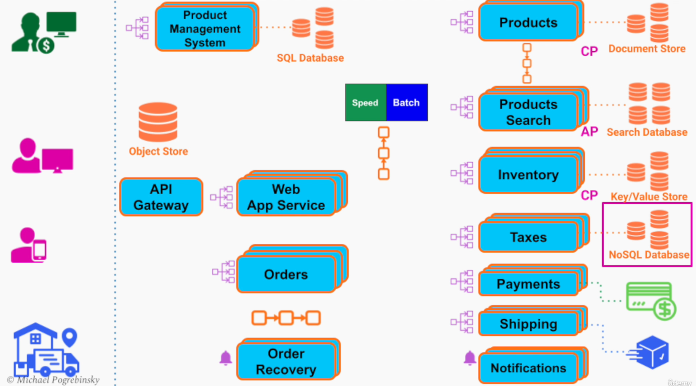
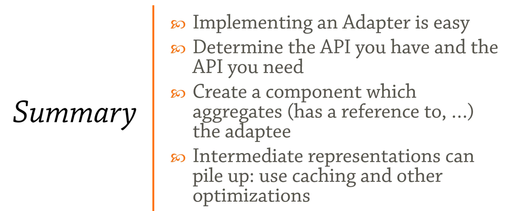

- description : (education정리) 손에-잡히는-소프트웨어-아키텍처-설계_Python / 소프트웨어 아키텍처 및 대규모 시스템 설계 / Design Patterns in Python
- tag : education , summary , my-summary , python , design , pattern , architecture
- date : 2025-04-26

TOC
- [1. 【한글자막】 소프트웨어 아키텍처 및 대규모 시스템 설계](#1-한글자막-소프트웨어-아키텍처-및-대규모-시스템-설계)
  - [1.1. 섹션2 : 시스템 요구사항 및 아키텍처 드라이버](#11-섹션2--시스템-요구사항-및-아키텍처-드라이버)
    - [1.1.1. T3. 시스템 설계 및 아키텍처 다이렉트 드라이버 개요](#111-t3-시스템-설계-및-아키텍처-다이렉트-드라이버-개요)
    - [1.1.2. T4. 기능 요구 사항 - 단계적 과정](#112-t4-기능-요구-사항---단계적-과정)
    - [1.1.3. T5. 시스템 품질 속성 요구 사항](#113-t5-시스템-품질-속성-요구-사항)
    - [1.1.4. T6. 시스템 제약 사항](#114-t6-시스템-제약-사항)
  - [1.2. 섹션3: 대규모 시스템에서 가장 중요한 품질 속성](#12-섹션3-대규모-시스템에서-가장-중요한-품질-속성)
    - [1.2.1. T7. 성능](#121-t7-성능)
    - [1.2.2. T8. 확장성 : Scalability](#122-t8-확장성--scalability)
    - [1.2.3. T9. 가용성 - 개요 및 측정](#123-t9-가용성---개요-및-측정)
    - [1.2.4. T10. 내결함성 및 고가용성](#124-t10-내결함성-및-고가용성)
    - [1.2.5. T11. SLA, SLO, SLI](#125-t11-sla-slo-sli)
  - [1.3. 섹션4: API 설계](#13-섹션4-api-설계)
    - [1.3.1. T13. API 설계 개요](#131-t13-api-설계-개요)
    - [1.3.2. T14. RPC](#132-t14-rpc)
    - [1.3.3. T15. 인기 있는 RPC 프레임워크](#133-t15-인기-있는-rpc-프레임워크)
    - [1.3.4. T16. REST API](#134-t16-rest-api)
  - [1.4. 섹션5: 대규모 시스템에 필요한 아키텍처 빌딩 블록](#14-섹션5-대규모-시스템에-필요한-아키텍처-빌딩-블록)
    - [1.4.1. T17. DNS, SW/HW 로드 밸런싱 및 GSLB](#141-t17-dns-swhw-로드-밸런싱-및-gslb)
    - [1.4.2. T19. 메시지 브로커](#142-t19-메시지-브로커)
    - [1.4.3. T20. 메시지 브로커 솔루션](#143-t20-메시지-브로커-솔루션)
    - [1.4.4. T21. API 게이트웨이](#144-t21-api-게이트웨이)
    - [1.4.5. T22. API 게이트웨이 솔루션](#145-t22-api-게이트웨이-솔루션)
    - [1.4.6. T23. 콘텐츠 전송 네트워크 (CDN)](#146-t23-콘텐츠-전송-네트워크-cdn)
  - [1.5. 섹션6: 글로벌 규모의 데이터 스토리지 (DataBase)](#15-섹션6-글로벌-규모의-데이터-스토리지-database)
    - [1.5.1. T25. 관계형 데이터베이스 및 ACID 트랜잭션](#151-t25-관계형-데이터베이스-및-acid-트랜잭션)
    - [1.5.2. T26. 비관계형 데이터베이스](#152-t26-비관계형-데이터베이스)
    - [1.5.3. T27. 비관계형 데이터베이스 - 솔루션](#153-t27-비관계형-데이터베이스---솔루션)
    - [1.5.4. T28. 데이터베이스의 가용성과 확장성, 성능을 개선하는 기술](#154-t28-데이터베이스의-가용성과-확장성-성능을-개선하는-기술)
    - [1.5.5. T29. Brewer의 (CAP) 정리 : distributed database](#155-t29-brewer의-cap-정리--distributed-database)
    - [1.5.6. T30. 확장 가능한 비정형 데이터 스토리지](#156-t30-확장-가능한-비정형-데이터-스토리지)
    - [1.5.7. T31. 확장 가능한 비정형 데이터 스토리지 - 클라우드 및 오픈 소스 솔루션](#157-t31-확장-가능한-비정형-데이터-스토리지---클라우드-및-오픈-소스-솔루션)
  - [1.6. 섹션7: 소스트웨어 아키텍처 패턴](#16-섹션7-소스트웨어-아키텍처-패턴)
    - [1.6.1. T32. 소프트웨어 아키텍처 패턴 개요](#161-t32-소프트웨어-아키텍처-패턴-개요)
    - [1.6.2. T33. 멀티티어 아키텍처](#162-t33-멀티티어-아키텍처)
    - [1.6.3. T34. 마이크로서비스 아키텍처](#163-t34-마이크로서비스-아키텍처)
    - [1.6.4. T35. 이벤트 기반 아키텍처](#164-t35-이벤트-기반-아키텍처)
  - [1.7. 섹션8: 빅 데이터 아키텍처 패턴](#17-섹션8-빅-데이터-아키텍처-패턴)
    - [1.7.1. T36. 빅 데이터 개요](#171-t36-빅-데이터-개요)
    - [1.7.2. T37. 빅 데이터 처리 방식](#172-t37-빅-데이터-처리-방식)
    - [1.7.3. T38. 람다 아키텍처](#173-t38-람다-아키텍처)
  - [1.8. 섹션9: 소스트웨어 아키텍처 \& 시스템 디자인 연습](#18-섹션9-소스트웨어-아키텍처--시스템-디자인-연습)
    - [1.8.1. T39. 확장성이 높은 포럼 디자인 1 - 요구 사항 \& API](#181-t39-확장성이-높은-포럼-디자인-1---요구-사항--api)
    - [1.8.2. T40. 확장성이 높은 포럼 디자인 2 - 기능 아키텍처 다이어그램](#182-t40-확장성이-높은-포럼-디자인-2---기능-아키텍처-다이어그램)
    - [1.8.3. T41. 확장성이 높은 포럼 디자인 3 - 소프트웨어 아키텍처 완성](#183-t41-확장성이-높은-포럼-디자인-3---소프트웨어-아키텍처-완성)
    - [1.8.4. T42. 인터넷 쇼핑몰 플랫폼 디자인 1 - 요구 사항 \& 시퀀스 다이어그램](#184-t42-인터넷-쇼핑몰-플랫폼-디자인-1---요구-사항--시퀀스-다이어그램)
    - [1.8.5. T43. 인터넷 쇼핑몰 플랫폼 디자인 2 - 기능 다이어그램](#185-t43-인터넷-쇼핑몰-플랫폼-디자인-2---기능-다이어그램)
    - [1.8.6. T44. 인터넷 쇼핑몰 플랫폼 디자인 3 - 소프트웨어 아키텍처 완성](#186-t44-인터넷-쇼핑몰-플랫폼-디자인-3---소프트웨어-아키텍처-완성)
  - [1.9. 섹션10: 보너스 섹션](#19-섹션10-보너스-섹션)
    - [1.9.1. T45. 보너스 강의 - 계속 공부하기](#191-t45-보너스-강의---계속-공부하기)
- [2. Design Patterns in Python](#2-design-patterns-in-python)
  - [2.1. section 1 : SOLID](#21-section-1--solid)
    - [2.1.1. T1. Introduction](#211-t1-introduction)
    - [2.1.2. T2. Overview](#212-t2-overview)
    - [2.1.3. T3. Single Responsibility Principle](#213-t3-single-responsibility-principle)
    - [2.1.4. T4. Open-Closed Principle](#214-t4-open-closed-principle)
    - [2.1.5. T5. Liskov Substitution Principle](#215-t5-liskov-substitution-principle)
    - [2.1.6. T6. Interface Segregation Principle](#216-t6-interface-segregation-principle)
    - [2.1.7. T7. Dependency Inversion Principle](#217-t7-dependency-inversion-principle)
    - [2.1.8. T8. Summary](#218-t8-summary)
    - [2.1.9. T9. Gamma Categorization](#219-t9-gamma-categorization)
  - [2.2. section 2 : Builder](#22-section-2--builder)
    - [2.2.1. T10. Overview](#221-t10-overview)
    - [2.2.2. T11. Builder](#222-t11-builder)
    - [2.2.3. T12. Builder Facets](#223-t12-builder-facets)
    - [2.2.4. T13. Builder Inheritance](#224-t13-builder-inheritance)
    - [2.2.5. T14. Summary](#225-t14-summary)
  - [2.3. section 3 : Factories](#23-section-3--factories)
    - [2.3.1. T15. Overview](#231-t15-overview)
    - [2.3.2. T16. Factory Method](#232-t16-factory-method)
    - [2.3.3. T17. Factory](#233-t17-factory)
    - [2.3.4. T18. Abstract Factory](#234-t18-abstract-factory)
    - [2.3.5. T19. Summary](#235-t19-summary)
  - [2.4. section 4 : Prototype](#24-section-4--prototype)
    - [2.4.1. T21. Prototype](#241-t21-prototype)
    - [2.4.2. T22. Prototype Factory](#242-t22-prototype-factory)
    - [2.4.3. T23. Summary](#243-t23-summary)
  - [2.5. section 5 : Singleton](#25-section-5--singleton)
    - [2.5.1. T24. Overview](#251-t24-overview)
    - [2.5.2. T25. Singleton Allocator](#252-t25-singleton-allocator)
    - [2.5.3. T26. Singleton Decorator](#253-t26-singleton-decorator)
    - [2.5.4. T27. Singleton Metaclass](#254-t27-singleton-metaclass)
    - [2.5.5. T28. Monostate](#255-t28-monostate)
    - [2.5.6. T29. Singleton Testability](#256-t29-singleton-testability)
    - [2.5.7. T30. Summary](#257-t30-summary)
  - [2.6. section 6 : Adapter](#26-section-6--adapter)
    - [2.6.1. T31. Overview](#261-t31-overview)
    - [2.6.2. T32. Adapter (no caching)](#262-t32-adapter-no-caching)
    - [2.6.3. T33. Adapter (with caching)](#263-t33-adapter-with-caching)
    - [2.6.4. T34. Summary](#264-t34-summary)
  - [2.7. section 9 : Decorator](#27-section-9--decorator)
    - [2.7.1. T42. Overview](#271-t42-overview)
    - [2.7.2. T43. Python Functional Decorators](#272-t43-python-functional-decorators)
    - [2.7.3. T44. Classic Decorator](#273-t44-classic-decorator)
    - [2.7.4. T45. Dynamic Decorator](#274-t45-dynamic-decorator)
    - [2.7.5. T46. Summary](#275-t46-summary)
  - [2.8. section 10 : Facade](#28-section-10--facade)
    - [2.8.1. T47. Overview](#281-t47-overview)
    - [2.8.2. T48. Façade](#282-t48-façade)
    - [2.8.3. T49. Summary](#283-t49-summary)
  - [2.9. section 11 : Flyweight](#29-section-11--flyweight)
    - [2.9.1. T50. Overview](#291-t50-overview)
    - [2.9.2. T51. User Names](#292-t51-user-names)
    - [2.9.3. T52. Text Formatting](#293-t52-text-formatting)
    - [2.9.4. T53. Summary](#294-t53-summary)
  - [2.10. section 12 : Proxy](#210-section-12--proxy)
    - [2.10.1. T54. Overview](#2101-t54-overview)
    - [2.10.2. T55. Protection Proxy](#2102-t55-protection-proxy)
    - [2.10.3. T56. Virtual Proxy](#2103-t56-virtual-proxy)
    - [2.10.4. T57. Proxy vs Decorator](#2104-t57-proxy-vs-decorator)
    - [2.10.5. T58. Summary](#2105-t58-summary)
  - [2.11. section 13 : chain of responsibility](#211-section-13--chain-of-responsibility)
    - [2.11.1. T59. Overview](#2111-t59-overview)
    - [2.11.2. T60. Method Chain](#2112-t60-method-chain)
    - [2.11.3. T61. Command Query Separation](#2113-t61-command-query-separation)
    - [2.11.4. T62. Broker Chain](#2114-t62-broker-chain)
    - [2.11.5. T63. Summary](#2115-t63-summary)
  - [2.12. section 14 : command](#212-section-14--command)
    - [2.12.1. T64. Overview](#2121-t64-overview)
    - [2.12.2. T65. Command](#2122-t65-command)
    - [2.12.3. T66. Composite Command](#2123-t66-composite-command)
    - [2.12.4. T67. Summary](#2124-t67-summary)
  - [2.13. section 15 : Interpreter](#213-section-15--interpreter)
    - [2.13.1. T68. Overview](#2131-t68-overview)
    - [2.13.2. T69. Lexing](#2132-t69-lexing)
    - [2.13.3. T70. Parsing](#2133-t70-parsing)
    - [2.13.4. T71. Summary](#2134-t71-summary)
  - [2.14. section 16 : interator](#214-section-16--interator)
    - [2.14.1. T72. Overview](#2141-t72-overview)
    - [2.14.2. T73. Iterator](#2142-t73-iterator)
    - [2.14.3. T74. List-Backed Properties](#2143-t74-list-backed-properties)
    - [2.14.4. T75. Summary](#2144-t75-summary)
  - [2.15. section 17 : Mediator](#215-section-17--mediator)
    - [2.15.1. T76. Overview](#2151-t76-overview)
    - [2.15.2. T77. Chat Room](#2152-t77-chat-room)
    - [2.15.3. T78. Mediator with Events](#2153-t78-mediator-with-events)
    - [2.15.4. T79. Summary](#2154-t79-summary)
  - [2.16. section 18 : Memento](#216-section-18--memento)
    - [2.16.1. T80. Overview](#2161-t80-overview)
    - [2.16.2. T81. Memento](#2162-t81-memento)
    - [2.16.3. T82. Undo and Redo](#2163-t82-undo-and-redo)
    - [2.16.4. T83. Summary](#2164-t83-summary)
  - [2.17. section 19 : Observer](#217-section-19--observer)
    - [2.17.1. T84. Overview](#2171-t84-overview)
    - [2.17.2. T85. Events](#2172-t85-events)
    - [2.17.3. T86. Property Observers](#2173-t86-property-observers)
    - [2.17.4. T87. Property Dependencies](#2174-t87-property-dependencies)
    - [2.17.5. T88. Summary](#2175-t88-summary)
  - [2.18. section 20 : State](#218-section-20--state)
    - [2.18.1. T89. Overview](#2181-t89-overview)
    - [2.18.2. T90. Classic Implementation](#2182-t90-classic-implementation)
    - [2.18.3. T91. Handmade State Machine](#2183-t91-handmade-state-machine)
    - [2.18.4. T92. Switch-Based State Machine](#2184-t92-switch-based-state-machine)
    - [2.18.5. T93. Summary](#2185-t93-summary)
  - [2.19. section 21 : Strategy](#219-section-21--strategy)
    - [2.19.1. T94. Overview](#2191-t94-overview)
    - [2.19.2. T95. Strategy](#2192-t95-strategy)
    - [2.19.3. T96. Summary](#2193-t96-summary)
  - [2.20. section 22 : Template Method](#220-section-22--template-method)
    - [2.20.1. T97. Overview](#2201-t97-overview)
    - [2.20.2. T98. Template Method](#2202-t98-template-method)
    - [2.20.3. T99. Summary](#2203-t99-summary)
  - [2.21. section 23 : Visitor](#221-section-23--visitor)
    - [2.21.1. T100. Overview](#2211-t100-overview)
    - [2.21.2. T101. Intrusive Visitor](#2212-t101-intrusive-visitor)
    - [2.21.3. T102. Reflective Visitor](#2213-t102-reflective-visitor)
    - [2.21.4. T103. Classic Visitor](#2214-t103-classic-visitor)
    - [2.21.5. T104. Classic Visitor Refined](#2215-t104-classic-visitor-refined)
    - [2.21.6. T105. Summary](#2216-t105-summary)
    - [2.21.7. T106. Course Summary](#2217-t106-course-summary)


-------

<H1>손에-잡히는-소프트웨어-아키텍처-설계_Python</H1>

# 1. 【한글자막】 소프트웨어 아키텍처 및 대규모 시스템 설계
- URL : https://lg.udemy.com/course/software-architecture-design-large-scale-systems/learn/lecture/30800568?learning_path_id=9371175#overview
- [pdf 강의 워크북](./Software_Architecture_and_Design_of_Large_Scale_Systems-Workbook.pdf)

## 1.1. 섹션2 : 시스템 요구사항 및 아키텍처 드라이버
### 1.1.1. T3. 시스템 설계 및 아키텍처 다이렉트 드라이버 개요
- Features/Functional Requirement
  - What "system must do"
- Quality Attributes / Non-Functional Requirement 
- System Requirement
  - Time / Financial / Staffing constraints
### 1.1.2. T4. 기능 요구 사항 - 단계적 과정
- gathering
  - use cases
  - user flows : step-by-sep
- steps
  - identify all the actors / users in our system
  - capture  and describe all the possible use-cases / scenarios
  - user flow - expand each use case through flow of events (event : action / data)
- UML (Unified Modeling Language) - Sequence Diagram
  - action들이 API 가 되는 것이다.
### 1.1.3. T5. 시스템 품질 속성 요구 사항
- important considerations
  - measurable / testable
  - trade off - ex) performance & security
  - feasibility - ex) unrealistically low latency / 100% availability
### 1.1.4. T6. 시스템 제약 사항
- it is not always bad.
- types of contraints
  - technical
  - business : deadline , budget
  - legal

## 1.2. 섹션3: 대규모 시스템에서 가장 중요한 품질 속성
### 1.2.1. T7. 성능
- response time (end2end latency)
  - processing time + waiting itme (latency)
- throughput (ex.logging system)
### 1.2.2. T8. 확장성 : Scalability
- vertical scalability (scale up): 한 컴안에 resouce 추가
- horizontal scalability (scale out): 컴을 여러대 추가
- team/organizational scalability : 조직간 분업 (서비스 분리)
### 1.2.3. T9. 가용성 - 개요 및 측정 
- High Availability
- Measurements
  - MTBF (mean time between failures) : average time our system is operational
  - MTTR (mean time to revovery) : time average it takes us to detect and revocer from a faulure.
- Availability = MTBF / (MTBF + MTTR)
  - 5 nines (99.999%)
### 1.2.4. T10. 내결함성 및 고가용성
- Fault Tolerance
  - replication
  - failure detection
  - fast recovery
### 1.2.5. T11. SLA, SLO, SLI
- SLA : service level agreement (legal contract)
  - availability
  - performance
  - data durability
  - time to respond to system failures
- SLO : service level objectives
  - individual goals
- SLI : service level indicators
  - quantitative measure of our compliance with a service level objective
## 1.3. 섹션4: API 설계
### 1.3.1. T13. API 설계 개요
- categories
  - public api
  - private api
  - partner api : similar to public api (business relationship)
- best practice
  - complete encaptulation : completely decoupled from our internal design and implementation
  - easy to use / understand / impossible to misuse
    - only one way / descriptive names / keep consitent
  - keeping the operations **idempotent** (멱등 : 여러번 적용하더라도 결과가 달라지지 않는)
    - An operation does not have any additional effect on the result if it is performed more than once.
    - functional programming 으로 되면 딱이네!~~~~
  - API pagination 
    - pagination allows the client not to send all information in one time (ex. restFul API)
      - to request only a smalll segment of the resposne
      - specify the maximum size of each response from our system
  - **Asynchronous API**
  - **versioning our API**
### 1.3.2. T14. RPC
- 
### 1.3.3. T15. 인기 있는 RPC 프레임워크
- gRPC
  - gRPC 는 현대 오픈소스 고성능 원격 프로시저 호출(RPC) 프레임워크를 뜻합니다. Google은 2015년에 gRPC를 기존의 Google 내부 RPC 인프라의 후속 세대 모델로 개발했습니다.
  - gRPC는 HTTP/2 를 전송 프로토콜로 사용하고 프로토콜 버퍼 를 인터페이스 정의 언어로 사용합니다.
- [Apache Thrift](https://thrift.apache.org/tutorial/)
  - Thrift경량이자 언어 독립성을 지니는 포인트 투 포인트 RPC용 소프트웨어 스택입니다.
  - Thrift는 C++, Java, Python, Go, Scala, Swift, PHP, Ruby, Perl, C#, JavaScript, Node.js 등  28개 이상의 언어를 지원하기 때문에, Thrift를 통해 다양한 언어로 쓰인 프로그램이 손쉽게 데이터를 공유하고 원격 프로시저를 호출할 수 있습니다.
  - Facebook에서 “확장 가능한 언어 간 서비스 개발”용으로 Thrift를 만들었습니다.Thrift 인터페이스 정의 언어라는 고유의 인터페이스 정의 언어를 사용합니다.
- Java 원격 함수 호출 ([RMI](https://docs.oracle.com/javase/tutorial/rmi/))
  - 하나의 Java 가상 머신이 다른 Java 가상 머신에서 실행되는 객체에 대한 메서드를 호출할 수 있게 해주는 RPC 프레임워크입니다. 
  - RMI는 인터페이스 정의 언어로서 Java를 사용합니다.
### 1.3.4. T16. REST API
- it is architectural style
- statelessness - high availability and scalibility
- naming resources as noun
## 1.4. 섹션5: 대규모 시스템에 필요한 아키텍처 빌딩 블록
### 1.4.1. T17. DNS, SW/HW 로드 밸런싱 및 GSLB
- quality attributes
  - scaling up/down
  - high availability
  - perfformance (throughput)
  - maintainability
- GSLB (global server load balancer) : 지역정보에 맞게 가장 가까운 서버의 IP를 보내주며 , 알아서 health check도 한다.
### 1.4.2. T19. 메시지 브로커
- 
- asynchromous communcation
- a sw architectural build block that uses the queue data structure to store messages between senders and receivers
- used inside our system and not exposed externally
- fault tolerance
### 1.4.3. T20. 메시지 브로커 솔루션
- 오픈 소스 메시지 브로커
  - Apache Kafka - 요즘 가장 인기 있는 오픈 소스 메시지 브로커. Apache Kafka는 분산 이벤트 스트리밍 플랫폼으로 수많은 회사에서 데이터 파이프라인, 스트리밍 분석, 데이터 통합 그리고 미션 크리티컬 애플리케이션의 높은 성능을 위해 사용하고 있습니다.
  - RabbitMQ - 널리 배포된 오픈 소스 메시지 브로커. 전세계적으로 작은 규모의 스타트업과 대기업이 사용합니다.
### 1.4.4. T21. API 게이트웨이
- API gateway
  - API composition
  - compose all the APIs of all our services into one single API
  - the client applications can call one single service
- Benefits
  - seamless internal modifications/refatoring
  - consolidating all security , authorization and authentication in a single place
  - request routing
  - static content and response cacheing
  - monitoring and alerting
  - protocol translation
    - 
### 1.4.5. T22. API 게이트웨이 솔루션
- 오픈 소스 API 게이트웨이
  - Netflix Zuul
    - Zuul은 Java 언어로 쓰인 무료 오픈소스 애플리케이션 게이트웨이로서 역동적인 라우팅, 모니터링, 회복 탄력성, 보안성 등의 역량을 제공합니다.
### 1.4.6. T23. 콘텐츠 전송 네트워크 (CDN)
- speeding up the delivery of content to end users
- performance - faster page loads
- pull and push strategy
## 1.5. 섹션6: 글로벌 규모의 데이터 스토리지 (DataBase)
### 1.5.1. T25. 관계형 데이터베이스 및 ACID 트랜잭션
- join
- natural structure for humans
- ACID transaction
  - Atomicity - all at once
  - Consistency
  - Isolation 
  - Durability - Once a transaction is complete , its final state will persist and remain permanently inside the DB
- disadvantages
  - Rigid structure
  - Hard to maintain / scale
  - slower read operations
### 1.5.2. T26. 비관계형 데이터베이스
- efficient storage (RDB) vs faster queries (NoSQL)
- NoSQL database
  - key value store
  - docuemnt store : 다른 type들을 저장가능하다.
  - graph database : recommend new products to users based on past purchase history or friends of the user
- example
  - user profiles
  - content management
### 1.5.3. T27. 비관계형 데이터베이스 - 솔루션
- 키/값 저장소 예시
  - Redis
  - Aerospike
  - Amazon DynamoDB
- 문서 저장소 예시
  - Cassandra
  - MongoDB
- 그래픽 데이터베이스 예시
  - Amazon Neptune
  - NEO4J
### 1.5.4. T28. 데이터베이스의 가용성과 확장성, 성능을 개선하는 기술
- database indexing : additional index table with hashmap or B-tree
  - speed up retrieval operations
- database replication : fault tolerance
- database partitioning / sharding (조각들)
### 1.5.5. T29. Brewer의 (CAP) 정리 : distributed database
- CAP theorem : In the presence of a network partition , a distributed database can not guarantee both consistency and availaiblity and has to choose only one of them
- Consistency / Availability / Partition tolerance
### 1.5.6. T30. 확장 가능한 비정형 데이터 스토리지
- backup and archiving
- web hosting
- machine learning and big data analytics
- limitations of a distributed file system
  - number of files is limited
  - no easy access through web API (HTTP+REST)
- Object Store - benefits
  - linear scalability
  - no limit to the number of objects we can store
  - very high limit on a single object size
  - provieds an HTTP + REST API
  - supports for versioning out of a box
- 
### 1.5.7. T31. 확장 가능한 비정형 데이터 스토리지 - 클라우드 및 오픈 소스 솔루션
- 클라우드 기반 객체 저장소 솔루션
  - Amazon S3 (Simple Storage Service) - 버킷 내에 객체 데이터를 저장하는 Amazon의 확장성이 뛰어난 클라우드 스토리지 서비스입니다. 웹 사이트, 클라우드 네이티브 애플리케이션, 백업, 아카이빙 머신 러닝 및 분석과 같은 다양한 사용 사례를 위해 원하는 양의 데이터를 저장하고 보호하도록 설계되었습니다.
  - GCP Cloud Storage - 모든 규모의 기업을 위해 비정형 데이터를 저장하기 위한 Google Cloud의 관리형 서비스입니다.
  - Azure Blob Storage - 클라우드 네이티브 워크로드, 아카이브, 데이터 레이크, 고성능 컴퓨팅 및 머신러닝을 위한 Microsoft의 확장성 있고 안전한 객체 저장소입니다.
  - Alibaba Cloud OSS (Object Storage Service) - 완벽하게 관리되는 엔터프라이즈급 객체 저장 서비스로 어디서나 원하는 양의 데이터를 저장하고 액세스할 수 있습니다.
- 오픈 소스 및 타사 객체 저장소 솔루션
  - OpenIO - 소프트웨어 기반의 오픈 소스 객체 스토리지 솔루션이며, 빅 데이터, HPC 및 AI에 이상적입니다. S3와 호환되며 온-프레미스 또는 선택한 모든 하드웨어에 클라우드 호스팅으로 배포할 수 있습니다.
  - MinIO - 고성능의 S3 호환 객체 스토리지입니다. 쿠버네티스 기반이며 GNU AGPL v3에서 100% 오픈 소스입니다.
  - Ceph - 안정적이고 확장 가능한 오픈 소스 저장소입니다. Ceph는 상용 하드웨어 구성 요소로 구축된 단일 클러스터에서 객체, 블록 및 파일 인터페이스가 있는 통합 스토리지 서비스를 제공합니다.
## 1.6. 섹션7: 소스트웨어 아키텍처 패턴
### 1.6.1. T32. 소프트웨어 아키텍처 패턴 개요
- just guidelines
### 1.6.2. T33. 멀티티어 아키텍처
- Tier > Layer
- Three Tier architecture : the most popular
  - user interface (presentation tier) 
    - no business logic
  - application Tier
    - all functionality and features
  - data tier
    - storage
- three tier architecture 단점 : 조직확장에 제한적
### 1.6.3. T34. 마이크로서비스 아키텍처
- microservices architecture vs monolithic (3 tier) architecture
- monolithic architecture  disadvantages
  - we have problems in organizational scalability 
    - the more engineers we add to the team , the more code merge conflicts we get
    - our meetings becore larger , longer and less productive
  - once we start seeing these problems , we should consideer migrating our architecture towards microservices
- micro service architecture
  - business logic as a collection of loosely coupled and independentyly deployed services
  - each service is owned by a small team and has a narrow scope of responsibility
- micro serice가 그냥 되는게 아니다.
  - 경험등이 있어야 하고
  - overhead와 challenges가 뭔지 고려해야 한다.
- 정책
  - SRP (single responsibility principle)
    - each service needs to be responsible for only one
  - separate database per service
### 1.6.4. T35. 이벤트 기반 아키텍처
- decoupling fo microservices
- event sourcing pattern : 다시 돌려볼수 있다.
- CQRS : 가장 강력한 event based architecture
  - Command / Query / REsponsibility / Segregation
  - update and read operations separation
  - joining data from different databases
- event는 절대 변경해서는 안된다. 제거를 하고 싶은 경우는 이에 반대로 상응하는 것을 추가해야지 제거를 하면 안된다.
## 1.7. 섹션8: 빅 데이터 아키텍처 패턴
### 1.7.1. T36. 빅 데이터 개요
- volume
- variety : various data type
- velocity : high rate stream
### 1.7.2. T37. 빅 데이터 처리 방식
- batch processing
- real time processing
### 1.7.3. T38. 람다 아키텍처
- challenges of choosing big data processing
  - high delay of batch processing
  - longer time to analyze deeply
- lambda architecture
  - it attempts to find a balance between:
    - high fault tolerance and comprehensive analysis of data (batch processing)
    - low latency (real-time processing)
  - 
## 1.8. 섹션9: 소스트웨어 아키텍처 & 시스템 디자인 연습
### 1.8.1. T39. 확장성이 높은 포럼 디자인 1 - 요구 사항 & API
- 
### 1.8.2. T40. 확장성이 높은 포럼 디자인 2 - 기능 아키텍처 다이어그램
- 
- 
- 
### 1.8.3. T41. 확장성이 높은 포럼 디자인 3 - 소프트웨어 아키텍처 완성
- repliation
  - 
- summary
  - scalability
    - load balancing
    - database sharding
    - API gateway
  - performance
    - CDN
    - caching
    - database indexing
  - HA
    - database replication
    - redundancy
    - message broker
    - multiple data center deployment
  - availability over consistency
    - choosing/configuring AP databases
  - durability
    - replication and backups
### 1.8.4. T42. 인터넷 쇼핑몰 플랫폼 디자인 1 - 요구 사항 & 시퀀스 다이어그램
- functional requirements for both (customer , merchants)
  - store front
  - store checkout
  - 각각을 Draw sequence diagram
- quality attributes requirements
  - scalability
  - performance
  - consistency vs availability
  - HA
- defining system API
- summary
  - 
### 1.8.5. T43. 인터넷 쇼핑몰 플랫폼 디자인 2 - 기능 다이어그램
- 
- summary
  - 
### 1.8.6. T44. 인터넷 쇼핑몰 플랫폼 디자인 3 - 소프트웨어 아키텍처 완성
- 
- 
- 
- 
## 1.9. 섹션10: 보너스 섹션
### 1.9.1. T45. 보너스 강의 - 계속 공부하기


# 2. Design Patterns in Python
- 2020년 8월 pthon 2.7 사용
- 
- 
## 2.1. section 1 : SOLID
- https://en.wikipedia.org/wiki/SOLID
### 2.1.1. T1. Introduction
### 2.1.2. T2. Overview
### 2.1.3. T3. Single Responsibility Principle
- [srp.py](srp.py)
- Persistence를 위한 기능은 별도로 준비를 해야한다. save , load
- god object를 만들지 마라.
### 2.1.4. T4. Open-Closed Principle
- [ocp.py](ocp.py)
- OCP = open for extension, closed for modification
  - 경우의 수에 따라 함수들을 계속 늘려나가면서 짜게 하지 말라.
  - class AndSpecification(Specification):  처럼 추가 가능
  - BetterFilter() is better than ProductFilter()
- yield와 return의 차이 설명 : yield는 generator를 통한 streaming같이 return을 한다. [링크](https://www.daleseo.com/python-yield/)
### 2.1.5. T5. Liskov Substitution Principle
- [lsp.py](lsp.py)
- The idea is that if you have some interface that takes some sort of base class, you should be able to stick a derived class in there and everything should work.
- Python에서 @something은 데코레이터를 의미합니다. 특히 이 코드에서 사용된 데코레이터들은 property와 setter를 만들어주는 기능을 합니다.
  - @property
    - 함수처럼 보이지만, 속성처럼 사용할 수 있게 해줍니다.
    - 즉, obj.area처럼 메서드 호출 없이 값을 얻을 수 있습니다.
  - @width.setter
    - width라는 property를 쓸 수 있게(set 가능하게) 만듭니다.
    - @property로 만든 것만 setter를 따로 만들 수 있어요.
  - @Rectangle.width.setter
    - 부모 클래스에서 상속된 프로퍼티를 자식 클래스에서 오버라이드 한다.
- 코드 버그 : Square안에는 self._width = value 와 같이 self를 붙여주어야한다.
### 2.1.6. T6. Interface Segregation Principle
- [isp.py](isp.py)
- The idea is that you don't really want to stick too many elements, too many methods, for example, into an interface.
- @abstractmethod란?
  - Python에서 @abstractmethod는 추상 메서드를 정의할 때 사용합니다.
  - "이 클래스는 직접 사용하지 말고, 반드시 상속해서 구현해야 한다" 라는 뜻입니다.
### 2.1.7. T7. Dependency Inversion Principle
- [dip.py](dip.py)
- one of the things that the dependency inversion principle states is that high level classes or high level modules in your code should not depend directly on low level modules.
  - relations = relationships.relations 와 같이 받아서 내부의 내용을 직접 고치지 말라는 것이다.
- 코드 버그 : relations -> self.relations
### 2.1.8. T8. Summary
- 
### 2.1.9. T9. Gamma Categorization
- 
## 2.2. section 2 : Builder
### 2.2.1. T10. Overview
- when piece wise object construction is complicated, the builder actually provides an API for doing it succinctly
- 
### 2.2.2. T11. Builder
- [builder.py](builder.py)
- 코드 버그 : __root = HtmlElement() 을 self.__init__안으로 옮기세요요
- fluent interface : return self
### 2.2.3. T12. Builder Facets
- the question is how can you get several builders participating in the build up of an object and how can you actually make a nice, fluent interface so that you can jump from one builder to another?
- [builder_facets.py](builder_facets.py)
- 초기화할때 builder를 이용하여 creation. __init__(많은 arguments)를 사용하지 않으려는 것이다.
  - ```python
    p = pb\
            .lives\
                .at('123 London Road')\
                .in_city('London')\
                .with_postcode('SW12BC')\
            .works\
                .at('Fabrikam')\
                .as_a('Engineer')\
                .earning(123000)\
            .build()
    ```
### 2.2.4. T13. Builder Inheritance
- [builder_inheritance.py](builder_inheritance.py)
- alternatives with inheritance
### 2.2.5. T14. Summary
- [builder_exercise.py](builder_exercise.py)
## 2.3. section 3 : Factories
### 2.3.1. T15. Overview
- 
- 
- a factory is quite simply a component that is responsible solely for the wholesale as opposed to piece wise creation of objects.
### 2.3.2. T16. Factory Method
- [factory_method.py](factory_method.py)
- __init__() 을 여러 종류로 선언하고 싶을때 (물론 python class에서는 한개만 있어야 한다.)
- init()에 type으로 구별하는 방법보다, factory method를 이용해서 별도의 함수를 이용하므로 더 좋은 naming이 가능하다.
### 2.3.3. T17. Factory
- [factory.py](factory.py)
- singleton instance : factory
### 2.3.4. T18. Abstract Factory
- [abstract_factory.py](abstract_factory.py)
- ```factory_instance = eval(factory_name)()``` 으로 class를 쉽게 얻어올수 있다. 
- derived class를 이용하고 , 각각 안에는 같은 member 함수들을 가지고 있다.
### 2.3.5. T19. Summary
- [factory_exercise.py](factory_exercise.py)
- 이게 좋은 코드 일까?
  - ```python
    class PersonFactory:
        idnum = -1
        def create_person(self, name):
            PersonFactory.idnum += 1
            return Person(PersonFactory.idnum,name)
    ```
- summary
  - 
  - we looked at something called factory method, which is a method, typically a static method that is capable of creating objects.
  - Then we talked about the general idea of a factory as just any entity that can take care of object creation.
  - Typically, when we talk about a factory, we talk about a class, but that's not necessarily the case. For example, if you have a method and that method takes a lambda that creates objects, then you have a factory wrapped as a little anonymous function.
  - We also talked that a factory is a separate class can either be external so it can reside as a completely separate entity or you can actually put it as a nested class inside the class, which it actually creates.
  - And finally, we looked at hierarchies of factories that can be made to correspond to hierarchies of types and can be used to easily create related objects.
## 2.4. section 4 : Prototype
### 2.4.1. T21. Prototype
- [prototype.py](prototype.py)
- copy.deepcopy(john) 을 이용하여 copy하여 쉽게 사용한다.
### 2.4.2. T22. Prototype Factory
- [prototype_factory.py](prototype_factory.py)
### 2.4.3. T23. Summary
- [prototype_exercise.py](prototype_exercise.py)
## 2.5. section 5 : Singleton
### 2.5.1. T24. Overview
- some components in your system, it makes sense for them to only be initialized once.
### 2.5.2. T25. Singleton Allocator
- [singleton_allocator.py](singleton_allocator.py)
### 2.5.3. T26. Singleton Decorator
- [singleton_decorator.py](singleton_decorator.py)
### 2.5.4. T27. Singleton Metaclass
- [singleton_metaclass.py](singleton_metaclass.py)
### 2.5.5. T28. Monostate
- [monostate.py](monostate.py)
- singleton과 같이 state 값도 1개의 instance를 같이 사용하는 2가지 방법
### 2.5.6. T29. Singleton Testability
- [singleton_testing.py](singleton_testing.py)
### 2.5.7. T30. Summary
- [singleton_exercise.py](singleton_exercise.py)
- a == b (==) : **값(value)**이 같은지를 비교합니다.
- a is b (is) : **객체(identity)**가 같은지를 비교합니다.
- 
## 2.6. section 6 : Adapter
### 2.6.1. T31. Overview
- 
### 2.6.2. T32. Adapter (no caching)
- [no_caching.py](no_caching.py)
### 2.6.3. T33. Adapter (with caching)
- [with_caching.py](with_caching.py)
- ```hash(line)``` unique한 hash key값을 return한다.
### 2.6.4. T34. Summary
- [adapter_exercise.py](adapter_exercise.py)
- 아래와 같은 경우이면 square.side값을 바꿔줘도 init()에서 값을 set하기 때문에 calculate_area() 호출할때 값이 다시 set되지 않고 init()을 수행할때 당시의 값만을 가지고 있게 된다.
- ```python
  class SquareToRectangleAdapter:
      def __init__(self, square):
          self.square = square
          self.width = self.square.side
          self.height = self.square.side
  ```
- 
## section 7 : bridge
### T35. Overview
- 
- 
### T36. Bridge
- [bridge.py](bridge.py)
- argument로 rederer를 넘겨서 bridge
- avoid a complexity explosion
- renderer라는 implemetation을 각기 구현하여 argument로 넘겨준다. (별도로 개발한다고 생각해서 complexity가 감소한다는 것인가?)
### T37. Summary
- [bridge_exercise.py](bridge_exercise.py)
- 
  - the idea of the bridge is to decouple the abstraction from the implementation.
  - And both of these can exist as hierarchies if you want them to.
  - Essentially, you can think of a bridge as a stronger form of encapsulation.
## section 8 : Composite
### T38. Overview
- composition make compound objects : grouping of shapes
### T39. Geometric Shapes
- [geometric_shapes.py](geometric_shapes.py)
- 
### T40. Neural Networks
- [neural_networks.py](neural_networks.py)
### T41. Summary
- [composite_exercise.py](composite_exercise.py)
- composite에서는 iterator가 중요
- ```python
  from abc import ABC
  from collections.abc import Iterable

  class ValueContainer(Iterable, ABC):
      @property
      def sum(self):
          result = 0
          for c in self:
              for i in c:
                  result += i
          return result
  class SingleValue(ValueContainer):
      def __init__(self, value):
          self.value = value
      def __iter__(self):
          yield self.value
  class ManyValues(list, ValueContainer):
      pass

  self.assertEqual(all_values.sum, 66)
  ```
- 
## 2.7. section 9 : Decorator
### 2.7.1. T42. Overview
- adding behaviour without altering the class itself
- 
- 
### 2.7.2. T43. Python Functional Decorators
- [functional_decorators.py](functional_decorators.py)
- @time_it을 붙여서 , 해당 함수가 수행되는 시간을 찍어주는 것이다.
  - @time_it <== time_it(some_op)()
- wrapper(func) 으로 func을 앞에서 먼저 수행하는 것이다. 내부에서 func()을 call해주어야 한다.
### 2.7.3. T44. Classic Decorator
- [oop_decorator.py](oop_decorator.py)
- @을 꼭 사용하는 것이 아닌 , inheritance를 이용하여 계속 새로운 class생성 가능
### 2.7.4. T45. Dynamic Decorator
- [dynamic_decorator.py](dynamic_decorator.py)
- __iter__ , __next__ , __getattr__ , __setattr__ , __delattr__ 정의
### 2.7.5. T46. Summary
- [decorator_exercise.py](decorator_exercise.py)
  - ```python
    class ColoredShape:
      def resize(self, factor):
        # note that a Square doesn't have resize()
        if isinstance(self.shape,Circle):
            self.shape.radius *= factor
    ```
- 
  - a decorator is typically a class that keeps a reference to the object it actually decorates.
  - then what it does is it adds certain utility methods and attributes to basically increase the set of the object's functionality without modifying the underlying object, without going into the object and actually changing the original class's source code, you have an extra class which performs those additional operations.
  - You may or may not forward the calls to the decorator, to the underlying object.
  - you can automatically set it up so that whenever you try to access a particular member of the decorator, provided you allow this, it can actually go to the underlying object and call that method.
  - We saw that the proxying of those calls can be done dynamically as opposed to just copying every single method by hand and replicating it, because that is rather tedious.
  - Now these decorators are not directly related to the Gang of four decorator pattern.
## 2.8. section 10 : Facade
- Exposing several components through a single interface
### 2.8.1. T47. Overview
- 
- 
### 2.8.2. T48. Façade
- [facade.py](facade.py)
### 2.8.3. T49. Summary
- [facade_exercise.py](facade_exercise.py)
- 
## 2.9. section 11 : Flyweight
- Space optimization
### 2.9.1. T50. Overview
- Avoid redundancy when storing data
- ranges
- 
### 2.9.2. T51. User Names
- [users.py](users.py)
- User2에서 처럼 index를 이용하므로 사용 memory를 줄이는 것이다.
### 2.9.3. T52. Text Formatting
- [text_formatting.py](text_formatting.py)
- 문자를 다 고쳐서 기록하지 말고 , option들만을 기록해서 실제로 사용할때 변경해서 쓰면 됨
### 2.9.4. T53. Summary
- [flyweight_exercise.py](flyweight_exercise.py)
## 2.10. section 12 : Proxy
- an interface for accessing a particular resource
### 2.10.1. T54. Overview
- 
### 2.10.2. T55. Protection Proxy
- [protection_proxy.py](protection_proxy.py)
- access control functionality를 더하는 것이다.
### 2.10.3. T56. Virtual Proxy
- [virtual_proxy.py](virtual_proxy.py)
- 실제로 그릴때 bitmap을 load한다.
### 2.10.4. T57. Proxy vs Decorator
- proxy provides an identical interface to the object that it's proxying things to, whereas the decorator provides an enhanced interface.
- decorator typically aggregates or has a reference to what it is decorating;  proxy doesn't have to do this and in actual fact, the proxy doesn't evenhave to work with a materialized object, an object that exists.
### 2.10.5. T58. Summary
- [proxy_exercise.py](proxy_exercise.py)
- has the same interface
- 
## 2.11. section 13 : chain of responsibility
### 2.11.1. T59. Overview
- 
### 2.11.2. T60. Method Chain
- [method_chain.py](method_chain.py)
- next_modifier와 handle() 로 계속 chain처럼 이어진다.
### 2.11.3. T61. Command Query Separation
### 2.11.4. T62. Broker Chain
- [broker_chain.py](broker_chain.py)
### 2.11.5. T63. Summary
- [chain_exercise.py](chain_exercise.py)
## 2.12. section 14 : command
### 2.12.1. T64. Overview
- 
- command 단위로 undo / redo 등을 할수 있게 하는 것이다. rollback도 포함.
### 2.12.2. T65. Command
- [command.py](command.py)
- 은행에서 처리하는 것과 유사
### 2.12.3. T66. Composite Command
- [composite_command.py](composite_command.py)
### 2.12.4. T67. Summary
- [command_exercise.py](command_exercise.py)
- 
## 2.13. section 15 : Interpreter
- Interpreters are all around us. Even now , in this very room.
### 2.13.1. T68. Overview
- 
- lex , parser
### 2.13.2. T69. Lexing
- [handmade.py](handmade.py)
### 2.13.3. T70. Parsing
- [parsing.py](parsing.py)
### 2.13.4. T71. Summary
- [interpreter_exercise.py](interpreter_exercise.py)
## 2.14. section 16 : interator
### 2.14.1. T72. Overview
- traverse
- __iter__() , __next__()
### 2.14.2. T73. Iterator
- [tree_traversal.py](tree_traversal.py)
### 2.14.3. T74. List-Backed Properties
- @property , @??setter
### 2.14.4. T75. Summary
- [iterator_exercise.py](iterator_exercise.py)
- yield value  , yield from function()
  - ```python
    def traverse_preorder(self):
      yield self.value
      if self.left:
        yield from self.left.traverse_preorder()
      if self.right:
        yield from self.right.traverse_preorder()
  ```
## 2.15. section 17 : Mediator
- Faclitates communication between components
### 2.15.1. T76. Overview
- 
- 
### 2.15.2. T77. Chat Room
- [chat_room.py](chat_room.py)
### 2.15.3. T78. Mediator with Events
- [mediator_with_events.py](mediator_with_events.py)
- event
  - ```python
    class Event(list):
        def __call__(self, *args, **kwargs):
            for item in self:
                item(*args, **kwargs)
    ```
### 2.15.4. T79. Summary
- [mediator_exercise.py](mediator_exercise.py)
- 
## 2.16. section 18 : Memento
- Keep a memento of an object's state to return to that state
### 2.16.1. T80. Overview
- 
- 
### 2.16.2. T81. Memento
- [memento.py](memento.py)
- snapshot to go back
### 2.16.3. T82. Undo and Redo
- [undo_redo.py](undo_redo.py)
### 2.16.4. T83. Summary
- [memento_exercise.py](memento_exercise.py)
- 
## 2.17. section 19 : Observer
### 2.17.1. T84. Overview
- 
- 
### 2.17.2. T85. Events
- [events.py](events.py)
- event의 좋은 예제이다. 
- catch_a_cold()될때마다 등록된 Event들이 call되어진다.
### 2.17.3. T86. Property Observers
- [property_observers.py](property_observers.py)
- property가 변경되었을때 event들 수행.
### 2.17.4. T87. Property Dependencies
- [property_dependencies.py](property_dependencies.py)
### 2.17.5. T88. Summary
- [observer_exercise.py](observer_exercise.py)
- 
## 2.18. section 20 : State
- Fun with Finite State Machines
### 2.18.1. T89. Overview
- 
- 
### 2.18.2. T90. Classic Implementation
- [classic.py](classic.py)
### 2.18.3. T91. Handmade State Machine
- [state_handmade.py](state_handmade.py)
- state diagram을 통한 구현
### 2.18.4. T92. Switch-Based State Machine
- [switch_based.py](switch_based.py)
### 2.18.5. T93. Summary
- [state_exercise.py](state_exercise.py)
- 
## 2.19. section 21 : Strategy
- system behaviour partially specified at runtime
### 2.19.1. T94. Overview
- 
- 
### 2.19.2. T95. Strategy
- [strategy.py](strategy.py)
- 일반적 코딩 방식인듯!  polymorphic
### 2.19.3. T96. Summary
- 문제 : 근의 공식
  - Strategy Coding Exercise
  - Consider the quadratic equation and its canonical solution:
    - The part b^2-4*a*c is called the discriminant. Suppose we want to provide an API with two different strategies for calculating the discriminant:
      - In OrdinaryDiscriminantStrategy , If the discriminant is negative, we return it as-is. This is OK, since our main API returns Complex  numbers anyway.
      - In RealDiscriminantStrategy , if the discriminant is negative, the return value is NaN (not a number). NaN propagates throughout the calculation, so the equation solver gives two NaN values. In Python, you make such a number with float('nan').
    - Please implement both of these strategies as well as the equation solver itself. With regards to plus-minus in the formula, please return the + result as the first element and - as the second. Note that the solve() method is expected to return complex values.
- [strategy_exercise.py](strategy_exercise.py)
- 
## 2.20. section 22 : Template Method
- a high-level blueprint for an algorithm to be completed by inheritors
### 2.20.1. T97. Overview
- 
- 
### 2.20.2. T98. Template Method
- [template_method.py](template_method.py)
- strategy pattern과 유사
### 2.20.3. T99. Summary
- Problem : Template Method Coding Exercise
  - Imagine a typical collectible card game which has cards representing creatures. Each creature has two values: Attack and Health. Creatures can fight each other, dealing their Attack damage, thereby reducing their opponent's health.
  - The class CardGame implements the logic for two creatures fighting one another. However, the exact mechanics of how damage is dealt is different:
    - TemporaryCardDamage : In some games (e.g., Magic: the Gathering), unless the creature has been killed, its health returns to the original value at the end of combat.
    - PermanentCardDamage : In other games (e.g., Hearthstone), health damage persists.
  - You are asked to implement classes TemporaryCardDamageGame  and PermanentCardDamageGame  that would allow us to simulate combat between creatures.
  - Some examples:
    - With temporary damage, creatures 1/2 and 1/3 can never kill one another. With permanent damage, second creature will win after 2 rounds of combat.
    - With either temporary or permanent damage, two 2/2 creatures kill one another.
- [template_exercise.py](template_exercise.py)
- 
## 2.21. section 23 : Visitor
- Allows adding extra behaviours to entire hierarchies of classes
### 2.21.1. T100. Overview
- doxygen source code가 visitor pattern을 이용함.
  - language에 따른 visitor들을 다르게 구현
- 
- 
- data structure를 traverse하면서 visit
### 2.21.2. T101. Intrusive Visitor
- [intrusive.py](intrusive.py)
### 2.21.3. T102. Reflective Visitor
- [reflective.py](reflective.py)
### 2.21.4. T103. Classic Visitor
- [classic_visitor.py](classic_visitor.py)
### 2.21.5. T104. Classic Visitor Refined
- [classic_refined.py](classic_refined.py)
### 2.21.6. T105. Summary
- problem : Visitor Coding Exercise
  - You are asked to implement a visitor called ExpressionPrinter  for printing different mathematical expressions. The range of expressions covers addition and multiplication - please put round brackets around addition operations (but not multiplication ones)! Also, please avoid any blank spaces in output.
  - Example:
    - Input: AdditionExpression(Value(2), Value(3)) 
    - Output: (2+3) 
  - Here is the corresponding unit test:
    - ```python
      class Evaluate(unittest.TestCase):
        def test_simple_addition(self):
            simple = AdditionExpression(Value(2), Value(3))
            ep = ExpressionPrinter()
            ep.visit(simple)
            self.assertEqual("(2+3)", str(ep))
      ```
- [visitor_exercise.py](visitor_exercise.py)
- 
### 2.21.7. T106. Course Summary
- [summary.txt](summary.txt)