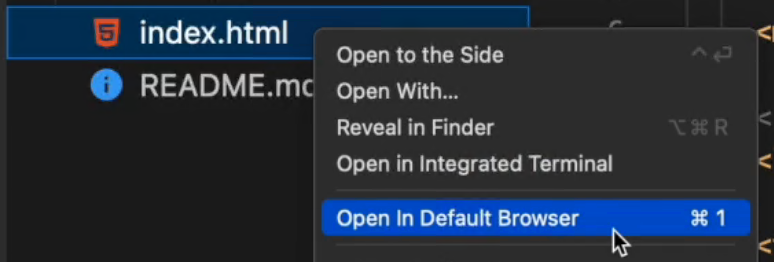
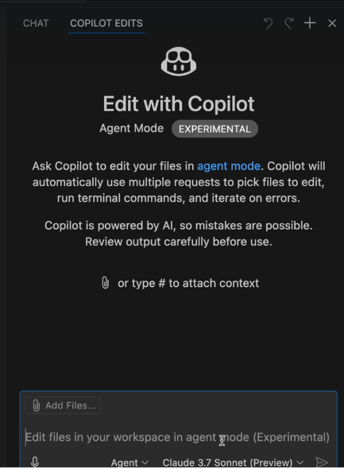

- description : (education정리) AI 업무-효율을-확-끌어올리는-GitHub-Copilot활용-프로그래밍
- tag : education , summary , my-summary , ai,github , copilot
- date : 

TOC
- [1. 홍드로이드의 AI 도구를 활용한 학습부터 웹 \& 앱 서비스 개발까지 한번에](#1-홍드로이드의-ai-도구를-활용한-학습부터-웹--앱-서비스-개발까지-한번에)
  - [1.1. project IDX (google IDX)](#11-project-idx-google-idx)
- [2. GitHub Copilot Beginner to Pro - AI for Coding \& Development](#2-github-copilot-beginner-to-pro---ai-for-coding--development)
  - [github copilot agent mode](#github-copilot-agent-mode)
- [Github Copilot - The Complete Guide](#github-copilot---the-complete-guide)
  - [링크](#링크)
  - [text generation](#text-generation)


-------

시간 슬롯 : 목 2025-02-13, 오전 12:00 - 수 2025-04-30, 오후 11:59

<H1><p style="color:blue;">Title : AI 업무-효율을-확-끌어올리는-GitHub-Copilot활용-프로그래밍</p></H1>

# 1. 홍드로이드의 AI 도구를 활용한 학습부터 웹 & 앱 서비스 개발까지 한번에
- [첨부자료: 개발자의+수익+극대화+루트+전자책.pdf](./개발자의+수익+극대화+루트+전자책.pdf)
- 개발시 필요한 내용이나 예제를 chatgpt에 문의해서 개발하는 것을 보여주는 것이다. (이미 하고 있음)
- chatGPT를 사용할때는 명확하고 구체적인 질문을 하라.
- claude를 이용하여 
  - setting에서 enable artifacts (개발결과를 바로 볼수 있는  기능)를 ON 시켜야함.
  - prompt
    - 웹사이트에서 계산기 유틸 만들텐데, html , css로 개발 코드를 구현해줘
    - 나머지는 상세한 개선 사항을 넣는다.
- figma + plugin
  - html.to.design 을 chrome plugin에 추가 (setting : file url access 허용) 하고 -> figma.com 접속 -> create new -> design file -> 아래 도구 모음에서 "html to design"을 실행해준다. -> use layout -> 각 요소들이 각기 click이 됨.

## 1.1. project IDX (google IDX)
- ```project IDX``` 나 ```DartPad```를 이용하여 dart language를 사용해 볼수 있음.
  - 나는 project IDX login 후에 화면이 나오지 않음 (오늘쪽 끝의 ```설치```를 눌러봐도 아무것도 나오지 않음)
- flutter 를 선택하여 진행 (확장자 : dart) : cross platform 지원
- prompt : 너는 비전공자들을 가르치는 개발자 출신 강사야.  ~~~을 예시를 들어 설명해줘
- statelessWidget vs statefulWidget
  - 변화하는 것은 statefulWidget를 사용하면 된다.

# 2. GitHub Copilot Beginner to Pro - AI for Coding & Development
- source : show zip file in this directory
  - code.zip - this contains all the code we generate in this course. [링크](./code.zip)
  - code-refactor.zip - this code is the refactored code for script.js that we generate in lecture 22 titled "Use GitHub Copilot Chat to refactor Javascript code". [링크](./code-refactor.zip)
  - code-with-server.zip - this code contains the addition of the express js code covered in lectures 23 titled "Use GitHub Copilot to generate server code with express (+ prompt tips)" and 24 titled "Use GitHub Copilot chat to setup sending emails using Resend".
- You will need VSCode and the **Live Server extension** installed to follow along in this course.  [링크](./code-with-server.zip)
- **Open In Default Browser** extension : browser에서 HTML을 쉽게 열수 있습니다.
- create workspace
  - copilot chat prompt : @workspace /new  create an html project called bucks2bar with the latest version of bootstrap
- 


## github copilot agent mode
- 공유 CDN UI
- 뭘 사용할지를 결정하고 , agent mode를 사용한다.
- 
  - COPILOT EDITS
  - Agent
  - Claude 3.7 Sonnet
- prompt
  - create a new next js project in the current directory
    - turbopack : local에서 compile등이 빨라짐
    - 뭘하는지도 다 볼수 있다.
    - Continue 를 누르고 선택하고.. 반복
    - Done은 완전히 끝났을때 누르는 것이다.
- marine weather : https://open-meteo.com/en/docs
  - support API URL : https://api.open-meteo.com/v1/forecast?latitude=52.52&longitude=13.41
- copilot에는 잘게 잘라서 질문을 해야 한다.
  - prompt
    - replace the contents of the homepage wth a search input which will search for a list of locations using the open meteo API. Use shadcn for the UI. 
  - skeleton component : fade in /out
- 한 일들에 대한 설명들이 잘 나와있다.
- 실행을 시켜봤는데 , 제대로 동작하지 않을때 ,  현상에 따라 정확히 지적을 해준다.
  - prompt
    - when a location is selected , query the open meteo marine weather API for the current marine weather. and this is an example URL....  Here is the response from that URL. .....   
  - 자세히 예제까지 주어야 한다.
- Done - chat window will clear.

# Github Copilot - The Complete Guide
- udemy : https://lg.udemy.com/course/github-copilot-the-complete-guide/learn/lecture/41494346#overview
## 링크
- https://platform.openai.com/tokenizer
- https://github.blog/changelog/
- https://github.com/alexhddev/copilot_resources/commit/64b714dd47bb978f1db9dec5afb5242ef119ddc7
- https://github.com/cli/cli

## text generation
- @workspace 로 해서 여러가지를 요청하면 document등을 만들어준다.
- 집에서 해봐야 할 듯!