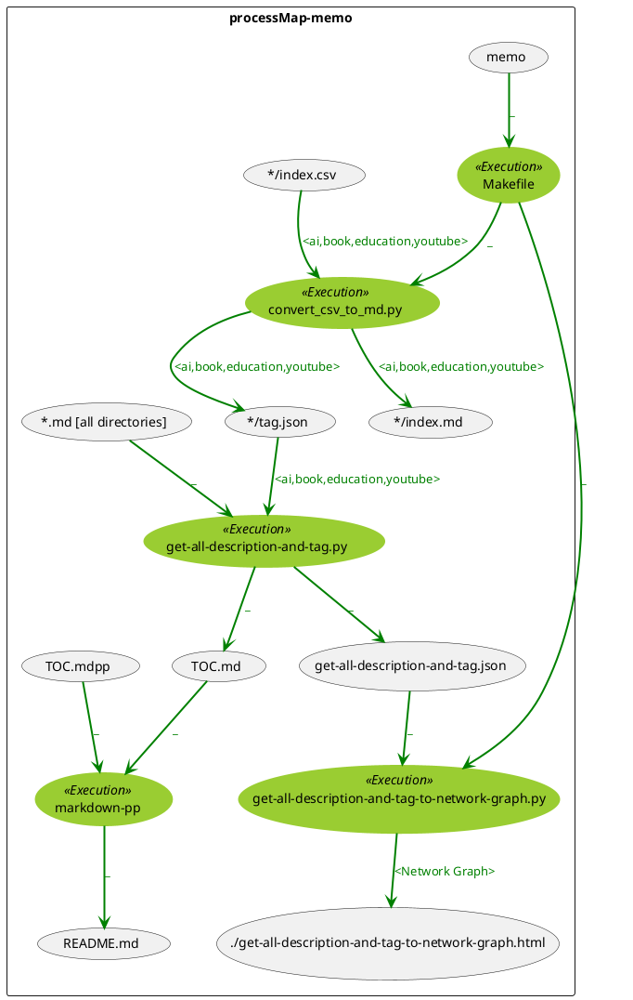

```plantuml
@startuml total.png

skinparam usecase {
    BackgroundColor<< Execution >> YellowGreen
    BorderColor<< Execution >> YellowGreen

    BackgroundColor<< Email >> LightSeaGreen
    BorderColor<< Email >> LightSeaGreen

    ArrowColor Olive
}
          rectangle processMap-memo {
    usecase (Makefile) as (Makefile) << Execution >>
    usecase (convert_csv_to_md.py) as (convert_csv_to_md.py) << Execution >>
    usecase (get-all-description-and-tag-to-network-graph.py) as (get-all-description-and-tag-to-network-graph.py) << Execution >>
    usecase (get-all-description-and-tag.py) as (get-all-description-and-tag.py) << Execution >>
    usecase (markdown-pp) as (markdown-pp) << Execution >>
    (memo) --> (Makefile) #line:green;line.bold;text:green : _
    (get-all-description-and-tag.json) --> (get-all-description-and-tag-to-network-graph.py) #line:green;line.bold;text:green : _
    (get-all-description-and-tag-to-network-graph.py) --> (./get-all-description-and-tag-to-network-graph.html) #line:green;line.bold;text:green : <Network Graph>
    (Makefile) --> (convert_csv_to_md.py) #line:green;line.bold;text:green : _
    (*/index.csv) --> (convert_csv_to_md.py) #line:green;line.bold;text:green : <ai,book,education,youtube>
    (convert_csv_to_md.py) --> (*/index.md) #line:green;line.bold;text:green : <ai,book,education,youtube>
    (convert_csv_to_md.py) --> (*/tag.json) #line:green;line.bold;text:green : <ai,book,education,youtube>
    (*.md [all directories]) --> (get-all-description-and-tag.py) #line:green;line.bold;text:green : _
    (get-all-description-and-tag.py) --> (get-all-description-and-tag.json) #line:green;line.bold;text:green : _
    (*/tag.json) --> (get-all-description-and-tag.py) #line:green;line.bold;text:green : <ai,book,education,youtube>
    (get-all-description-and-tag.py) --> (TOC.md) #line:green;line.bold;text:green : _
    (TOC.md) --> (markdown-pp) #line:green;line.bold;text:green : _
    (markdown-pp) --> (README.md) #line:green;line.bold;text:green : _
    (TOC.mdpp) --> (markdown-pp) #line:green;line.bold;text:green : _
    (Makefile) --> (get-all-description-and-tag-to-network-graph.py) #line:green;line.bold;text:green : _
  }
@enduml
```
