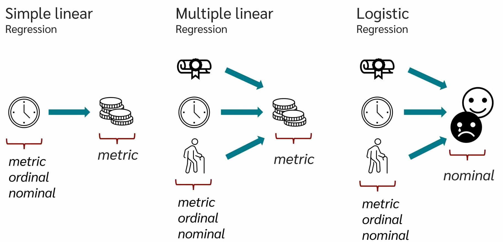
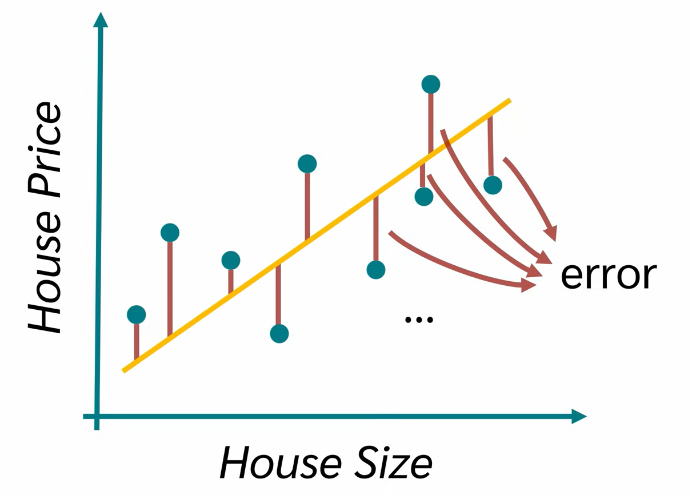
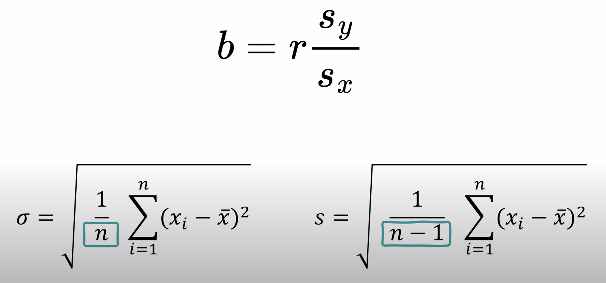
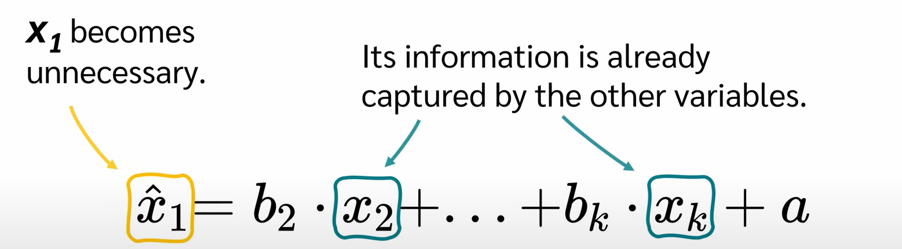
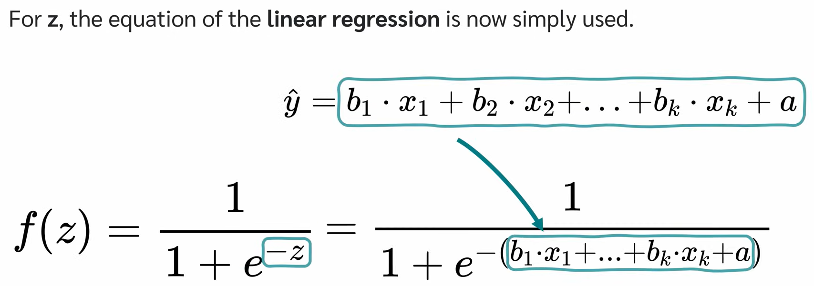
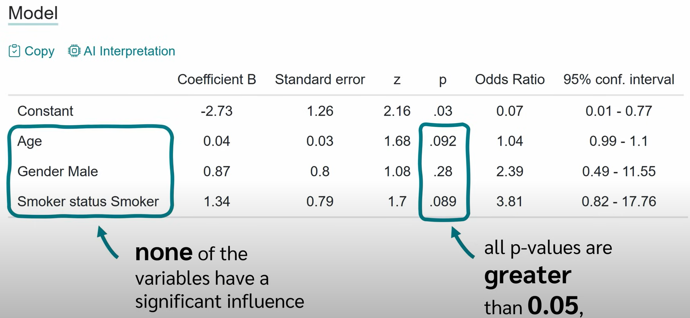

- description : Regression Analysis (simple / multiple / logistic regression)| Full Course 2025
- tag : youtube , data , analysis , regression , education , six-sigma
- date : 2025-01-21

TOC
- [1. 2025-01-29 15:22:19 Regression Analysis | Full Course 2025](#1-2025-01-29-152219-regression-analysis--full-course-2025)
  - [1.1. Simple Linear Regression](#11-simple-linear-regression)
  - [1.2. Multiple Linear Regression](#12-multiple-linear-regression)
  - [1.3. logistic Linear Regression](#13-logistic-linear-regression)

---------------

# 1. 2025-01-29 15:22:19 [Regression Analysis | Full Course 2025](https://youtu.be/T5AoqxQFkzY?si=EaUq-p9X_WgBs4fg)
- 
- logistic checks binary outcome. (true or false)

## 1.1. Simple Linear Regression
- Predict price
- y = ax + b
  - minimize the error
  - 
  - standard deviation & variance
    - 
- p-value < 0.05     => reject null hythesis
- assumption
  - Linear Relationship (Linear vs non linear)
  - independence of error
  - homoskedasticity
  - normally distributed errors

## 1.2. Multiple Linear Regression
- y = b1*x1 + b2*x2 ... + c
  - y is dependent variable
  - x is independent variables
- assumption
  - Linear Relationship (Linear vs non linear)
  - independence of error : the errors should be independent of each other.
  - homoskedasticity : 양쪽에 골고루 분포
  - normally distributed errors
  - **No Multicollinearity** : not highly correlated with two or more independent variables (x1 , x2 ..)
    - 다음과 같이 x1이 x2~xk 로 찾아질수 있다면 x1은 필요없게 되는 것이다. 필요없게 되는게 multicollinearity가 있다고 한다.
      - 
    - Coefficient of determination R^2 : R^2 (설명력) explains how well the independent variables.  T (Tolerance) = 1 - R^2  , T < 0.1 
- remove or combine variables to make independent variables
- to consider the Adjusted R^2 to avoid overestination (R^2)
- The number of dummy vairables you create will always be the number of categories **minus one**.  3종류 중에 1개만 선택되는 것으로 2개의 variable만 있어도 1개는 유츄가 가능하다.

## 1.3. logistic Linear Regression
- 0과 1사이의 값을 나오게 하는 function이다.  **Maximum likelyhood method**
  - 
- result
  - 
  - 여기서는 중요한 인지가 없다. 모두 > 0.05
  - Odds = (Probability of event happening) / (Probability of it not happening)
    - odd(success) = success / failure = 0.7 / 0.3 = 2.33
  - An Odds Ratio (OR) is simply a comparison of hte odds of an event occurring in two different groups.
    - male이 female 보다 2.39 배
    - OR = {GroupA (Probability of event happening) / (Probability of it not happening)}  /  {GroupB (Probability of event happening) / (Probability of it not happening)}
  