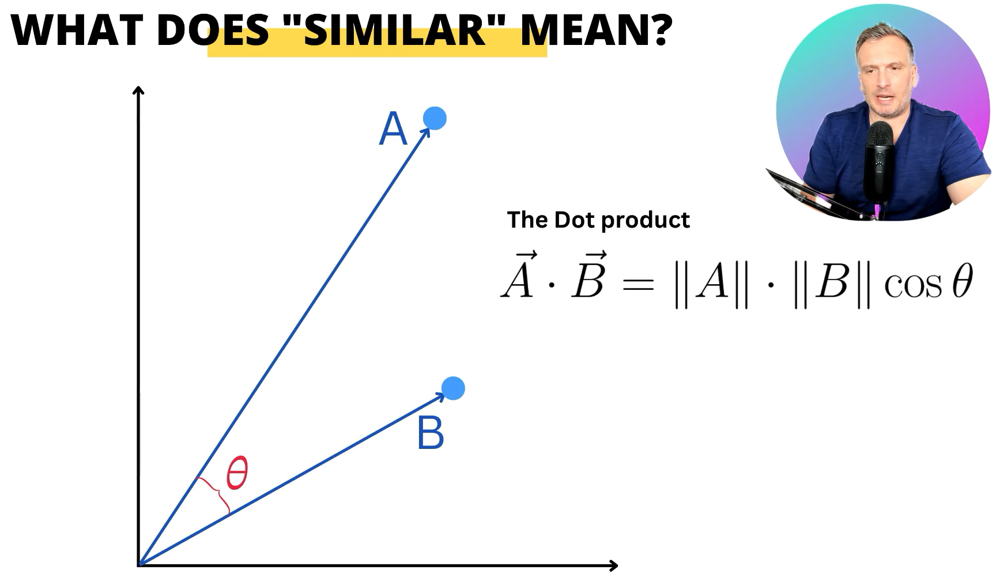
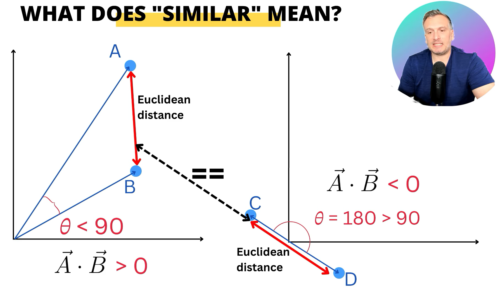
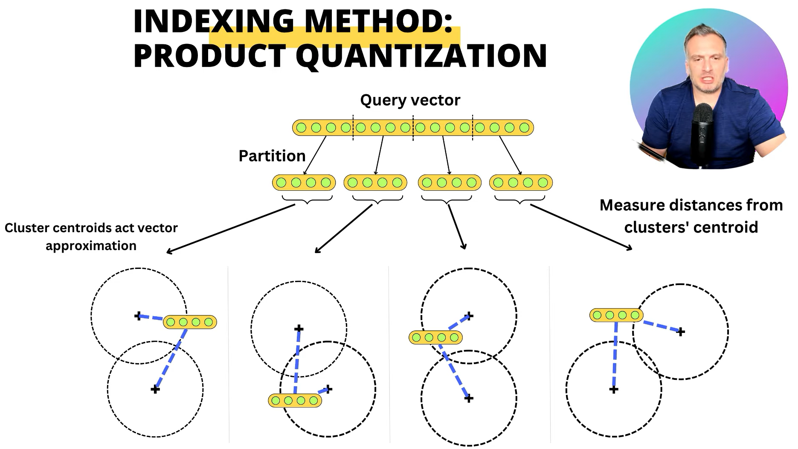

- description : Understanding How Vector Databases Work!
- tag : youtube , ai , ML , vector , database , vector-database
- date : 2025-01-29

TOC
- [1. 2025-01-29 20:18:30 Understanding How Vector Databases Work!](#1-2025-01-29-201830-understanding-how-vector-databases-work)
  - [1.1. similarity](#11-similarity)
  - [1.2. indexing](#12-indexing)
  - [1.3. indexing method : indexing techniques](#13-indexing-method--indexing-techniques)
  - [1.4. indexing method : locally sensitive hashing](#14-indexing-method--locally-sensitive-hashing)
  - [1.5. indexing method : hierarchical navigable small word](#15-indexing-method--hierarchical-navigable-small-word)

---------------

# 1. 2025-01-29 20:18:30 [Understanding How Vector Databases Work!](https://youtu.be/035I2WKj5F0?si=vuqwzIYd_vVmdVIY)
- text , images , user , time series data들을 모아서 vector database로 가지고 있다.
- 이유는 similar item을 찾기 위해서이다.
- 병렬화 / scalability가 매우 좋음.

## 1.1. similarity
- 
- A,B is more similar
  - 

## 1.2. indexing
- linear searching하면 O(N)이므로 indexing 필요
  
## 1.3. indexing method : indexing techniques
- quantization하여 indexing을 하고 DB를 만들고 찾는다.
  - 

## 1.4. indexing method : locally sensitive hashing
- hash가 더 빠르므로 space를 다수로 나우면서 , 그 점이 어떤 space로 들어가는지를 가지고 hash 를 만드는 것이다.

## 1.5. indexing method : hierarchical navigable small word
- nearest neighbor를 찾아가는 과정 반복... 