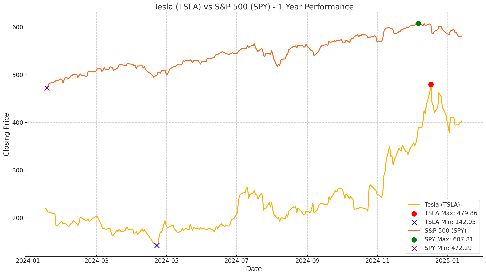

- description : (youtube정리) 챗GPT로 미국 주식 포트폴리오 자동으로 관리하는 방법 feat 구글 스프레드 시트, Apps Script 코드 작성
- tag : youtube , summary , my-summary , visualization , apps , scripts , goodle , spreadsheet , automation , stock , chatgpt
- date : 2025-01-14

TOC
- [2025-01-14 22:25:47 챗GPT로 미국 주식 포트폴리오 자동으로 관리하는 방법 feat 구글 스프레드 시트, Apps Script 코드 작성](#2025-01-14-222547-챗gpt로-미국-주식-포트폴리오-자동으로-관리하는-방법-feat-구글-스프레드-시트-apps-script-코드-작성)
  - [시각화](#시각화)
  - [엑셀 upload](#엑셀-upload)


-----------------

# 2025-01-14 22:25:47 [챗GPT로 미국 주식 포트폴리오 자동으로 관리하는 방법 feat 구글 스프레드 시트, Apps Script 코드 작성](https://www.youtube.com/watch?v=NN9pFgIHc50&list=WL&index=3&ab_channel=%EB%A9%94%ED%83%80%EC%BD%94%EB%93%9CM)
## 시각화
- GPT : 구글 파이낸스 에서 구글 스프레드 시트의 시트 이름에 적힌 {티커}에 따라서 일자별 종가를 가져와서 스프레트에 저장하고 싶어. {티커}에 따라 A1셀부터는 날짜,종가 컬럼이 필요해. 2행부터는 컬럼에 따라 일자별 종가 정보를 가져오는 apps script 코드를 생성해주고 , 주석은 한국어로 작성해줘. 최근 1년간의 종가 데이터가 필요해
```js
// Google Apps Script 코드
function fetchStockData() {
  // 현재 활성화된 스프레드시트를 가져옴
  const spreadsheet = SpreadsheetApp.getActiveSpreadsheet();

  // 활성화된 시트의 이름을 티커로 간주
  const sheet = spreadsheet.getActiveSheet();
  const ticker = sheet.getName();

  // A1 셀에 헤더 설정 (날짜, 종가)
  sheet.getRange("A1").setValue("날짜");
  sheet.getRange("B1").setValue("종가");

  // Google Finance 함수로 데이터를 가져오기 위한 쿼리 생성
  // 최근 1년간 데이터를 가져오기 위해 현재 날짜와 1년 전 날짜 계산
  const today = new Date();
  const lastYear = new Date();
  lastYear.setFullYear(today.getFullYear() - 1);

  const startDate = Utilities.formatDate(lastYear, Session.getScriptTimeZone(), "yyyy-MM-dd");
  const endDate = Utilities.formatDate(today, Session.getScriptTimeZone(), "yyyy-MM-dd");

  // Google Finance 함수로 데이터를 가져옴
  const data = `=GOOGLEFINANCE(\"${ticker}\", \"close\", \"${startDate}\", \"${endDate}\")`;

  // A2 셀부터 데이터 출력
  sheet.getRange("A2").setFormula(data);
}
```

- GPT : 각 sheet들에 대해서 sheet name을 {티커}로 하는 위의 데이러를 가져와 주었으면 해
- GPT : 그리고, 각 sheet의 B3셀부터 일자별 종가 가격이 있는데. 오늘까지의 일자별 종가값을 꺾은선 그래프로 그려주는 apps script 코드를 작성해줘
  - apps script에서 실행할 함수를 선택해주고 >RUN 을 눌러주어야 한다.
```js
// Google Apps Script 코드
function fetchStockDataForAllSheets() {
  // 현재 활성화된 스프레드시트를 가져옴
  const spreadsheet = SpreadsheetApp.getActiveSpreadsheet();

  // 스프레드시트의 모든 시트를 가져옴
  const sheets = spreadsheet.getSheets();

  // 각 시트에 대해 데이터 처리
  sheets.forEach(sheet => {
    const ticker = sheet.getName(); // 시트 이름을 티커로 간주

    // A1 셀에 헤더 설정 (날짜, 종가)
    sheet.getRange("A1").setValue("날짜");
    sheet.getRange("B1").setValue("종가");

    // Google Finance 함수로 데이터를 가져오기 위한 쿼리 생성
    // 최근 1년간 데이터를 가져오기 위해 현재 날짜와 1년 전 날짜 계산
    const today = new Date();
    const lastYear = new Date();
    lastYear.setFullYear(today.getFullYear() - 1);

    const startDate = Utilities.formatDate(lastYear, Session.getScriptTimeZone(), "yyyy-MM-dd");
    const endDate = Utilities.formatDate(today, Session.getScriptTimeZone(), "yyyy-MM-dd");

    // Google Finance 함수로 데이터를 가져옴
    const data = `=GOOGLEFINANCE("${ticker}", "close", "${startDate}", "${endDate}")`;

    // A2 셀부터 데이터 출력
    sheet.getRange("A2").setFormula(data);
  });
}

function createLineChartForAllSheets() {
  // 현재 활성화된 스프레드시트를 가져옴
  const spreadsheet = SpreadsheetApp.getActiveSpreadsheet();

  // 스프레드시트의 모든 시트를 가져옴
  const sheets = spreadsheet.getSheets();

  sheets.forEach(sheet => {
    const sheetName = sheet.getName();

    // 데이터 범위: B3부터 마지막 행까지
    const lastRow = sheet.getLastRow();
    const dataRange = sheet.getRange(`A3:B${lastRow}`);

    // 새 차트를 추가
    const chart = sheet.newChart()
      .setChartType(Charts.ChartType.LINE)
      .addRange(dataRange)
      .setPosition(1, 5, 0, 0) // 차트를 시트의 특정 위치에 배치
      .setOption("title", `${sheetName} 종가 추세`)
      .setOption("curveType", "function") // 곡선형 꺾은선 그래프
      .setOption("legend", { position: "bottom" })
      .build();

    sheet.insertChart(chart); // 차트를 시트에 삽입
  });
}
```

## 엑셀 upload 
- GPT : 이 데이터는 테슬라와 S&P500 의 일자별 조아 주식 데이터야 . 1년간의 데이터를 나타내고 있어.먼저 데이터를 살펴봐줘.
  - 이렇게 먼저 기본적인 설명을 해주고 , 분석을 미리 해보게 시키는 것이 좋음.
- GPT : TSLA와 SPY에 대한 시각화를 위한 꺽은선 그래프로 시각화해줘. 이때 , 1년간 최고가와 최저가에 서로 다른 마크 표시와 다른 컬러를 이용하여 표시해줘.
  - 

- GPT : 동적인 (interactive) 그래프로 그려줘.
  - [interactive graph](./Tesla_vs_SP500_Performance.html)

- 주요 이벤트 추가
  - youtube화면의 내용을 잡아서 GPT에게 txt로 변환해달라고 요청하여 결과를 prompt에 입력력
    - "한글 무료 OCR" plugin 사용 -> text로 변환 완료
  - GPT :  2023년 12월부터 24년 12월까지의 테슬라의 신기술 발표, 성과 발표, 이사회 변동 등 회사의 주요 이벤트 리스트를 날짜순으로 보여줘. 주가에 변동을 줄만한 큰 대내외 이벤트로 구성해줘. 도출된 이벤트 날짜 전후의 -2일 ~ +2일간의 주식 종가 데이터를 비교해보고, 특정 이벤트가 주가에 영향을 미쳤다면, 주식 선그래프에 세로선을 추가하고, 이벤트 내용에 대한 annotation을 추가하세요.
  - GPT : 이벤트도 그래프에 표시해줘.
  - GPT : 이벤트와 범례를 쌍으로 하는 것은 좋은데 ,   이벤트들을 서로 다른 색으로 구분해주었으면 해
    - [interactive analyzed graph](./Tesla_Stock_with_Colored_Events.html)

