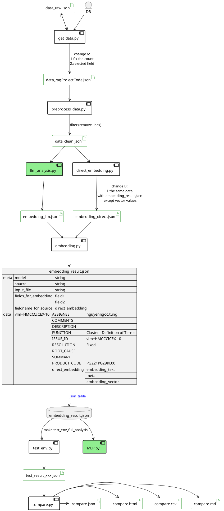

```puml
@startuml

!define RECTANGLE json
!define NODE py

' Define colors
skinparam artifact {
    BackgroundColor #B5EAD7  ' pastel green (background) for json
    BorderColor green
}
skinparam component {
    BackgroundColor #FFDAC1  ' pastel orange (background) for py
    ' BorderColor blue
    BorderThickness 2
    FontStyle bold  'FontColor    FontSize
}

together {
    entity DB
    artifact data_raw.json
}
artifact data_ragProjectCode.json
artifact data_clean.json
artifact embedding_llm.json
artifact embedding_direct.json
database embedding_result.json
artifact test_result_xxx.json
artifact compare.md
artifact compare.csv
artifact compare.html
artifact compare.json

json "embedding_result.json" as json_embedding_result {
    "meta": {
    "model": "string",
    "source": "string",
    "input_file": "string",
    "fields_for_embedding": ["field1", "field2"],
    "fieldname_for_source": "direct_embedding"
    },
    "data": {
    "vlm=HMCCCICEX-10": {
        "ASSIGNEE": "nguyenngoc.tung",
        "COMMENTS": [],
        "DESCRIPTION": "",
        "FUNCTION": "Cluster - Definition of Terms",
        "ISSUE_ID": "vlm=HMCCCICEX-10",
        "RESOLUTION": "Fixed",
        "ROOT_CAUSE": "",
        "SUMMARY": "",
        "PRODUCT_CODE": "PGZ21PGZ9KL00",
        "direct_embedding": {
        "embedding_text": "",
        "meta": {},
        "embedding_vector": []
        }
    }
    }
}

component get_data.py
component preprocess_data.py
component llm_analysis.py #lightgreen
component direct_embedding.py
component embedding.py
component test_env.py
component compare.py
component MLP.py #lightgreen

' 기본적으로 get_data.py의 input은 DB or cache file이 될 것이다.
DB --> get_data.py
data_raw.json --> get_data.py
get_data.py --> data_raw.json
get_data.py --> data_ragProjectCode.json : change A:\n1.fix the count\n2.selected field
preprocess_data.py --> data_clean.json  : filter (remove lines)
data_ragProjectCode.json --> preprocess_data.py

data_clean.json --> llm_analysis.py
llm_analysis.py --> embedding_llm.json
embedding_llm.json --> embedding.py


data_clean.json --> direct_embedding.py
direct_embedding.py --> embedding_direct.json : change B:\n1.the same data\n with embedding_result.json\n except vector values
embedding_direct.json --> embedding.py

embedding.py --> json_embedding_result
json_embedding_result --> embedding_result.json : [[#embedding_resultjson json_table]]
embedding_result.json --> test_env.py : make test_env_full_analysis
test_env.py --> test_result_xxx.json
test_result_xxx.json --> compare.py
compare.py -> compare.csv
compare.py -> compare.html
compare.py -> compare.json
compare.py -> compare.md
embedding_result.json --> MLP.py
@enduml
```